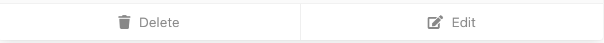
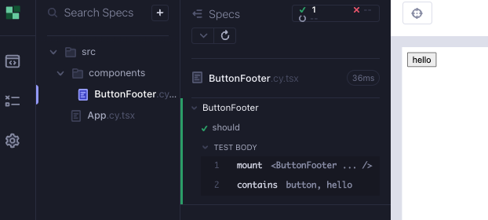
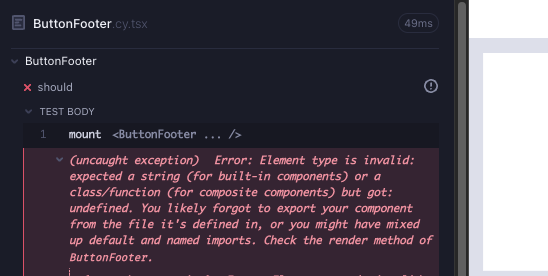
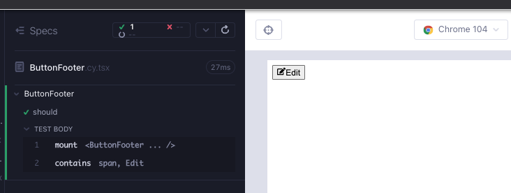
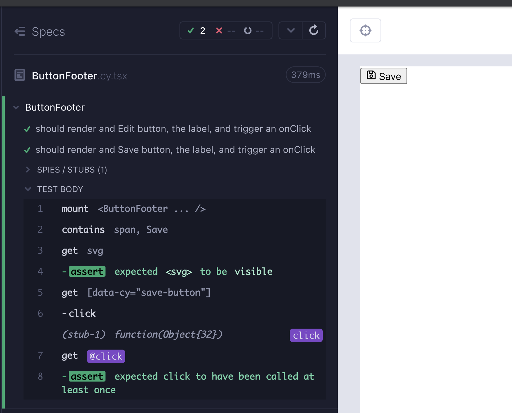

# ButtonFooter

Bileşenimizin sonunda nasıl görünebileceği budur. Etiketi ve CSS simgesini saran bir düğmeye ihtiyacımız var. İkon ve metin değişebilir; İptal, Kaydet, Düzenle veya Sil.



`feat/button-footer` adında bir dal oluşturun. `src/components/` klasörü altında 2 dosya oluşturun; `ButtonFooter.cy.tsx`, `ButtonFooter.tsx`.

Bileşenin monte edildiğini kontrol eden minimal bir testle başlarız (Kırmızı 1).

```tsx
// src/components/ButtonFooter.cy.tsx
import ButtonFooter from "./ButtonFooter";

describe("ButtonFooter", () => {
  it("should", () => {
    cy.mount(<ButtonFooter />);
  });
});
```

Derleyici böyle bir bileşen olmadığını belirtiyor, hadi yeşil yapalım (Yeşil 1).

```tsx
// src/components/ButtonFooter.tsx

export default function ButtonFooter() {
  return <button>hello</button>;
}
```

Cypress bileşen test koşucusunu başlatın ve testi çalıştırın; `yarn cy:open-ct`.

Dizenin işlendiğini test edelim. Başarılı bir test geçtikten sonra, yeni bir başarısızlık alana kadar veya yeniden düzenlemek isteyene kadar buna devam edebiliriz.

```typescript
// src/components/ButtonFooter.cy.tsx
import ButtonFooter from "./ButtonFooter";

describe("ButtonFooter", () => {
  it("should", () => {
    cy.mount(<ButtonFooter />);
    cy.contains("hello");
  });
});
```



Düğmenin bir etiketi içerecek olan span etiketi ile sarılmasını sağlayalım.

```tsx
// src/components/ButtonFooter.tsx

export default function ButtonFooter() {
  return (
    <button>
      <span>hello</span>
    </button>
  );
}
```

Aslında "merhaba" dizesini, bileşene geçirebileceğimiz bir özellik olan bir değişken yapmak istiyoruz. Dize için değişkenin adını `etiket` olarak adlandıralım ve bir özellik yapalım. Bileşeni bu yeni özellikle monte ederiz. Test hala geçiyor, ancak derleyici hatası alıyoruz (Kırmızı 2).

```tsx
// src/components/ButtonFooter.tsx
import ButtonFooter from "./ButtonFooter";

describe("ButtonFooter", () => {
  it("should", () => {
    const label = "hello";
    cy.mount(<ButtonFooter label={label} />);
    cy.contains(label);
  });
});
```

Şimdi başarılı bir test yapmamız gerekiyor. Haydi bileşene özelliği ve türünü ekleyelim (Yeşil 2).

```tsx
// src/components/ButtonFooter.tsx
type ButtonFooterProps = {
  label: "Cancel" | "Save" | "Edit" | "Delete";
};

export default function ButtonFooter({ label }: ButtonFooterProps) {
  return (
    <button>
      <span>{label}</span>
    </button>
  );
}
```

Stil, bu rehberin önemli bir parçası değildir ve çoğu bileşen için küresel stiller tercih ederiz. Bu durumda, [react-icons](https://react-icons.github.io/react-icons/) çok mantıklıdır, çünkü her bileşen için özelleştirilmiş bir stil uygulayabiliriz.

```bash
yarn add react-icons
yarn add -D @types/react-icons
```

Özelliklerine göre, düğme içinde farklı türde ikonlar kullanmak istiyoruz; Düzenle, Sil, Kaydet, İptal. Düğmenin bu stili içermesini ve bir özellik olarak özelleştirmesini sağlayabiliriz. Bu özelliği `IconClass` olarak adlandıracağız ve olası türleri belirleyeceğiz.

```tsx
// src/components/ButtonFooter.tsx
import { FaUndo, FaRegSave, FaEdit, FaTrash } from "react-icons/fa";

type ButtonFooterProps = {
  label: "Cancel" | "Save" | "Edit" | "Delete";
  IconClass: typeof FaUndo | typeof FaRegSave | typeof FaEdit | typeof FaTrash;
};

export default function ButtonFooter({ label, IconClass }: ButtonFooterProps) {
  return (
    <button>
      <IconClass />
      <span>{label}</span>
    </button>
  );
}
```

Bu testin başarısız olmasının nedeni, şimdi monte ettiğimiz bileşene bir `IconClass` özelliği geçmemiz gerektiğidir. Bu hatayla tanışın; beklenen bazı özelliklerin tanımsız (Kırmızı 3) olduğunu söylüyor. Aynı başarısızlık, testteki bir TS hatasıyla da yakalanabilir. Bu durumda, Cypress bileşen testlerinde karşılaşabileceğimiz hatalarla tanışmak faydalıdır.



Eğer `IconClass` adında, `FaEdit` türünde bir değere sahip bir özellik geçersek, testimiz tekrar başarılı olacaktır (Yeşil 3).

```tsx
// src/components/ButtonFooter.cy.tsx
import ButtonFooter from "./ButtonFooter";
import { FaEdit } from "react-icons/fa";

describe("ButtonFooter", () => {
  it("should", () => {
    const label = "Edit";
    cy.mount(<ButtonFooter label={label} IconClass={FaEdit} />);
    cy.contains(label);
  });
});
```



Bu, farklı stillere sahip olabileceğimiz ve tıklama işlemi üzerinde bir tıklama işleyici çağırmamız gerektiği anlamına gelir. Bunu test etmek için bir test yazalım (Kırmızı 4).

```tsx
// src/components/ButtonFooter.cy.tsx
import ButtonFooter from "./ButtonFooter";
import { FaEdit } from "react-icons/fa";

describe("ButtonFooter", () => {
  it("should", () => {
    const label = "Edit";
    cy.mount(
      <ButtonFooter
        label={label}
        IconClass={FaEdit}
        onClick={cy.stub().as("click")}
      />
    );
    cy.contains(label).click();
    cy.get("@click").should("be.called");
  });
});
```

Bir `onClick` özelliğine ihtiyacımız olduğunu hemen anlayabiliriz. Bileşenimizi bu gerekliliği yerine getirecek şekilde geliştirelim (Yeşil 4).

```tsx
// src/components/ButtonFooter.tsx
import { FaUndo, FaRegSave, FaEdit, FaTrash } from "react-icons/fa";
import { MouseEvent } from "react";

type ButtonFooterProps = {
  label: "Cancel" | "Save" | "Edit" | "Delete";
  IconClass: typeof FaUndo | typeof FaRegSave | typeof FaEdit | typeof FaTrash;
  onClick: (e: MouseEvent<HTMLButtonElement>) => void;
};

export default function ButtonFooter({
  label,
  IconClass,
  onClick,
}: ButtonFooterProps) {
  return (
    <button onClick={onClick}>
      <IconClass />
      <span>{label}</span>
    </button>
  );
}
```

Şimdi seçicimizi geliştirebilir ve `label` dizesine dayalı hale getirebiliriz. Metnin görüntülendiğinden emin olmak için `cy.contains(label)` kullanmaya devam ediyoruz, ancak tıklamayı `data-cy` seçicimizle yapacağız, bu da testin başarısız olmasına neden olmalıdır (Kırmızı 5).

```tsx
// src/components/ButtonFooter.cy.tsx
import ButtonFooter from "./ButtonFooter";
import { FaEdit } from "react-icons/fa";

describe("ButtonFooter", () => {
  it("should", () => {
    const label = "Edit";
    cy.mount(
      <ButtonFooter
        label={label}
        IconClass={FaEdit}
        onClick={cy.stub().as("click")}
      />
    );
    cy.getByCy(`${label.toLowerCase()}-button`).click();
    cy.get("@click").should("be.called");
  });
});
```

Şimdi `data-cy` seçiciyi düğme özelliklerine ekleyebiliriz. Buradayken, benzer bir değere sahip olacağı için `aria-label` de ekleyebiliriz. Ayrıca daha güzel bir görünüm için simge ve metin arasında boşluk bırakmak amacıyla ` ` kullanabiliriz (Refaktör 5).

```tsx
// src/components/ButtonFooter.tsx
import { FaUndo, FaRegSave, FaEdit, FaTrash } from "react-icons/fa";
import { MouseEvent } from "react";

type ButtonFooterProps = {
  label: "Cancel" | "Save" | "Edit" | "Delete";
  IconClass: typeof FaUndo | typeof FaRegSave | typeof FaEdit | typeof FaTrash;
  onClick: (e: MouseEvent<HTMLButtonElement>) => void;
};

export default function ButtonFooter({
  label,
  IconClass,
  onClick,
}: ButtonFooterProps) {
  return (
    <button
      data-cy={`${label.toLowerCase()}-button`}
      aria-label={label}
      onClick={onClick}
    >
      <IconClass />
      &nbsp;
      <span>{label}</span>
    </button>
  );
}
```

Şimdi svg simgesinin render edildiğinden emin olmamız gereken sadece bir satır kaldı. Testin adını da sonlandırabiliriz. Bir Düzenle düğmesi oluşturuyoruz, etiketi ve tıklama işlemini doğruluyoruz. Bu, küçük ölçekli bir e2e test gibi görünmektedir.

```tsx
// src/components/ButtonFooter.cy.tsx
import ButtonFooter from "./ButtonFooter";
import { FaEdit } from "react-icons/fa";

describe("ButtonFooter", () => {
  it("should render and Edit button, the label, and trigger an onClick", () => {
    const label = "Edit";
    cy.mount(
      <ButtonFooter
        label={label}
        IconClass={FaEdit}
        onClick={cy.stub().as("click")}
      />
    );

    cy.contains(label);
    cy.get("svg").should("be.visible");

    cy.getByCy(`${label.toLowerCase()}-button`).click();
    cy.get("@click").should("be.called");
  });
});
```

Başka ne yapabiliriz bu bileşenle? Sadece etiket ve simge özellikleri var. Farklı bir simge türü için başka bir test yazalım (Yeşil 5).

```tsx
// src/components/ButtonFooter.cy.tsx
import ButtonFooter from "./ButtonFooter";
import { FaEdit, FaRegSave } from "react-icons/fa";

describe("ButtonFooter", () => {
  it("should render and Edit button, the label, and trigger an onClick", () => {
    const label = "Edit";
    cy.mount(
      <ButtonFooter
        label={label}
        IconClass={FaEdit}
        onClick={cy.stub().as("click")}
      />
    );

    cy.contains(label);
    cy.get("svg").should("be.visible");

    cy.getByCy(`${label.toLowerCase()}-button`).click();
    cy.get("@click").should("be.called");
  });

  it("should render and Save button, the label, and trigger an onClick", () => {
    const label = "Save";
    cy.mount(
      <ButtonFooter
        label={label}
        IconClass={FaRegSave}
        onClick={cy.stub().as("click")}
      />
    );

    cy.contains(label);
    cy.get("svg").should("be.visible");

    cy.getByCy(`${label.toLowerCase()}-button`).click();
    cy.get("@click").should("be.called");
  });
});
```

Testlerde kod tekrarına dair farklı görüşler vardır. Bazıları, test kancaları ve yardımcıları kullanmaktansa, başarısızlık teşhisi daha kolay olduğu için uzun testlerde tekrarlamayı tercih eder. Testin nasıl başarısız olabileceğini ve yeniden düzenlemenin teşhisi zorlaştırıp zorlaştırmayacağını düşünün. Bu durumda, iki bileşenin büyük olasılıkla aynı şekilde başarısız olması muhtemeldir. Yardımcı işlevi yakında tutarsak, testi daha kuru hale getirebiliriz (Refaktör 6).

> İpucu: Teşhis veya sunumlar sırasında testler boyunca adım adım ilerlemek için [`cy.pause()`](https://docs.cypress.io/api/commands/pause#Pause-and-step-through-each-click-command) kullanın. Başka yararlı bir teşhis komutu da [`cy.debug()`](https://docs.cypress.io/api/commands/debug#Syntax) 'dır.

İkinci testte bileşene bir stil eklediğimiz için ek bir css kontrolü ekleyebiliriz. Son görünüm için stilleri içe aktarın.

```tsx
// src/components/ButtonFooter.cy.tsx
import ButtonFooter from "./ButtonFooter";
import { FaEdit, FaRegSave } from "react-icons/fa";
import "../styles.scss";

describe("ButtonFooter", () => {
  const doAssertions = (label: "Cancel" | "Save" | "Edit" | "Delete") => {
    cy.contains(label);
    cy.get("svg").should("be.visible");

    cy.getByCy(`${label.toLowerCase()}-button`).click();
    cy.get("@click").should("be.called");
  };

  it("should render and Edit button, the label, and trigger an onClick", () => {
    const label = "Edit";
    cy.mount(
      <ButtonFooter
        label={label}
        IconClass={FaEdit}
        onClick={cy.stub().as("click")}
      />
    );

    doAssertions(label);
  });

  it("should render and Save button, the label, and trigger an onClick", () => {
    const label = "Save";
    cy.mount(
      <ButtonFooter
        label={label}
        IconClass={FaRegSave}
        onClick={cy.stub().as("click")}
      />
    );

    doAssertions(label);
  });
});
```

## Stiller hakkında önemli not

Bileşen test dosyalarında stilleri her seferinde içe aktarmak zorunda kalmamak için, stilleri `cypress/support/component.ts` dosyasında (veya gelecekte `.tsx`) içe aktarabiliriz, bu dosya her bileşen testinden önce çalışır.

Yaklaşan örneklerde, TDD amaçları için stilleri açıkça içe aktaracağız. Son projede, test dosyalarındaki içe aktarmaları kaldırabilir ve yalnızca destek dosyasında bulundurabilirsiniz.

```tsx
// cypress/support/component.tsx
import "./commands";
import { mount } from "cypress/react18";
// import styles here so you don't have to import in each component test
import "../../src/styles.scss";

Cypress.Commands.add("mount", mount);
```



## Bileşen testinin React Testing Library (RTL) sürümü

```tsx
// src/components/ButtonFooter.test.tsx
import ButtonFooter from "./ButtonFooter";
import { FaEdit, FaRegSave } from "react-icons/fa";
import { render, screen } from "@testing-library/react";
import userEvent from "@testing-library/user-event";
import "@testing-library/jest-dom";

describe("ButtonFooter", () => {
  const click = jest.fn();

  const doAssertions = async (label: string) => {
    expect(await screen.findByText(label)).toBeVisible();

    await userEvent.click(
      await screen.findByTestId(`${label.toLowerCase()}-button`)
    );
    expect(click).toHaveBeenCalled();
  };

  it("should render and Edit button, the label, and trigger an onClick", async () => {
    const label = "Edit";
    render(<ButtonFooter label={label} IconClass={FaEdit} onClick={click} />);

    await doAssertions(label);
  });

  it("should render and Save button, the label, and trigger an onClick", async () => {
    const label = "Save";
    render(
      <ButtonFooter label={label} IconClass={FaRegSave} onClick={click} />
    );

    await doAssertions(label);
  });
});
```

## Özet

Gereksinime baktık ve bir bileşeni yerleştiren başarısız bir test yazdık (Kırmızı 1).

Testi geçmek için bir bileşen ekledik (Yeşil 1).

</br>

Testteki sabit kodlu dizeyi bir değişkene çevirdik ve bunun `cy.mount`'a bir prop olarak geçirildiğini sağladık. (Kırmızı 2)

Bileşene `label` prop'unu ve türünü ekledik (Yeşil 2).

</br>

Bileşene yeni bir prop olarak bir simge ekledik ve başarısız bir test aldık (Kırmızı 3).

Testi, bu yeni prop'u da kullanacak şekilde geliştirdik (Yeşil 3).

</br>

onClick olayı için bir test ekledik (Kırmızı 4).

Bileşeni, yeni özelliği barındıracak şekilde geliştirdik (Yeşil 4).

</br>

Buton tıklaması için data-cy sorgusunu kullanmaya karar verdik (Kırmızı 5).

Ve bileşeni, data-cy özelliğiyle geliştirdik (Yeşil 5, Refaktör 5).

Testi geliştirdik ve `svg`'nin işlendiğinden emin olduk.

</br>

Test kapsamını, farklı bir bileşen deneyerek artırdık; Kaydet düğmesi (Yeşil 6).

Ve testi daha sade hale getirmek için yeniden yapılandırdık (Refaktör 6).

## Çıkarılacak Dersler

- İlk önce başarısız bir test yaparak, hataları bulan bir test sağlanır.
- TypeScript ve ESlint, bize Kırmızı veren "testler" olarak hizmet edebilir.
- Geçerli bir teste sahip olduğumuzda, yeni bir başarısızlık alana kadar veya yeniden yapılandırmak isteyene kadar ona eklemeye devam edebiliriz.
- Kırmızı-Yeşil-Refaktör döngüleri her zaman bu sırayla olmak zorunda değildir. Birkaç Kırmızı + Yeşil döngüsü ve ardından Refaktör olabilir. Ya da bir Kırmızı, ardından birkaç Yeşil ve Refaktör olur. Ana fikir, başarısız olan bir şeyle başlamak, onu çalışır hale getirmek için minimumu yapmak ve ardından onu daha iyi hale getirmektir.
- `data-cy` özelliklerini, şablon dize literalleri ve JSX ile seçiciler için kullanarak, bir bileşene veya varyantlarına (ör: kaydet vs düzenle) hassas ve çabasız bir şekilde başvurabiliriz.
- Başarısızlık teşhisi açısından zararlı olmayacakları sürece, testlere refaktörleme uygulanabilir; duruma göre değerlendirin.

