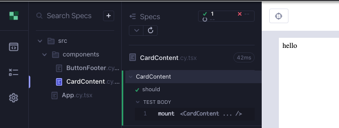
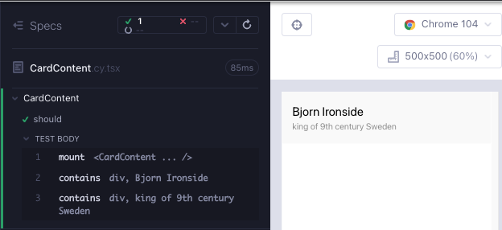

# CardContent

Sonunda bileşenimiz şöyle görünebilir. İki başka div'i saran bir div'e ihtiyacımız var.


`feat/cardContent` adında bir dal oluşturun. `src/components/` klasörü altında 2 dosya oluşturun; `CardContent.cy.tsx`, `CardContent.tsx`.

Bileşeni işleyen minimal bir testle başlıyoruz (Kırmızı 1).

```tsx
// src/components/CardContent.cy.tsx
import CardContent from "./CardContent";

describe("CardContent", () => {
  it("should render the card content", () => {
    cy.mount(<CardContent />);
  });
});
```

Derleyiciyi yeşil yapmak için minimumu yapıyoruz.

```tsx
// src/components/CardContent.tsx

export default function CardContent() {
  return <div>hello</div>;
}
```

Cypress bileşen test çalıştırıcısını başlatın ve testi çalıştırın; `yarn cy:open-ct`.

Dizenin işlendiğini test edelim (Yeşil 1).

```tsx
// src/components/CardContent.cy.tsx
import CardContent from "./CardContent";

describe("CardContent", () => {
  it("should render the card content", () => {
    cy.mount(<CardContent />);
    cy.contains("hello");
  });
});
```



İstediğimiz div'ler için bir test yazalım; bir isim içeren iki div'e ihtiyacımız var, diğeri bir açıklama içeriyor (Kırmızı 2).

```tsx
// src/components/CardContent.cy.tsx
import CardContent from "./CardContent";

describe("CardContent", () => {
  it("should render the card content", () => {
    cy.mount(<CardContent />);

    cy.contains("Bjorn Ironside");
    cy.contains("king of 9th century Sweden");
  });
});
```

Test edilen değerleri sabit kodlayarak yeşil yaparız (Yeşil 2).

```tsx
// src/components/CardContent.tsx
export default function CardContent() {
  return (
    <div>
      <div>Bjorn Ironside</div>
      <div>king of 9th century Sweden</div>
    </div>
  );
}
```

İsim ve açıklamanın prop'lar olarak geçirilmesi gerektiği açık hale geliyor (Kırmızı 3).

```tsx
// src/components/CardContent.cy.tsx
import CardContent from "./CardContent";

describe("CardContent", () => {
  it("should render the card content", () => {
    const name = "Bjorn Ironside";
    const description = "king of 9th century Sweden";
    cy.mount(<CardContent name={name} description={description} />);

    cy.contains(name);
    cy.contains(description);
  });
});
```

Test hala başarılı, ancak derleyici, mevcut olmayan prop'lar hakkında şikayet ediyor. Hadi bunları bileşene ekleyelim (Yeşil 3). Ayrıca, bunların her ikisinin de dize olacağını bildiğimiz için bu prop'lar için türleri ekleyebiliriz.

```tsx
// src/components/CardContent.tsx
type CardContentProps = {
  name: string;
  description: string;
};

export default function CardContent({ name, description }: CardContentProps) {
  return (
    <div>
      <div>{name}</div>
      <div>{description}</div>
    </div>
  );
}
```

Şimdi bileşenimize bazı stiller ekleyebiliriz.

```tsx
// src/components/CardContent.cy.tsx
import CardContent from "./CardContent";
import "../styles.scss";

// ...
```

Bileşenimiz Cypress çalıştırıcısında hala aynı görünüyor. Daha güzel görünmesi için bazı css sınıfları ekleyelim (Refaktör 3).

```tsx
// src/components/CardContent.tsx
type CardContentProps = {
  name: string;
  description: string;
};

export default function CardContent({ name, description }: CardContentProps) {
  return (
    <div className="card-content">
      <div className="name">{name}</div>
      <div className="description">{description}</div>
    </div>
  );
}
```

Son olarak, bileşeni kullanırken başvurmayı kolaylaştırmak için bileşenin üst etiketine `data-cy` özniteliği ekleriz.

```tsx
type CardContentProps = {
  name: string;
  description: string;
};

export default function CardContent({ name, description }: CardContentProps) {
  return (
    <div data-cy="card-content" className="card-content">
      <div className="name">{name}</div>
      <div className="description">{description}</div>
    </div>
  );
}
```

Şimdi bileşenimize bazı stiller ekleyebiliriz.

```
javascriptCopy code
// src/components/CardContent.cy.tsx
import CardContent from "./CardContent";
import "../styles.scss";

// ...
```

Bileşenimiz Cypress çalıştırıcısında hala aynı görünüyor. Daha güzel görünmesi için bazı css sınıfları ekleyelim (Yeniden düzenleme 3).

```
typescriptCopy code
// src/components/CardContent.tsx
type CardContentProps = {
  name: string;
  description: string;
};

export default function CardContent({ name, description }: CardContentProps) {
  return (
    <div className="card-content">
      <div className="name">{name}</div>
      <div className="description">{description}</div>
    </div>
  );
}
```

Son olarak, bileşeni kullanırken başvurmayı kolaylaştırmak için bileşenin üst etiketine `data-cy` özniteliği ekleriz.

```
typescriptCopy code
type CardContentProps = {
  name: string;
  description: string;
};

export default function CardContent({ name, description }: CardContentProps) {
  return (
    <div data-cy="card-content" className="card-content">
      <div className="name">{name}</div>
      <div className="description">{description}</div>
    </div>
  );
}
```

Bu, bileşenle çalışmamızı tamamlar.



## Bileşen testinin RTL sürümü

```tsx
// src/components/CardContent.test.tsx
import CardContent from "./CardContent";
import { render, screen } from "@testing-library/react";
import "@testing-library/jest-dom";

describe("CardContent", () => {
  it("should render the card content", async () => {
    const name = "Bjorn Ironside";
    const description = "king of 9th century Sweden";
    render(<CardContent name={name} description={description} />);

    expect(await screen.findByText(name)).toBeVisible();
    expect(await screen.findByText(description)).toBeVisible();
  });
});
```

## Özet

Bileşeni işleyen minimal bir testle başladık (Kırmızı 1)

Fonksiyon bileşenini yeşil yapmak için ekledik (Yeşil 1)

İşlemeyi doğrulamak için bir test ekledik (Yeşil 1)

</br>

Div'ler için başarısız bir test yazdık (Kırmızı 2).

Bileşen için oluşturduğumuz div'lere değerleri sabit kodladık (Yeşil 2).

</br>

Testi, sabit kodlanmış değerler yerine prop'larla işlemek üzere geliştirdik (Kırmızı 3).

Prop'ları ve türlerini bileşene ekledik (Yeşil 3).

Bileşene stiller ve sınıflar ekledik (Yeniden düzenleme 3).

</br>

## Çıkarılacak Dersler

- Testlerin başlangıçta geçmesi için sabit kodlanmış değerler kullanılması teşvik edilir.
- Bileşenin üst etiketine `data-cy` özniteliği kullanmak, diğer bileşenler veya uygul
