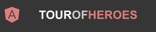
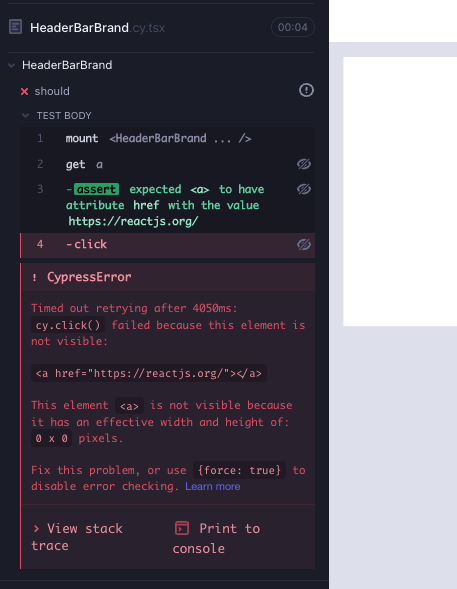
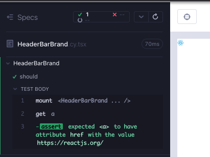
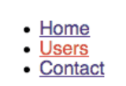
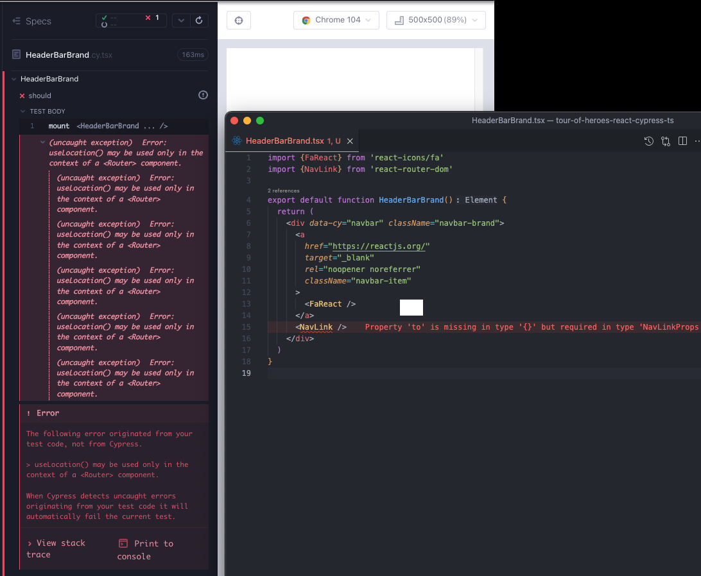
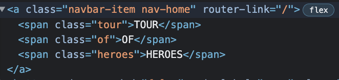
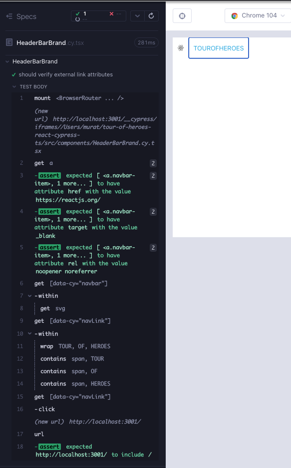

# HeaderBarBrand

Bileşenimiz sonunda neye benzeyebileceğini görelim. Uygulamamızın https://reactjs.org/ adresine ve `/heroes` yoluna iki bağlantıya ihtiyacımız var. React simgesinin görüntülenmesi ve metin için biraz css'e ihtiyacımız var.



`feat/headerBarBrand` adında bir dal oluşturun. `src/components/` klasörü altında 2 dosya oluşturun; `HeaderBarBrand.cy.tsx`, `HeaderBarBrand.tsx`. Her zamanki gibi, bileşen işlemesiyle minimal başlangıç yapın; aşağıdakileri dosyalara kopyalayın ve `yarn cy:open-ct` ile çalıştırıcıyı açtıktan sonra testi çalıştırın.

```tsx
// src/components/HeaderBarBrand.cy.tsx
import HeaderBarBrand from "./HeaderBarBrand";
import "../styles.scss";

describe("HeaderBarBrand", () => {
  it("should", () => {
    cy.mount(<HeaderBarBrand />);
  });
});
```

```tsx
// src/components/HeaderBarBrand.tsx

export default function HeaderBarBrand() {
  return <div>hello</div>;
}
```

## Harici adrese bağlantı

İki bağlantıyı içeren bir `div`'e ihtiyacımız var. Başarısız bir testle (Kırmızı 1) daha kolay başlayalım.

```tsx
// src/components/HeaderBarBrand.cy.tsx
import HeaderBarBrand from "./HeaderBarBrand";
import "../styles.scss";

describe("HeaderBarBrand", () => {
  it("should", () => {
    cy.mount(<HeaderBarBrand />);
    cy.get("a").should("have.attr", "href", "https://reactjs.org/");
  });
});
```

Testin geçmesi için bileşene bağlantıyı ekleyin (Yeşil 1).

```tsx
// src/components/HeaderBarBrand.tsx

export default function HeaderBarBrand() {
  return (
    <div>
      <a href="https://reactjs.org/" />
    </div>
  );
}
```

Bağlantıya tıklayalım ve herhangi bir yönlendirme olup olmadığını görelim. Cypress çalıştırıcısı, öğenin görünür olmadığından şikayet edecek (Kırmızı 2).

```tsx
// src/components/HeaderBarBrand.cy.tsx
import HeaderBarBrand from "./HeaderBarBrand";
import "../styles.scss";

describe("HeaderBarBrand", () => {
  it("should", () => {
    cy.mount(<HeaderBarBrand />);
    cy.get("a").should("have.attr", "href", "https://reactjs.org/").click();
  });
});
```



Tıklama işlemine bir güç ekleyebiliriz `.click({force: true})`, ama daha iyisini yapalım. İlk bölümde `react-icons`'u yükledik, bu nedenle `FaReact`'i içe aktarabiliriz (Yeşil 2).

Şimdilik testten `.click()`'i çıkarın ve sadece görünürlük için kontrol edin.

```tsx
// src/components/HeaderBarBrand.tsx
import { FaReact } from "react-icons/fa";

export default function HeaderBarBrand() {
  return (
    <div>
      <a href="https://reactjs.org/">
        <FaReact />
      </a>
    </div>
  );
}
```

```tsx
// src/components/HeaderBarBrand.cy.tsx
import HeaderBarBrand from "./HeaderBarBrand";
import "../styles.scss";

describe("HeaderBarBrand", () => {
  it("should", () => {
    cy.mount(<HeaderBarBrand />);
    cy.get("a")
      .should("have.attr", "href", "https://reactjs.org/")
      .should("be.visible");
  });
});
```

Simge oluşturulur (Yeşil 2) .



Linkin [https://reactjs.org](https://reactjs.org/) adresinde yeni bir sekmede açılmasını istiyoruz. Bunun için link'e `target='_blank'` ve `rel="noopener noreferrer">` özelliklerini ekleyebiliriz. Yeni işlevsellik için hatalı bir test yazalım (Kırmızı 3).

```tsx
// src/components/HeaderBarBrand.tsx
import HeaderBarBrand from "./HeaderBarBrand";
import "../styles.scss";

describe("HeaderBarBrand", () => {
  it("should", () => {
    cy.mount(<HeaderBarBrand />);
    cy.get("a")
      .should("have.attr", "href", "https://reactjs.org/")
      .and("have.attr", "target", "_blank")
      .and("have.attr", "rel", "noopener noreferrer");
  });
});
```

Testin geçmesi için bileşene özellikleri ekliyoruz (Yeşil 3).

```tsx
// src/components/HeaderBarBrand.tsx
import { FaReact } from "react-icons/fa";

export default function HeaderBarBrand() {
  return (
    <div>
      <a href="https://reactjs.org/" target="_blank" rel="noopener noreferrer">
        <FaReact />
      </a>
    </div>
  );
}
```

> Cypress'te bir 2. sekme ile başa çıkmanın [3 yolu var](https://glebbahmutov.com/blog/cypress-second-tab/). Yaklaşımımız düşük maliyetli ve güvenlidir; bileşenin dışına çıkıp tıklama yapmaya gerek yok.

CSS'e baktığımızda, `navbar-brand` ve `navbar-item` sınıflarımız var. Renderın daha iyi görünmesi için bunları ekleyebiliriz (Düzenleme 3).

```tsx
// src/components/HeaderBarBrand.tsx
import { FaReact } from "react-icons/fa";

export default function HeaderBarBrand() {
  return (
    <div className="navbar-brand">
      <a
        href="https://reactjs.org/"
        target="_blank"
        rel="noopener noreferrer"
        className="navbar-item"
      >
        <FaReact />
      </a>
    </div>
  );
}
```

Şimdilik yalnızca bağlantıyı kontrol ediyoruz. Bileşenin içinde bir `svg` olup olmadığını da doğrulayabiliriz. Bir css seçicisiyle değil bileşen için bir `data-cy` özelliği olmasını istiyoruz. Bu için başarısız bir test yazalım (Kırmızı 4).

```tsx
// src/components/HeaderBarBrand.tsx
import HeaderBarBrand from "./HeaderBarBrand";
import "../styles.scss";

describe("HeaderBarBrand", () => {
  it("should", () => {
    cy.mount(<HeaderBarBrand />);
    cy.get("a")
      .should("have.attr", "href", "https://reactjs.org/")
      .and("have.attr", "target", "_blank")
      .and("have.attr", "rel", "noopener noreferrer");
    cy.getByCy("header-bar-brand").within(() => cy.get("svg"));
  });
});
```

Bileşenimizdeki link kısmında `data-cy` özelliğini ekledik ve bu kısmı tamamladık.

```tsx
// src/components/HeaderBarBrand.tsx
import { FaReact } from "react-icons/fa";

export default function HeaderBarBrand() {
  return (
    <div data-cy="header-bar-brand" className="navbar-brand">
      <a
        href="https://reactjs.org/"
        target="_blank"
        rel="noopener noreferrer"
        className="navbar-item"
      >
        <FaReact />
      </a>
    </div>
  );
}
```

## `/heroes` rotası için bağlantı

Uygulamamızda yönlendirme çözümü olarak `react-router` kullanacağız. React Router'ın `Link` bileşeni, uygulamadaki farklı rotalara geçmek için kullanılır ve `NavLink`, kullanıcının hangi rotada olduğuna dair görsel bir işaret eklemek için kullanılır. Biz `NavLink`i tercih edeceğiz. İşte `NavLink`nin bağlantı vurgu özelliğini gösteren bir örnek görüntü:



React-router'ı `yarn add react-router-dom` ile uygulamamıza ekleyin. `div`in altına `NavLink` ekleyin ve nasıl göründüklerine bakalım.

```tsx
// src/components/HeaderBarBrand.tsx
import { FaReact } from "react-icons/fa";
import { NavLink } from "react-router-dom";

export default function HeaderBarBrand() {
  return (
    <div data-cy="header-bar-brand" className="navbar-brand">
      <a
        href="https://reactjs.org/"
        target="_blank"
        rel="noopener noreferrer"
        className="navbar-item"
      >
        <FaReact />
      </a>
      <NavLink />
    </div>
  );
}
```

İki hata alıyoruz. Biri eksik bir özniteliğe dair bir derleyici uyarısı, diğeri `react-router`ın bileşeni `Router` bileşeni içinde sarmalanmadan kullanılmasıdır (Red 5). Bu da başka bir bileşen testi hatasıdır ve bu hata ile de tanışmak istiyoruz.



`NavLink`'e `data-cy` özniteliğini ekleyerek, bileşenin bağlantı kısmıyla ilgili işlemi tamamlamış oluruz.

```tsx
// src/components/HeaderBarBrand.tsx
import { FaReact } from "react-icons/fa";
import { NavLink } from "react-router-dom";

export default function HeaderBarBrand() {
  return (
    <div data-cy="header-bar-brand" className="navbar-brand">
      <a
        href="https://reactjs.org/"
        target="_blank"
        rel="noopener noreferrer"
        className="navbar-item"
      >
        <FaReact />
      </a>
      <NavLink to="/" />
    </div>
  );
}
```

Bileşen testindeki hata mesajını ise, bileşeni `BrowserRouter` içinde sarmalayarak giderebiliriz. Bu, gelecekteki yönlendirmeyle ilgili bileşen testlerinde sık sık göreceğimiz bir durumdur.

```tsx
// src/components/HeaderBarBrand.cy.tsx
import HeaderBarBrand from "./HeaderBarBrand";
import { BrowserRouter } from "react-router-dom";
import "../styles.scss";

tsxdescribe("HeaderBarBrand", () => {
  it("should", () => {
    cy.mount(
      <BrowserRouter>
        <HeaderBarBrand />
      </BrowserRouter>
    );
    cy.get("a")
      .should("have.attr", "href", "https://reactjs.org/")
      .and("have.attr", "target", "_blank")
      .and("have.attr", "rel", "noopener noreferrer");
    cy.getByCy("header-bar-brand").within(() => cy.get("svg"));
  });
});
```

Testimiz tekrar başarılı oldu, ancak görsel olarak herhangi bir fark yok. Gereksinimler özelliklerini belirlemek için Angular sürümünü kullandık. Orada metnin üç farklı stildeki span ile gösterildiğini görebiliyoruz. `NavLink`'e css sınıflarını da ekleyebiliriz.



Bu içeriği kontrol eden yeni bir hatalı test yazabiliriz. `NavLink`'in oluşturulup oluşturulmadığını kontrol etmek istiyoruz ve `span` altındaki dizeleri doğrulamak istiyoruz. Bu linke tıklandığında, anasayfada olduğumuzu doğrulayabiliriz (Red 6). Cypress bileşen testinde url kavramı yoktur, ancak bağlantılara tıklama işlemi gerçekten bir url değerini değiştirir, bunu doğrulayabiliriz.

```tsx
// src/components/HeaderBarBrand.cy.tsx
import HeaderBarBrand from "./HeaderBarBrand";
import { BrowserRouter } from "react-router-dom";
import "../styles.scss";

describe("HeaderBarBrand", () => {
  it("should verify external link attributes", () => {
    cy.mount(
      <BrowserRouter>
        <HeaderBarBrand />
      </BrowserRouter>
    );

    cy.get("a")
      .should("have.attr", "href", "https://reactjs.org/")
      .and("have.attr", "target", "_blank")
      .and("have.attr", "rel", "noopener noreferrer");
    cy.getByCy("header-bar-brand").within(() => cy.get("svg"));

    cy.getByCy("navLink").within(() =>
      ["TOUR", "OF", "HEROES"].forEach((part: string) =>
        cy.contains("span", part)
      )
    );
    cy.getByCy("navLink").click();
    cy.url().should("contain", "/");
  });
});
```

Başarısızlıkları çözmek için, `data-cy` özniteliğini ekler ve uygulamanın Angular sürümündeki DOM yapısını kopyalarız (Green 6).

```tsx
// src/components/HeaderBarBrand.tsx
import { FaReact } from "react-icons/fa";
import { NavLink } from "react-router-dom";

export default function HeaderBarBrand() {
  return (
    <div data-cy="header-bar-brand" className="navbar-brand">
      <a
        href="https://reactjs.org/"
        target="_blank"
        rel="noopener noreferrer"
        className="navbar-item"
        data-cy="header-bar-brand-link"
      >
        <div data-cy="react-icon-svg">
          <FaReact />
        </div>
      </a>
      <NavLink data-cy="navLink" to="/" className="navbar-item navbar-home">
        <span className="tour">TOUR</span>
        <span className="of">OF</span>
        <span className="heroes">HEROES</span>
      </NavLink>
    </div>
  );
}
```



Bu noktada bir test yeniden yapılandırması mümkündür, iki farklı bölüme ayırmamız gerekiyor mu yoksa tek bir `it` bloğu altında mı olmalıdır?

Bir Cypress bileşen testi, küçük ölçekli bir e2e testidir; bir hatanın yarattığı zararın küçültülmesi için testleri kısa tutmaya gerek yoktur, çünkü çalıştırıcı teşhis etmeyi kolaylaştırır. Bir test perspektifinden önemli olan, testin başlangıç durumudur; bu duruma ulaşmak yaygınsa, genellikle bir test geliştirme fırsatıdır, kısmi test çoğaltması yerine.

Bizim durumumuzda, basit bir bileşen olduğu için, testi uzun tutabilir veya ortak durum için bir before hook kullanabiliriz (bileşenin montajı), böylece 2 ayrı test olur. İşte iki farklı sürüm (Düzenleme 6):

> İpucu: Uzun bir testte [`cy.log()`](https://docs.cypress.io/api/commands/log#Syntax), sınır belirlemede kullanılabilir.

```tsx
// src/components/HeaderBarBrand.cy.tsx
// single it block
import HeaderBarBrand from "./HeaderBarBrand";
import { BrowserRouter } from "react-router-dom";
import "../styles.scss";

describe("HeaderBarBrand", () => {
  it("should verify internal and external links", () => {
    cy.mount(
      <BrowserRouter>
        <HeaderBarBrand />
      </BrowserRouter>
    );

    cy.get("a")
      .should("have.attr", "href", "https://reactjs.org/")
      .and("have.attr", "target", "_blank")
      .and("have.attr", "rel", "noopener noreferrer");
    cy.getByCy("header-bar-brand").within(() => cy.get("svg"));

    cy.getByCy("navLink").within(() =>
      ["TOUR", "OF", "HEROES"].forEach((part: string) =>
        cy.contains("span", part)
      )
    );
    cy.getByCy("navLink").click();
    cy.url().should("contain", "/");
  });
});
```

```tsx
// src/components/HeaderBarBrand.cy.tsx
// 2 it blocks with a beforeEach hook for mount
import HeaderBarBrand from "./HeaderBarBrand";
import { BrowserRouter } from "react-router-dom";
import "../styles.scss";

describe("HeaderBarBrand", () => {
  r;
  beforeEach(() => {
    cy.mount(
      <BrowserRouter>
        <HeaderBarBrand />
      </BrowserRouter>
    );
  });

  it("should verify external link attributes", () => {
    cy.get("a")
      .should("have.attr", "href", "https://reactjs.org/")
      .and("have.attr", "target", "_blank")
      .and("have.attr", "rel", "noopener noreferrer");
    cy.getByCy("header-bar-brand").within(() => cy.get("svg"));
  });

  it("should verify internal link spans and navigation", () => {
    cy.getByCy("navLink").within(() =>
      ["TOUR", "OF", "HEROES"].forEach((part: string) =>
        cy.contains("span", part)
      )
    );
    cy.getByCy("navLink").click();
    cy.url().should("contain", "/");
  });
});
```

### Bileşen testinin RTL sürümü

```tsx
// src/components/HeaderBarBrand.test.tsx
import HeaderBarBrand from "./HeaderBarBrand";
import { render, screen, within } from "@testing-library/react";
import { BrowserRouter } from "react-router-dom";
import userEvent from "@testing-library/user-event";
import "@testing-library/jest-dom";

describe("HeaderBarBrand", () => {
  beforeEach(() => {
    render(
      <BrowserRouter>
        <HeaderBarBrand />
      </BrowserRouter>
    );
  });
  it("should verify external link attributes", async () => {
    const link = await screen.findByTestId("header-bar-brand-link");
    expect(link).toHaveAttribute("href", "https://reactjs.org/");
    expect(link).toHaveAttribute("target", "_blank");
    expect(link).toHaveAttribute("rel", "noopener noreferrer");

    // not easy to get a tag with RTL, needed to use a test id
    within(await screen.findByTestId("header-bar-brand")).getByTestId(
      "react-icon-svg"
    );
  });

  it("should verify internal link spans and navigation", async () => {
    const navLink = await screen.findByTestId("navLink");
    const withinNavLink = within(navLink);
    ["TOUR", "OF", "HEROES"].map((part) => withinNavLink.getByText(part));

    await userEvent.click(navLink);
    expect(window.location.pathname).toBe("/");
  });
});
```

## Özet

Bir href'ye giden bir bağlantı için başarısız bir test ekledik (Kırmızı 1).

Bağlantıyı bileşene ekledik (Yeşil 1).

</br>

Simgenin / bağlantının görünmediği tespit edildi (Kırmızı 2).

`react-icon` ekledik ve bağlantının görünürlüğünü doğruladık (Yeşil 2).

</br>

Dış bağlantıya tıklandığında yeni bir sekme açmak için yeni bir özellik için başarısız bir test ekledik (Kırmızı 3).

`target=_blank` ve `rel` özniteliklerini bileşene ekledik (Yeşil 3).

Bileşenin görünümünü iyileştirmek için CSS ekledik (Düzenleme 3).

</br>

Daha kapsamlı bir kontrol yapmak ve `data-cy` seçicisini kullanmak için testi iyileştirdik (Kırmızı 4).

Ardından bileşeni teste geçmek için iyileştirdik (Yeşil 4).

</br>

Dahili bağlantı için `react-router` ekledik ve yönlendirme için `NavLink` kullandık. `NavLink`'in bir `to` özniteliği olmadığı için iki hata aldık, diğeri de testin `Router` bileşeni tarafından sarılmamış olmasıydı (Kırmızı 5).

`NavLink`'e `to` özniteliğini ekledik ve bileşeni `BrowserRouter` ile sararak sorunu çözdük (Yeşil 5).

</br>

[Angular uygulamasının](https://papa-heroes-angular.azurewebsites.net/heroes) görsel yapısal özelliklerini inceleyerek bileşene yeni testler ekledik (Kırmızı 6).

Bileşeni testi geçmesi için iyileştirdik (Yeşil 6).

Testi yeniden düzenledik (Düzenleme 6).

## Çıkarılacak Dersler

- Cypress'te ikinci sekme ile ilgili [3 yöntem](https://glebbahmutov.com/blog/cypress-second-tab/) vardır. Çoğu zaman `href` özniteliği için kontrol yeterlidir.
- React uygulamalarında yönlendirmede [`react-router`](https://reactrouter.com/en/main) de facto bir çözümdür. Navigasyon için [`NavLink`](https://reactrouter.com/en/main/components/nav-link) ile bir `to` özniteliği kullanırız.
- `react-router` ile ilgili bileşen testleri için bileşeni `BrowserRouter` ile sarmak gerekir.
- Cypress bileşen testinde URL kavramı yoktur, ancak bağlantılara tıklamak gerçekten bir URL özniteliğini değiştirir, bunu doğrulayabiliriz.
- Bir Cypress bileşen testi küçük ölçekli bir end-to-end testidir. Bir hata durumunda tanı koymayı kolaylaştırmak için testleri kısa tutmak gerekli değildir. Test açısından önemli olan, bir testin başlangıç durumudur; eğer bu duruma ulaşmak yaygınsa, genellikle bir test geliştirme fırsatıdır, kısmi test kopyalaması değil.
- Uzun bir testte, delimitasyon için [`cy.log()`](https://docs.cypress.io/api/commands/log#Syntax) kullanılabilir.
