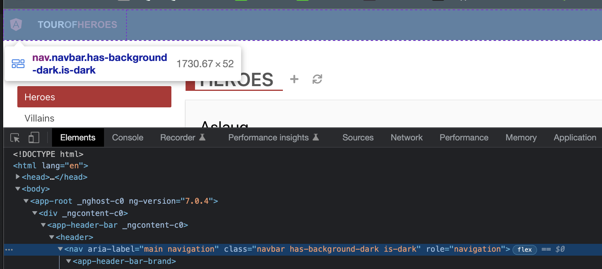
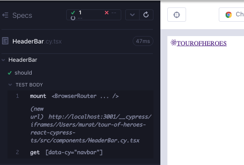
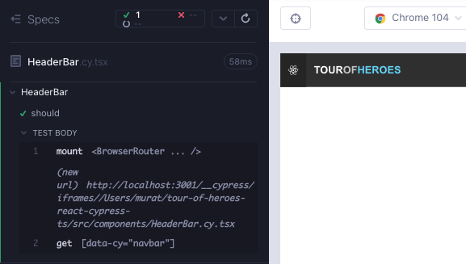

# HeaderBar

Uygulamanın Angular versiyonunda, `HeaderBarBrand` üzerinde bir üst bileşen bulunmaktadır. Bunu da oluşturalım.



`feat/headerBar` adında bir dal oluşturun. `src/components/` klasörü altında 2 dosya oluşturun; `HeaderBar.cy.tsx`, `HeaderBar.tsx`. Her zamanki gibi, bileşen işlemi ile minimal başlayın; aşağıdakileri dosyalara kopyalayın ve `yarn cy:open-ct` ile çalıştırıcıyı açtıktan sonra testi çalıştırın.

```typescript
// src/components/HeaderBar.cy.tsx
import HeaderBar from "./HeaderBar";

describe("HeaderBar", () => {
  it("should", () => {
    cy.mount(<HeaderBar />);
  });
});
```

```tsx
// src/components/HeaderBar.tsx

export default function HeaderBar() {
  return <div>hello</div>;
}
```

`HeaderBar` bileşeninde, `HeaderBar`ın alt bileşeni olan, üst düzey bir `data-cy` seçici ekledik ve değeri `header-bar-brand` oldu. Alt bileşenin varlığını kontrol etmek için başarısız bir test ekleyelim (Kırmızı 1).

```tsx
// src/components/HeaderBar.cy.tsx
import HeaderBar from "./HeaderBar";

describe("HeaderBar", () => {
  it("should", () => {
    cy.mount(<HeaderBar />);
    cy.getByCy("header-bar-brand");
  });
});
```

Alt bileşeni ana bileşene ekleyin.

```tsx
// src/components/HeaderBar.tsx
import HeaderBarBrand from "./HeaderBarBrand";

export default function HeaderBar() {
  return (
    <div>
      <HeaderBarBrand />
    </div>
  );
}
```

`HeaderBarBrand` bileşeni ile aldığımız `react-router` ile ilgili hatayı alıyoruz. Bir alt bileşen `react-router` kullanıyorsa, ana bileşeni test ederken, ana bileşeni de `BrowserRouter` içine sarmamız gerekir (Yeşil 1).

```tsx
// src/components/HeaderBar.cy.tsx
import HeaderBar from "./HeaderBar";
import { BrowserRouter } from "react-router-dom";
import "../styles.scss";

describe("HeaderBar", () => {
  it("should", () => {
    cy.mount(
      <BrowserRouter>
        <HeaderBar />
      </BrowserRouter>
    );
    cy.getByCy("header-bar-brand");
  });
});
```

Alt bileşen işlem görüyor.



Özellikler, alt bileşenin bir `header` ve bir `nav` tarafından sarıldığını gösteriyor. Ayrıca koyu temayı veren bir css de var. Bunları tarayıcıdan kopyalayabiliriz. Bileşenin en üst etiketine de bir `data-cy` seçici ekliyoruz.

```tsx
// src/components/HeaderBar.tsx
import HeaderBarBrand from "./HeaderBarBrand";

export default function HeaderBar() {
  return (
    <header data-cy="header-bar">
      <nav
        className="navbar has-background-dark is-dark"
        role="navigation"
        aria-label="main navigation"
      >
        <HeaderBarBrand />
      </nav>
    </header>
  );
}
```

Bileşen, CSS ile harika görünüyor.



Geleneksel bir KırmızıYeşilDüzenleme döngüsüne gerekli olmadığını fark edin; Kırmızımız bu durumda bileşenin son haliyle işlem görmemesiydi ve bunu adım adım geliştirdik.

Bu noktada başka ne test edilebilir? Alt bileşen için testleri tekrarlamamıza gerek yok, çünkü bunların hepsini çocukta ele aldık. `nav` etiketinin bir özelliğini kontrol etmek dışında değerli başka bir ek kontrol yoktur. Bunu, [Cypress testing library](https://testing-library.com/docs/cypress-testing-library/intro/) ile kolayca ekleyebiliriz (Düzenleme 1).

```tsx
// src/components/HeaderBar.cy.tsx
import HeaderBar from "./HeaderBar";
import { BrowserRouter } from "react-router-dom";
import "../styles.scss";

describe("HeaderBar", () => {
  it("should", () => {
    cy.mount(
      <BrowserRouter>
        <HeaderBar />
      </BrowserRouter>
    );
    cy.getByCy("header-bar-brand");
    cy.findByRole("navigation");
  });
});
```

## Bileşen testinin RTL sürümü

```tsx
// src/components/HeaderBar.test.tsx
import HeaderBar from "./HeaderBar";
import { render, screen } from "@testing-library/react";
import { BrowserRouter } from "react-router-dom";
import "@testing-library/jest-dom";

describe("HeaderBar", () => {
  it("should render error", async () => {
    render(
      <BrowserRouter>
        <HeaderBar />
      </BrowserRouter>
    );
    expect(await screen.findByTestId("header-bar-brand")).toBeVisible();
  });
});
```

## Özet ve çıkarılacak dersler

Bu bölümün ana çıkarımı, bileşenler arasındaki ebeveyn-çocuk ilişkisi ve üst düzey `data-cy` seçicilerin çocuk bileşenlerin daha yüksek düzeydeki testlerde daha kolay başvurulmasını nasıl sağladığına dair bir gösterimdir.

Eğer bir çocuk bileşen `react-router` kullanıyorsa, ebeveyn bileşeni test ederken, ebeveyn bileşenini de `BrowserRouter` içine sarmamız gerekir.

Bir ebeveyn bileşeninde, çocuk bileşenin tüm testlerini tekrarlamamıza gerek yoktur, çünkü tümünü çocukta ele aldık. Aynı düşünce süreci, e2e ile daha yüksek düzeydeki testlere de uygulanır.

Bileşeni tasarlarken, mutlaka geleneksel bir KırmızıYeşilDüzenleme döngüsünden geçmemiz gerekmez. Test aracımız aynı zamanda tasarım aracı olduğunda, KırmızıYeşilDüzenleme, bileşene sınıflar ve css eklerken bileşene kademeli görsel iyileştirmeler de olabilir.
