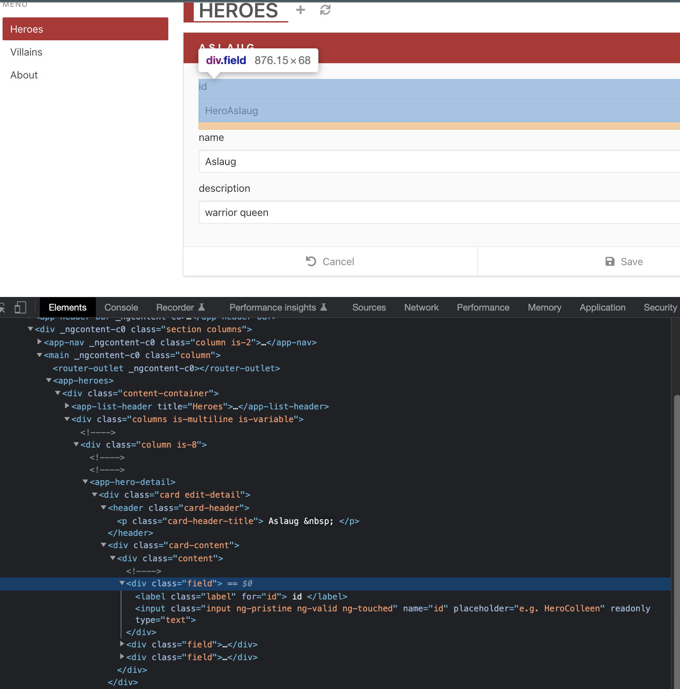
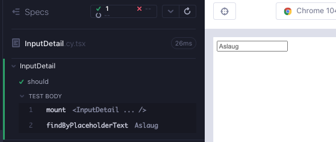
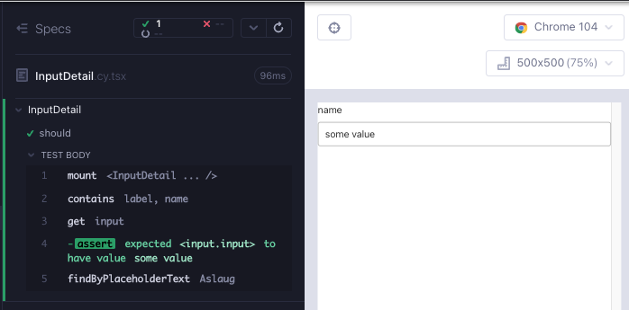

# InputDetail

Angular sürümünde uygulamanın bu bileşeninin, bir `label` ve `input` içeren bir `div` olacağını görebiliriz. Bu klasik bir form alanıdır.



`feat/inputDetail` adında bir dal oluşturun. `src/components/` klasörü altında `InputDetail.cy.tsx` ve `InputDetail.tsx` adında 2 dosya oluşturun. Her zamanki gibi, bir bileşen render ile minimal başlayın; aşağıdakileri dosyalara kopyalayın ve `yarn cy:open-ct` ile koşucuyu açtıktan sonra testi çalıştırın.

```tsx
// src/components/InputDetail.cy.tsx
import InputDetail from "./InputDetail";

describe("InputDetail", () => {
  it("should", () => {
    cy.mount(<InputDetail />);
  });
});
```

```tsx
// src/components/InputDetail.tsx
export default function InputDetail() {
  return <div>hello</div>;
}
```

İlk başarısız testimize geçelim. Bir `input` etiketinin placeholder niteliği olması gerekiyor. Hem bunu hem de Testing Library'nin `findByPlaceholderText`'ini kullanarak kontrol edebiliriz (Kırmızı 1).

```tsx
// src/components/InputDetail.cy.tsx
import InputDetail from "./InputDetail";

describe("InputDetail", () => {
  it("should", () => {
    cy.mount(<InputDetail />);
    cy.findByPlaceholderText("Aslaug");
  });
});
```

Bileşeni, sert kodlamayla iyileştirerek testi geçiririz (Yeşil 1).

```tsx
// src/components/InputDetail.tsx
export default function InputDetail() {
  return (
    <div>
      <input placeholder="Aslaug"></input>
    </div>
  );
}
```

Hemen bu değerin bir özellik olması gerektiğini söyleyebiliriz, çünkü sert kodlanmış değer nedeniyle. Testi ve bileşeni bir prop kabul etmek üzere geliştiriyoruz (Düzenleme 1).

```tsx
// src/components/InputDetail.cy.tsx
import InputDetail from "./InputDetail";

describe("InputDetail", () => {
  it("should", () => {
    const placeholder = "Aslaug";
    cy.mount(<InputDetail placeholder={placeholder} />);
    cy.findByPlaceholderText(placeholder);
  });
});
```

```tsx
// src/components/InputDetail.tsx
type InputDetailProps = {
  placeholder: string;
};

export default function InputDetail({ placeholder }: InputDetailProps) {
  return (
    <div>
      <input placeholder={placeholder}></input>
    </div>
  );
}
```



İhtiyacımız olan bir sonraki etiket `label`'dır. Bu, formlarda yaygın bir düzendir; css ve niteliklerle bir `div` etiketi içinde `label` ve `input` etiketlerini içeren bir yapıdır. Başarısız bir test yazalım (Kırmızı 2).

```tsx
// src/components/InputDetail.cy.tsx
import InputDetail from "./InputDetail";

describe("InputDetail", () => {
  it("should", () => {
    const placeholder = "Aslaug";
    const name = "name";
    cy.mount(<InputDetail name={name} placeholder={placeholder} />);

    cy.contains(name);
    cy.findByPlaceholderText(placeholder);
  });
});
```

Yeni prop'u türlere, bileşen argümanlarına ve etiket etiketine ekleyerek geçen bir test alın (Yeşil 2).

```tsx
// src/components/InputDetail.tsx
type InputDetailProps = {
  name: string;
  placeholder: string;
};

export default function InputDetail({ name, placeholder }: InputDetailProps) {
  return (
    <div>
      <label>{name}</label>
      <input placeholder={placeholder}></input>
    </div>
  );
}
```

CSS'yi ve alışılagelmiş form alanı niteliklerini ekleyebiliriz.

`input type="text"` bir `input`'u metin girişi yapar.

`label htmlFor={someValue}` `label` ve `input` etiketlerini bağlar (Refactor 2).

```tsx
// src/components/InputDetail.tsx
type InputDetailProps = {
  name: string;
  placeholder: string;
};

export default function InputDetail({ name, placeholder }: InputDetailProps) {
  return (
    <div className="field">
      <label className="label" htmlFor={name}>
        {name}
      </label>
      <input
        name={name}
        placeholder={placeholder}
        className="input"
        type="text"
      ></input>
    </div>
  );
}
```

Form alanlarının da bir `value` özelliği bulunmaktadır. Bu özellik, ağdan gelen `readonly` değerleri veya yazılabilir form alanları için kullanılabilir. Şimdilik, bir formun `defaultValue` değerini kontrol eden başarısız bir test yazalım ve aynı zamanda stilleri ekleyelim (Kırmızı 3).

```tsx
// src/components/InputDetail.cy.tsx
import InputDetail from "./InputDetail";
import "../styles.scss";

describe("InputDetail", () => {
  it("should", () => {
    const placeholder = "Aslaug";
    const name = "name";
    const value = "some value";
    cy.mount(
      <InputDetail name={name} value={value} placeholder={placeholder} />
    );

    cy.contains(name);
    cy.get("input").should("have.value", value);
    cy.findByPlaceholderText(placeholder);
  });
});
```

Testi, `value` özelliği ile bir `defaultValue` özelliği ekleyerek yeşil yaparız. Ayrıca bunu bir tip ve bileşene argüman olarak da ekleriz (Yeşil 3).

```tsx
// src/components/InputDetail.tsx
type InputDetailProps = {
  name: string;
  value: string;
  placeholder: string;
};

export default function InputDetail({
  name,
  value,
  placeholder,
}: InputDetailProps) {
  return (
    <div className="field">
      <label className="label" htmlFor={name}>
        {name}
      </label>
      <input
        name={name}
        defaultValue={value}
        placeholder={placeholder}
        className="input"
        type="text"
      ></input>
    </div>
  );
}
```

Bileşen CSS ile güzel bir şekilde oluşturuluyor.



Form alanı için 2 çeşit önerdik; salt okunur ve yazılabilir alan. İki durum yaratalım. Bir alanın değiştirilebilir olduğunu kontrol eden ilk test geçmelidir. İkinci test, girişin salt okunur olduğunu kontrol eder ve şimdilik başarısız olmalıdır. Ayrıca, mevcut olmayan bir `readOnly` özelliği geçmeye çalışırken derleyici göstergesi alırız (Kırmızı 4).

```tsx
//  src/components/InputDetail.cy.tsx
import InputDetail from "./InputDetail";
import "../styles.scss";

describe("InputDetail", () => {
  it("should allow the input field to be modified", () => {
    const placeholder = "Aslaug";
    const name = "name";
    const value = "some value";
    const newValue = "42";
    cy.mount(
      <InputDetail name={name} value={value} placeholder={placeholder} />
    );

    cy.contains(name);
    cy.findByPlaceholderText(placeholder).clear().type(newValue);
    cy.get("input").should("have.value", newValue);
  });

  it("should not allow the input field to be modified when readonly", () => {
    const placeholder = "Aslaug";
    const name = "name";
    const value = "some value";
    cy.mount(
      <InputDetail
        name={name}
        value={value}
        placeholder={placeholder}
        readOnly={true}
      />
    );

    cy.contains(name);
    cy.findByPlaceholderText(placeholder).should("have.attr", "readOnly");
  });
});
```

readOnly özelliğini tiplere, argümanlara ve bileşenin salt okunur özelliğine ekleyerek geçen bir test alabiliriz (Yeşil 4). Bu noktada, `name` ve `value` zorunlu alanlar olduğunu ve geri kalanların isteğe bağlı olduğunu belirtmek önemlidir.

```tsx
//  src/components/InputDetail.tsx
type InputDetailProps = {
  name: string;
  value: string;
  placeholder?: string;
  readOnly?: boolean;
};

export default function InputDetail({
  name,
  value,
  placeholder,
  readOnly,
}: InputDetailProps) {
  return (
    <div className="field">
      <label className="label" htmlFor={name}>
        {name}
      </label>
      <input
        name={name}
        defaultValue={value}
        placeholder={placeholder}
        readOnly={readOnly}
        className="input"
        type="text"
      ></input>
    </div>
  );
}
```

Bir form alanı için ihtiyaç duyduğumuz son özellik, yazılabilir bir alan olduğunda `onChange`'dir. Form alanı değiştiğinde `onChange` olayının çağrıldığını kontrol etmek için testi geliştirelim (Kırmızı 5). `onChange` değeri basitçe `cy.stub().as('onChange')`'dir.

```tsx
//  src/components/InputDetail.cy.tsx
import InputDetail from "./InputDetail";
import "../styles.scss";

describe("InputDetail", () => {
  it("should allow the input field to be modified", () => {
    const placeholder = "Aslaug";
    const name = "name";
    const value = "some value";
    const newValue = "42";
    cy.mount(
      <InputDetail
        name={name}
        value={value}
        placeholder={placeholder}
        onChange={cy.stub().as("onChange")}
      />
    );

    cy.contains(name);
    cy.findByPlaceholderText(placeholder).clear().type(newValue);
    cy.get("input").should("have.value", newValue);
    cy.get("@onChange").should("have.been.called");
  });

  it("should not allow the input field to be modified when readonly", () => {
    const placeholder = "Aslaug";
    const name = "name";
    const value = "some value";
    cy.mount(
      <InputDetail
        name={name}
        value={value}
        placeholder={placeholder}
        readOnly={true}
      />
    );

    cy.contains(name);
    cy.findByPlaceholderText(placeholder).should("have.attr", "readOnly");
    cy.get("input").should("have.value", value);
  });
});
```

Testi geçmek için, yeni `onChange` özelliği için tipi eklemeliyiz, bileşenin argümanını ve giriş etiketinin özelliğini eklemeliyiz (Yeşil 5).

```tsx
import { ChangeEvent } from "react";

type InputDetailProps = {
  name: string;
  value: string;
  placeholder?: string;
  onChange?: (e: ChangeEvent<HTMLInputElement>) => void;
  readOnly?: boolean;
};

export default function InputDetail({
  name,
  value,
  placeholder,
  onChange,
  readOnly,
}: InputDetailProps) {
  return (
    <div className="field">
      <label className="label" htmlFor={name}>
        {name}
      </label>
      <input
        name={name}
        defaultValue={value}
        placeholder={placeholder}
        onChange={onChange}
        readOnly={readOnly}
        className="input"
        type="text"
      ></input>
    </div>
  );
}
```

onChange kontrolü ile testi daha spesifik hale getirebiliriz. 42 yazarken 2 kez çağrılmalıdır (Düzenleme 5).

```tsx
// src/components/InputDetail.cy.tsx
import InputDetail from "./InputDetail";
import "../styles.scss";

describe("InputDetail", () => {
  const placeholder = "Aslaug";
  const name = "name";
  const value = "some value";
  const newValue = "42";

  it("should allow the input field to be modified", () => {
    cy.mount(
      <InputDetail
        name={name}
        value={value}
        placeholder={placeholder}
        onChange={cy.stub().as("onChange")}
      />
    );

    cy.contains("label", name);
    cy.findByPlaceholderText(placeholder).clear().type(newValue);
    cy.findByDisplayValue(newValue);
    cy.get("@onChange")
      .its("callCount")
      .should("eq", newValue.length + 1);
  });

  it("should not allow the input field to be modified", () => {
    cy.mount(
      <InputDetail
        name={name}
        value={value}
        placeholder={placeholder}
        readOnly={true}
      />
    );

    cy.contains("label", name);
    cy.findByPlaceholderText(placeholder)
      .should("have.value", value)
      .and("have.attr", "readOnly");
  });
});
```

Son dokunuş olarak, bileşeni bir alt öğe olarak kullanıldığında başvurmayı kolaylaştırmak için bir `data-cy` seçici ekleriz.

```tsx
import { ChangeEvent } from "react";

type InputDetailProps = {
  name: string;
  value: string;
  placeholder?: string;
  onChange?: (e: ChangeEvent<HTMLInputElement>) => void;
  readOnly?: boolean;
};

export default function InputDetail({
  name,
  value,
  placeholder,
  onChange,
  readOnly,
}: InputDetailProps) {
  return (
    <div data-cy={`input-detail-${name}`} className="field">
      <label className="label" htmlFor={name}>
        {name}
      </label>
      <input
        name={name}
        defaultValue={value}
        placeholder={placeholder}
        onChange={onChange}
        readOnly={readOnly}
        className="input"
        type="text"
      ></input>
    </div>
  );
}
```

## Bileşen testinin RTL versiyonu

```tsx
// src/components/InputDetail.test.tsx
import InputDetail from "./InputDetail";
import { render, screen } from "@testing-library/react";
import userEvent from "@testing-library/user-event";

describe("InputDetail", () => {
  const placeholder = "Aslaug";
  const name = "name";
  const value = "some value";
  const newValue = "42";

  it("should allow the input field to be modified", async () => {
    const onChange = jest.fn();
    render(
      <InputDetail
        name={name}
        value={value}
        placeholder={placeholder}
        onChange={onChange}
      />
    );

    await screen.findByText(name);
    const inputField = await screen.findByPlaceholderText(placeholder);
    await userEvent.clear(inputField);
    await userEvent.type(inputField, newValue);
    expect(inputField).toHaveDisplayValue(newValue);
    expect(onChange).toHaveBeenCalledTimes(newValue.length);
  });

  it("should not allow the input field to be modified", async () => {
    render(
      <InputDetail
        name={name}
        value={value}
        placeholder={placeholder}
        readOnly={true}
      />
    );

    await screen.findByText(name);
    const inputField = await screen.findByPlaceholderText(placeholder);
    expect(inputField).toHaveDisplayValue(value);
    expect(inputField).toHaveAttribute("readOnly");
  });
});
```

## Özet

`findByPlaceholderText` komutunu kullanarak input placeholder metin kontrolü ile başladık (Kırmızı 1).

Testin geçmesi için placeholder özelliğine sabit bir değer atadık (Yeşil 1).

Sabit değeri bir prop ile değiştirdik. Prop'u tiplere, bileşenin argümanlarına ekledik ve placeholder özelliğinin değeri için bu argümanı kullandık (Düzenleme 1).

</br>

Formlarda sıkça rastlanan bir model belirledik; bir `div`'ın, css ve özniteliklerle birlikte bir `label` ve `input`'u sarmalıyor. Etiket etiketi altındaki alan adını kontrol eden başarısız bir test yazdık (Kırmızı 2).

Yeni prop'u tiplere, bileşenin argümanlarına ve `label` etiketine ekledik (Yeşil 2).

Formlar üzerinde önemli bir bilgi belirledik: `input type="text"` bir `input`'u metin girişi yapar, `label htmlFor={someValue}` `label` ve `input` etiketlerini bağlar. Bileşeni bu bilgi ile geliştirdik (Düzenleme 2).

</br>

Yeni bir prop için `value` / `defaultValue` testi ekledik (Kırmızı 3).

Önceki döngülerde olduğu gibi, defaultValue'yi tip, bileşenin argümanları ve `input` özniteliğine ekleyerek testi yeşile çevirdik (Yeşil 3).

</br>

Bileşenin iki çeşidini desteklemeye karar verdik; yazılabilir alanlar için biri ve salt okunur alanlar için diğeri. Salt okunur alanın değiştirilmemesi gerektiğini doğrulayan yeni bir test ekledik (Kırmızı 4).

Önceki döngülerde olduğu gibi, readOnly tipini, bileşene argümanı ve eşleşen bir prop ile özniteliği ekledik (Yeşil 4).

</br>

Sonunda, alanda `onChange` prop'u istedik. Alanı değiştirirken `onChange` olayının çağrıldığını kontrol eden bir test ekledik (Kırmızı 5).

Yeni prop için tip ekledik, bileşene argümanı ve eşleşen bir prop ile özniteliği ekledik (Yeşil 5).

Testi, belirli sayıda `onChange` çağrısını kontrol etmek için geliştirdik (Düzenleme 5).

## Alınacak Dersler

- Bileşen testine bir prop eklerken:
  1. Prop'u bileşen tiplerine ekleyin.
  2. Bileşene veya argümanlara ekleyin.
  3. Bileşende prop'u kullanın.

## Takeaways

- When adding a prop to the component test:
  1. Add the prop to the component types.
  2. Add it to the arguments or the component.
  3. Use the prop in the component.
- Bir `div`'ın `label` ve `input`'u sarmalaması, form alanları oluşturmak için yaygın bir modeldir. `input type="text"` bir `input`'u metin girişi yapar, `label htmlFor={someValue}` `label` ve `input` etiketlerini bağlar.
