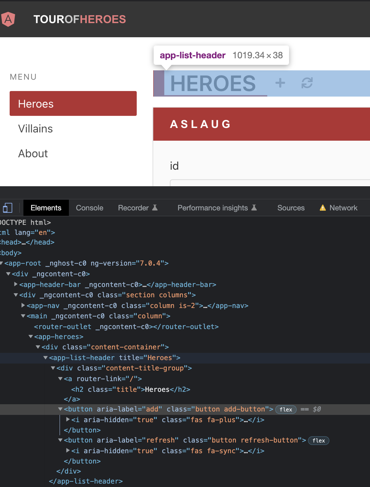
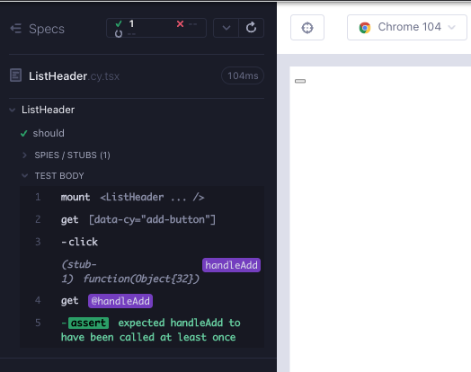
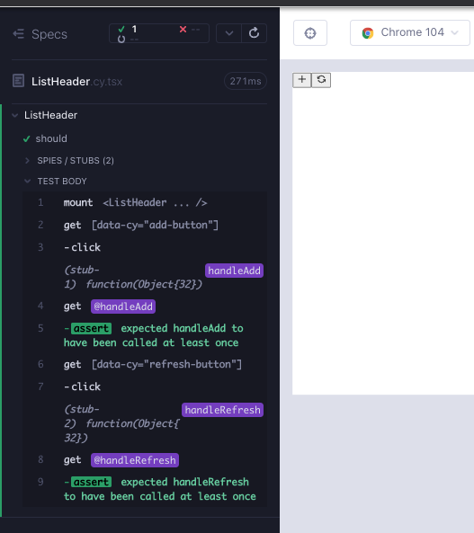
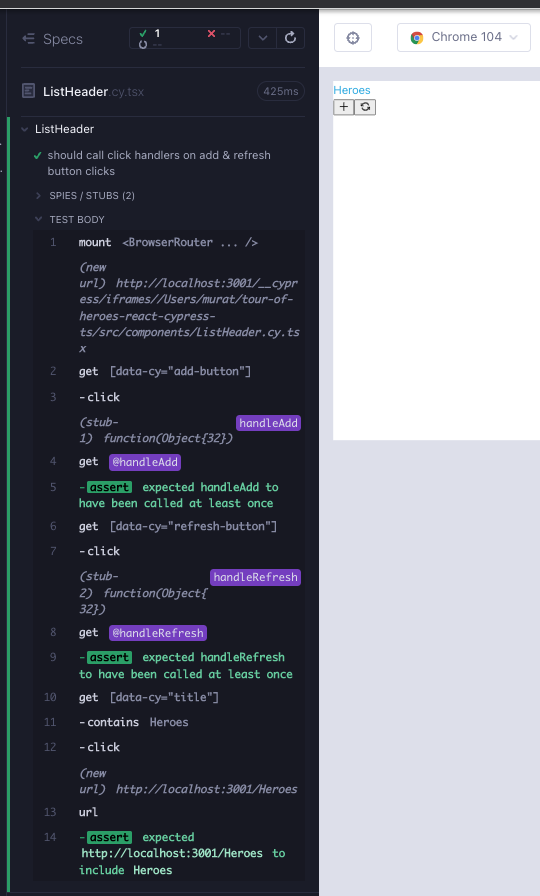
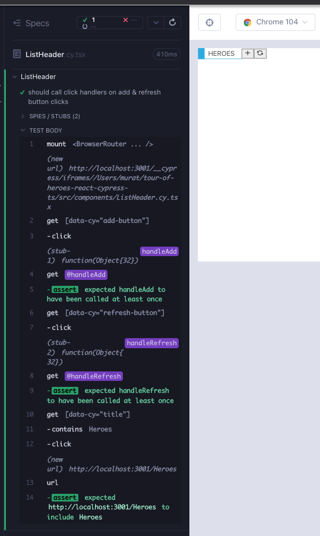

# ListHeader

Angular versiyonundaki uygulamada, bileşenin bir bağlantıyı ve ekle ve yenile için iki düğme içeren bir `div` olacağını görebiliriz.



`feat/listHeader` adında bir dal oluşturun. `src/components/` klasörü altında 2 dosya oluşturun; `ListHeader.cy.tsx`, `ListHeader.tsx`. Her zamanki gibi, bileşenin oluşturulmasıyla başlayarak aşağıdakileri dosyalara kopyalayın ve `yarn cy:open-ct` ile koşucuyu açtıktan sonra testi çalıştırın.

```tsx
// src/components/ListHeader.cy.tsx
import ListHeader from "./ListHeader";

describe("ListHeader", () => {
  it("should", () => {
    cy.mount(<ListHeader />);
  });
});
```

```tsx
// src/components/ListHeader.tsx

export default function ListHeader() {
  return <div>hello</div>;
}
```

Ekle düğmesiyle başlayacağız ve başarısız bir test yazacağız (Kırmızı 1).

```tsx
// src/components/ListHeader.cy.tsx
import ListHeader from "./ListHeader";
describe("ListHeader", () => {
  it("should", () => {
    cy.mount(<ListHeader />);

    cy.getByCy("add-button");
  });
});
```

`data-cy` özelliğini, testin geçmesi için düğmeye ekliyoruz (Yeşil 1). Ayrıca bileşen daha büyük ölçekte kullanıldığında üst seviye etiket için de bir `data-cy` özelliği ekliyoruz.

```tsx
// src/components/ListHeader.tsx
export default function ListHeader() {
  return (
    <div data-cy="list-header">
      <button data-cy="add-button"></button>
    </div>
  );
}
```

Düğmelerin `onClick` işleyicileri vardır. Bileşeni `handleAdd` adında bir özellikle yerleştirerek bir test ekleriz ve tıklama üzerine çağrılmasını bekleriz (Kırmızı 2).

```tsx
// src/components/ListHeader.cy.tsx
import ListHeader from "./ListHeader";

describe("ListHeader", () => {
  it("should", () => {
    cy.mount(<ListHeader handleAdd={cy.stub().as("handleAdd")} />);

    cy.getByCy("add-button").click();
    cy.get("@handleAdd").should("be.called");
  });
});
```

Önceki bölümlerden bir bileşene yeni özellikler eklerken akışı hatırlıyoruz:

- Türlerde özelliği ekleyin
- Bileşenin argümanlarına veya bileşene ekleyin
- Bileşende kullanın.

Burada özellik `onClick` ve `button` etiketine ekleniyor. İlk geçen testimize sahibiz (Yeşil 2).

```tsx
// src/components/ListHeader.tsx
import { MouseEvent } from "react";

type ListHeaderProps = {
  handleAdd: (e: MouseEvent<HTMLButtonElement>) => void;
};

export default function ListHeader({ handleAdd }: ListHeaderProps) {
  return (
    <div data-cy="list-header">
      <button data-cy="add-button" onClick={handleAdd}></button>
    </div>
  );
}
```



Yenile düğmesi için benzer bir özellik ve benzer bir doğrulama ile başka bir kontrol oluşturabiliriz, sadece farklı isim; `handleRefresh` (Kırmızı 3).

```tsx
// src/components/ListHeader.cy.tsx
import ListHeader from "./ListHeader";

describe("ListHeader", () => {
  it("should", () => {
    cy.mount(
      <ListHeader
        handleAdd={cy.stub().as("handleAdd")}
        handleRefresh={cy.stub().as("handleRefresh")}
      />
    );

    cy.getByCy("add-button").click();
    cy.get("@handleAdd").should("be.called");

    cy.getByCy("refresh-button").click();
    cy.get("@handleRefresh").should("be.called");
  });
});
```

Ekle düğmesinin aynası olan prop türü, prop argümanı ve `onClick` özelliği eklemek (Yeşil 3).

```tsx
// src/components/ListHeader.tsx
import { MouseEvent } from "react";

type ListHeaderProps = {
  handleAdd: (e: MouseEvent<HTMLButtonElement>) => void;
  handleRefresh: (e: MouseEvent<HTMLButtonElement>) => void;
};

export default function ListHeader({
  handleAdd,
  handleRefresh,
}: ListHeaderProps) {
  return (
    <div data-cy="list-header">
      <button data-cy="add-button" onClick={handleAdd}></button>
      <button data-cy="refresh-button" onClick={handleRefresh}></button>
    </div>
  );
}
```

Angular uygulamasından aria etiketlerini rahatça kopyalayabiliriz (Düzenleme 3).

```tsx
// src/components/ListHeader.tsx
import { MouseEvent } from "react";

type ListHeaderProps = {
  handleAdd: (e: MouseEvent<HTMLButtonElement>) => void;
  handleRefresh: (e: MouseEvent<HTMLButtonElement>) => void;
};

export default function ListHeader({
  handleAdd,
  handleRefresh,
}: ListHeaderProps) {
  return (
    <div data-cy="list-header">
      <button
        data-cy="add-button"
        onClick={handleAdd}
        aria-label="add"
      ></button>
      <button
        data-cy="refresh-button"
        onClick={handleRefresh}
        aria-label="refresh"
      ></button>
    </div>
  );
}
```

Görseller, düğmeler için simgelerin eksik olduğunu gösteriyor. İkonları seçmek için [react-icons](https://react-icons.github.io/react-icons) kullanabiliriz (Düzenleme 4). Bu, test aracımızın, artımlı görsel iyileştirmelerle RedGreenRefactor döngülerine yardımcı olmak için tasarım aracı olarak kullanılmasıyla ilgili başka bir örnektir.

```tsx
// src/components/ListHeader.tsx
import { MouseEvent } from "react";
import { FiRefreshCcw } from "react-icons/fi";
import { GrAdd } from "react-icons/gr";

type ListHeaderProps = {
  handleAdd: (e: MouseEvent<HTMLButtonElement>) => void;
  handleRefresh: (e: MouseEvent<HTMLButtonElement>) => void;
};

export default function ListHeader({
  handleAdd,
  handleRefresh,
}: ListHeaderProps) {
  return (
    <div data-cy="list-header">
      <button data-cy="add-button" onClick={handleAdd} aria-label="add">
        <GrAdd />
      </button>
      <button
        data-cy="refresh-button"
        onClick={handleRefresh}
        aria-label="refresh"
      >
        <FiRefreshCcw />
      </button>
    </div>
  );
}
```



Son kalan parça başlık bağlantısıdır. Bir `data-cy` özniteliğiyle başarısız bir kontrol yazıyoruz ve içinde bir metin içermesi gerektiğini düşünüyoruz (Kırmızı 5).

```tsx
// src/components/ListHeader.cy.tsx
import ListHeader from "./ListHeader";
import "../styles.scss";

describe("ListHeader", () => {
  it("should call click handlers on add & refresh button clicks", () => {
    cy.mount(
      <ListHeader
        handleAdd={cy.stub().as("handleAdd")}
        handleRefresh={cy.stub().as("handleRefresh")}
      />
    );

    cy.getByCy("add-button").click();
    cy.get("@handleAdd").should("be.called");

    cy.getByCy("refresh-button").click();
    cy.get("@handleRefresh").should("be.called");

    cy.getByCy("title").contains("HEROES");
  });
});
```

Kodu sert kodlanmış bir başlıkla geçerli bir bağlantıya (Yeşil 5) dönüştürüyoruz.

```tsx
// src/components/ListHeader.tsx
import { MouseEvent } from "react";
import { FiRefreshCcw } from "react-icons/fi";
import { GrAdd } from "react-icons/gr";

type ListHeaderProps = {
  handleAdd: (e: MouseEvent<HTMLButtonElement>) => void;
  handleRefresh: (e: MouseEvent<HTMLButtonElement>) => void;
};

export default function ListHeader({
  handleAdd,
  handleRefresh,
}: ListHeaderProps) {
  return (
    <div data-cy="list-header">
      <a data-cy="title">
        <h2>HEROES</h2>
      </a>
      <button data-cy="add-button" onClick={handleAdd} aria-label="add">
        <GrAdd />
      </button>
      <button
        data-cy="refresh-button"
        onClick={handleRefresh}
        aria-label="refresh"
      >
        <FiRefreshCcw />
      </button>
    </div>
  );
}
```

Tüm sert kodlanmış değerlerle, onu bir özellik olarak geçme modelini hatırlıyoruz. Bileşen testine `title` özelliğini ekliyoruz (Kırmızı 6).

```tsx
// src/components/ListHeader.cy.tsx
import ListHeader from "./ListHeader";
import "../styles.scss";

describe("ListHeader", () => {
  it("should call click handlers on add & refresh button clicks", () => {
    const title = "Heroes";
    cy.mount(
      <ListHeader
        title={title}
        handleAdd={cy.stub().as("handleAdd")}
        handleRefresh={cy.stub().as("handleRefresh")}
      />
    );

    cy.getByCy("add-button").click();
    cy.get("@handleAdd").should("be.called");

    cy.getByCy("refresh-button").click();
    cy.get("@handleRefresh").should("be.called");

    cy.getByCy("title").contains(title);
  });
});
```

Modeli hatırlıyoruz; bir tür, bir bileşen bağımsız değişkeni ve bileşen oluşturmadaki bir değişken olarak özelliği geçiyoruz (Yeşil 6).

```tsx
// src/components/ListHeader.tsx
import { MouseEvent } from "react";
import { FiRefreshCcw } from "react-icons/fi";
import { GrAdd } from "react-icons/gr";

type ListHeaderProps = {
  title: string;
  handleAdd: (e: MouseEvent<HTMLButtonElement>) => void;
  handleRefresh: (e: MouseEvent<HTMLButtonElement>) => void;
};

export default function ListHeader({
  title,
  handleAdd,
  handleRefresh,
}: ListHeaderProps) {
  return (
    <div data-cy="list-header">
      <a data-cy="title">
        <h2>{title}</h2>
      </a>
      <button data-cy="add-button" onClick={handleAdd} aria-label="add">
        <GrAdd />
      </button>
      <button
        data-cy="refresh-button"
        onClick={handleRefresh}
        aria-label="refresh"
      >
        <FiRefreshCcw />
      </button>
    </div>
  );
}
```

Önceki `HeaderBarBrand` bileşeninde `react-router`'dan bir `NavLink` kullandık. Uygulama, bu `a` bağlantısının aslında uygulamamızda Kahramanlar, Kötüler veya Hakkında olabilen bir rota olduğunu öne sürüyor. `a` yerine `NavLink` kullanıyoruz ve `to` özniteliği rotalardan biridir. Dize türünü 3 olasılığın birliği olarak da geliştirebiliriz (Düzenleme 6).

```tsx
// src/components/ListHeader.tsx
import { MouseEvent } from "react";
import { NavLink } from "react-router-dom";
import { FiRefreshCcw } from "react-icons/fi";
import { GrAdd } from "react-icons/gr";

type ListHeaderProps = {
  title: "Heroes" | "Villains" | "About";
  handleAdd: (e: MouseEvent<HTMLButtonElement>) => void;
  handleRefresh: (e: MouseEvent<HTMLButtonElement>) => void;
};

export default function ListHeader({
  title,
  handleAdd,
  handleRefresh,
}: ListHeaderProps) {
  return (
    <div data-cy="list-header">
      <NavLink data-cy="title" to={title}>
        <h2>{title}</h2>
      </NavLink>
      <button data-cy="add-button" onClick={handleAdd} aria-label="add">
        <GrAdd />
      </button>
      <button
        data-cy="refresh-button"
        onClick={handleRefresh}
        aria-label="refresh"
      >
        <FiRefreshCcw />
      </button>
    </div>
  );
}
```

Bu değişiklikle, bileşenin `BrowserRouter` içinde sarmalanması gerektiğini şikayet eden tanıdık test hatasıyla karşılaşıyoruz.

```tsx
// src/components/ListHeader.cy.tsx
import ListHeader from "./ListHeader";
import { BrowserRouter } from "react-router-dom";
import "../styles.scss";

describe("ListHeader", () => {
  it("should call click handlers on add & refresh button clicks", () => {
    const title = "Heroes";
    cy.mount(
      <BrowserRouter>
        <ListHeader
          title={title}
          handleAdd={cy.stub().as("handleAdd")}
          handleRefresh={cy.stub().as("handleRefresh")}
        />
      </BrowserRouter>
    );

    cy.getByCy("add-button").click();
    cy.get("@handleAdd").should("be.called");

    cy.getByCy("refresh-button").click();
    cy.get("@handleRefresh").should("be.called");

    cy.getByCy("title").contains(title);
  });
});
```

Navigasyon sırasında bir tıklamayla o URL'de olduğumuzu kontrol edebiliriz. Bunu daha önce `HeaderBarBrand` bileşeninde yapmıştık (Düzenleme 7).

```tsx
// src/components/ListHeader.cy.tsx
import ListHeader from "./ListHeader";
import { BrowserRouter } from "react-router-dom";
import "../styles.scss";

describe("ListHeader", () => {
  it("should call click handlers on add & refresh button clicks", () => {
    const title = "Heroes";
    cy.mount(
      <BrowserRouter>
        <ListHeader
          title={title}
          handleAdd={cy.stub().as("handleAdd")}
          handleRefresh={cy.stub().as("handleRefresh")}
        />
      </BrowserRouter>
    );

    cy.getByCy("add-button").click();
    cy.get("@handleAdd").should("be.called");

    cy.getByCy("refresh-button").click();
    cy.get("@handleRefresh").should("be.called");

    cy.getByCy("title").contains(title).click();
    cy.url().should("contain", title);
  });
});
```



Testimiz yüksek kapsamla harika görünüyor. Oluşturma eksik olsa da. Orijinal uygulamadan `div` içindeki css'yi kopyalayabilir ve RGF döngülerinde bize yardımcı olması için tasarım aracı olarak test aracımızı kullanabiliriz (Düzenleme 8).

```tsx
// src/components/ListHeader.tsx
import { MouseEvent } from "react";
import { NavLink } from "react-router-dom";
import { FiRefreshCcw } from "react-icons/fi";
import { GrAdd } from "react-icons/gr";

type ListHeaderProps = {
  title: "Heroes" | "Villains" | "About";
  handleAdd: (e: MouseEvent<HTMLButtonElement>) => void;
  handleRefresh: (e: MouseEvent<HTMLButtonElement>) => void;
};

export default function ListHeader({
  title,
  handleAdd,
  handleRefresh,
}: ListHeaderProps) {
  return (
    <div data-cy="list-header" className="content-title-group">
      <NavLink data-cy="title" to={title}>
        <h2>{title}</h2>
      </NavLink>
      <button data-cy="add-button" onClick={handleAdd} aria-label="add">
        <GrAdd />
      </button>
      <button
        data-cy="refresh-button"
        onClick={handleRefresh}
        aria-label="refresh"
      >
        <FiRefreshCcw />
      </button>
    </div>
  );
}
```



## Bileşen testinin RTL versiyonu

```tsx
// src/components/ListHeader.test.tsx
import ListHeader from "./ListHeader";
import { render, screen } from "@testing-library/react";
import userEvent from "@testing-library/user-event";
import { BrowserRouter } from "react-router-dom";
import "@testing-library/jest-dom";

describe("ListHeader", () => {
  it("should call click handlers on add & refresh button clicks", async () => {
    const handleAdd = jest.fn();
    const handleRefresh = jest.fn();
    const title = "Heroes";
    render(
      <BrowserRouter>
        <ListHeader
          title={title}
          handleAdd={handleAdd}
          handleRefresh={handleRefresh}
        />
      </BrowserRouter>
    );

    await userEvent.click(await screen.findByTestId("add-button"));
    expect(handleAdd).toHaveBeenCalled();

    await userEvent.click(await screen.findByTestId("refresh-button"));
    expect(handleRefresh).toHaveBeenCalled();

    await userEvent.click(await screen.findByText(title));
    expect(window.location.pathname).toBe(`/${title}`);
  });
});
```

## Özet

Bir düğme tıklaması için başarısız bir testle başladık (Kırmızı 1, 2).

Bileşeni, `data-cy` seçiciye sahip bir düğme (Yeşil 1) ve onClick işleyicisi (Yeşil 2) ile geliştirdik.

</br>

Aynısını bir yenileme düğmesi için tekrarladık (Kırmızı 3, Yeşil 3).

Bileşeni aria etiketleriyle geliştirdik (Yeniden yapılandırma 3).

Test aracını görsel tasarım aracı olarak kullandık ve ekleme ve yenileme için simgeler ekledik (Yeniden yapılandırma 4).

</br>

Liste başlığını içeren bir bağlantı için başarısız bir test ekledik (Kırmızı 5).

Bağlantıda sert kodlanmış bir başlıkla testi geçerli hale getirdik (Yeşil 5).

</br>

Sert kodlanmış değerleri bileşenlere özellik olarak geçirmeyi tercih ettiğimizi hatırladık. Testte bileşen bağlamasına özelliği ekledik (Kırmızı 6).

Yine, bileşene yeni özelliği ekledik; türler, bağımsız değişkenler ve bileşende kullanıldı (Yeşil 6).

`a` etiketini, `HeaderBarBrand` bileşeninde olduğu gibi `NavLink` olacak şekilde yeniden yapılandırdık (Yeniden yapılandırma 6).

Testi bir rota URL kontrolüyle geliştirdik (Yeniden yapılandırma 7).

Ek css ile görselleri geliştirdik (Yeniden yapılandırma 8).

## Çıkarımlar

- Bileşene özellikler eklemek için modeli hatırladık:
  - Özelliği türlere ekleyin
  - Bileşene veya bağımsız değişkenlere ekleyin
  - Bileşende kullanın.
- Test aracı, artan görsel geliştirmelerle RedGreenRefactor döngülerine yardımcı olmak için tasarım aracı olarak hizmet verebilir.
- İlk bölümde gördüğümüz gibi, anahtar fikir, başarısız bir şeyle başlamak, işe yaraması için minimumu yapmak ve ardından daha iyi hale getirmektir. Bu bölümde, sonunda şeyleri daha iyi hale getirmek için testi ve görselleri sürekli geliştirdik.
