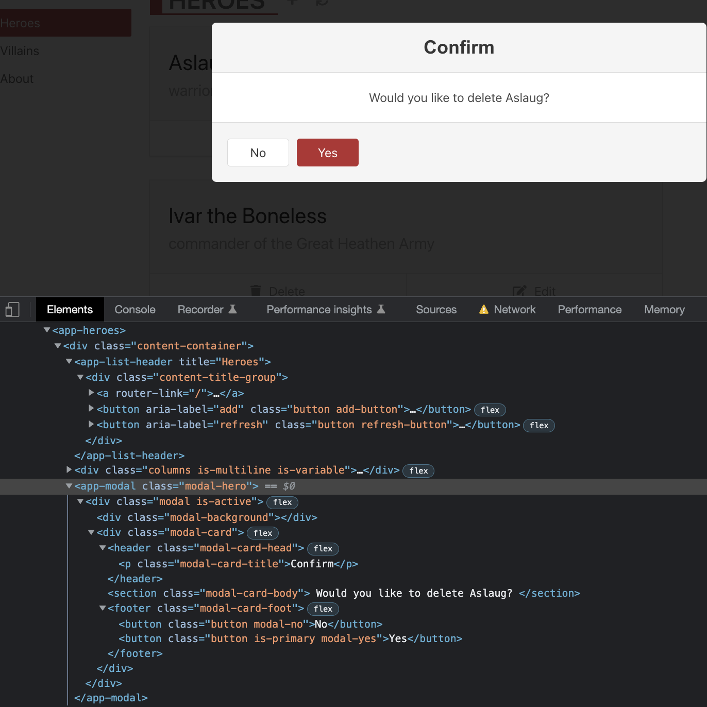
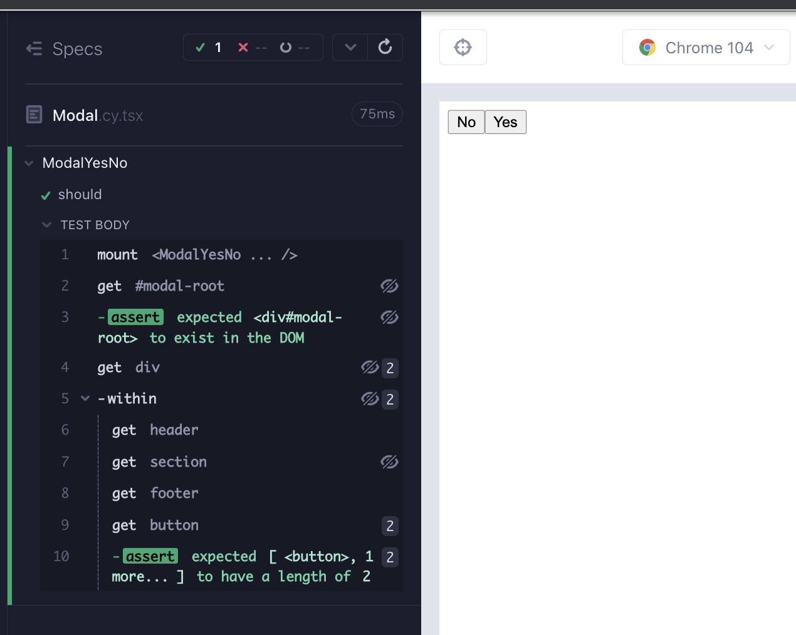
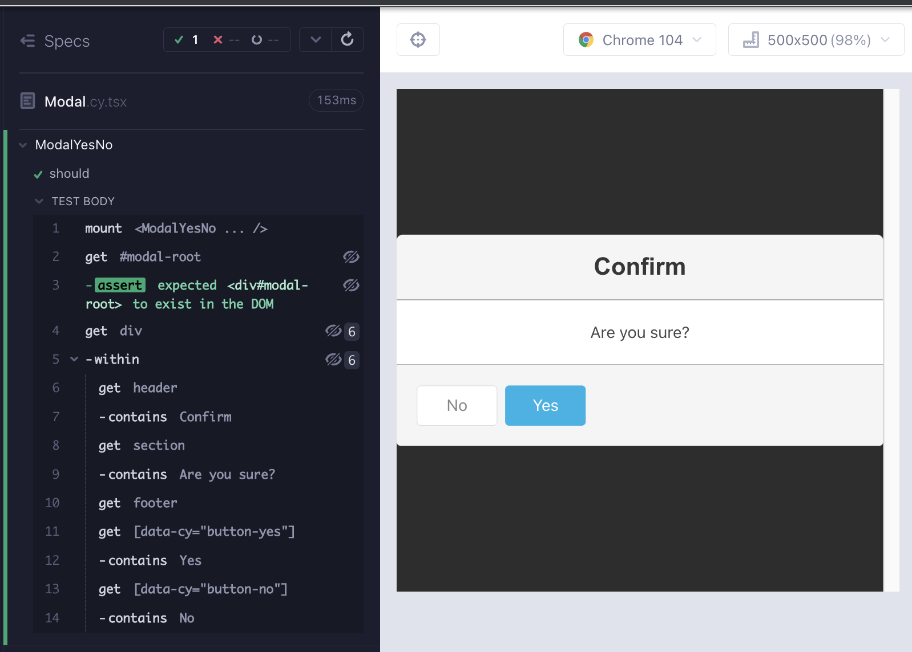

# ModalYesNo

Angular sürümündeki uygulamada, bileşenin çok sayıda css, başlık, bölüm ve sonunda 2 düğme içeren bir altbilgi ile bir modal olacağını görebiliriz. İskelet için, `header`, `section`, `footer` ve `footer` altındaki iki düğme ile `div` içeren bir yapıya başlayabiliriz.



`feat/modalYesNo` adlı bir dal oluşturun. `src/components/` klasörü altında `ModalYesNo.cy.tsx`, `ModalYesNo.tsx` adında 2 dosya oluşturun. Her zamanki gibi, bileşenin render edilmesiyle başlayarak aşağıdakileri dosyalara kopyalayın ve `yarn cy:open-ct` ile runner'ı açtıktan sonra testi çalıştırın.

```tsx
// src/components/ModalYesNo.cy.tsx
import ModalYesNo from "./ModalYesNo";

describe("ModalYesNo", () => {
  it("should", () => {
    cy.mount(<ModalYesNo />);
  });
});
```

```tsx
// src/components/ModalYesNo.tsx

export default function ModalYesNo() {
  return <div>hello</div>;
}
```

## Modal Portal Tarifi

İşleri basit tutmak için, [**React TypeScript Cheatsheet**](https://react-typescript-cheatsheet.netlify.app/) adresinden orijinal tarifi kullanacağız, [modal portal](https://react-typescript-cheatsheet.netlify.app/docs/basic/getting-started/portals/) örneği. `src/components/Modal.tsx` oluşturun ve aşağıdaki kodu yapıştırın.

```tsx
/* eslint-disable @typescript-eslint/no-non-null-assertion */
import { useEffect, useRef, ReactNode } from "react";
import { createPortal } from "react-dom";

type ModalProps = {
  children?: ReactNode;
};

const Modal = ({ children }: ModalProps) => {
  const el = useRef(document.createElement("div"));

  let modalRoot = document.getElementById("modal-root");
  if (!modalRoot) {
    modalRoot = document.createElement("div");
    modalRoot.setAttribute("id", "modal-root");
    document.body.appendChild(modalRoot);
  }

  useEffect(() => {
    const currentEl = el.current;

    modalRoot!.appendChild(currentEl);

    return () => {
      modalRoot!.removeChild(currentEl);
    };
  }, [modalRoot]);

  return createPortal(children, el.current);
};

export default Modal;
```

Şimdilik modalın her zaman açık olduğunu varsayacağız ve DOM'da `modal-root` adlı bir öğe bulunduğunu doğrulayan başarısız bir test yazacağız (Red 1).

```tsx
// src/components/ModalYesNo.cy.tsx
import ModalYesNo from "./ModalYesNo";

describe("ModalYesNo", () => {
  it("should", () => {
    cy.mount(<ModalYesNo />);

    cy.get("#modal-root").should("exist");
  });
});
```

Testi geçmek için `Modal`'ı içe aktarıp render etmeliyiz (Green 1).

```tsx
// src/components/ModalYesNo.tsx
import Modal from "./Modal";

export default function ModalYesNo() {
  return <Modal></Modal>;
}
```

Uygulamanın `header`, `section` ve `footer` ile iki düğme içeren bir iskeleti üzerinde karar kıldık. Bunu için başarısız bir test yazalım (Red 2).

```tsx
// src/components/ModalYesNo.cy.tsx
import ModalYesNo from "./ModalYesNo";

describe("ModalYesNo", () => {
  it("should", () => {
    cy.mount(<ModalYesNo />);

    cy.get("#modal-root").should("exist");

    cy.get("div")
      .last()
      .within(() => {
        cy.get("header");
        cy.get("section");
        cy.get("footer");
        cy.get("button").should("have.length", 2);
      });
  });
});
```

Modalın iskeletini oluşturarak testi geçirelim (Green 2).

```tsx
import Modal from "./Modal";

export default function ModalYesNo() {
  return (
    <Modal>
      <div>
        <header></header>
        <section></section>
        <footer>
          <button>No</button>
          <button>Yes</button>
        </footer>
      </div>
    </Modal>
  );
}
```



Bu biraz çıplak görünüyor. Angular sürümünden stilleri kopyalayalım ve birkaç etiket daha ekleyelim (Düzenleme 2). Önceki bölüme benzer şekilde, görsel yardımcılarla Düzenleme adımları için RedGreenDüzenleme döngüsü yapabiliriz.

```tsx
// src/components/ModalYesNo.tsx
import Modal from "./Modal";

export default function ModalYesNo() {
  return (
    <Modal>
      <div className="modal is-active">
        <div className="modal-background" />
        <div className="modal-card">
          <header className="modal-card-head">
            <p className="modal-card-title"></p>
          </header>
          <section className="modal-card-body"></section>
          <footer className="modal-card-foot card-footer">
            <button className="button modal-no"></button>
            <button className="button is-primary modal-yes"></button>
          </footer>
        </div>
      </div>
    </Modal>
  );
}
```

Test çoğunlukla aynı kalır, tek fark stillerin içe aktarılmasıdır.

```tsx
// src/components/ModalYesNo.cy.tsx
import ModalYesNo from "./ModalYesNo";
import "../styles.scss";

describe("ModalYesNo", () => {
  it("should", () => {
    cy.mount(<ModalYesNo />);

    cy.get("#modal-root").should("exist");

    cy.get("div")
      .last()
      .within(() => {
        cy.get("header");
        cy.get("section");
        cy.get("footer");
        cy.get("button").should("have.length", 2);
      });
  });
});
```

Görseller gerçek şeye benziyor. Şimdi kalan şey biraz metin ve düğmeler için onClick işleyicileridir.


Modalda dört metin parçası vardır; başlık, mesaj ve düğmeler. Bu dizeleri kontrol eden başarısız bir test yazalım. Sert kodlanmış değerler kullanacağız ve daha sonra neyin parametreleştirilebileceğine karar vereceğiz (Red 3).

```tsx
// src/components/ModalYesNo.cy.tsx
import ModalYesNo from "./ModalYesNo";
import "../styles.scss";

describe("ModalYesNo", () => {
  it("should", () => {
    cy.mount(<ModalYesNo />);

    cy.get("#modal-root").should("exist");

    cy.get("div")
      .last()
      .within(() => {
        cy.get("header").contains("Confirm");
        cy.get("section").contains("Are you sure?");
        cy.get("footer");
        cy.getByCy("button-yes").contains("Yes");
        cy.getByCy("button-no").contains("No");
      });
  });
});
```

Testi geçmek için sert kodlanmış dizeyi ilgili etiketlere ekleriz (Yeşil 3).

```tsx
// src/components/ModalYesNo.tsx
import Modal from "./Modal";

export default function ModalYesNo() {
  return (
    <Modal>
      <div className="modal is-active">
        <div className="modal-background" />
        <div className="modal-card">
          <header className="modal-card-head">
            <p className="modal-card-title">Confirm</p>
          </header>
          <section className="modal-card-body">Are you sure?</section>
          <footer className="modal-card-foot card-footer">
            <button data-cy="button-no" className="button modal-no">
              No
            </button>
            <button
              data-cy="button-yes"
              className="button is-primary modal-yes"
            >
              Yes
            </button>
          </footer>
        </div>
      </div>
    </Modal>
  );
}
```

Görsellerle daha iyi bir değerlendirme yapabiliriz ve neyin parametrize edilmesi gerektiğine karar verebiliriz. Onayla, Hayır ve Evet büyük olasılıkla sabit kalır. Mesaj, eğer varsa, bir özellik olarak parametrize edilmelidir. Burada aracın bileşenin yeniden düzenlenmesinde ve tasarımında bize yardımcı olduğu önemlidir.



Testi, mesaj için bir özellik kabul edecek şekilde değiştiririz. Test geçer, ancak TS derleyicisi yeni eklenen özelliğe karşı bizi uyarıyor (Kırmızı 4). Burada TS'nin de RedGreenDüzenleme döngülerinde bize yardımcı olduğu önemlidir.

```tsx
// src/components/ModalYesNo.cy.tsx
import ModalYesNo from "./ModalYesNo";
import "../styles.scss";

describe("ModalYesNo", () => {
  it("should", () => {
    const message = "Are you sure?";
    cy.mount(<ModalYesNo message={message} />);

    cy.get("#modal-root").should("exist");

    cy.get("div")
      .last()
      .within(() => {
        cy.get("header").contains("Confirm");
        cy.get("section").contains(message);
        cy.get("footer");
        cy.getByCy("button-yes").contains("Yes");
        cy.getByCy("button-no").contains("No");
      });
  });
});
```

```tsx
// src/components/ModalYesNo.tsx
import Modal from "./Modal";

type ModalYesNoProps = {
  message: string;
};

export default function ModalYesNo({ message }: ModalYesNoProps) {
  return (
    <Modal>
      <div className="modal is-active">
        <div className="modal-background" />
        <div className="modal-card">
          <header className="modal-card-head">
            <p className="modal-card-title">Confirm</p>
          </header>
          <section className="modal-card-body">{message}</section>
          <footer className="modal-card-foot card-footer">
            <button data-cy="button-no" className="button modal-no">
              No
            </button>
            <button
              data-cy="button-yes"
              className="button is-primary modal-yes"
            >
              Yes
            </button>
          </footer>
        </div>
      </div>
    </Modal>
  );
}
```

İyi kurulmuş bir deseni takip ederek, bir özellik türü, bileşene bir argüman ve bileşende değeri kullanarak ekleyin (Yeşil 4).

```tsx
// src/components/ModalYesNo.cy.tsx
import ModalYesNo from "./ModalYesNo";
import "../styles.scss";

describe("ModalYesNo", () => {
  it("should", () => {
    const message = "Are you sure?";
    cy.mount(<ModalYesNo message={message} onYes={cy.stub().as("onYes")} />);

    cy.get("#modal-root").should("exist");

    cy.get("div")
      .last()
      .within(() => {
        cy.get("header").contains("Confirm");
        cy.get("section").contains(message);
        cy.get("footer");
        cy.getByCy("button-yes").contains("Yes");
        cy.getByCy("button-no").contains("No");
      });

    cy.getByCy("button-yes").click();
    cy.get("@onYes").should("be.called");
  });
});
```

Evet ve Hayır düğmeleri için tıklama işleyicilerini ekleyelim. Bunların çağrılmasını sağlamak için özellikler geçirmemiz ve kullanmamız gerekecek. Başarısız bir test yazın (Kırmızı 5).

```tsx
// src/components/ModalYesNo.tsx
import Modal from "./Modal";
import { MouseEvent } from "react";

type ModalYesNoProps = {
  message: string;
  onYes: (e: MouseEvent<HTMLButtonElement>) => void;
};

export default function ModalYesNo({ message, onYes }: ModalYesNoProps) {
  return (
    <Modal>
      <div className="modal is-active">
        <div className="modal-background" />
        <div className="modal-card">
          <header className="modal-card-head">
            <p className="modal-card-title">Confirm</p>
          </header>
          <section className="modal-card-body">{message}</section>
          <footer className="modal-card-foot card-footer">
            <button data-cy="button-no" className="button modal-no">
              No
            </button>
            <button
              data-cy="button-yes"
              onClick={onYes}
              className="button is-primary modal-yes"
            >
              Yes
            </button>
          </footer>
        </div>
      </div>
    </Modal>
  );
}
```

Sonraki döngü için, Hayır düğmesi için aynısını tekrarlayın. Her zaman olduğu gibi, başarısız olan testi önce yazın ve ardından bunu geçmesini sağlayacak kodu yazın (Kırmızı 6, Yeşil 6).

```tsx
// src/components/ModalYesNo.cy.tsx
import ModalYesNo from "./ModalYesNo";
import "../styles.scss";

describe("ModalYesNo", () => {
  it("should render the modal and call onClick handlers", () => {
    const message = "Are you sure?";
    cy.mount(
      <ModalYesNo
        message={message}
        onYes={cy.stub().as("onYes")}
        onNo={cy.stub().as("onNo")}
      />
    );

    cy.get("#modal-root").should("exist");

    cy.get("div")
      .last()
      .within(() => {
        cy.get("header").contains("Confirm");
        cy.get("section").contains(message);
        cy.get("footer");
        cy.getByCy("button-yes").contains("Yes");
        cy.getByCy("button-no").contains("No");
      });

    cy.getByCy("button-yes").click();
    cy.get("@onYes").should("be.called");

    cy.getByCy("button-no").click();
    cy.get("@onNo").should("be.called");
  });
});
```

```tsx
import Modal from "./Modal";
import { MouseEvent } from "react";

type ModalYesNoProps = {
  message: string;
  onYes: (e: MouseEvent<HTMLButtonElement>) => void;
  onNo: (e: MouseEvent<HTMLButtonElement>) => void;
};

export default function ModalYesNo({ message, onYes, onNo }: ModalYesNoProps) {
  return (
    <Modal>
      <div className="modal is-active">
        <div className="modal-background" />
        <div className="modal-card">
          <header className="modal-card-head">
            <p className="modal-card-title">Confirm</p>
          </header>
          <section className="modal-card-body">{message}</section>
          <footer className="modal-card-foot card-footer">
            <button
              data-cy="button-no"
              onClick={onNo}
              className="button modal-no"
            >
              No
            </button>
            <button
              data-cy="button-yes"
              onClick={onYes}
              className="button is-primary modal-yes"
            >
              Yes
            </button>
          </footer>
        </div>
      </div>
    </Modal>
  );
}
```

Son düşünülmesi gereken özellik, modalın kullanımıdır. Açık veya kapalı olabilir. Genellikle bu, bir `useState` kancasıyla ele alınır, ancak bunun kullanımını bir testle çoğaltabiliriz. Boolean koşullu bir render içeren bir ana bileşen eklememiz gereken bir test ekliyoruz. Bu kenar durumunu kontrol etmemize izin veren bir yardımcı işlevle bir test ekliyoruz. Bunu çalıştırmak için yapmamız gereken tek şey, bileşenin en üst div öğesine bir `data-cy` özelliği eklemektir (Düzenleme 6).

```tsx
// src/components/ModalYesNo.cy.tsx
import ModalYesNo from "./ModalYesNo";
import "../styles.scss";

describe("ModalYesNo", () => {
  it("should render the modal and call onClick handlers", () => {
    const message = "Are you sure?";
    cy.mount(
      <ModalYesNo
        message={message}
        onYes={cy.stub().as("onYes")}
        onNo={cy.stub().as("onNo")}
      />
    );

    cy.get("#modal-root").should("exist");

    cy.get("div")
      .last()
      .within(() => {
        cy.get("header").contains("Confirm");
        cy.get("section").contains(message);
        cy.get("footer");
        cy.getByCy("button-yes").contains("Yes");
        cy.getByCy("button-no").contains("No");
      });

    cy.getByCy("button-yes").click();
    cy.get("@onYes").should("be.called");

    cy.getByCy("button-no").click();
    cy.get("@onNo").should("be.called");
  });

  it("should not render the modal with if conditional render is false", () => {
    function ParentComponent(): JSX.Element | boolean {
      return (
        false && (
          <ModalYesNo
            message={"yo"}
            onYes={cy.stub().as("onYes")}
            onNo={cy.stub().as("onNo")}
          />
        )
      );
    }

    // @ts-expect-error: replicating useState
    cy.mount(<ParentComponent />);
    cy.getByCy("modal-yes-no").should("not.exist");
  });
});
```

```tsx
// src/components/ModalYesNo.tsx
import Modal from "./Modal";
import { MouseEvent } from "react";

type ModalYesNoProps = {
  message: string;
  onYes: (e: MouseEvent<HTMLButtonElement>) => void;
  onNo: (e: MouseEvent<HTMLButtonElement>) => void;
};

export default function ModalYesNo({ message, onYes, onNo }: ModalYesNoProps) {
  return (
    <Modal>
      <div data-cy="modal-yes-no" className="modal is-active">
        <div className="modal-background" />
        <div className="modal-card">
          <header className="modal-card-head">
            <p className="modal-card-title">Confirm</p>
          </header>
          <section className="modal-card-body">{message}</section>
          <footer className="modal-card-foot card-footer">
            <button
              data-cy="button-no"
              onClick={onNo}
              className="button modal-no"
            >
              No
            </button>
            <button
              data-cy="button-yes"
              onClick={onYes}
              className="button is-primary modal-yes"
            >
              Yes
            </button>
          </footer>
        </div>
      </div>
    </Modal>
  );
}
```

## RTL sürümü bileşen testi

```tsx
// src/components/ModalYesNo.test.tsx
import ModalYesNo from "./ModalYesNo";
import { render, screen } from "@testing-library/react";
import userEvent from "@testing-library/user-event";
import "@testing-library/jest-dom";

describe("ModalYesNo", () => {
  const message = "Are you sure?";
  const onYes = jest.fn();
  const onNo = jest.fn();
  it("should render the modal and call onClick handlers", async () => {
    render(<ModalYesNo message={message} onYes={onYes} onNo={onNo} />);

    await screen.findByText("Confirm");
    await screen.findByText(message);

    const buttonYes = await screen.findByTestId("button-yes");
    const buttonNo = await screen.findByTestId("button-no");

    expect(buttonYes).toBeVisible();
    expect(buttonNo).toBeVisible();

    await userEvent.click(buttonYes);
    expect(onYes).toHaveBeenCalled();

    await userEvent.click(buttonNo);
    expect(onNo).toHaveBeenCalled();
  });

  it("should not render the modal with if conditional render is false", async () => {
    function ParentComponent(): JSX.Element | boolean {
      return false && <ModalYesNo message={"yo"} onYes={onYes} onNo={onNo} />;
    }
    // @ts-expect-error: replicating useState
    render(<ParentComponent />);
    expect(screen.queryByTestId("modal-yes-no")).not.toBeInTheDocument();
  });
});
```

## Özet

İlk olarak, modal-root'un oluşturulduğunu kontrol eden basit bir testle başladık (Kırmızı 1).

Bir modal tarifi kullandık ve bunu bileşenimize içe aktardık (Yeşil 1).

</br>

Bileşenin iskeletine karar verdik ve bunun için bir test yazdık (Kırmızı 2).

Bileşeni stil ekleyerek yeniden düzenledik. Önceki bölümlerde olduğu gibi, yeniden düzenleme artışları için görsel yardımcılar kullandık (Düzenleme 3).

</br>

Modalda bulunan 4 metin parçasıyla başarısız bir test yazdık, sabit kodlanmış değerler kullanarak (Kırmızı 3)

Testi geçmek için sabit kodlanmış dizeleri ilgili etiketlere ekledik (Yeşil 3).

Bileşenin görselleriyle desteklenerek, dizelerden birini parametrize etmeye ve diğerlerini değiştirmeden bırakmaya karar verdik. Aracın bileşenin Düzenlemeünde olduğu kadar tasarımda da yardımcı olması önemliydi.

</br>

Parametrize edilmiş "mesaj" dizesi için bir özellik ekledik ve bunun için başarısız bir test yazdık (Kırmızı 4).

Bir prop türü eklemek, bileşene bir argüman eklemek ve değeri işlev dönüşünde / oluşturmada kullanmak şeklindeki modeli izledik.

</br>

Evet ve Hayır düğmeleri için tıklama işleyici testleri ekledik (Kırmızı 5, 6) ve bileşene özelliklerle birlikte türler, argümanlar ve onClick nitelikleri ekledik (Yeşil 5, 6).

Bileşenin koşullu oluşturma ile kullanılabilmesini sağlamak için, bileşen testinde bir yardımcı işlev, boolean koşullu oluşturma içeren bir üst bileşen oluşturduk (Düzenleme 6).

## Ana Fikirler

- Bileşen testinin görsel sonuçları, bileşeni yeniden düzenlemeye ve tasarlamaya yardımcı olabilir.
- Birinci bölümde de gördüğümüz gibi, TypeScript ve ESlint de bize Kırmızı veren "testler" olarak hizmet edebilir.
