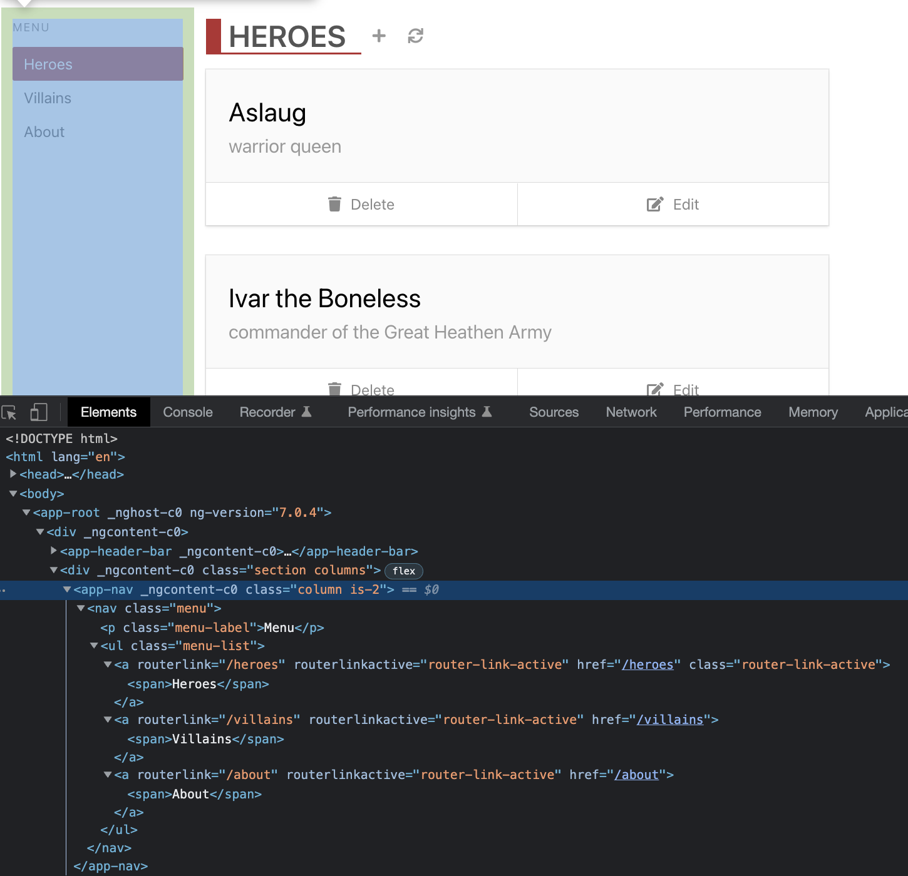
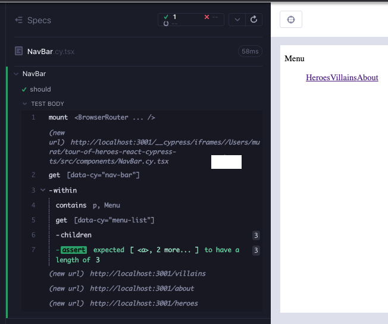
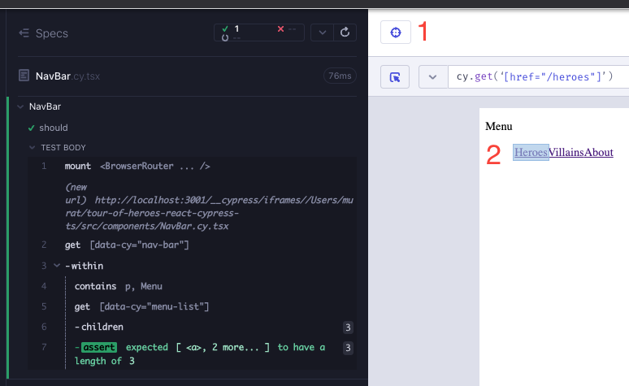
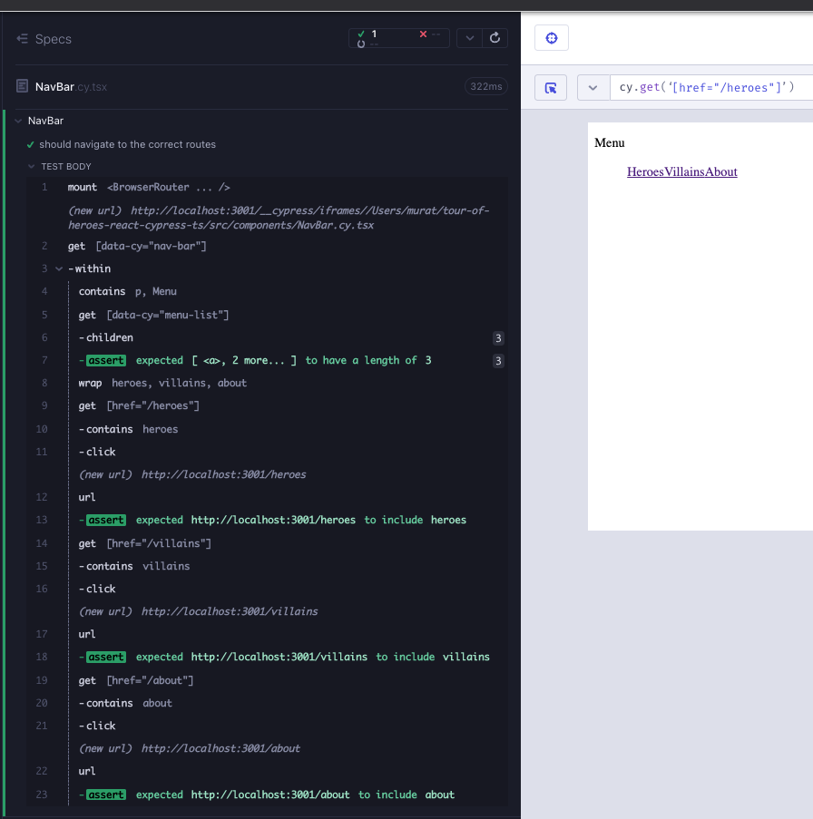
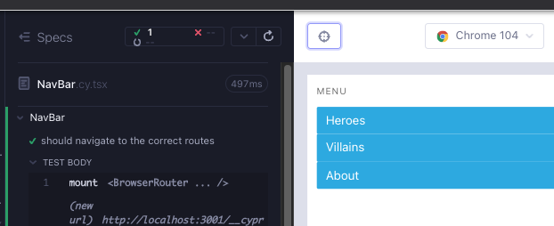
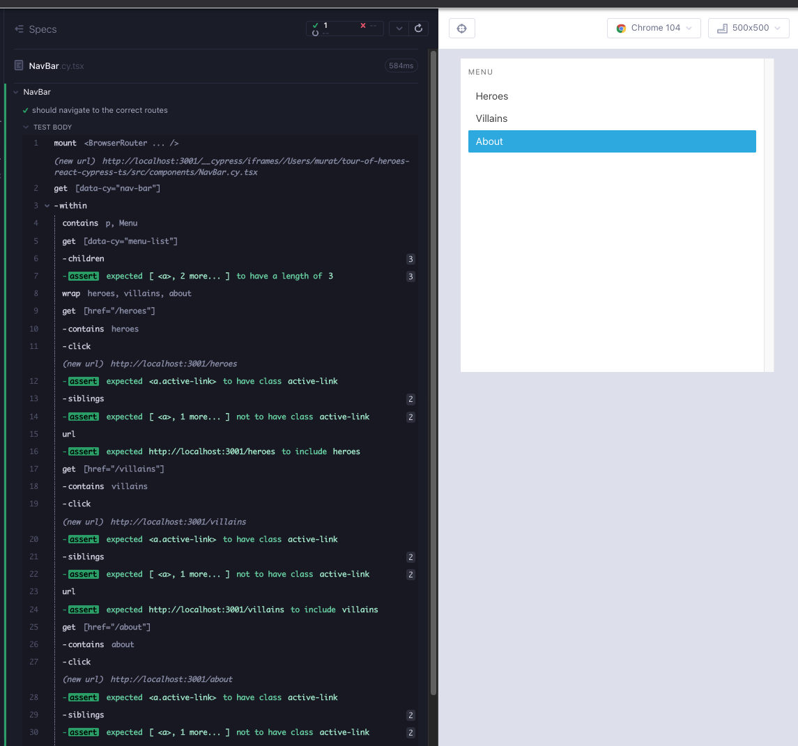

# NavBar

Angular sürümündeki uygulamada, bileşen `nav`, "Menu" yazan `p` ve üç rotaya bağlantı içeren `ul` içerir.



`feat/NavBar` adında bir dal oluşturun. `src/components/` klasörü altında `NavBar.cy.tsx`, `NavBar.tsx` adında 2 dosya oluşturun. Her zamanki gibi, bileşenin işlemesi için en az düzeyde başlayın; aşağıdakileri dosyalara kopyalayın ve `yarn cy:open-ct` ile koşucuyu açtıktan sonra testi çalıştırın.

```tsx
// src/components/NavBar.cy.tsx
import NavBar from "./NavBar";

describe("NavBar", () => {
  it("should", () => {
    cy.mount(<NavBar />);
  });
});
```

```tsx
// src/components/NavBar.tsx

export default function NavBar() {
  return <div>hello</div>;
}
```

Bileşenin iskeletini doğrulayan başarısız bir testle başlıyoruz. Üst etiketin bileşen adıyla `data-cy` niteliği içermesini istiyoruz, bu da bileşeni kullanıldığında daha kolay başvurulabilir hale getirir. Daha sonra önemli olabilecek etiketler için de `data-cy` nitelikleri ekleyebiliriz (Kırmızı 1).

```tsx
// src/components/NavBar.cy.tsx
import NavBar from "./NavBar";

describe("NavBar", () => {
  it("should", () => {
    cy.mount(<NavBar />);

    cy.getByCy("nav-bar").within(() => {
      cy.contains("p", "Menu");
      cy.getByCy("menu-list").children().should("have.length", 3);
    });
  });
});
```

Bu testi geçen en küçük bileşen şu şekildedir (Yeşil 1):

```tsx
// src/components/NavBar.tsx
export default function NavBar() {
  return (
    <nav data-cy="nav-bar">
      <p>Menu</p>
      <ul data-cy="menu-list">
        <a></a>
        <a></a>
        <a></a>
      </ul>
    </nav>
  );
}
```

Uygulama rotalarıyla ilgili önceki bileşenlerde (`HeaderBarBrand`, `ListHeader`) `react-router-dom`'dan `NavLink` kullandık. Bileşeni aynı şekilde yeniden düzenleyebiliriz. Yeniden düzenleme, önceki yönlendirme ile ilgili bileşenlerde gördüğümüz tanıdık bir `Router` hatasıyla sonuçlanır. Bileşen testinde, sorunu gidermek için `BrowserRouter` ile bağlamayı sararız (Düzenleme 1).

```tsx
// src/components/NavBar.tsx
import { NavLink } from "react-router-dom";

export default function NavBar() {
  return (
    <nav data-cy="nav-bar">
      <p>Menu</p>
      <ul data-cy="menu-list">
        <NavLink></NavLink>
        <NavLink></NavLink>
        <NavLink></NavLink>
      </ul>
    </nav>
  );
}
```

```tsx
// src/components/NavBar.tsx
import NavBar from "./NavBar";
import { BrowserRouter } from "react-router-dom";

describe("NavBar", () => {
  it("should", () => {
    cy.mount(
      <BrowserRouter>
        <NavBar />
      </BrowserRouter>
    );

    cy.getByCy("nav-bar").within(() => {
      cy.contains("p", "Menu");
      cy.getByCy("menu-list").children().should("have.length", 3);
    });
  });
});
```

Testte yeni başarısızlık var  `*(uncaught exception)**TypeError: Cannot read properties of undefined (reading 'pathname')*`. Ayrıca, başarısızlığın kaynağını anlamamıza yardımcı olan bir TS hatası var `Property 'to' is missing in type '{}' but required in type 'NavLinkProps` (Kırmızı 2). Bağlantıları `to` nitelikleriyle güçlendirmemiz gerekiyor (Yeşil 2). Burada önemli olan, TS'nin de başarısız bir testle birlikte, başarısızlığın kaynağını anlamamıza yard

```tsx
// src/components/NavBar.tsx
import { NavLink } from "react-router-dom";

export default function NavBar() {
  return (
    <nav data-cy="nav-bar">
      <p>Menu</p>
      <ul data-cy="menu-list">
        <NavLink to="/heroes">Heroes</NavLink>
        <NavLink to="/villains">Villains</NavLink>
        <NavLink to="/about">About</NavLink>
      </ul>
    </nav>
  );
}
```

Bileşenin iskeleti olmuş durumda.



Yeşil bir testimiz olduğunda, başka bir kırmızı elde edene kadar kodu yeniden düzenleyebilir veya ek testler ekleyebiliriz. Bu rotalara tıkladığımızda bizi ilgili URL'lere götüren testler ekleyelim. Test, `HeaderBarBrand` ve `ListHeader` bileşenlerinde yapılanlara benzer. Bu geliştirmeler için Cypress'ın seçici oyun alanını kullanabiliriz. Bu durumda, rota değişmedikçe değişmeyecek olan `href` hedefli `cy.get` iyi bir seçicidir (Yeşil 3).



Rota kontrollerini ekleyerek, test hala yeşil.

```tsx
// src/components/NavBar.cy.tsx
import NavBar from "./NavBar";
import { BrowserRouter } from "react-router-dom";

describe("NavBar", () => {
  it("should navigate to the correct routes", () => {
    cy.mount(
      <BrowserRouter>
        <NavBar />
      </BrowserRouter>
    );

    cy.getByCy("nav-bar").within(() => {
      cy.contains("p", "Menu");
      cy.getByCy("menu-list").children().should("have.length", 3);

      cy.get('[href="/heroes"]').click();
      cy.url().should("contain", "heroes");

      cy.get('[href="/villains"]').click();
      cy.url().should("contain", "villains");

      cy.get('[href="/about"]').click();
      cy.url().should("contain", "about");
    });
  });
});
```

Tekrarlama iyi görünmüyor. Testi biraz düzenleyelim (Düzenleme 3).

```tsx
// src/components/NavBar.cy.tsx
import NavBar from "./NavBar";
import { BrowserRouter } from "react-router-dom";

describe("NavBar", () => {
  it("should navigate to the correct routes", () => {
    cy.mount(
      <BrowserRouter>
        <NavBar />
      </BrowserRouter>
    );

    cy.getByCy("nav-bar").within(() => {
      cy.contains("p", "Menu");
      cy.getByCy("menu-list").children().should("have.length", 3);

      cy.wrap(["heroes", "villains", "about"]).each((route) => {
        cy.get(`[href="/${route}"]`).click();
        cy.url().should("contain", route);
      });
    });
  });
});
```

Test yeniden yapılandırma sırasında hala yeşil. Şu anda düşünebileceğimiz tek ek test, bağlantıdaki dizeyi kontrol etmektir. `route`'un `string` türünde olduğunu belirtebiliriz ve `{matchCase: false}` ile her iki büyük/küçük harf eşlemesini yapabiliriz (Düzenleme 3).

```tsx
// src/components/NavBar.cy.tsx
import NavBar from "./NavBar";
import { BrowserRouter } from "react-router-dom";
import "../styles.scss";

describe("NavBar", () => {
  it("should navigate to the correct routes", () => {
    cy.mount(
      <BrowserRouter>
        <NavBar />
      </BrowserRouter>
    );

    cy.getByCy("nav-bar").within(() => {
      cy.contains("p", "Menu");
      cy.getByCy("menu-list").children().should("have.length", 3);

      cy.wrap(["heroes", "villains", "about"]).each((route: string) => {
        cy.get(`[href="/${route}"]`)
          .contains(route, { matchCase: false })
          .click();
        cy.url().should("contain", route);
      });
    });
  });
});
```



KırmızıYeşilDüzenleme döngülerinden geçtik, testi mümkün olduğunca geliştirdik ve başarısızlık almadık. Şu anda test aracını tasarım aracı olarak kullanabilir ve görselleri geliştirebiliriz. Angular bileşeninin CSS'ini ekleyelim. Bileşen testine `import '../styles.scss'` eklemeyi unutmayın.

```tsx
// src/components/NavBar.cy.tsx
import { NavLink } from "react-router-dom";

export default function NavBar() {
  return (
    <nav data-cy="nav-bar" className="column is-2 menu">
      <p className="menu-label">Menu</p>
      <ul data-cy="menu-list" className="menu-list">
        <NavLink to="/heroes">Heroes</NavLink>
        <NavLink to="/villains" className="active-link">
          Villains
        </NavLink>
        <NavLink to="/about" className="active-link">
          About
        </NavLink>
      </ul>
    </nav>
  );
}
```

Stilleri eklerken, görsellerde bir sorun fark ettik; her bağlantı sürekli olarak etkin (Kırmızı 4).

.

Burada önemli olan, bileşen testinin bize tasarım aracı olarak yardımcı olması ve yeni bir başarısız test oluşturmasıdır. Aktif düğümün `active-link` sınıfına sahip olması ve diğer düğümlerin sahip olmaması gerekiyor. Başarısız bir test yazalım (Kırmızı 4).

```tsx
// src/components/NavBar.cy.tsx
import NavBar from "./NavBar";
import { BrowserRouter } from "react-router-dom";
import "../styles.scss";

describe("NavBar", () => {
  it("should navigate to the correct routes", () => {
    cy.mount(
      <BrowserRouter>
        <NavBar />
      </BrowserRouter>
    );

    cy.getByCy("nav-bar").within(() => {
      cy.contains("p", "Menu");
      cy.getByCy("menu-list").children().should("have.length", 3);

      cy.wrap(["heroes", "villains", "about"]).each((route: string) => {
        cy.get(`[href="/${route}"]`)
          .contains(route, { matchCase: false })
          .click();
        cy.get(`[href="/${route}"]`).should("have.class", "active-link");
        cy.get(`[href="/${route}"]`)
          .siblings()
          .should("not.have.class", "active-link");
        cy.url().should("contain", route);
      });
    });
  });
});
```

Bu testi geçmek için, bağlantı aktifse `active-link` css'sine sahip olan ve değilse css'siz bir mantığa ihtiyacımız var (Yeşil 4).

```tsx
// src/components/NavBar.tsx
import { NavLink } from "react-router-dom";

export default function NavBar() {
  return (
    <nav data-cy="nav-bar" className="column is-2 menu">
      <p className="menu-label">Menu</p>
      <ul data-cy="menu-list" className="menu-list">
        <NavLink
          to="/heroes"
          className={(link) => (link.isActive ? "active-link" : "")}
        >
          Heroes
        </NavLink>
        <NavLink
          to="/villains"
          className={(link) => (link.isActive ? "active-link" : "")}
        >
          Villains
        </NavLink>
        <NavLink
          to="/about"
          className={(link) => (link.isActive ? "active-link" : "")}
        >
          About
        </NavLink>
      </ul>
    </nav>
  );
}
```

Tekrar eden kodu bir yardımcıya çıkarabiliriz (Düzenleme 4).

```tsx
// src/components/NavBar.tsx
import { NavLink } from "react-router-dom";

export default function NavBar() {
  const linkIsActive = (link: { isActive: boolean }) =>
    link.isActive ? "active-link" : "";

  return (
    <nav data-cy="nav-bar" className="column is-2 menu">
      <p className="menu-label">Menu</p>
      <ul data-cy="menu-list" className="menu-list">
        <NavLink to="/heroes" className={linkIsActive}>
          Heroes
        </NavLink>
        <NavLink to="/villains" className={linkIsActive}>
          Villains
        </NavLink>
        <NavLink to="/about" className={linkIsActive}>
          About
        </NavLink>
      </ul>
    </nav>
  );
}
```

Bileşen testinde, `cy.get(`[href="/${*route*}"]`)` öznesinin her doğrulama için ortak olduğunu fark ediyoruz. Cypress' zincir sözdiziminden faydalanarak doğrulamaları daha hafif hale getirebiliriz. Ayrıca menü uzunluğu doğrulamasında daha az sabit kodlama yapabiliriz (Düzenleme 4).

```tsx
// src/components/NavBar.cy.tsx
import NavBar from "./NavBar";
import { BrowserRouter } from "react-router-dom";
import "../styles.scss";

const routes = ["heroes", "villains", "boys", "about"];

describe("NavBar", () => {
  it("should navigate to the correct routes", () => {
    cy.mount(
      <BrowserRouter>
        <NavBar />
      </BrowserRouter>
    );

    cy.contains("p", "Menu");
    cy.getByCy("menu-list").children().should("have.length", routes.length);

    routes.forEach((route: string) => {
      cy.get(`[href="/${route}"]`)
        .contains(route, { matchCase: false })
        .click()
        .should("have.class", "active-link")
        .siblings()
        .should("not.have.class", "active-link");

      cy.url().should("contain", route);
    });
  });
});
```



## Bileşen testinin RTL sürümü

```tsx
// src/components/NavBar.test.tsx
import NavBar from "./NavBar";
import { render, screen, within, waitFor } from "@testing-library/react";
import userEvent from "@testing-library/user-event";
import { BrowserRouter } from "react-router-dom";
import "@testing-library/jest-dom";

const routes = ["Heroes", "Villains", "Boys", "About"];

describe("NavBar", () => {
  beforeEach(() => {
    render(
      <BrowserRouter>
        <NavBar />
      </BrowserRouter>
    );
  });

  it("should verify route layout", async () => {
    expect(await screen.findByText("Menu")).toBeVisible();

    const menuList = await screen.findByTestId("menu-list");
    expect(within(menuList).queryAllByRole("link").length).toBe(routes.length);

    routes.forEach((route) => within(menuList).getByText(route));
  });

  it.each(routes)("should navigate to route %s", async (route: string) => {
    const link = async (name: string) => screen.findByRole("link", { name });
    const activeRouteLink = await link(route);
    userEvent.click(activeRouteLink);
    await waitFor(() => expect(activeRouteLink).toHaveClass("active-link"));
    expect(window.location.pathname).toEqual(`/${route.toLowerCase()}`);

    const remainingRoutes = routes.filter((r) => r !== route);
    remainingRoutes.forEach(async (inActiveRoute) => {
      expect(await link(inActiveRoute)).not.toHaveClass("active-link");
    });
  });
});
```

## Özet

Bileşenin iskeletini belirledik ve onun için başarısız bir test yazdık (Kırmızı 1).

Testi geçmek için minimal bir bileşen oluşturduk (Yeşil 1).

Bileşeni, bağlantı etiketleri yerine NavLinks kullanacak şekilde yeniden düzenledik (Düzenleme 1)

</br>

NavLinks'ten eksik bir öznitelikle ilgili olarak TS hatalarıyla desteklenen bir test hatası yaşadık (Kırmızı 2).

`to` öznitelikleri ve rotaları NavLinks'lere eklendi (Yeşil 2).

Önceki bölümlere benzer şekilde, burada önemli olan TS'nin de başarısız bir testle birlikte bize yardımcı olmasıydı.

</br>

Her zaman yeşil bir testimiz olduğunda, *yeniden düzenleme yapabilir veya başka bir kırmızı elde edene kadar ek testler ekleyebiliriz*.

Tercihimiz, stillerden önce test eklemektir.

Rota kontrolleri için testler ekledik (Yeşil 3) ve testi daha da düzenledik (Düzenleme 3).

</br>

Düşünebileceğimiz tüm testleri tükettikten sonra, bileşene stiller ekledik ve görsellerle ilgili bir şeylerin ters gittiğini fark ettik. Her bağlantı etkindi (Kırmızı 4).

Stilleri iki kez kontrol etmek için başarısız bir test yazdık, `have.class` ve `not.have.class` iddialarını kullanarak (Kırmızı 4).

Bileşen css'sine aktif ve pasif bağlantıların stilini belirlemek için mantık ekledik (Yeşil 4).

Mantığı daha DRY (Don't Repeat Yourself) olacak şekilde yeniden düzenledik (Düzenleme 4).

Sonunda, bileşen testini Cypress'in zincirleme sözdiziminden faydalanacak şekilde yeniden düzenledik ve daha az sihirli sayı kullandık (Düzenleme 4).

## Çıkarılacak Ders

Burada önemli olan, bileşen testinin bize yeni başarısız bir test oluşturmak için tasarım aracı olarak yardımcı olmasıydı. Düşünebildiğimiz kadar çok test yazdık, ancak tüm bağlantıların her zaman etkin olduğunu gördüğümüzde, ek bir özellik düşündük.
