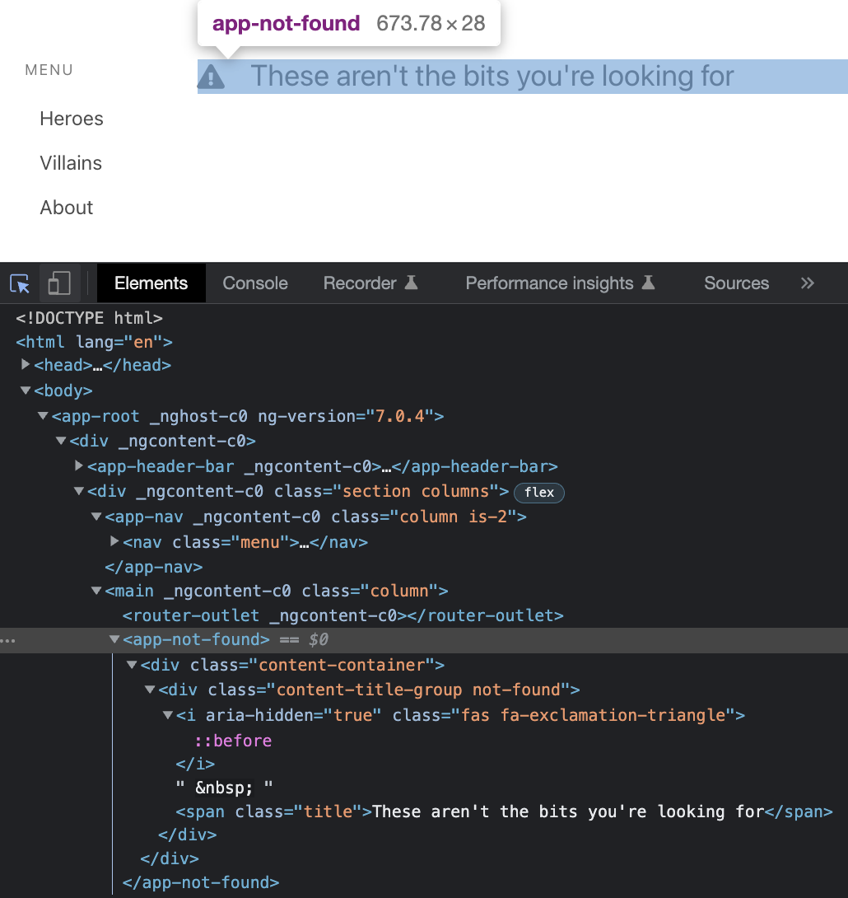
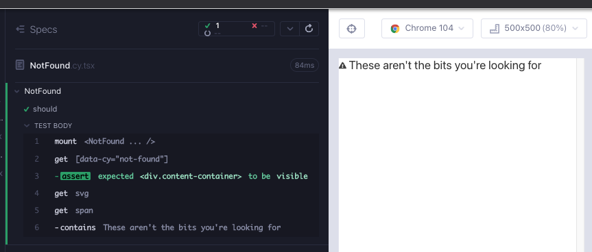

# NotFound

Angular sürümündeki uygulamada, bileşen esas olarak stil için div'lerle sarılı bir simge ve span'dan oluşur.



`feat/NotFound` adında bir dal oluşturun. `src/components/` klasörü altında 2 dosya oluşturun; `NotFound.cy.tsx`, `NotFound.tsx`. Her zamanki gibi, bir bileşeni işlemeye başlamak için minimal başlayın; dosyalara aşağıdakileri kopyalayın ve `yarn cy:open-ct` ile çalıştırıcıyı açtıktan sonra testi çalıştırın.

```tsx
// src/components/NotFound.cy.tsx
import NotFound from "./NotFound";

describe("NotFound", () => {
  it("should", () => {
    cy.mount(<NotFound />);
  });
});
```

```tsx
// src/components/NotFound.tsx

export default function NotFound() {
  return <div>hello</div>;
}
```

Bileşenin iskeleti için bir test yazın (Kırmızı 1). Şimdiye kadar Cypress'in [within](https://docs.cypress.io/api/commands/within) kullanıyorduk. Bir bileşeni test ediyoruz ve her şey tek bir etiketin altında olduğu için içinde kullanmak isteğe bağlıdır. Ayrıca başlangıçta, her bileşenle olduğu gibi daha sonra da stilleri bileşene aktarabiliriz.

```tsx
// src/components/NotFound.cy.tsx
import NotFound from "./NotFound";
import "../styles.scss";

describe("NotFound", () => {
  it("should", () => {
    cy.mount(<NotFound />);

    cy.getByCy("not-found").should("be.visible");
    cy.get("svg");
    cy.get("span").contains("These aren't the bits you're looking for");
  });
});
```

Testi geçmek için minimal bir bileşen oluşturuyoruz (Yeşil 1).

```tsx
// src/components/NotFound.tsx
export default function NotFound() {
  return (
    <div data-cy="not-found">
      <svg />
      <span>These aren't the bits you're looking for</span>
    </div>
  );
}
```

Bu `svg`'nin gerçek bir simge olmasını istiyoruz. [react-icons](https://react-icons.github.io/react-icons/search?q=tria) adresinden içinde ünlem olan bir üçgen simge içe aktaralım. Burada önemli olan, test aracının RedGreenRefactor döngüsünde tasarımımıza yardımcı olmasıdır (Düzenleme 1).

```tsx
// src/components/NotFound.tsx
import { FaExclamationTriangle } from "react-icons/fa";

export default function NotFound() {
  return (
    <div data-cy="not-found">
      <FaExclamationTriangle />
      <span>These aren't the bits you're looking for</span>
    </div>
  );
}
```

Bu basit bir bileşendir, eklemeye değer başka testler yoktur. Geriye kalan tek şey stillerdir. Bunları uygulamanın Angular sürümünden kopyalayabiliriz (Düzenleme 1).

```tsx
import { FaExclamationTriangle } from "react-icons/fa";

export default function NotFound() {
  return (
    <div data-cy="not-found" className="content-container">
      <div className="content-title-group not-found">
        <div data-cy="exclamation">
          <FaExclamationTriangle />
        </div>
        &nbsp;
        <span className="title">These aren't the bits you're looking for</span>
      </div>
    </div>
  );
}
```



## Bileşen testinin RTL sürümü

```tsx
// src/components/NotFound.test.tsx
import NotFound from "./NotFound";
import { render, screen } from "@testing-library/react";
import "@testing-library/jest-dom";

describe("NotFound", () => {
  it("should", async () => {
    render(<NotFound />);

    expect(await screen.findByTestId("not-found")).toBeVisible();
    expect(await screen.findByTestId("exclamation")).toBeVisible();
    expect(
      await screen.findByText("These aren't the bits you're looking for")
    ).toBeVisible();
  });
});
```

## Özet

Bu, geçmişte öğrendiklerimizi pekiştirdiğimiz basit bir bileşendi.

Bir bileşen testinde, stilleri hemen ayarlayabiliriz. Şimdiye kadar ki örneklerimizde bu basit bir içe aktarma olmuştur.

`react-icons` ve/veya `styles-icons` kullanmanın avantajlarından yararlanmak faydalıdır.

Cypress bileşen testleri, RedGreenRefactor döngülerinde görsel tasarımımıza yardımcı olabilir.
