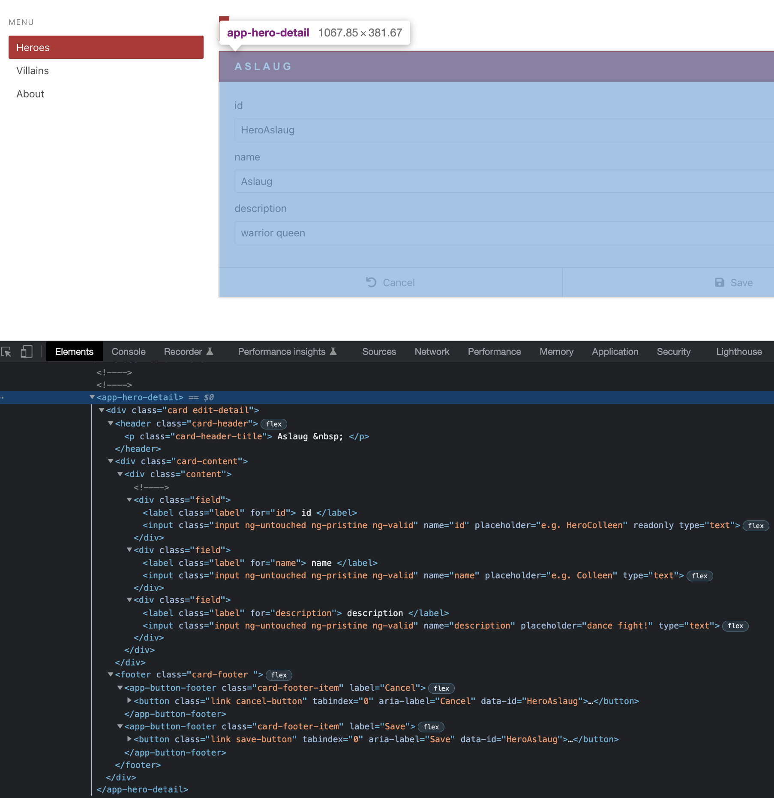
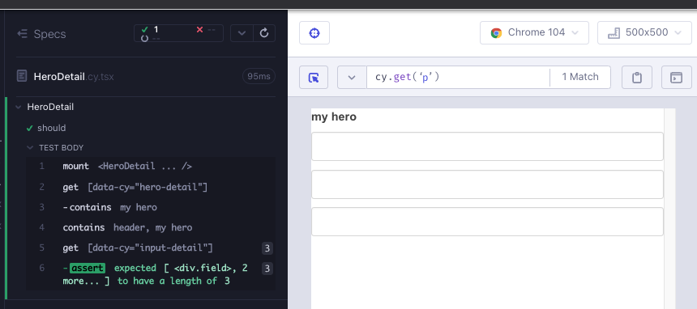
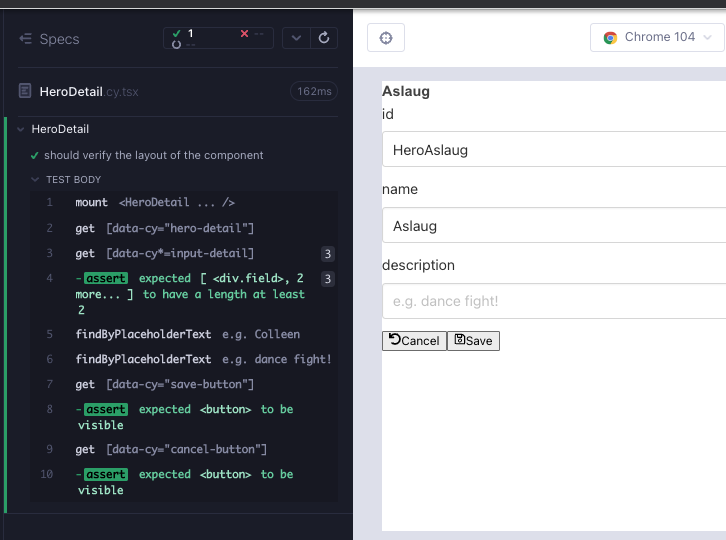

# HeroDetail

Daha basit, çocuk bileşenlerle işimiz bitti. Bundan sonra çocuk bileşenleri kullanan ve uygulama durumunu göz önünde bulunduran daha üst düzey bileşenlere odaklanacağız.

Angular sürümünde uygulamanın, şimdiye kadar gördüklerimizden biraz daha karmaşık bir bileşeni bulunuyor. Bir bileşen karmaşık göründüğünde, en üst düzeyden başlayarak katman katman aşağı inerek anlamlandırmak daha kolaydır.

- başlık
  - kahramanın adı ile `p`.
- div/div
  - `InputDetail` bileşenini kullanan 3 alan. İlk alan `readonly`.
- altbilgi
  - `ButtonFooter` bileşenini kullanan 2 altbilgi; `İptal` ve `Kaydet` çeşidi.

Test odaklı tasarım, mühendislik ve bilimsel yöntem, hepsi daha küçük parçalara ayırarak sorunu çözmeye, kısa geri bildirim döngüleriyle testler aracılığıyla ilerlememizi doğrulamaya ve hızla tekrarlamaya dayanır. Cypress bileşen testlerini iyi bir uyum haline getiren şey, geri bildirim döngülerinin kalitesi ve hızıdır. 



`feat/HeroDetail` adında bir dal oluşturun. `src/heroes/` klasörü altında `HeroDetail.cy.tsx`, `HeroDetail.tsx` adında 2 dosya oluşturun. Her zamanki gibi, bileşen oluşturma işlemini basitleştirerek başlayın; aşağıdakileri dosyalara kopyalayın ve `yarn cy:open-ct` komutuyla koşucuyu açtıktan sonra testi çalıştırın.

```tsx
// src/heroes/HeroDetail.cy.tsx
import HeroDetail from "./HeroDetail";
import "../styles.scss";

describe("HeroDetail", () => {
  it("should", () => {
    cy.mount(<HeroDetail />);
  });
});
```

```tsx
// src/heroes/HeroDetail.tsx

export default function HeroDetail() {
  return <div>hello</div>;
}
```

## `header`

Bileşenin üst düzey katmanlarına bakarak, bir taslakla başarısız bir test yazmaya başlayabiliriz (Kırmızı 1).

```tsx
// src/heroes/HeroDetail.cy.tsx
import HeroDetail from "./HeroDetail";
import "../styles.scss";

describe("HeroDetail", () => {
  it("should", () => {
    cy.mount(<HeroDetail />);

    cy.getByCy("hero-detail").contains("my hero");
    cy.contains("header", "my hero");
  });
});
```

Başlangıçta şimdilik sadece en temel gereksinime odaklanıyoruz; bu testi geçmek için sadece `data-cy` özniteliği ve sert kodlanmış bir değer içeren bir başlık etiketi gereklidir (Yeşil 1).

```tsx
// src/heroes/HeroDetail.tsx

export default function HeroDetail() {
  return (
    <div data-cy="hero-detail">
      <header>
        <p>my hero</p>
      </header>
    </div>
  );
}
```

## 3 form alanı

`InputDetail` bileşenleri için sonraki etiketler, form alanlarını oluşturacak olan 3 alandır. Uzunluklarının 3 olması gerektiğini kontrol edelim (Kırmızı 2).

```tsx
// src/heroes/HeroDetail.cy.tsx
import HeroDetail from "./HeroDetail";
import "../styles.scss";

describe("HeroDetail", () => {
  it("should", () => {
    cy.mount(<HeroDetail />);

    cy.getByCy("hero-detail").contains("my hero");
    cy.contains("header", "my hero");
    cy.getByCyLike("input-detail").should("have.length", 3);
  });
});
```

`InputDetail` bileşenlerini iki katmanlı `div`lerin altına ekleyin ve geçen bir test alın (Yeşil 2).

```tsx
// src/heroes/HeroDetail.tsx
import InputDetail from "../components/InputDetail";

export default function HeroDetail() {
  return (
    <div data-cy="hero-detail">
      <header>
        <p>my hero</p>
      </header>
      <div>
        <div>
          <InputDetail></InputDetail>
          <InputDetail></InputDetail>
          <InputDetail></InputDetail>
        </div>
      </div>
    </div>
  );
}
```



TS bize yardımcı oluyor ve `InputDetail` bileşeninin bazı prop'larla gelmesi gerektiğini bildiriyor. Derleyiciyi kullanıp otomatik olarak düzeltecek olursak, zorunlu prop'ları ekler (Kırmızı 3, Yeşil 3).

```tsx
// src/heroes/HeroDetail.tsx
import InputDetail from "../components/InputDetail";

export default function HeroDetail() {
  return (
    <div data-cy="hero-detail">
      <header>
        <p>my hero</p>
      </header>
      <div>
        <div>
          <InputDetail name={""} value={""}></InputDetail>
          <InputDetail name={""} value={""}></InputDetail>
          <InputDetail name={""} value={""}></InputDetail>
        </div>
      </div>
    </div>
  );
}
```

Şartnamelere göz atarak testimizi geliştirmeye başlayabiliriz. İlk `InputDetail` alanının `readonly` olacağını biliyoruz. Yazılabilir iki alanın yer tutucu metinleri olmalıdır. [Testing Library örnekleri](https://github.com/testing-library/cypress-testing-library/blob/97939da7d4707a71049884c0324c0eda56e26fc2/cypress/integration/find.spec.js) form alanlarında metin kontrol etmek için iki kullanışlı komut içerir; `findByDisplayValue`, `findByPlaceholderText` (Kırmızı 4).

```tsx
// src/heroes/HeroDetail.cy.tsx
import HeroDetail from "./HeroDetail";
import "../styles.scss";

describe("HeroDetail", () => {
  it("should", () => {
    cy.mount(<HeroDetail />);

    cy.getByCy("hero-detail").contains("my hero");
    cy.contains("header", "my hero");
    cy.getByCyLike("input-detail").should("have.length", 3);

    cy.findByDisplayValue("HeroAslaug").should("be.visible");
    cy.findByPlaceholderText("e.g. Colleen").should("be.visible");
    cy.findByPlaceholderText("e.g. dance fight!").should("be.visible");
  });
});
```

Testi geçmek için gerekenleri yapmalıyız. İlk uygulama ekran görüntüsünden alan adlarını alabiliriz; alanların adları `id`, `name`, `description` olmalıdır. İlk alan `id` değeri şimdilik sabit kodlanabilir. İkinci ve üçüncü alanların boş değeri ve `placeholder`ı vardır. Bu, yeşil bir test almak için minimaldir (Yeşil 4).

```tsx
// src/heroes/HeroDetail.tsx
import InputDetail from "../components/InputDetail";

export default function HeroDetail() {
  return (
    <div data-cy="hero-detail">
      <header>
        <p>my hero</p>
      </header>
      <div>
        <div>
          <InputDetail name={"id"} value={"HeroAslaug"}></InputDetail>
          <InputDetail
            name={"name"}
            value=""
            placeholder={"e.g. Colleen"}
          ></InputDetail>
          <InputDetail
            name={"description"}
            value=""
            placeholder={"e.g. dance fight!"}
          ></InputDetail>
        </div>
      </div>
    </div>
  );
}
```

Düzenleme etmeye başlamadan önce, bu aşamada kahraman verilerinin şekli hakkında konuşmak yararlıdır. Ağdan `id`'yi (salt okunur) okuyacak ve `name` ve `description`'ı ağa yazacağız. Verilerimiz şu şekilde 3 string özelliğe sahip bir nesnedir:

```json
{
  "id": "HeroAslaug",
  "name": "Aslaug",
  "description": "warrior queen"
}
```

Bu şekil için bir arayüz oluşturalım, çünkü her yerde kullanacağız. `./src/models/Hero.ts` dosyası ve klasör oluşturun ve aşağıdaki kodu yapıştırın:

```typescript
// /src/models/Hero.ts
export interface Hero {
  id: string;
  name: string;
  description: string;
}
```

Bileşenimizde yer tutucu metinlerin sabit kodlanması sorun oluşturmaz, ancak `value` özellikleri dikkat çekicidir. Bu, uygulamamızda durum ihtiyacına işaret ediyor. Şimdilik bunu bileşene sabit kodlayarak başlayabiliriz (Düzenleme 4).

```tsx
// src/heroes/HeroDetail.tsx
import { Hero } from "../models/Hero";
import InputDetail from "../components/InputDetail";

export default function HeroDetail() {
  const hero: Hero = {
    id: "HeroAslaug",
    name: "",
    description: "",
  };
  return (
    <div data-cy="hero-detail">
      <header>
        <p>my hero</p>
      </header>
      <div>
        <div>
          <InputDetail
            name={"id"}
            value={hero.id}
            readOnly={true}
          ></InputDetail>
          <InputDetail
            name={"name"}
            value={hero.name}
            placeholder="e.g. Colleen"
          ></InputDetail>
          <InputDetail
            name={"description"}
            value={hero.description}
            placeholder="e.g. dance fight!"
          ></InputDetail>
        </div>
      </div>
    </div>
  );
}
```

TypeScript yollarını kullanarak çok fazla `../` klasör başvurusuna ihtiyaç duymadan dosyaları bileşenler, modeller ve gelecekte kolayca içe aktarabiliriz.

```json
{
  "compilerOptions": {
    "target": "esnext",
    "lib": ["esnext", "dom"],
    "types": ["cypress", "node", "@testing-library/cypress"],
    "baseUrl": "./"
  },
  "include": ["**/*.ts*", "../cypress.d.ts"],
  "extends": "../tsconfig.json"
}
```

Şimdi bileşenlerden, modellerden ve gelecekteki kancalardan dosyaları daha kolay bir şekilde içe aktarabiliriz.

```tsx
// src/heroes/HeroDetail.tsx
import { Hero } from "models/Hero";
import InputDetail from "components/InputDetail";

export default function HeroDetail() {
  const hero: Hero = {
    id: "HeroAslaug",
    name: "",
    description: "",
  };
  return (
    <div data-cy="hero-detail">
      <header>
        <p>my hero</p>
      </header>
      <div>
        <div>
          <InputDetail
            name={"id"}
            value={hero.id}
            readOnly={true}
          ></InputDetail>
          <InputDetail
            name={"name"}
            value={hero.name}
            placeholder="e.g. Colleen"
          ></InputDetail>
          <InputDetail
            name={"description"}
            value={hero.description}
            placeholder="e.g. dance fight!"
          ></InputDetail>
        </div>
      </div>
    </div>
  );
}
```

Hala "my-hero" kodlamasını test ve bileşene gömülü olarak yapıyoruz. Bu açıkça `hero.name` ve uygulama ekran görüntüsünde bile görüntülenmiyor. Ağ verisi olsun ya da olmasın bunu görüntülemek için bir mekanizmaya ihtiyacımız var. Veriler bileşene gömülü olduğu için şimdilik bunları testlerle kontrol edemeyeceğiz, bu yüzden şimdilik `contains('my hero')` ile metin kontrollerini devre dışı bırakabilir ve bileşen üzerinde çalışabiliriz.

Test ve bileşenimiz şu anda şu şekildedir:

```tsx
// src/heroes/HeroDetail.cy.tsx
import HeroDetail from "./HeroDetail";
import "../styles.scss";

describe("HeroDetail", () => {
  it("should", () => {
    cy.mount(<HeroDetail />);

    cy.getByCy("hero-detail");
    cy.getByCyLike("input-detail").should("have.length", 3);

    cy.findByDisplayValue("HeroAslaug").should("be.visible");
    cy.findByPlaceholderText("e.g. Colleen").should("be.visible");
    cy.findByPlaceholderText("e.g. dance fight!").should("be.visible");
  });
});
```

```tsx
// src/heroes/HeroDetail.tsx
import { Hero } from "models/Hero";
import InputDetail from "components/InputDetail";

export default function HeroDetail() {
  const hero: Hero = {
    id: "HeroAslaug",
    name: "",
    description: "",
  };
  return (
    <div data-cy="hero-detail">
      <header>
        <p>{hero.name}</p>
      </header>
      <div>
        <div>
          <InputDetail
            name={"id"}
            value={hero.id}
            readOnly={true}
          ></InputDetail>
          <InputDetail
            name={"name"}
            value={hero.name}
            placeholder="e.g. Colleen"
          ></InputDetail>
          <InputDetail
            name={"description"}
            value={hero.description}
            placeholder="e.g. dance fight!"
          ></InputDetail>
        </div>
      </div>
    </div>
  );
}
```

Eğer `hero.name` için bir dize girersek, bileşen test yürütücüsünde `p`'yi açıp kapatabiliriz. Aynı mantığı, `id` alanı için de uygulamamız gerekiyor çünkü eğer `id` için veri mevcut değilse, görüntülemenin mantıklı olmadığı ortada. Bunu koşullu oluşturma ile sağlayabiliriz.

```tsx
// src/heroes/HeroDetail.tsx
import { Hero } from "models/Hero";
import InputDetail from "components/InputDetail";

export default function HeroDetail() {
  const hero: Hero = {
    id: "",
    name: "",
    description: "",
  };
  return (
    <div data-cy="hero-detail">
      <header>
        <p>{hero.name}</p>
      </header>
      <div>
        <div>
          {hero.id && (
            <InputDetail
              name={"id"}
              value={hero.id}
              readOnly={true}
            ></InputDetail>
          )}
          <InputDetail
            name={"name"}
            value={hero.name}
            placeholder="e.g. Colleen"
          ></InputDetail>
          <InputDetail
            name={"description"}
            value={hero.description}
            placeholder="e.g. dance fight!"
          ></InputDetail>
        </div>
      </div>
    </div>
  );
}
```

`hero.id` değerini değiştirin ve alan da değiştirilmelidir. Şimdilik 2 alan veya daha fazlasıyla tamam olacak şekilde testi ayarlamamız gerekiyor (Düzenleme 4).

```tsx
// src/heroes/HeroDetail.cy.tsx
import HeroDetail from "./HeroDetail";
import "../styles.scss";

describe("HeroDetail", () => {
  it("should", () => {
    cy.mount(<HeroDetail />);

    // cy.getByCy('hero-detail').contains('my hero')
    // cy.contains('header', 'my hero')
    // cy.getByCyLike('input-detail').should('have.length', 3)
    cy.getByCy("hero-detail");
    cy.getByCyLike("input-detail").should("have.length.gte", 2);

    // cy.findByDisplayValue('HeroAslaug').should('be.visible')
    cy.findByPlaceholderText("e.g. Colleen").should("be.visible");
    cy.findByPlaceholderText("e.g. dance fight!").should("be.visible");
  });
});
```

`id` yoksa, id alanı devre dışı kalacak ve tam tersi. İsim varsa, `p` gösterilecektir ve tam tersi. Bunların hepsi daha sonra ele alacağımız test durumlarıdır. Testlerin, ihtiyaç duyduğumuz tasarımı doğrulamak için kullanamayacağımızı belirtmek önemlidir, ancak bileşen testinin mini bir kullanıcı arayüzü uygulaması olması, şimdilik bize yardımcı oluyor.


Tam UI düzenine sahip olana kadar durumla ilgili kararları erteleyeceğiz.

## `footer`

Aşağılık bölümü, `Cancel` ve `Save` düğmeleri için 2 `ButtonFooter` bileşenini saran bir `footer` etiketinden oluşur. Bunun için başarısız bir test yazalım. İlgili seçici ile `ButtonFooter` bileşenine bakıyoruz; `save-button`, `cancel-button` (Kırmızı 5)

```tsx
// src/heroes/HeroDetail.cy.tsx
import HeroDetail from "./HeroDetail";
import "../styles.scss";

describe("HeroDetail", () => {
  it("should verify the layout of the component", () => {
    cy.mount(<HeroDetail />);

    // cy.getByCy('hero-detail').contains('my hero')
    // cy.contains('header', 'my hero')
    // cy.getByCyLike('input-detail').should('have.length', 3)
    cy.getByCy("hero-detail");
    cy.getByCyLike("input-detail").should("have.length.gte", 2);

    // cy.findByDisplayValue('HeroAslaug').should('be.visible')
    cy.findByPlaceholderText("e.g. Colleen").should("be.visible");
    cy.findByPlaceholderText("e.g. dance fight!").should("be.visible");

    cy.getByCy("save-button").should("be.visible");
    cy.getByCy("cancel-button").should("be.visible");
  });
});
```

`ButtonFooter` alt bileşenlerini eklediğimizde, TS hataları ve başarısız bir test (Kırmızı 5) alırız.

```tsx
// src/heroes/HeroDetail.tsx
import InputDetail from "components/InputDetail";
import ButtonFooter from "components/ButtonFooter";

export default function HeroDetail() {
  const hero: Hero = {
    id: "HeroAslaug",
    name: "Aslaug",
    description: "",
  };
  return (
    <div data-cy="hero-detail">
      <header>
        <p>{hero.name}</p>
      </header>
      <div>
        <div>
          {hero.id && (
            <InputDetail
              name={"id"}
              value={hero.id}
              readOnly={true}
            ></InputDetail>
          )}
          <InputDetail
            name={"name"}
            value={hero.name}
            placeholder="e.g. Colleen"
          ></InputDetail>
          <InputDetail
            name={"description"}
            value={hero.description}
            placeholder="e.g. dance fight!"
          ></InputDetail>
        </div>
      </div>
      <footer>
        <ButtonFooter />
        <ButtonFooter />
      </footer>
    </div>
  );
}
```

`ButtonFooter` prop'ları `label`, `IconClass` ve `onClick`'tır. TS ve onun için yazdığımız bileşen testi `/components/ButtonFooter.cy.tsx`, belgeleme görevi görür. Bileşen testine bakarak eksik prop'ları ekleyelim. Şimdilik, tıklama işleyicileri boş fonksiyonlar olabilir. Simgeleri [react-icons](https://react-icons.github.io/react-icons/search?q=undo) adresinden alabiliriz. `label` herhangi bir dize olabilir (Yeşil 5).

```tsx
// src/heroes/HeroDetail.tsx
import InputDetail from "components/InputDetail";
import ButtonFooter from "components/ButtonFooter";
import { FaUndo, FaRegSave } from "react-icons/fa";
import { Hero } from "models/Hero";

export default function HeroDetail() {
  const hero: Hero = {
    id: "HeroAslaug",
    name: "Aslaug",
    description: "",
  };
  return (
    <div data-cy="hero-detail">
      <header>
        <p>{hero.name}</p>
      </header>
      <div>
        <div>
          {hero.id && (
            <InputDetail
              name={"id"}
              value={hero.id}
              readOnly={true}
            ></InputDetail>
          )}
          <InputDetail
            name={"name"}
            value={hero.name}
            placeholder="e.g. Colleen"
          ></InputDetail>
          <InputDetail
            name={"description"}
            value={hero.description}
            placeholder="e.g. dance fight!"
          ></InputDetail>
        </div>
      </div>
      <footer>
        <ButtonFooter label="Cancel" IconClass={FaUndo} onClick={() => {}} />
        <ButtonFooter label="Save" IconClass={FaRegSave} onClick={() => {}} />
      </footer>
    </div>
  );
}
```



Bu formu kaydederken veya iptal ederken durumu değiştireceğiz, bu nedenle bir olay meydana gelmelidir. Şimdilik `console.log`'u izleyen başarısız testler yazabiliriz (Kırmızı 6).

```tsx
// src/heroes/HeroDetail.cy.tsx
import HeroDetail from "./HeroDetail";
import "../styles.scss";

describe("HeroDetail", () => {
  it("should verify the layout of the component", () => {
    cy.mount(<HeroDetail />);

    // cy.getByCy('hero-detail').contains('my hero')
    // cy.contains('header', 'my hero')
    // cy.getByCyLike('input-detail').should('have.length', 3)
    cy.getByCy("hero-detail");
    cy.getByCyLike("input-detail").should("have.length.gte", 2);

    // cy.findByDisplayValue('HeroAslaug').should('be.visible')
    cy.findByPlaceholderText("e.g. Colleen").should("be.visible");
    cy.findByPlaceholderText("e.g. dance fight!").should("be.visible");

    cy.getByCy("save-button").should("be.visible");
    cy.getByCy("cancel-button").should("be.visible");
  });
  it("should handle Save", () => {
    cy.mount(<HeroDetail />);
    cy.window()
      .its("console")
      .then((console) => cy.spy(console, "log").as("log"));

    cy.getByCy("save-button").click();
    cy.get("@log").should("have.been.calledWith", "handleSave");
  });

  it("should handle Cancel", () => {
    cy.mount(<HeroDetail />);
    cy.window()
      .its("console")
      .then((console) => cy.spy(console, "log").as("log"));

    cy.getByCy("cancel-button").click();

    cy.get("@log").should("have.been.calledWith", "handleCancel");
  });
});
```

Testleri geçirir hale getirmek için işleyiciler için console.log ekleyebiliriz (Yeşil 6).

```tsx
// src/heroes/HeroDetail.tsx
import InputDetail from "components/InputDetail";
import ButtonFooter from "components/ButtonFooter";
import { FaUndo, FaRegSave } from "react-icons/fa";
import { Hero } from "models/Hero";

export default function HeroDetail() {
  const hero: Hero = {
    id: "HeroAslaug",
    name: "Aslaug",
    description: "",
  };
  return (
    <div data-cy="hero-detail">
      <header>
        <p>{hero.name}</p>
      </header>
      <div>
        <div>
          {hero.id && (
            <InputDetail
              name={"id"}
              value={hero.id}
              readOnly={true}
            ></InputDetail>
          )}
          <InputDetail
            name={"name"}
            value={hero.name}
            placeholder="e.g. Colleen"
          ></InputDetail>
          <InputDetail
            name={"description"}
            value={hero.description}
            placeholder="e.g. dance fight!"
          ></InputDetail>
        </div>
      </div>
      <footer>
        <ButtonFooter
          label="Cancel"
          IconClass={FaUndo}
          onClick={() => {
            console.log("handleCancel");
          }}
        />
        <ButtonFooter
          label="Save"
          IconClass={FaRegSave}
          onClick={() => {
            console.log("handleSave");
          }}
        />
      </footer>
    </div>
  );
}
```

console.log'ları yardımcı fonksiyonlara dönüştürebiliriz (Düzenleme 6)

```tsx
// src/heroes/HeroDetail.tsx
import InputDetail from "components/InputDetail";
import ButtonFooter from "components/ButtonFooter";
import { FaUndo, FaRegSave } from "react-icons/fa";
import { Hero } from "models/Hero";

export default function HeroDetail() {
  const hero: Hero = {
    id: "HeroAslaug",
    name: "Aslaug",
    description: "",
  };

  const handleCancel = () => console.log("handleCancel");
  const handleSave = () => console.log("handleSave");

  return (
    <div data-cy="hero-detail">
      <header>
        <p>{hero.name}</p>
      </header>
      <div>
        <div>
          {hero.id && (
            <InputDetail
              name={"id"}
              value={hero.id}
              readOnly={true}
            ></InputDetail>
          )}
          <InputDetail
            name={"name"}
            value={hero.name}
            placeholder="e.g. Colleen"
          ></InputDetail>
          <InputDetail
            name={"description"}
            value={hero.description}
            placeholder="e.g. dance fight!"
          ></InputDetail>
        </div>
      </div>
      <footer>
        <ButtonFooter
          label="Cancel"
          IconClass={FaUndo}
          onClick={handleCancel}
        />
        <ButtonFooter label="Save" IconClass={FaRegSave} onClick={handleSave} />
      </footer>
    </div>
  );
}
```

Bir kahramanı kaydederken, kahramanı oluşturuyor veya güncelliyor olacağız. Eğer `hero.name` yoksa, onu oluşturmalıyız. Eğer bir `hero.name` varsa, kahramanı güncellemeliyiz. `handleSave` işlemini kullanarak güncelleme ve kaydetme fonksiyonları oluşturalım ve mantığını geliştirelim. Şimdilik, `name` özelliğini kullanarak test edebilir ve `handleSave` çağrıldığında konsolun `updateHero` ve `createHero` arasında geçiş yapmasını sağlayabiliriz.

```tsx
// src/heroes/HeroDetail.tsx
import InputDetail from "components/InputDetail";
import ButtonFooter from "components/ButtonFooter";
import { FaUndo, FaRegSave } from "react-icons/fa";
import { Hero } from "models/Hero";

export default function HeroDetail() {
  const hero: Hero = {
    id: "HeroAslaug",
    name: "Aslaug",
    description: "",
  };

  const handleCancel = () => console.log("handleCancel");

  const updateHero = () => console.log("updateHero");
  const createHero = () => console.log("createHero");
  const handleSave = () => {
    console.log("handleSave");
    return hero.name ? updateHero() : createHero();
  };

  return (
    <div data-cy="hero-detail">
      <header>
        <p>{hero.name}</p>
      </header>
      <div>
        <div>
          {hero.id && (
            <InputDetail
              name={"id"}
              value={hero.id}
              readOnly={true}
            ></InputDetail>
          )}
          <InputDetail
            name={"name"}
            value={hero.name}
            placeholder="e.g. Colleen"
          ></InputDetail>
          <InputDetail
            name={"description"}
            value={hero.description}
            placeholder="e.g. dance fight!"
          ></InputDetail>
        </div>
      </div>
      <footer>
        <ButtonFooter
          label="Cancel"
          IconClass={FaUndo}
          onClick={handleCancel}
        />
        <ButtonFooter label="Save" IconClass={FaRegSave} onClick={handleSave} />
      </footer>
    </div>
  );
}
```

Durum konusuna geçmeden önce, stiller ekleyelim (Düzenleme 6).

```tsx
// src/heroes/HeroDetail.tsx
import InputDetail from "components/InputDetail";
import ButtonFooter from "components/ButtonFooter";
import { FaUndo, FaRegSave } from "react-icons/fa";
import { Hero } from "models/Hero";

export default function HeroDetail() {
  const hero: Hero = {
    id: "HeroAslaug",
    name: "Aslaug",
    description: "",
  };

  const handleCancel = () => console.log("handleCancel");

  const updateHero = () => console.log("updateHero");
  const createHero = () => console.log("createHero");
  const handleSave = () => {
    console.log("handleSave");
    return hero.name ? updateHero() : createHero();
  };

  return (
    <div data-cy="hero-detail" className="card edit-detail">
      <header className="card-header">
        <p className="card-header-title">{hero.name}</p>
        &nbsp;
      </header>
      <div className="card-content">
        <div className="content">
          {hero.id && (
            <InputDetail
              name={"id"}
              value={hero.id}
              readOnly={true}
            ></InputDetail>
          )}
          <InputDetail
            name={"name"}
            value={hero.name}
            placeholder="e.g. Colleen"
          ></InputDetail>
          <InputDetail
            name={"description"}
            value={hero.description}
            placeholder="e.g. dance fight!"
          ></InputDetail>
        </div>
      </div>
      <footer className="card-footer">
        <ButtonFooter
          label="Cancel"
          IconClass={FaUndo}
          onClick={handleCancel}
        />
        <ButtonFooter label="Save" IconClass={FaRegSave} onClick={handleSave} />
      </footer>
    </div>
  );
}
```


## Durum ve `useState`

Kent C. Dodds'tan alıntı yaparak, React'te UI durum yönetimini iki kategoriye indirgeyebiliriz:

1. Kullanıcı Arayüzü durumu: modal açık, öğe vurgulanmış vb.
2. Sunucu verileri

Herhangi bir durumu uygulamadan önce, bileşenin düzenini inceleyen testler yazabiliriz. Bileşendeki sabit kodlu `hero` nesnesi yerine, bir prop ile veri iletebiliriz. Bileşenlerimizi prop'lar veya onları saran şeyler üzerinden değiştiriyoruz ve şu anda prop daha kolay bir seçenek. Prop'un değeri sadece kahraman nesnemizdir (Kırmızı 7).

```tsx
// src/heroes/HeroDetail.cy.tsx
import HeroDetail from "./HeroDetail";
import "../styles.scss";
import { Hero } from "models/Hero";

describe("HeroDetail", () => {
  it("should handle Save", () => {
    cy.mount(<HeroDetail />);
    cy.window()
      .its("console")
      .then((console) => cy.spy(console, "log").as("log"));

    cy.getByCy("save-button").click();
    cy.get("@log").should("have.been.calledWith", "handleSave");
  });

  it("should handle Cancel", () => {
    cy.mount(<HeroDetail />);
    cy.window()
      .its("console")
      .then((console) => cy.spy(console, "log").as("log"));

    cy.getByCy("cancel-button").click();

    cy.get("@log").should("have.been.calledWith", "handleCancel");
  });

  context("state: should verify the layout of the component", () => {
    it("id: false, name: false - should verify the minimal state of the component", () => {
      const hero: Hero = { id: "", name: "", description: "" };
      cy.mount(<HeroDetail hero={hero} />);

      cy.getByCy("hero-detail");
      cy.getByCyLike("input-detail").should("have.length", 2);

      cy.findByPlaceholderText("e.g. Colleen").should("be.visible");
      cy.findByPlaceholderText("e.g. dance fight!").should("be.visible");

      cy.getByCy("save-button").should("be.visible");
      cy.getByCy("cancel-button").should("be.visible");
    });
  });
});
```

Daha önce, kaydetme ve iptal işlemlerini ele almak için yer tutucular oluşturduk, bunlar kategori 2'ye (sunucu verileri) girer. Ayrıca ad ve açıklama alanlarında durum da bulunmaktadır ve bunlar kategori 1 (kullanıcı arayüzü durumu) altına girer. Durumu en alakalı olduğu yerde yönetmeyi tercih etmek istiyoruz. React'te bunu yapmanın en temel yolu, `useState` hook'u ile yapılabilir. Bir bileşen içinde kullanılan değerin değiştiğine dair React'a uyarıda bulunmak istiyoruz ve sadece değişkeni doğrudan güncellemek işe yaramaz, bir güncelleyici işleve ihtiyacımız var. Bu yaklaşımda:

1. Bileşenin ihtiyaç duyduğu durumu düşünün
2. Durumu gösterin
3. Olaylara yanıt olarak durumu güncelleyin

`useState` hook'u, değeri ve güncelleyici işlevi 2 elemanlı bir dizi içinde döndürür, adlar keyfidir. Değişken için başlangıç değeri istiyorsak, bunu `useState`'e argüman olarak iletiyoruz.

```
const [value, setValue] = useState(initialValue);
```

Bizim durumumuzda bu şöyle olabilir:

```
const [hero, setHero] = useState(someInitialHeroData);
```

`someInitialHeroData` değişken adı uzundur. `HeroDetail` bileşenini kullanan herkesin perspektifinden, bu sadece `hero` olarak görülür. Bileşen içindeki perspektiften de öyledir. Bunu çözmek için adı takma adla kullanabilir ve geçirilen kahramanın bir kopyasını oluşturarak nesne yapılandırmasını kullanabiliriz.

Testlerde belirttiğimiz gibi, bileşenimize herhangi bir veriyi iletmek için en basit yol, bir proptur. Bileşenimizi durum yönetimi için hazırlanmak üzere yeniden düzenleyebiliriz. Bu şekilde, bileşende sabit kodlu `hero` verisi olması gerekmez ve bunun bileşeni kullanan kişi tarafından belirlenmesine izin verebiliriz. Bir kez prop iletilince, `useState` hook'unu bileşen durumunu yönetmek için kullanabiliriz (Yeşil 7).

```tsx
// src/heroes/HeroDetail.tsx
import InputDetail from "components/InputDetail";
import { useState } from "react";
import ButtonFooter from "components/ButtonFooter";
import { FaUndo, FaRegSave } from "react-icons/fa";
import { Hero } from "models/Hero";

type HeroDetailProps = {
  hero: Hero;
};

export default function HeroDetail({ hero: initHero }: HeroDetailProps) {
  const [hero, setHero] = useState<Hero>({ ...initHero });

  const handleCancel = () => console.log("handleCancel");
  const updateHero = () => console.log("updateHero");
  const createHero = () => console.log("createHero");
  const handleSave = () => {
    console.log("handleSave");
    return hero.name ? updateHero() : createHero();
  };

  return (
    <div data-cy="hero-detail" className="card edit-detail">
      <header className="card-header">
        <p className="card-header-title">{hero.name}</p>
        &nbsp;
      </header>
      <div className="card-content">
        <div className="content">
          {hero.id && (
            <InputDetail
              name={"id"}
              value={hero.id}
              readOnly={true}
            ></InputDetail>
          )}
          <InputDetail
            name={"name"}
            value={hero.name}
            placeholder="e.g. Colleen"
          ></InputDetail>
          <InputDetail
            name={"description"}
            value={hero.description}
            placeholder="e.g. dance fight!"
          ></InputDetail>
        </div>
      </div>
      <footer className="card-footer">
        <ButtonFooter
          label="Cancel"
          IconClass={FaUndo}
          onClick={handleCancel}
        />
        <ButtonFooter label="Save" IconClass={FaRegSave} onClick={handleSave} />
      </footer>
    </div>
  );
}
```

ESLint, `setHero`'nun kullanılmadığı konusunda bizi uyarıyor. `InputDetail`'in yazılabilir alanlar için kullanılan bir `onChange` işleyicisi olduğunu fark edin ve burada `setHero` uygun şekilde yer alıyor. Şimdi ad değişikliğini ve açıklama değişikliğini ele almak için iki test daha yazalım. Ayrıca, TS, handleSave ve handleCancel testlerinde eksik proplar hakkında bize bir uyarı veriyor. Tüm bu handleSomething testleri için, bileşene ilettiğimiz prop olarak boş özelliklere sahip bir kahraman nesnesi kullanabiliriz (Kırmızı 8).

```tsx
// src/heroes/HeroDetail.cy.tsx
import HeroDetail from "./HeroDetail";
import "../styles.scss";
import { Hero } from "models/Hero";
import React from "react";

describe("HeroDetail", () => {
  it("should handle Save", () => {
    const hero: Hero = { id: "", name: "", description: "" };
    cy.mount(<HeroDetail hero={hero} />);
    cy.window()
      .its("console")
      .then((console) => cy.spy(console, "log").as("log"));

    cy.getByCy("save-button").click();
    cy.get("@log").should("have.been.calledWith", "handleSave");
  });

  it("should handle Cancel", () => {
    const hero: Hero = { id: "", name: "", description: "" };
    cy.mount(<HeroDetail hero={hero} />);
    cy.window()
      .its("console")
      .then((console) => cy.spy(console, "log").as("log"));

    cy.getByCy("cancel-button").click();

    cy.get("@log").should("have.been.calledWith", "handleCancel");
  });

  context("handleNameChange, handleDescriptionChange", () => {
    it("should handle name change", () => {
      const hero: Hero = { id: "", name: "", description: "" };
      cy.mount(<HeroDetail hero={hero} />);
      cy.window()
        .its("console")
        .then((console) => cy.spy(console, "log").as("log"));

      cy.getByCy("input-detail-name").type("abc");
      cy.get("@log").should("have.been.calledWith", "handleNameChange");
      cy.get("@log").its("callCount").should("eq", 3);
    });

    it("should handle description change", () => {
      const hero: Hero = { id: "", name: "", description: "" };
      cy.mount(<HeroDetail hero={hero} />);
      cy.window()
        .its("console")
        .then((console) => cy.spy(console, "log").as("log"));

      cy.getByCy("input-detail-description").type("123");
      cy.get("@log").should("have.been.calledWith", "handleDescriptionChange");
      cy.get("@log").its("callCount").should("eq", 3);
    });
  });

  context("state: should verify the layout of the component", () => {
    it("id: false, name: false - should verify the minimal state of the component", () => {
      const hero: Hero = { id: "", name: "", description: "" };
      cy.mount(<HeroDetail hero={hero} />);

      cy.getByCy("hero-detail");
      cy.getByCyLike("input-detail").should("have.length", 2);

      cy.findByPlaceholderText("e.g. Colleen").should("be.visible");
      cy.findByPlaceholderText("e.g. dance fight!").should("be.visible");

      cy.getByCy("save-button").should("be.visible");
      cy.getByCy("cancel-button").should("be.visible");
    });
  });
});
```

Bileşene eksik işleyicileri ekleyerek testin geçmesini sağlayabiliriz (Yeşil 8).

```tsx
// src/heroes/HeroDetail.tsx
import InputDetail from "components/InputDetail";
import { useState } from "react";
import ButtonFooter from "components/ButtonFooter";
import { FaUndo, FaRegSave } from "react-icons/fa";

type Hero = {
  id: string;
  name: string;
  description: string;
};
type HeroDetailProps = {
  hero: Hero;
};

export default function HeroDetail({ hero: initHero }: HeroDetailProps) {
  const [hero, setHero] = useState<Hero>({ ...initHero });

  const handleCancel = () => console.log("handleCancel");
  const updateHero = () => console.log("updateHero");
  const createHero = () => console.log("createHero");
  const handleSave = () => {
    console.log("handleSave");
    return hero.name ? updateHero() : createHero();
  };
  const handleNameChange = () => console.log("handleNameChange");
  const handleDescriptionChange = () => console.log("handleDescriptionChange");

  return (
    <div data-cy="hero-detail" className="card edit-detail">
      <header className="card-header">
        <p className="card-header-title">{hero.name}</p>
        &nbsp;
      </header>
      <div className="card-content">
        <div className="content">
          {hero.id && (
            <InputDetail
              name={"id"}
              value={hero.id}
              readOnly={true}
            ></InputDetail>
          )}
          <InputDetail
            name={"name"}
            value={hero.name}
            placeholder="e.g. Colleen"
            onChange={handleNameChange}
          ></InputDetail>
          <InputDetail
            name={"description"}
            value={hero.description}
            placeholder="e.g. dance fight!"
            onChange={handleDescriptionChange}
          ></InputDetail>
        </div>
      </div>
      <footer className="card-footer">
        <ButtonFooter
          label="Cancel"
          IconClass={FaUndo}
          onClick={handleCancel}
        />
        <ButtonFooter label="Save" IconClass={FaRegSave} onClick={handleSave} />
      </footer>
    </div>
  );
}
```

Tüm metin alanının değeriyle `setHero`'yu çağırmamız gerekiyor. Yapı çözümleme yoluyla mevcut `hero` verisinin bir kopyasını oluşturabilir ve olay hedefinin değeriyle herhangi bir kahraman özelliğini geçersiz kılabiliriz. Ayrıca buraya tipleri de ekleyebiliriz (Düzenleme 8).

```tsx
// src/heroes/HeroDetail.tsx
import InputDetail from "components/InputDetail";
import { useState, ChangeEvent } from "react";
import ButtonFooter from "components/ButtonFooter";
import { FaUndo, FaRegSave } from "react-icons/fa";
import { Hero } from "models/Hero";

type HeroDetailProps = {
  hero: Hero;
};

export default function HeroDetail({ hero: initHero }: HeroDetailProps) {
  const [hero, setHero] = useState<Hero>({ ...initHero });

  const handleCancel = () => console.log("handleCancel");
  const updateHero = () => console.log("updateHero");
  const createHero = () => console.log("createHero");
  const handleSave = () => {
    console.log("handleSave");
    return hero.name ? updateHero() : createHero();
  };
  const handleNameChange = (e: ChangeEvent<HTMLInputElement>) => {
    console.log("handleNameChange");
    setHero({ ...hero, name: e.target.value });
  };
  const handleDescriptionChange = (e: ChangeEvent<HTMLInputElement>) => {
    console.log("handleDescriptionChange");
    setHero({ ...hero, description: e.target.value });
  };

  return (
    <div data-cy="hero-detail" className="card edit-detail">
      <header className="card-header">
        <p className="card-header-title">{hero.name}</p>
        &nbsp;
      </header>
      <div className="card-content">
        <div className="content">
          {hero.id && (
            <InputDetail
              name={"id"}
              value={hero.id}
              readOnly={true}
            ></InputDetail>
          )}
          <InputDetail
            name={"name"}
            value={hero.name}
            placeholder="e.g. Colleen"
            onChange={handleNameChange}
          ></InputDetail>
          <InputDetail
            name={"description"}
            value={hero.description}
            placeholder="e.g. dance fight!"
            onChange={handleDescriptionChange}
          ></InputDetail>
        </div>
      </div>
      <footer className="card-footer">
        <ButtonFooter
          label="Cancel"
          IconClass={FaUndo}
          onClick={handleCancel}
        />
        <ButtonFooter label="Save" IconClass={FaRegSave} onClick={handleSave} />
      </footer>
    </div>
  );
}
```

Sunucuyla ilgili durumlar (kategori 2) için, örneğin `handleSave` ve `handleCancel`, durumu bileşenin dışında yönetmek zorunda kaldığımızda kararı erteleyeceğiz. Şimdilik, console.log'lar yeterli olacaktır.

Bileşenle ilgili durumlar (kategori 1) için, örneğin `handleNameChange` ve `handleDescriptionChange`, `setHero`'yu kullanarak console.log'dan daha fazlasını yapıyoruz. Bu nedenle, log'ları kaldırabilir ve testleri, `useState` üzerinde casusluk yapacak şekilde iyileştirebiliriz.

Testi, isim ve açıklama değişikliği için console log kontrollerini kaldırmak ve `useState` üzerinde casusluk yapmak için ayarlayabiliriz (Düzenleme 8).

```tsx
// src/heroes/HeroDetail.cy.tsx
import HeroDetail from "./HeroDetail";
import "../styles.scss";
import { Hero } from "models/Hero";
import React from "react";

describe("HeroDetail", () => {
  it("should handle Save", () => {
    const hero: Hero = { id: "", name: "", description: "" };
    cy.mount(<HeroDetail hero={hero} />);
    cy.window()
      .its("console")
      .then((console) => cy.spy(console, "log").as("log"));

    cy.getByCy("save-button").click();
    cy.get("@log").should("have.been.calledWith", "handleSave");
  });

  it("should handle Cancel", () => {
    const hero: Hero = { id: "", name: "", description: "" };
    cy.mount(<HeroDetail hero={hero} />);
    cy.window()
      .its("console")
      .then((console) => cy.spy(console, "log").as("log"));

    cy.getByCy("cancel-button").click();

    cy.get("@log").should("have.been.calledWith", "handleCancel");
  });

  it("should handle name change", () => {
    cy.spy(React, "useState").as("useState");
    const hero: Hero = { id: "", name: "", description: "" };
    cy.mount(<HeroDetail hero={hero} />);

    const newHeroName = "abc";
    cy.getByCy("input-detail-name").type(newHeroName);

    cy.get("@useState").should("have.been.called");
  });

  it("should handle description change", () => {
    cy.spy(React, "useState").as("useState");
    const hero: Hero = { id: "", name: "", description: "" };
    cy.mount(<HeroDetail hero={hero} />);

    const newHeroDescription = "123";
    cy.getByCy("input-detail-description").type(newHeroDescription);
    cy.get("@useState").should("have.been.called");
  });

  context("state: should verify the layout of the component", () => {
    it("id: false, name: false - should verify the minimal state of the component", () => {
      const hero: Hero = { id: "", name: "", description: "" };
      cy.mount(<HeroDetail hero={hero} />);

      cy.getByCy("hero-detail");
      cy.getByCyLike("input-detail").should("have.length", 2);

      cy.findByPlaceholderText("e.g. Colleen").should("be.visible");
      cy.findByPlaceholderText("e.g. dance fight!").should("be.visible");

      cy.getByCy("save-button").should("be.visible");
      cy.getByCy("cancel-button").should("be.visible");
    });
  });
});
```

İki `it` bloğunu, yeni bir `context` bloğundaki `beforeEach` kancası ile daha kuru hale getirebiliriz. Aynı fikir, `handleSave` ve `handleCancel` testleri için de geçerlidir (Düzenleme 8).

```tsx
// src/heroes/HeroDetail.cy.tsx
import HeroDetail from "./HeroDetail";
import "../styles.scss";
import { Hero } from "models/Hero";
import React from "react";

describe("HeroDetail", () => {
  context("handleSave, handleCancel", () => {
    beforeEach(() => {
      cy.window()
        .its("console")
        .then((console) => cy.spy(console, "log").as("log"));

      const hero: Hero = { id: "", name: "", description: "" };
      cy.mount(<HeroDetail hero={hero} />);
    });
    it("should handle Save", () => {
      cy.getByCy("save-button").click();
      cy.get("@log").should("have.been.calledWith", "handleSave");
    });

    it("should handle Cancel", () => {
      cy.getByCy("cancel-button").click();
      cy.get("@log").should("have.been.calledWith", "handleCancel");
    });
  });

  context("handleNameChange, handleDescriptionChange", () => {
    beforeEach(() => {
      cy.spy(React, "useState").as("useState");
      const hero: Hero = { id: "", name: "", description: "" };
      cy.mount(<HeroDetail hero={hero} />);
    });

    it("should handle name change", () => {
      const newHeroName = "abc";
      cy.getByCy("input-detail-name").type(newHeroName);

      cy.get("@useState").should("have.been.called");
    });

    it("should handle description change", () => {
      const newHeroDescription = "123";
      cy.getByCy("input-detail-description").type(newHeroDescription);
      cy.get("@useState").should("have.been.called");
    });
  });

  context("state: should verify the layout of the component", () => {
    it("id: false, name: false - should verify the minimal state of the component", () => {
      const hero: Hero = { id: "", name: "", description: "" };
      cy.mount(<HeroDetail hero={hero} />);

      cy.get("p").then(($el) => cy.wrap($el.text()).should("equal", ""));
      cy.getByCyLike("input-detail").should("have.length", 2);
      cy.getByCy("input-detail-id").should("not.exist");

      cy.findByPlaceholderText("e.g. Colleen").should("be.visible");
      cy.findByPlaceholderText("e.g. dance fight!").should("be.visible");

      cy.getByCy("save-button").should("be.visible");
      cy.getByCy("cancel-button").should("be.visible");
    });
  });
});
```

İşte bileşenin nihai hali. Sunucu tarafı durum yönetimini daha sonra ele alıyoruz.

```tsx
// src/heroes/HeroDetail.cy.tsx
import InputDetail from "components/InputDetail";
import { useState, ChangeEvent } from "react";
import ButtonFooter from "components/ButtonFooter";
import { FaUndo, FaRegSave } from "react-icons/fa";
import { Hero } from "models/Hero";

type HeroDetailProps = {
  hero: Hero;
};

export default function HeroDetail({ hero: initHero }: HeroDetailProps) {
  const [hero, setHero] = useState<Hero>({ ...initHero });

  const handleCancel = () => console.log("handleCancel");
  const updateHero = () => console.log("updateHero");
  const createHero = () => console.log("createHero");
  const handleSave = () => {
    console.log("handleSave");
    return hero.name ? updateHero() : createHero();
  };

  const handleNameChange = (e: ChangeEvent<HTMLInputElement>) => {
    console.log("handleNameChange");
    setHero({ ...hero, name: e.target.value });
  };
  const handleDescriptionChange = (e: ChangeEvent<HTMLInputElement>) => {
    console.log("handleDescriptionChange");
    setHero({ ...hero, description: e.target.value });
  };

  return (
    <div data-cy="hero-detail" className="card edit-detail">
      <header className="card-header">
        <p className="card-header-title">{hero.name}</p>
        &nbsp;
      </header>
      <div className="card-content">
        <div className="content">
          {hero.id && (
            <InputDetail
              name={"id"}
              value={hero.id}
              readOnly={true}
            ></InputDetail>
          )}
          <InputDetail
            name={"name"}
            value={hero.name}
            placeholder="e.g. Colleen"
            onChange={handleNameChange}
          ></InputDetail>
          <InputDetail
            name={"description"}
            value={hero.description}
            placeholder="e.g. dance fight!"
            onChange={handleDescriptionChange}
          ></InputDetail>
        </div>
      </div>
      <footer className="card-footer">
        <ButtonFooter
          label="Cancel"
          IconClass={FaUndo}
          onClick={handleCancel}
        />
        <ButtonFooter label="Save" IconClass={FaRegSave} onClick={handleSave} />
      </footer>
    </div>
  );
}
```

## Özet

### `header`

Başlık etiketi için başarısız bir test ekledik ve testi geçmek için minimal bir bileşen yazdık (Kırmızı 1, Yeşil 1).

</br>

### Form alanları

3 `InputDetail` bileşeni / form alanı içeren bir test yazdık ve bileşeni geliştirdik (Kırmızı 2, Yeşil 2).

</br>

TS derleyicisinden yararlanarak, `InputDetail` bileşenine zorunlu özellikleri ekledik (Kırmızı 3, Yeşil 3).

</br>

Cypress Testing Library komutlarını kullanarak alan değerleri ve yer tutucuları için kontrol gerçekleştirdik (Kırmızı 4).

Bileşeni, sabit kodlanmış değerlerle teste geçecek şekilde geliştirdik (Yeşil 4).

Durumu temsil etmek için bileşene sabit kodlanmış bir `hero` nesnesi ekledik (Düzenleme 4).

Durum hakkındaki kararları tüm kullanıcı arayüzü düzenine sahip olduktan sonra ertelemeye karar verdik.

Sonuç olarak, bileşen test koşucusunun görsellerini, testlerle tasarımı yönlendirmek yerine, bileşene koşullu oluşturma eklemek için kullandık (Düzenleme 4).

Belirsiz bir özellik (durum) için testleri kullanmamayı tercih etmemize rağmen, bileşen testinin mini bir kullanıcı arayüzü uygulaması olması, ilerlememize yardımcı oldu.

</br>

### `footer`

`ButtonFooter` bileşeni için başarısız bir test ekledik ve üst bileşeni teste geçecek şekilde geliştirdik (Kırmızı 5).

TS'den yararlanarak, `ButtonFooter` bileşenine eksik özellikleri ekledik (Yeşil 5).

</br>

Kaydet ve iptal tıklama işleyicilerinin ilgili düğmelere basıldığında çağrıldığını kontrol eden bir test yazdık (Kırmızı 6).

İşleyicilere console.log'ları doldurduk (Yeşil 6).

Bileşeni yeniden düzenledik ve stiller ekledik (Düzenleme 6).

## RTL versiyonu hakkında not

Bu bölümden itibaren, `HeroDetail`, `HeroList` ve üst bileşenleri `Heroes` daha sık değişecektir. Kısalık adına, tam kullanıcı arayüzü düzenine sahip olduktan sonra bileşen testlerinin RTL sürümlerini kaydedeceğiz.

### Durum

`hero` nesnesinin şeklini inceledik ve onu bileşene bir özellik olarak iletmeye karar verdik.

Bileşenin 4 durumu için, `hero` nesnesinin varyasyonlarına dayalı olarak testler yazdık (Kırmızı 7)

Bileşenin iç (UI) durumunu yönetmek için `useState` kancasını kullandık (Yeşil 7).

</br>

İsim ve açıklama değişikliklerini ele alma için testler yazdık (Kırmızı 8).

Eksik işleyicileri teste geçecek şekilde bileşene ekledik (Yeşil 8).

Nesne parçalama yoluyla `setHero` kullanımını geliştirdik (Düzenleme 8).

İsim değişikliği ve açıklama değişikliği işleyicileri üzerinden setHero tetiklendiğinde `useState` üzerinde casusluk yapacak şekilde testleri geliştirdik. Testi daha kuru hale getirdik (Düzenleme 8).

## Öğrenilenler

- Özellikler belirli değilse ve önemli kararları daha fazla netlik sağlanana kadar ertelemek istiyorsak (ör: durum yönetimi), testleri kullanmamayı seçebiliriz. Bileşen testinin mini bir UI uygulaması olması, tatmin edici nokta kontrolleri ile ilerlememize yardımcı olur.
- Olay işleyicilerinin ne yapması gerektiğine karar verene kadar, `console.log` kullanmak kabul edilebilir.
- Bileşenlerimizi ya özelliklerle ya da onları saran şeylerle manipüle ederiz.
- React'te, UI durum yönetimimizi iki kategoriye basitleştirebiliriz (Kent C. Dodds'tan alıntı yaparak):
  1. UI durumu: modal açık, öğe vurgulanmış vb.
  2. Sunucu verileri
