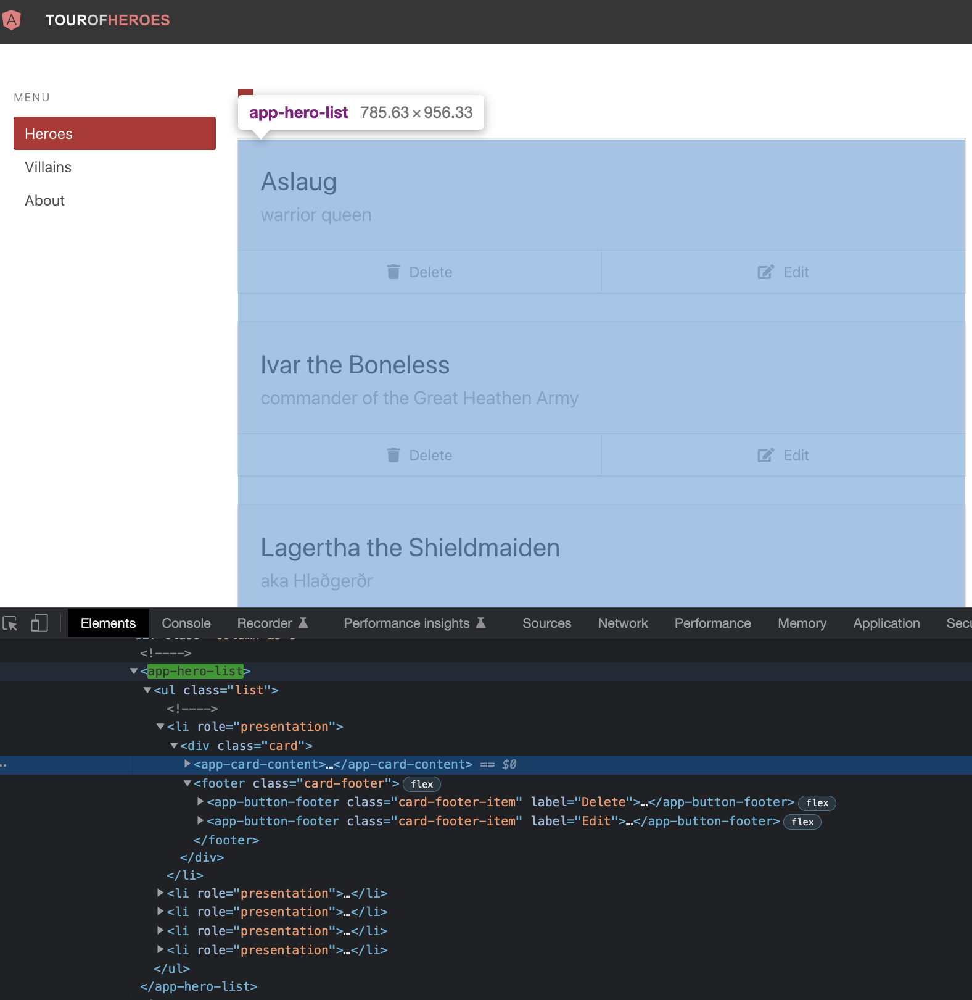
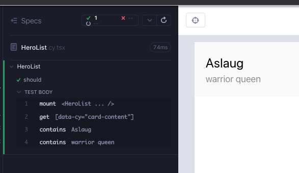
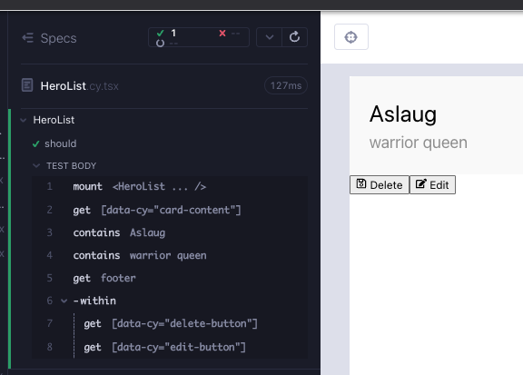
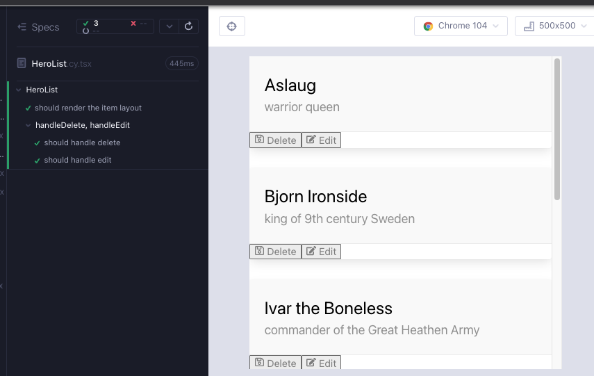

# HeroList

`HeroList`, daha karmaşık bileşenlerimizin ikincisi olan üst bileşenlerdir. Uygulamanın Angular versiyonunda, kahramanların bir listesini görüyoruz. Listenin her öğesi, `CardContent` bileşenimizi ve liste öğesini düzenlemek veya silmek için iki `ButtonFooter` bileşenini saran bir `div`dir.



`feat/HeroList` adlı bir dal oluşturun. `src/heroes/` klasörü altında 2 dosya oluşturun; `HeroList.cy.tsx`, `HeroList.tsx`. Her zamanki gibi, bileşen işlemesine minimal başlayarak aşağıdakileri dosyalara kopyalayın ve `yarn cy:open-ct` ile koşucuyu açtıktan sonra testi çalıştırın.

```tsx
// src/heroes/HeroList.cy.tsx
import HeroList from "./HeroList";
import "../styles.scss";

describe("HeroList", () => {
  it("should", () => {
    cy.mount(<HeroList />);
  });
});
```

```tsx
// src/heroes/HeroList.tsx
export default function HeroList() {
  return <div>hello</div>;
}
```

## Bir liste öğesi

React'te bir liste bileşeni oluştururken, önce tek bir öğeyle başlamak ve ardından listeye geçmek daha kolaydır. `div` ile başlayacağız. İstediğimiz şema şu şekildedir:

- div
  - `CardContent`
  - `footer`
    - 2 x`ButtonFooter`

Önce `CardContent` işlemini test ederek başlarız (Kırmızı 1).

```tsx
// src/heroes/HeroList.cy.tsx
import HeroList from "./HeroList";
import "../styles.scss";

describe("HeroList", () => {
  it("should", () => {
    cy.mount(<HeroList />);

    cy.getByCy("card-content");
  });
});
```

`CardContent` çocuk bileşeni ekledikten sonra test geçer, ancak `CardContent`ten eksik olan ad ve açıklama özellikleri hakkında bir derleyici uyarısı alırız. Şimdilik boş dize ile özellikleri ekleyebiliriz.

```tsx
// src/heroes/HeroList.tsx
import CardContent from "components/CardContent";

export default function HeroList() {
  return (
    <div>
      <CardContent name="" description="" />
    </div>
  );
}
```

Şimdi özellik değerleri için başarısız bir test ekleyebiliriz (Kırmızı 2).

```tsx
// src/heroes/HeroList.cy.tsx
import HeroList from "./HeroList";
import "../styles.scss";

describe("HeroList", () => {
  it("should", () => {
    cy.mount(<HeroList />);

    cy.getByCy("card-content");
    cy.contains("Aslaug");
    cy.contains("warrior queen");
  });
});
```

Ve testi geçmek için bileşene sabit kodlu özellik değerlerini ekleyebiliriz (Yeşil 2).

```tsx
// src/heroes/HeroList.tsx
import CardContent from "components/CardContent";

export default function HeroList() {
  return (
    <div>
      <CardContent name="Aslaug" description="warrior queen" />
    </div>
  );
}
```

Kullanımdan `hero`nun ağdan aldığımız bir veri parçası olduğuna dair bir ipucu alırız. Şimdilik bir `hero` nesnesi oluşturabilir ve bunu hem teste hem de bileşene kopyalayabiliriz (Düzenleme 2).

```tsx
// src/heroes/HeroList.cy.tsx
import HeroList from "./HeroList";
import { Hero } from "models/Hero";
import "../styles.scss";

describe("HeroList", () => {
  const hero: Hero = {
    id: "HeroAslaug",
    name: "Aslaug",
    description: "warrior queen",
  };
  it("should", () => {
    cy.mount(<HeroList />);

    cy.getByCy("card-content");
    cy.contains(hero.name);
    cy.contains(hero.description);
  });
});
```

```tsx
// src/heroes/HeroList.tsx
import CardContent from "components/CardContent";
import { Hero } from "models/Hero";

export default function HeroList() {
  const hero: Hero = {
    id: "HeroAslaug",
    name: "Aslaug",
    description: "warrior queen",
  };
  return (
    <div>
      <CardContent name={hero.name} description={hero.description} />
    </div>
  );
}
```



`cancel` ve `edit` düğmelerinin işlemini kontrol etmek için `ButtonFooter` bileşeninin çeşitlerinden olan yeni bir test oluşturabiliriz. `footer`ı kontrol etmek ve düğmelerin içinde olduğundan emin olmak isteğe bağlıdır; bunun yerine bileşenleri kontrol edebiliriz. Test maliyeti ve güven arasında bir çağrıdır ve ne kadar test ettiğimize bağlıdır. Bu durumda "footer etiketi hiç değişecek mi?", "within api kullanmak yüksek miktarda iş mi?", "Bu ayrıntıyı test etmekle ne kadar daha fazla güven alırız?" gibi sorular kararımızı belirleyebilir (Kırmızı 3).

```tsx
// src/heroes/HeroList.cy.tsx
import HeroList from "./HeroList";
import { Hero } from "models/Hero";
import "../styles.scss";

describe("HeroList", () => {
  const hero: Hero = {
    id: "HeroAslaug",
    name: "Aslaug",
    description: "warrior queen",
  };
  it("should", () => {
    cy.mount(<HeroList />);

    cy.getByCy("card-content");
    cy.contains(hero.name);
    cy.contains(hero.description);

    cy.get("footer")
      .first()
      .within(() => {
        cy.getByCy("delete-button");
        cy.getByCy("edit-button");
      });
  });
});
```

`ButtonFooter` çocuğunu bileşene ekledikçe, eksik prop'lar hakkında bir derleyici uyarısı alırız ve başarısız bir test (Kırmızı3) elde ederiz.

```tsx
// src/heroes/HeroList.tsx
import CardContent from "components/CardContent";
import ButtonFooter from "components/ButtonFooter";
import { Hero } from "models/Hero";

export default function HeroList() {
  const hero: Hero = {
    id: "HeroAslaug",
    name: "Aslaug",
    description: "warrior queen",
  };
  return (
    <div>
      <CardContent name={hero.name} description={hero.description} />
      <footer>
        <ButtonFooter />
        <ButtonFooter />
      </footer>
    </div>
  );
}
```

Eksik prop'ları ekleyerek testi geçmek için `ButtonFooter` türlerinden yararlanabiliriz. Şimdilik `onClick` değerlerini boş bırakabiliriz (Yeşil 3).

```tsx
// src/heroes/HeroList.tsx
import CardContent from "components/CardContent";
import ButtonFooter from "components/ButtonFooter";
import { FaEdit, FaRegSave } from "react-icons/fa";
import { Hero } from "models/Hero";

export default function HeroList() {
  const hero: Hero = {
    id: "HeroAslaug",
    name: "Aslaug",
    description: "warrior queen",
  };

  return (
    <div>
      <CardContent name={hero.name} description={hero.description} />
      <footer>
        <ButtonFooter label="Delete" IconClass={FaRegSave} onClick={""} />
        <ButtonFooter label="Edit" IconClass={FaEdit} onClick={""} />
      </footer>
    </div>
  );
}
```



**TDD zihniyetinde, yeşil testlerimiz olduğunda, ek kaynak kod eklemektense daha fazla test eklemeyi veya yeniden düzenlemeyi tercih ederiz**. Silme ve kahramanı seçme olaylarını ele alan başarısız bir test yazalım. Şimdilik `console.log`'u izlemek için benzer `heroes/HeroDetail.cy.tsx` testi gibi bir şey olduğundan emin olalım. Önceki bölümlerde yaptığımız gibi `beforeEach` kancası ve `context` bloğunu kullanabiliriz (Kırmızı 4).

```tsx
// src/heroes/HeroList.cy.tsx
import HeroList from "./HeroList";
import { Hero } from "models/Hero";
import "../styles.scss";

describe("HeroList", () => {
  const hero: Hero = {
    id: "HeroAslaug",
    name: "Aslaug",
    description: "warrior queen",
  };
  it("should render the item layout", () => {
    cy.mount(<HeroList />);

    cy.getByCy("card-content");
    cy.contains(hero.name);
    cy.contains(hero.description);

    cy.get("footer")
      .first()
      .within(() => {
        cy.getByCy("delete-button");
        cy.getByCy("edit-button");
      });
  });

  context("handleDeleteHero, handleSelectHero", () => {
    beforeEach(() => {
      cy.window()
        .its("console")
        .then((console) => cy.spy(console, "log").as("log"));

      cy.mount(<HeroList />);
    });
    it("should handle delete", () => {
      cy.getByCy("delete-button").click();
      cy.get("@log").should("have.been.calledWith", "handleDeleteHero");
    });
    it("should handle edit", () => {
      cy.getByCy("edit-button").click();
      cy.get("@log").should("have.been.calledWith", "handleSelectHero");
    });
  });
});
```

Şu anda tüm testlerin geçmesi için yapmamız gereken, sırasıyla `handleDeleteHero` ve `handleSelectHero` argümanlarıyla dönen console.log'lar içeren işlevler doldurmaktır (Yeşil 4).

```tsx
// src/heroes/HeroList.tsx
import CardContent from "components/CardContent";
import ButtonFooter from "components/ButtonFooter";
import { FaEdit, FaRegSave } from "react-icons/fa";
import { Hero } from "models/Hero";

export default function HeroList() {
  const hero: Hero = {
    id: "HeroAslaug",
    name: "Aslaug",
    description: "warrior queen",
  };

  return (
    <div>
      <CardContent name={hero.name} description={hero.description} />
      <footer>
        <ButtonFooter
          label="Delete"
          IconClass={FaRegSave}
          onClick={() => console.log("handleDeleteHero")}
        />
        <ButtonFooter
          label="Edit"
          IconClass={FaEdit}
          onClick={() => console.log("handleSelectHero")}
        />
      </footer>
    </div>
  );
}
```

Şimdi, `onClick` olaylarını işlevlere dönüştürmenin ve stiller eklemenin iyi bir zamanıdır (Düzenleme 4).

```tsx
// src/heroes/HeroList.tsx
import CardContent from "components/CardContent";
import ButtonFooter from "components/ButtonFooter";
import { FaEdit, FaRegSave } from "react-icons/fa";
import { Hero } from "models/Hero";

export default function HeroList() {
  const hero: Hero = {
    id: "HeroAslaug",
    name: "Aslaug",
    description: "warrior queen",
  };

  const handleDeleteHero = () => console.log("handleDeleteHero");
  const handleSelectHero = () => console.log("handleSelectHero");

  return (
    <div className="card">
      <CardContent name={hero.name} description={hero.description} />
      <footer className="card-footer">
        <ButtonFooter
          label="Delete"
          IconClass={FaRegSave}
          onClick={handleDeleteHero}
        />
        <ButtonFooter
          label="Edit"
          IconClass={FaEdit}
          onClick={handleSelectHero}
        />
      </footer>
    </div>
  );
}
```

## Listeyi oluşturma

Üst `div`'i `ul` ve `li` içine alın. Bileşen hala oluşturuluyor. İhtiyacımız olan şey, üzerinde eşleme yapabileceğimiz veri listesi / dizisi.

```tsx
// src/heroes/HeroList.tsx
import CardContent from "components/CardContent";
import ButtonFooter from "components/ButtonFooter";
import { FaEdit, FaRegSave } from "react-icons/fa";
import { Hero } from "models/Hero";

export default function HeroList() {
  const hero: Hero = {
    id: "HeroAslaug",
    name: "Aslaug",
    description: "warrior queen",
  };

  const handleDeleteHero = () => console.log("handleDeleteHero");
  const handleSelectHero = () => console.log("handleSelectHero");

  return (
    <ul>
      {/* need some data here, an array of objects */}
      <li>
        <div className="card">
          <CardContent name={hero.name} description={hero.description} />
          <footer className="card-footer">
            <ButtonFooter
              label="Delete"
              IconClass={FaRegSave}
              onClick={handleDeleteHero}
            />
            <ButtonFooter
              label="Edit"
              IconClass={FaEdit}
              onClick={handleSelectHero}
            />
          </footer>
        </div>
      </li>
    </ul>
  );
}
```

`HeroDetail` bileşeni geliştirilirken veri hakkında yaptığımız şu açıklamayı hatırlayın; _"Bileşende sert kodlanmış `hero` nesnesi yerine, verileri bir prop ile iletebiliriz. Bileşenlerimizi prop'larla veya onları saran şeyle değiştiririz ve şu anda prop daha kolay bir seçenek."_ Bu yaklaşımla tutarlı kalabilir ve bileşene bir prop iletebiliriz; 2 `hero` nesnesinden oluşan bir dizi.

Testi değiştirerek başlarız. Bir `hero` nesnesi yerine, 2 `hero` nesnesinden oluşan bir `heroes` dizisi vardır. `name` ve `description` için string değerlerini kontrol etmek için, `hero` yerine `heroes[0]`'a başvururuz. Test hala başarılı, ancak bileşende henüz `heroes` adlı bir prop olmadığı için TS hatası var (Kırmızı 5).

```tsx
// src/heroes/HeroList.cy.tsx
import HeroList from "./HeroList";
import { Hero } from "models/Hero";
import "../styles.scss";

describe("HeroList", () => {
  const heroes: Hero[] = [
    {
      id: "HeroAslaug",
      name: "Aslaug",
      description: "warrior queen",
    },
    {
      id: "HeroBjorn",
      name: "Bjorn Ironside",
      description: "king of 9th century Sweden",
    },
  ];
  it("should render the item layout", () => {
    cy.mount(<HeroList heroes={heroes} />);

    cy.getByCy("card-content");
    cy.contains(heroes[0].name);
    cy.contains(heroes[0].description);

    cy.get("footer").first().within(()
      .first()
      .within(() => {
        cy.getByCy("delete-button");
        cy.getByCy("edit-button");
      });
  });

  context("handleDelete, handleEdit", () => {
    beforeEach(() => {
      cy.window()
        .its("console")
        .then((console) => cy.spy(console, "log").as("log"));

      cy.mount(<HeroList heroes={heroes} />);
    });
    it("should handle delete", () => {
      cy.getByCy("delete-button").click();
      cy.get("@log").should("have.been.calledWith", "handleDeleteHero");
    });
    it("should handle edit", () => {
      cy.getByCy("edit-button").click();
      cy.get("@log").should("have.been.calledWith", "handleSelectHero");
    });
  });
});
```

`heroes` dizisini bir prop olarak iletiyoruz ve prop türümüzün kahramanlar dizisi olması gerekiyor (Yeşil 5).

```tsx
// src/heroes/HeroList.tsx
import CardContent from "components/CardContent";
import ButtonFooter from "components/ButtonFooter";
import { FaEdit, FaRegSave } from "react-icons/fa";
import { Hero } from "models/Hero";

type HeroListProps = {
  heroes: Hero[];
};

export default function HeroList({ heroes }: HeroListProps) {
  const hero: Hero = {
    id: "HeroAslaug",
    name: "Aslaug",
    description: "warrior queen",
  };

  const handleDeleteHero = () => console.log("handleDeleteHero");
  const handleSelectHero = () => console.log("handleSelectHero");

  return (
    <ul>
      {/* an array of objects */}
      <li>
        <div className="card">
          <CardContent name={hero.name} description={hero.description} />
          <footer className="card-footer">
            <ButtonFooter
              label="Delete"
              IconClass={FaRegSave}
              onClick={handleDeleteHero}
            />
            <ButtonFooter
              label="Edit"
              IconClass={FaEdit}
              onClick={handleSelectHero}
            />
          </footer>
        </div>
      </li>
    </ul>
  );
}
```

Derleyici hatasını ele aldık, ancak bileşende hala sabit kodlu `hero` nesnesini kullanıyoruz ve `heroes` özelliği ile bileşene geçirilen veriyi kullanmıyoruz. `hero` nesnesini kaldırmak, testi başarısız kılar ve `hero.name` ve `hero.description` kullanımı için derleyici hataları verir (Kırmızı 6).

Başarısızlıkları geçici olarak ele almak için, `hero` referansı yerine `heroes[0]` kullanırız (Yeşil 6).

```tsx
// src/heroes/HeroList.tsx
import CardContent from "components/CardContent";
import ButtonFooter from "components/ButtonFooter";
import { FaEdit, FaRegSave } from "react-icons/fa";
import { Hero } from "models/Hero";
type HeroListProps = {
  heroes: Hero[];
};

export default function HeroList({ heroes }: HeroListProps) {
  const handleDeleteHero = () => console.log("handleDeleteHero");
  const handleSelectHero = () => console.log("handleSelectHero");

  return (
    <ul>
      {/* an array of objects */}
      <li>
        <div className="card">
          <CardContent
            name={heroes[0].name}
            description={heroes[0].description}
          />
          <footer className="card-footer">
            <ButtonFooter
              label="Delete"
              IconClass={FaRegSave}
              onClick={handleDeleteHero}
            />
            <ButtonFooter
              label="Edit"
              IconClass={FaEdit}
              onClick={handleSelectHero}
            />
          </footer>
        </div>
      </li>
    </ul>
  );
}
```

Bu, şu soruyu sormamıza neden olur; birden fazla liste öğesini nasıl görüntüleriz? Tüm `li`yi kopyalayıp `heroes[1]` içinde referanslayarak mı yaparız? Bu işe yarar (deneyin) ama bunun iyi olmadığını biliyoruz çünkü DRY değil ve ölçeklenmiyor.

Daha akıllı bir şekilde bir listeyi işlememiz gerekiyor. React'te, JS'ye benzer şekilde, bunu diziyi / verileri eşlemek suretiyle yapıyoruz. Tek fark, `li`yi sözdizimiyle sarmak için JSX gösterimini kullanma ihtiyacıdır. Bu `{` `}` karakterlerini dolar işareti olmayan bir şablon dizesi `${ }` gibi düşünün. Şimdi dizi indekslerini değil, haritanın ürettiği tek `hero`yu referans alabiliriz; dizinin her indeksine eşleşen. `map` kafa karıştırıcıysa, döndüren ve dizi oluşturmayan, ancak yeni bir dizi oluşturan `forEach`in daha iyi bir sürümü gibi düşünün (Düzenleme 6).

```tsx
// src/heroes/HeroList.tsx
import CardContent from "components/CardContent";
import ButtonFooter from "components/ButtonFooter";
import { FaEdit, FaRegSave } from "react-icons/fa";
import { Hero } from "models/Hero";
type HeroListProps = {
  heroes: Hero[];
};

export default function HeroList({ heroes }: HeroListProps) {
  const handleDeleteHero = () => console.log("handleDeleteHero");
  const handleSelectHero = () => console.log("handleSelectHero");

  return (
    <ul>
      {heroes.map((hero) => (
        <li>
          <div className="card">
            <CardContent name={hero.name} description={hero.description} />
            <footer className="card-footer">
              <ButtonFooter
                label="Delete"
                IconClass={FaRegSave}
                onClick={handleDeleteHero}
              />
              <ButtonFooter
                label="Edit"
                IconClass={FaEdit}
                onClick={handleSelectHero}
              />
            </footer>
          </div>
        </li>
      ))}
    </ul>
  );
}
```

İyi bir yeniden düzenleme oldu, render iyi görünüyor, ancak `Delete` ve `Edit` tıklamaları için test başarısız oluyor çünkü şimdi onların birden fazlası var ve tıklarken listenin `first()` örneğini kullanarak hızlı bir ayar yapabiliriz. Verileri de Cypress düzeneği olan bir json dosyasına, `./cypress/fixtures` altına taşıyabiliriz. `./cypress/fixtures/heroes.json` dosyasını oluşturun ve aşağıdaki içeriği yapıştırın.

```json
[
  {
    "id": "HeroAslaug",
    "name": "Aslaug",
    "description": "warrior queen"
  },
  {
    "id": "HeroBjorn",
    "name": "Bjorn Ironside",
    "description": "king of 9th century Sweden"
  },
  {
    "id": "HeroIvar",
    "name": "Ivar the Boneless",
    "description": "commander of the Great Heathen Army"
  },
  {
    "id": "HeroLagertha",
    "name": "Lagertha the Shieldmaiden",
    "description": "aka Hlaðgerðr"
  },
  {
    "id": "HeroRagnar",
    "name": "Ragnar Lothbrok",
    "description": "aka Ragnar Sigurdsson"
  },
  {
    "id": "HeroThora",
    "name": "Thora Town-hart",
    "description": "daughter of Earl Herrauðr of Götaland"
  }
]
```

Testi bu verileri kullanacak şekilde yeniden düzenleyebiliriz (Düzenleme 6).

```tsx
// src/heroes/HeroList.cy.tsx
import HeroList from "./HeroList";
import "../styles.scss";
import heroes from "../../cypress/fixtures/heroes.json";

describe("HeroList", () => {
  it("should render the item layout", () => {
    cy.mount(<HeroList heroes={heroes} />);

    cy.getByCy("card-content");
    cy.contains(heroes[0].name);
    cy.contains(heroes[0].description);

    cy.get("footer")
      .first()
      .within(() => {
        cy.getByCy("delete-button");
        cy.getByCy("edit-button");
      });
  });

  context("handleDelete, handleEdit", () => {
    beforeEach(() => {
      cy.window()
        .its("console")
        .then((console) => cy.spy(console, "log").as("log"));

      cy.mount(<HeroList heroes={heroes} />);
    });
    it("should handle delete", () => {
      cy.getByCy("delete-button").first().click();
      cy.get("@log").should("have.been.calledWith", "handleDeleteHero");
    });
    it("should handle edit", () => {
      cy.getByCy("edit-button").first().click();
      cy.get("@log").should("have.been.calledWith", "handleSelectHero");
    });
  });
});
```



Veri uzunluğu kadar listenin uzunluğu olduğunu doğrulayan yeni bir test ekleyelim (Kırmızı 7)

```tsx
// src/heroes/HeroList.cy.tsx
import HeroList from "./HeroList";
import "../styles.scss";
import heroes from "../../cypress/fixtures/heroes.json";

describe("HeroList", () => {
  it("should render the item layout", () => {
    cy.mount(<HeroList heroes={heroes} />);

    cy.getByCyLike("hero-list-item").should("have.length", heroes.length);

    cy.getByCy("card-content");
    cy.contains(heroes[0].name);
    cy.contains(heroes[0].description);

    cy.get("footer")
      .first()
      .within(() => {
        cy.getByCy("delete-button");
        cy.getByCy("edit-button");
      });
  });

  context("handleDelete, handleEdit", () => {
    beforeEach(() => {
      cy.window()
        .its("console")
        .then((console) => cy.spy(console, "log").as("log"));

      cy.mount(<HeroList heroes={heroes} />);
    });
    it("should handleDeleteHero", () => {
      cy.getByCy("delete-button").first().click();
      cy.get("@log").should("have.been.calledWith", "handleDeleteHero");
    });
    it("should handleSelectHero", () => {
      cy.getByCy("edit-button").first().click();
      cy.get("@log").should("have.been.calledWith", "handleSelectHero");
    });
  });
});
```

`data-cy` özelliğini bileşene eklerken, `key` özelliği hakkında önemli bir konuyu da ele alacağız.

JS'in `map` fonksiyonu ikinci bir argüman olan `index` alır. Bunu şablon dizesiyle kullanarak ve `data-cy` seçicileri ile liste üzerindeki n. öğeye erişebiliriz:

```tsx
// component
{heroes.map((hero, index) => (
  <li data-cy={`hero-list-item-${index}`} >
}
```

```tsx
// component test
cy.getByCy(`hero-list-item-2`);
```

React bir listeyi (yeniden) render ederken, `key` özelliği hangi liste öğelerinin değiştiğini belirlemek için kullanılır. [Dokümantasyon](https://reactjs.org/docs/lists-and-keys.html#keys)da belirtildiği üzere, key olarak index yerine benzersiz bir değer kullanılması önerilir, çünkü index kullanmak performansı olumsuz etkileyebilir.

```tsx
// not preferred
{heroes.map((hero, index) => (
  <li data-cy={`hero-list-item-${index}`} key={index}>
}
```

```tsx
// preferred, because hero.id is always unique
{heroes.map((hero, index) => (
  <li data-cy={`hero-list-item-${index}`} key={hero.id}>
}
```

Testin geçmesi için bileşeni `data-cy` özelliğiyle değiştireceğiz ve her zaman benzersiz olacak bir değere sahip bir `key` özelliği ekleyeceğiz (Yeşil 7).

```tsx
import CardContent from "components/CardContent";
import ButtonFooter from "components/ButtonFooter";
import { FaEdit, FaRegSave } from "react-icons/fa";
import { Hero } from "models/Hero";
type HeroListProps = {
  heroes: Hero[];
};

export default function HeroList({ heroes }: HeroListProps) {
  const handleDeleteHero = () => console.log("handleDeleteHero");
  const handleSelectHero = () => console.log("handleSelectHero");

  return (
    <ul data-cy="hero-list" className="list">
      {heroes.map((hero, index) => (
        <li data-cy={`hero-list-item-${index}`} key={hero.id}>
          <div className="card">
            <CardContent name={hero.name} description={hero.description} />
            <footer className="card-footer">
              <ButtonFooter
                label="Delete"
                IconClass={FaRegSave}
                onClick={handleDeleteHero}
              />
              <ButtonFooter
                label="Edit"
                IconClass={FaEdit}
                onClick={handleSelectHero}
              />
            </footer>
          </div>
        </li>
      ))}
    </ul>
  );
}
```

## Özet

### Tek liste öğesi

Listeyle uğraşmaya başlamadan önce, tek bir liste öğesi için test yazmaya karar verdik.

Alt bileşen `CardContent`i render eden bir test yazdık ve testi geçmek için sert kodlanmış prop değerleri kullandık (Kırmızı 1, Yeşil 1, Kırmızı 2, Yeşil 2). Hem bileşende hem de testte durumu taklit etmek için sert kodlanmış veriler kullandık (Düzenleme 2).

</br>

Diğer alt bileşen `ButtonFooter`ın render edilmesi için bir test ekledik (Kırmızı 3).

Eksik prop'ları eklemek için TS'nin avantajını kullandık (Yeşil 3).

</br>

Delete (silme) ve select (seçme) kahraman etkinliklerinin ele alınması için testler ekledik, `console.log` üzerinde casusluk yaptık (Kırmızı 4).

İlgili etkinlikleri console.log yapan fonksiyonlar ekledik ve tek öğeyi stillerle tamamladık (Yeşil 4, Düzenleme 4).

</br>

### Liste

Bileşene bir kahramanlar dizisini prop olarak geçmeye karar verdik ve TS hatası gördük (Kırmızı 5). TS hatasını çözmek için `HeroListProps` içinde `Hero[]` tipini kullandık (Yeşil 5).

</br>

Testten sert kodlanmış `hero` nesnesini kaldırdık, bu da başarısızlığa neden oldu (Kırmızı 6), bunun yerine `heroes` dizisinin ilk indeksini `heroes[0]` ile belirttik (Yeşil 6).

React'te listeleri render etme kalıbı hakkında düşündük; `map` kullanarak. Dizinin indeks referansını, her dizi öğesi için `hero` nesnesi olan map geri çağırma argümanına değiştirdik. Ayrıca, bileşen testinde daha büyük bir liste render etmek için Cypress fixture'ını kullanmaya başladık (Düzenleme 6).

</br>

Tüm listenin uzunluğunu doğrulayan bir test ekledik (Kırmızı 7).

React'in listelerde hangi öğelerin güncellendiğini belirlemek ve optimize etmek için kullandığı `key` özelliği hakkında düşündük. Bileşeni bu bilgiyle değiştirdik (Yeşil 7).

## Çıkarımlar

- React'te bir liste bileşeni oluştururken, önce tek bir öğeyle başlamak ve ardından listeye geçmek daha kolaydır.
- React'te listeleri render ederken ve veriler üzerinde haritalama yaparken, key özelliği için önerilen değer benzersiz olmalıdır, örneğin haritalanan dizinin indeksi yerine `hero.id` gibi. Ancak indeks, nth öğeyi seçmek için `data-cy` özelliğinde başvurulacak öğeye yararlıdır.
- Cypress' düzeltmeleri json olarak içe aktarılabilir ve testlerde veri yerine kullanılabilir.
- TDD zihniyetinde, yeşil testlere sahip olduğumuzda, daha fazla test eklemeyi veya yeniden düzenlemeyi, ek kaynak kodu eklemeye tercih etmek isteriz.
- Test etme her zaman maliyet ve güven arasındaki bir çağrıdır ve ne kadar test ettiğimiz değişir. Kararımızı belirleyebilecek bazı sorular şunlardır:
  - _Test edilen kod ne sıklıkla değişir?_
  - _Şimdi daha fazla inceleme yapan test kodunu yazmak yüksek miktarda çalışma mı?_
  - _Bu ayrıntıyı test ederek ne kadar fazla güven elde ederiz?_
