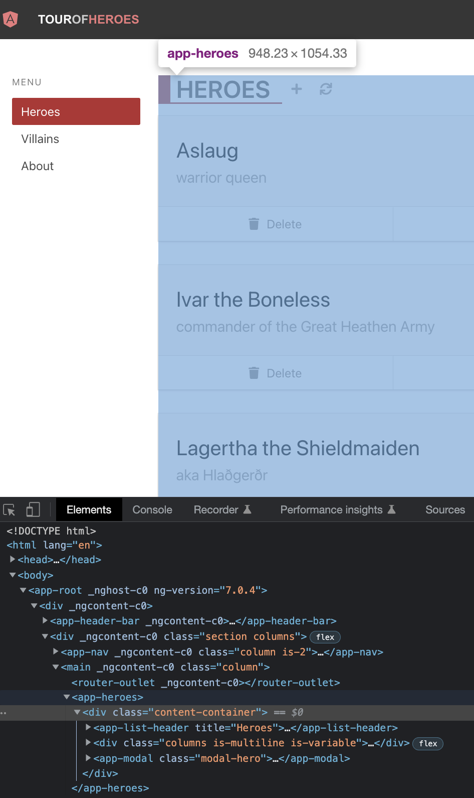
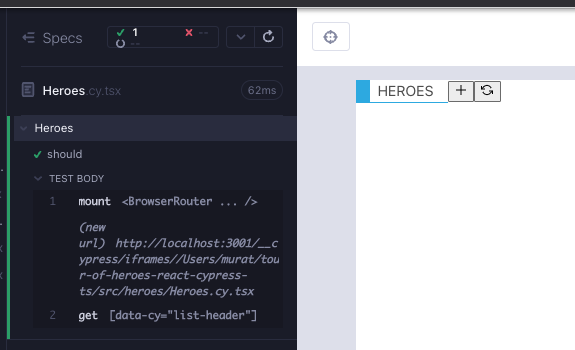
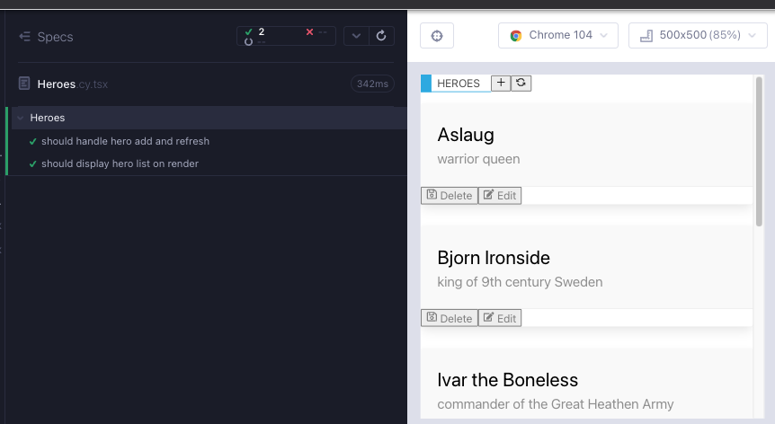
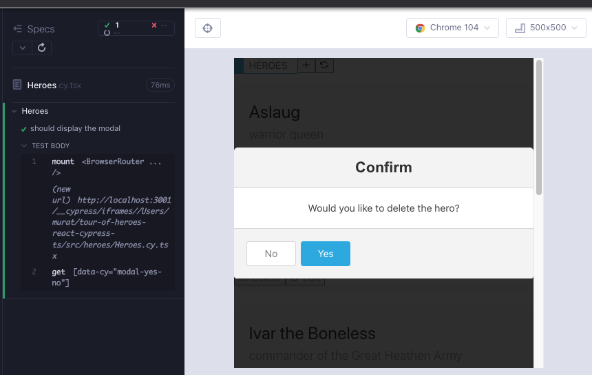
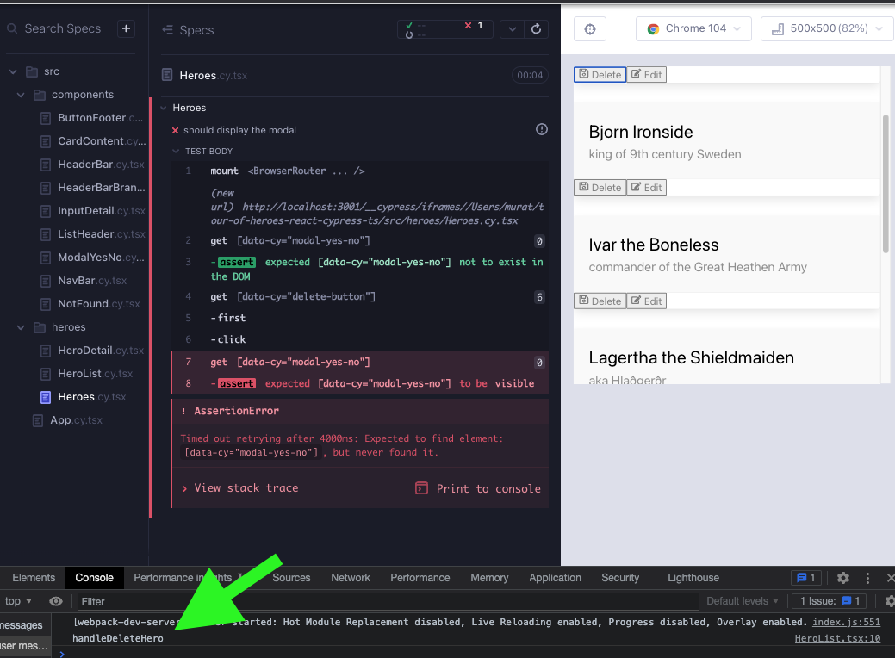

# Heroes part1 - lifting state

`Heroes` bileşeni, diğer kahraman bileşenlerini kullanır ve şimdiye kadarki en karmaşık olanıdır. Uygulamanın Angular versiyonuna bakarak, DOM öğelerinin bir madde listesi oluşturabiliriz.

- `ListHeader` alt bileşeni
- `div`
  - `HeroList` ve `HeroDetail` arasında geçiş yapan bir rota
- `ModalYesNo` bileşeni (silme işlemi için)



`feat/Heroes` adında bir dal oluşturun. `src/heroes/` klasörü altında `Heroes.cy.tsx`, `Heroes.tsx` adlı 2 dosya oluşturun. Her zamanki gibi, bileşenin işlemesini en aza indirgeyerek başlayın; dosyalara aşağıdakileri kopyalayın ve `yarn cy:open-ct` ile koşucuyu açtıktan sonra testi çalıştırın.

```tsx
// src/components/Heroes.cy.tsx
import Heroes from "./Heroes";
import "../styles.scss";

describe("Heroes", () => {
  it("should", () => {
    cy.mount(<Heroes />);
  });
});
```

```
// src/components/Heroes.tsx
export default function Heroes() {
  return <div>hello</div>;
}
```

## `ListHeader` alt bileşeni

Önce `ListHeader` bileşenini kontrol eden bir testle başlarız (Kırmızı 1).

```tsx
// src/components/Heroes.cy.tsx
import Heroes from "./Heroes";
import "../styles.scss";

describe("Heroes", () => {
  it("should", () => {
    cy.mount(<Heroes />);

    cy.getByCy("list-header");
  });
});
```

Testin çalışması için, işlemede alt bileşeni eklemeli ve gerekli nitelikleri eklemeliyiz; `title`, `handleAdd`, `handleRefresh`. Şimdilik herhangi bir değer uygundur (Kırmızı 1).

```tsx
// src/components/Heroes.tsx
import ListHeader from "../components/ListHeader";

export default function Heroes() {
  return (
    <div data-cy="heroes">
      <ListHeader title="Heroes" handleAdd={""} handleRefresh={""} />
    </div>
  );
}
```

Hala bir test hatası alıyoruz ve bu tanıdık bir yönlendirme hatası. Bu, alt bileşen `ListHeader`'ın `react-router`'ı kullanması nedeniyledir. `ListHeader` ve `HeaderBarBrand` bileşenlerinden hatırlayın ki, `react-router` kullandığımız herhangi bir zaman, bileşen testinde monte edilen bileşeni `BrowserRouter` içinde sarmalıyız (Yeşil 1).

```tsx
// src/components/Heroes.cy.tsx
import Heroes from "./Heroes";
import { BrowserRouter } from "react-router-dom";
import "../styles.scss";

describe("Heroes", () => {
  it("should", () => {
    cy.mount(
      <BrowserRouter>
        <Heroes />
      </BrowserRouter>
    );

    cy.getByCy("list-header");
  });
});
```



Simgelere tıkladığımızda tip hataları alırız. `ListHeader` bileşenini izole olarak test ederken, `handleAdd` ve `handleRefresh` için `cy.stub` kullandığımızı hatırlayın. Şimdi bileşen, bir alt bileşen olarak kullanılıyor ve React, `cy.stub` kullanamaz. Çocuğun tüketicisi / ebeveyni bu işleyici işlevi uygulamalıdır.

İki tıklamayla başarısız olan testleri geliştirelim. Şimdilik `HeroDetail.cy.tsx` ve `HeroList.cy.tsx` testlerinde yaptığımız gibi, konsol günlüklerini takip etmek yeterlidir (Kırmızı 2).

```tsx
// src/components/Heroes.cy.tsx
import Heroes from "./Heroes";
import { BrowserRouter } from "react-router-dom";
import "../styles.scss";

describe("Heroes", () => {
  it("should handle hero add and refresh", () => {
    cy.window()
      .its("console")
      .then((console) => cy.spy(console, "log").as("log"));

    cy.mount(
      <BrowserRouter>
        <Heroes />
      </BrowserRouter>
    );

    cy.getByCy("list-header");
    cy.getByCy("add-button").click();
    cy.get("@log").should("have.been.calledWith", "handleAdd");
    cy.getByCy("refresh-button").click();
    cy.get("@log").should("have.been.calledWith", "handleRefresh");
  });
});
```

Testi geçmek için, ilgili dizeyle `console.log` yapan işlevleri eklememiz gerekir (Yeşil 2).

```tsx
// src/components/Heroes.tsx
import ListHeader from "../components/ListHeader";

export default function Heroes() {
  return (
    <div data-cy="heroes">
      <ListHeader
        title="Heroes"
        handleAdd={() => console.log("handleAdd")}
        handleRefresh={() => console.log("handleRefresh")}
      />
    </div>
  );
}
```

Şimdilik `ListHeader` için bunları kendi işlevlerine çıkarabiliriz (Düzenleme 2).

```tsx
// src/components/Heroes.tsx
import ListHeader from "../components/ListHeader";

export default function Heroes() {
  const addNewHero = () => console.log("handleAdd");
  const handleRefresh = () => console.log("handleRefresh");

  return (
    <div data-cy="heroes">
      <ListHeader
        title="Heroes"
        handleAdd={addNewHero}
        handleRefresh={handleRefresh}
      />
    </div>
  );
}
```


`Heroes` işlendiğinde, önce `ListHeader` ve `HeroList` görüntülenir. Bir kahramanı düzenlersek, `HeroDetail` görüntülenir. Bir kahramanı silersek, `ModalYesNo` gösterilir. İlk önce `HeroList`'e, sonra modale odaklanacağız. Daha sonraki bir bölümde yönlendirmeyi ayarladıktan sonra `HeroDetail` ile ilgileneceğiz.

## `HeroList` alt bileşeni

Önce, `HeroList` işlemenin kontrol edildiği basit bir testle başlarız (Kırmızı 3).

```tsx
// src/components/Heroes.cy.tsx
import Heroes from "./Heroes";
import { BrowserRouter } from "react-router-dom";
import "../styles.scss";

describe("Heroes", () => {
  it("should handle hero add and refresh", () => {
    cy.window()
      .its("console")
      .then((console) => cy.spy(console, "log").as("log"));

    cy.mount(
      <BrowserRouter>
        <Heroes />
      </BrowserRouter>
    );

    cy.getByCy("list-header");
    cy.getByCy("add-button").click();
    cy.get("@log").should("have.been.calledWith", "handleAdd");
    cy.getByCy("refresh-button").click();
    cy.get("@log").should("have.been.calledWith", "handleRefresh");
  });

  it("should display hero list on render", () => {
    cy.mount(
      <BrowserRouter>
        <Heroes />
      </BrowserRouter>
    );

    cy.getByCy("hero-list");
  });
});
```

Alt `HeroList` bileşenini bileşenimize ekliyoruz. Bir kahramanlar özelliği gerektirir. Bir fikir, alt bileşenler için bileşen testlerine bakmak, nasıl kullanıldıklarını görmek ve ebeveyn bileşenin testlerini yazarken bu belgelendirmeyi temel alarak çalışmaktır. Ebeveyn düzeyinde herhangi bir testi tekrarlamamıza gerek yoktur, ancak alt bileşenin nasıl monte edileceği konusunda bir fikir vermek için yardımı kullanabiliriz. `HeroList.cy.tsx`'ye bir göz atın. Cypress düzeneği içe aktarıyoruz ve bir özellik olarak iletiyoruz. Benzer bir süreç tekrar edebilir ve veri ve durumla ilgili kararları daha sonra yapmak zorunda kalana kadar erteleyebiliriz (Yeşil 3).

Bir bileşen, kaynak klasörünün dışındaki bir dosyayı içe aktarıyorsa, bileşen izole olarak çalışacaktır, ancak daha büyük uygulama derlenmeyecektir. `cypress/fixtures/` içindeki `heroes.json` dosyasının `src/heroes` içinde bir kopyasını oluşturun ve `Heroes` bileşenini bu dosyayı kullanacak şekilde güncelleyin. Ağ verileriyle çalışırken daha sonra bunu zarif bir şekilde ele alacağız.

```tsx
// src/components/Heroes.tsx
import ListHeader from "../components/ListHeader";
import HeroList from "./HeroList";
import heroes from "./heroes.json";

export default function Heroes() {
  const addNewHero = () => console.log("handleAdd");
  const handleRefresh = () => console.log("handleRefresh");

  return (
    <div data-cy="heroes">
      <ListHeader
        title="Heroes"
        handleAdd={addNewHero}
        handleRefresh={handleRefresh}
      />
      <div>
        <div>
          <HeroList heroes={heroes} />
        </div>
      </div>
    </div>
  );
}
```



## `ModalYesNo` alt bileşeni

Bir kez daha çocuk bileşenlerin testlerine bakabilir, nasıl kullanıldıklarını görebilir ve ebeveyn bileşeni için testler yazarken bu belgelendirmeden yola çıkabiliriz. `ModalYesNo.cy.tsx`, `message` adlı bir string, `onYes` ve `onNo` olayları için özelliklere sahiptir. Ayrıca, modalın açılıp kapanmasına izin veren dahili bir durumu da destekler.

Hatalı bir test yazalım. Şimdilik modal için bir açma/kapama düğmemiz yok, bu nedenle sadece yeni modal testini çalıştırmalıyız (Kırmızı 4).

```tsx
// src/components/Heroes.cy.tsx
import Heroes from "./Heroes";
import { BrowserRouter } from "react-router-dom";
import "../styles.scss";

describe("Heroes", () => {
  it("should handle hero add and refresh", () => {
    cy.window()
      .its("console")
      .then((console) => cy.spy(console, "log").as("log"));

    cy.mount(
      <BrowserRouter>
        <Heroes />
      </BrowserRouter>
    );

    cy.getByCy("list-header");
    cy.getByCy("add-button").click();
    cy.get("@log").should("have.been.calledWith", "handleAdd");
    cy.getByCy("refresh-button").click();
    cy.get("@log").should("have.been.calledWith", "handleRefresh");
  });

  it("should display hero list on render", () => {
    cy.mount(
      <BrowserRouter>
        <Heroes />
      </BrowserRouter>
    );

    cy.getByCy("hero-list");
  });

  it.only("should display the modal", () => {
    cy.mount(
      <BrowserRouter>
        <Heroes />
      </BrowserRouter>
    );

    cy.getByCy("modal-yes-no");
  });
});
```

Çocuk bileşenini oluşturmak için, sadece `message`, `onNo`, `onYes` özelliklerini eklememiz yeterlidir. Şimdilik boş stringler olmaları sorun değil (Yeşil 4).

```tsx
// src/components/Heroes.tsx
import ListHeader from "../components/ListHeader";
import ModalYesNo from "components/ModalYesNo";
import HeroList from "./HeroList";
import heroes from "./heroes.json";

export default function Heroes() {
  const addNewHero = () => console.log("handleAdd");
  const handleRefresh = () => console.log("handleRefresh");

  return (
    <div data-cy="heroes">
      <ListHeader
        title="Heroes"
        handleAdd={addNewHero}
        handleRefresh={handleRefresh}
      />
      <div>
        <div>
          <HeroList heroes={heroes} />
        </div>
      </div>

      <ModalYesNo
        message="Would you like to delete the hero?"
        onNo={""}
        onYes={""}
      />
    </div>
  );
}
```



Bu testi çalıştırdıktan sonra, gerçekten o modalı kapatıp `Heroes` bileşenimizi görmek istiyoruz. Bu ihtiyaç için başarısız bir test yazalım (Kırmızı 5).

> Buradan itibaren, kısaltma amacıyla, bir test `.only` ile çalıştırıldığında, sadece ilgili kısmın kodunu gösteriyor olacağız.

```tsx
// src/components/Heroes.cy.tsx
it.only("should display the modal", () => {
  cy.mount(
    <BrowserRouter>
      <Heroes />
    </BrowserRouter>
  );

  cy.getByCy("modal-yes-no");
  cy.getByCy("button-no").click();
});
```

Cypress koşucusunda `func.apply is not a function` hatası alıyoruz. Bu hatayla tanışın, olay işleyicimizin bir şey yapmadığı anlamına gelir. Şimdilik bunu çözmek için `console.log` kullanan bir işlev kullanın (Yeşil 5).

```tsx
// src/components/Heroes.tsx
import ListHeader from "../components/ListHeader";
import ModalYesNo from "components/ModalYesNo";
import HeroList from "./HeroList";
import heroes from "./heroes.json";

export default function Heroes() {
  const addNewHero = () => console.log("handleAdd");
  const handleRefresh = () => console.log("handleRefresh");

  return (
    <div data-cy="heroes">
      <ListHeader
        title="Heroes"
        handleAdd={addNewHero}
        handleRefresh={handleRefresh}
      />
      <div>
        <div>
          <HeroList heroes={heroes} />
        </div>
      </div>

      <ModalYesNo
        message="Would you like to delete the hero?"
        onNo={() => console.log("handleCloseModal")}
        onYes={""}
      />
    </div>
  );
}
```

Kendi işlevine çevirebiliriz (Yeniden düzenleme 5).

```tsx
// src/components/Heroes.tsx
import ListHeader from "../components/ListHeader";
import ModalYesNo from "components/ModalYesNo";
import HeroList from "./HeroList";
import heroes from "./heroes.json";

export default function Heroes() {
  const addNewHero = () => console.log("handleAdd");
  const handleRefresh = () => console.log("handleRefresh");
  const handleCloseModal = () => () => console.log("handleCloseModal");

  return (
    <div data-cy="heroes">
      <ListHeader
        title="Heroes"
        handleAdd={addNewHero}
        handleRefresh={handleRefresh}
      />
      <div>
        <div>
          <HeroList heroes={heroes} />
        </div>
      </div>

      <ModalYesNo
        message="Would you like to delete the hero?"
        onNo={handleCloseModal}
        onYes={""}
      />
    </div>
  );
}
```

`HeroDetail` işlevinde `useState` kancasını ele aldık. O bölümde iki ana nokta vardı. İlk olarak, kullanıcı arayüzü durum yönetimimizi iki kategoriye basitleştirebiliriz:

1. Kullanıcı arayüzü durumu: modal açık, öğe vurgulanmış vb.
2. Sunucu verileri.

Modal durumunda, 1. kategori; kullanıcı arayüzü durumudur.

İkinci ana nokta, durumu en alakalı olduğu yerde yönetmeyi tercih etmemizdir. Bu durumda, modalın açık veya kapalı olması `Heroes` bileşeninde en alakalıdır ve `useState` kancası, bunu en basit şekilde karşılamak için kullanılır.

Modal hakkında 3 gereksinimimiz var. Akış şu şekildedir:

- `Heroes` oluşturulduğunda modalın kapalı olmasını istiyoruz.
- Bir kahramanı silmek istediğimizde, modalı göstermek istiyoruz.
- Modalda Hayır'a tıkladığında modalın gitmesini istiyoruz.

İlk adımın başarısız bir testini yazalım; bileşen oluşturulduğunda modal kapalı olmalıdır. `it` blokunu yorumlarla biraz değiştiriyoruz (Kırmızı 6).

```tsx
// src/components/Heroes.cy.tsx

it.only("should display the modal", () => {
  cy.mount(
    <BrowserRouter>
      <Heroes />
    </BrowserRouter>
  );

  cy.getByCy("modal-yes-no").should("not.exist");

  // delete the hero
  // cy.getByCy('modal-yes-no').should('be.visible')

  // select no
  // cy.getByCy('button-no').click()
  // cy.getByCy('modal-yes-no').should('not.exist')
});
```

Testi geçmek için, `ModalYesNo` bileşeninden önce `false` zinciri kullanabiliriz (Yeşil 6).

```tsx
// src/components/Heroes.tsx
import ListHeader from "../components/ListHeader";
import ModalYesNo from "components/ModalYesNo";
import HeroList from "./HeroList";
import heroes from "./heroes.json";

export default function Heroes() {
  const addNewHero = () => console.log("handleAdd");
  const handleRefresh = () => console.log("handleRefresh");
  const handleCloseModal = () => () => {
    console.log("handleCloseModal");
  };

  return (
    <div data-cy="heroes">
      <ListHeader
        title="Heroes"
        handleAdd={addNewHero}
        handleRefresh={handleRefresh}
      />
      <div>
        <div>
          <HeroList heroes={heroes} />
        </div>
      </div>

      {false && (
        <ModalYesNo
          message="Would you like to delete the hero?"
          onNo={handleCloseModal}
          onYes={""}
        />
      )}
    </div>
  );
}
```

Devam edelim ve testi yazalım. Düğmeye tıklamanız ve modalın açılması gerekiyor (Kırmızı 7).

```tsx
// src/components/Heroes.cy.tsx
it.only("should display the modal", () => {
  cy.mount(
    <BrowserRouter>
      <Heroes />
    </BrowserRouter>
  );

  cy.getByCy("modal-yes-no").should("not.exist");

  cy.getByCy("delete-button").first().click();
  cy.getByCy("modal-yes-no").should("be.visible");

  // select no
  // cy.getByCy('button-no').click()
  // cy.getByCy('modal-yes-no').should('not.exist')
});
```

Bu durum geçişini çalıştırmak için `useState` kullanmamız gerekiyor. Sert kodlanmış `false` değerini sevmiyoruz ve kancanın başlangıç durumu olarak kullanılabilir. Bu noktada, testin hala başarısız olması bekleniyor.

```tsx
// src/components/Heroes.tsx
import ListHeader from "../components/ListHeader";
import ModalYesNo from "components/ModalYesNo";
import HeroList from "./HeroList";
import heroes from "./heroes.json";
import { useState } from "react";

export default function Heroes() {
  const [showModal, setShowModal] = useState(false);
  const addNewHero = () => console.log("handleAdd");
  const handleRefresh = () => console.log("handleRefresh");
  const handleCloseModal = () => () => {
    console.log("handleCloseModal");
  };

  return (
    <div data-cy="heroes">
      <ListHeader
        title="Heroes"
        handleAdd={addNewHero}
        handleRefresh={handleRefresh}
      />
      <div>
        <div>
          <HeroList heroes={heroes} />
        </div>
      </div>

      {showModal && (
        <ModalYesNo
          message="Would you like to delete the hero?"
          onNo={handleCloseModal}
          onYes={() => console.log("handleOnYes")}
        />
      )}
    </div>
  );
}
```

## `HeroList` ve `ModalYesNo` bileşenlerinden `Heroes` bileşenine durumu taşıma

`showModal` orada harika görünüyor, ancak `Delete` düğmesine tıklandığında `setShowModal`'ı doğru olarak ayarlamamız gerekiyor. Konsola bakın, `handleDeleteHero` çağrılıyor ve bu işlev `HeroList` bileşeninde yaşıyor. Bu, iki alt bileşenin durumu paylaştığına dair bir ipucudur.



Kent C. Dodds'un [React ile Uygulama Durum Yönetimi](https://kentcdodds.com/blog/application-state-management-with-react) başlıklı makalesine başvurarak, makalenin özünü şöyle özetleyebiliriz:

- Bileşenler durumu paylaşıyorsa, durumu en yakın ortak ata bileşenine yükseltin.
- Ortak ata bileşeni çok derin ve durumu yükseltmek özellik iletimi ile sonuçlanıyorsa, React'ın context API'sini kullanın.
- Bunun ötesinde, durum yönetimi kütüphaneleri kullanın.

Bizim durumumuzda `Heroes` bileşeni, `HeroList` ve `ModalYesNo` adlı iki alt bileşeni barındırıyor; durumu ebeveyn bileşene yükseltmek en kolay seçenektir.

`ModalYesNo` bileşeni zaten `onYes` ve `onNo` `onClick` işleyicilerini üstte iletiyor. Öte yandan, `HeroList` kendi `handleDeleteHero` `onClick` işleyicisini uygular. Bunun yerine, `HeroList` bileşenine `Heroes` bileşenindeki `setShowModal` tarafından yönlendirilen bir `handleDeleteHero` özelliği geçirmemiz gerekiyor. Bu nedenle, `HeroList` bileşeninde bir değişiklik yapmamız gerekiyor. Kendi uyguladığımız `handleDeleteHero` işlevini kaldırıyoruz ve bunun yerine bir özellik olarak geçiriyoruz. Şimdilik özellik türünü genel bırakıyoruz.

```tsx
// src/components/HeroList.tsx
import CardContent from "../components/CardContent";
import ButtonFooter from "../components/ButtonFooter";
import { FaEdit, FaRegSave } from "react-icons/fa";
import { Hero } from "models/Hero";
type HeroListProps = {
  heroes: Hero[];
  handleDeleteHero: () => void; // TODO: consider better type
};

export default function HeroList({ heroes, handleDeleteHero }: HeroListProps) {
  const handleSelectHero = () => console.log("handleSelectHero");

  return (
    <ul data-cy="hero-list" className="list">
      {heroes.map((hero, index) => (
        <li data-cy={`hero-list-item-${index}`} key={hero.id}>
          <div className="card">
            <CardContent name={hero.name} description={hero.description} />
            <footer className="card-footer">
              <ButtonFooter
                label="Delete"
                IconClass={FaRegSave}
                onClick={handleDeleteHero}
              />
              <ButtonFooter
                label="Edit"
                IconClass={FaEdit}
                onClick={handleSelectHero}
              />
            </footer>
          </div>
        </li>
      ))}
    </ul>
  );
}
```

Eşleşen testi, yeni `handleDeleteHero` özelliğini kabul etmek için güncelliyoruz. Üzerine tıklanması durumunda çağrıldığını sağlamak için `cy.stub` kullanmak yeterlidir.

```tsx
// src/components/HeroList.cy.tsx
import HeroList from "./HeroList";
import "../styles.scss";
import heroes from "./heroes.json";

describe("HeroList", () => {
  it("should render the item layout", () => {
    cy.mount(
      <HeroList
        heroes={heroes}
        handleDeleteHero={cy.stub().as("handleDeleteHero")}
      />
    );

    cy.getByCyLike("hero-list-item").should("have.length", heroes.length);

    cy.getByCy("card-content");
    cy.contains(heroes[0].name);
    cy.contains(heroes[0].description);

    cy.get("footer")
      .first()
      .within(() => {
        cy.getByCy("delete-button");
        cy.getByCy("edit-button");
      });
  });

  context("handleDelete, handleEdit", () => {
    beforeEach(() => {
      cy.window()
        .its("console")
        .then((console) => cy.spy(console, "log").as("log"));

      cy.mount(
        <HeroList
          heroes={heroes}
          handleDeleteHero={cy.stub().as("handleDeleteHero")}
        />
      );
    });
    it("should handle delete", () => {
      cy.getByCy("delete-button").first().click();
      cy.get("@handleDeleteHero").should("have.been.called");
    });
    it("should handle edit", () => {
      cy.getByCy("edit-button").first().click();
      cy.get("@log").should("have.been.calledWith", "handleSelectHero");
    });
  });
});
```

Ebeveyn bileşen `Heroes`'a dönersek, şimdi bir `handleDeleteHero` özelliği geçirebiliriz. Değerinin, `setShowModal(<boolean arg>)`'yi döndüren bir işlev olması gerekiyor. Tüm tıklama işleyicilerinin neden işlev olması gerekiyor? [React belgelerine](https://reactjs.org/docs/handling-events.html) göre, JSX kullanırken olay işleyici olarak bir işlevi geçirirsiniz, bir dize değil. Yaptığımız değişikliklerden sonra, test başarılı oldu (Yeşil 7).

```tsx
// src/components/Heroes.tsx
import ListHeader from "../components/ListHeader";
import ModalYesNo from "components/ModalYesNo";
import HeroList from "./HeroList";
import heroes from "./heroes.json";
import { useState } from "react";

export default function Heroes() {
  const [showModal, setShowModal] = useState(false);
  const addNewHero = () => console.log("handleAdd");
  const handleRefresh = () => console.log("handleRefresh");
  const handleCloseModal = () => () => {
    console.log("handleCloseModal");
  };

  return (
    <div data-cy="heroes">
      <ListHeader
        title="Heroes"
        handleAdd={addNewHero}
        handleRefresh={handleRefresh}
      />
      <div>
        <div>
          <HeroList
            heroes={heroes}
            handleDeleteHero={() => setShowModal(true)}
          />
        </div>
      </div>

      {showModal && (
        <ModalYesNo
          message="Would you like to delete the hero?"
          onNo={handleCloseModal}
          onYes={() => console.log("handleOnYes")}
        />
      )}
    </div>
  );
}
```

`() => setShowModal(true)`'yi kendi işlevine çıkarabiliriz. Ayrıca bileşen testindeki `.only`'i de kaldırabiliriz (Düzenleme 7).

```tsx
// src/components/Heroes.tsx
import ListHeader from "../components/ListHeader";
import ModalYesNo from "components/ModalYesNo";
import HeroList from "./HeroList";
import heroes from "./heroes.json";
import { useState } from "react";

export default function Heroes() {
  const [showModal, setShowModal] = useState<boolean>(false);
  const addNewHero = () => console.log("handleAdd");
  const handleRefresh = () => console.log("handleRefresh");
  const handleCloseModal = () => {
    console.log("handleCloseModal");
  };
  const handleDeleteHero = () => {
    setShowModal(true);
  };

  return (
    <div data-cy="heroes">
      <ListHeader
        title="Heroes"
        handleAdd={addNewHero}
        handleRefresh={handleRefresh}
      />
      <div>
        <div>
          <HeroList heroes={heroes} handleDeleteHero={handleDeleteHero} />
        </div>
      </div>

      {showModal && (
        <ModalYesNo
          message="Would you like to delete the hero?"
          onNo={handleCloseModal}
          onYes={() => console.log("handleOnYes")}
        />
      )}
    </div>
  );
}
```

Modal akışındaki bir sonraki başarısız teste zamanı geldi; `button-no`'ya tıklanıldığında modal kaybolmalıdır (Kırmızı 8).

```tsx
// src/components/Heroes.cy.tsx
import Heroes from "./Heroes";
import { BrowserRouter } from "react-router-dom";
import "../styles.scss";

describe("Heroes", () => {
  it("should handle hero add and refresh", () => {
    cy.window()
      .its("console")
      .then((console) => cy.spy(console, "log").as("log"));

    cy.mount(
      <BrowserRouter>
        <Heroes />
      </BrowserRouter>
    );

    cy.getByCy("list-header");
    cy.getByCy("add-button").click();
    cy.get("@log").should("have.been.calledWith", "handleAdd");
    cy.getByCy("refresh-button").click();
    cy.get("@log").should("have.been.calledWith", "handleRefresh");
  });

  it("should display hero list on render", () => {
    cy.mount(
      <BrowserRouter>
        <Heroes />
      </BrowserRouter>
    );

    cy.getByCy("hero-list");
  });

  it("should display the modal", () => {
    cy.mount(
      <BrowserRouter>
        <Heroes />
      </BrowserRouter>
    );

    cy.getByCy("modal-yes-no").should("not.exist");

    cy.getByCy("delete-button").first().click();
    cy.getByCy("modal-yes-no").should("be.visible");

    cy.getByCy("button-no").click();
    cy.getByCy("modal-yes-no").should("not.exist");
  });
});
```

Bunu başarmak için, zaten var olan `handleCloseModal` işlevinde `setShowModal(false)` kullanırız (Yeşil 8).

```tsx
// src/components/Heroes.tsx
import ListHeader from "../components/ListHeader";
import ModalYesNo from "components/ModalYesNo";
import HeroList from "./HeroList";
import heroes from "./heroes.json";
import { useState } from "react";

export default function Heroes() {
  const [showModal, setShowModal] = useState<boolean>(false);
  const addNewHero = () => console.log("handleAdd");
  const handleRefresh = () => console.log("handleRefresh");
  const handleCloseModal = () => {
    setShowModal(false);
  };
  const handleDeleteHero = () => {
    setShowModal(true);
  };

  return (
    <div data-cy="heroes">
      <ListHeader
        title="Heroes"
        handleAdd={addNewHero}
        handleRefresh={handleRefresh}
      />
      <div>
        <div>
          <HeroList heroes={heroes} handleDeleteHero={handleDeleteHero} />
        </div>
      </div>

      {showModal && (
        <ModalYesNo
          message="Would you like to delete the hero?"
          onNo={handleCloseModal}
          onYes={() => console.log("handleOnYes")}
        />
      )}
    </div>
  );
}
```

Buradayken, modal akışının diğer kolunu da kapsayabiliriz; onayda evet'e tıklandığında, modalı kapatmalıyız ve şimdilik en azından bir şeyi `console.log` yapmalıyız (Kırmızı 10).

```tsx
// src/components/Heroes.cy.tsx
import Heroes from "./Heroes";
import { BrowserRouter } from "react-router-dom";
import "../styles.scss";

describe("Heroes", () => {
  it("should handle hero add and refresh", () => {
    cy.window()
      .its("console")
      .then((console) => cy.spy(console, "log").as("log"));

    cy.mount(
      <BrowserRouter>
        <Heroes />
      </BrowserRouter>
    );

    cy.getByCy("list-header");
    cy.getByCy("add-button").click();
    cy.get("@log").should("have.been.calledWith", "handleAdd");
    cy.getByCy("refresh-button").click();
    cy.get("@log").should("have.been.calledWith", "handleRefresh");
  });

  it("should display hero list on render", () => {
    cy.mount(
      <BrowserRouter>
        <Heroes />
      </BrowserRouter>
    );

    cy.getByCy("hero-list");
  });

  const invokeHeroDelete = () => {
    cy.getByCy("delete-button").first().click();
    cy.getByCy("modal-yes-no").should("be.visible");
  };
  it("should go through the modal flow", () => {
    cy.window()
      .its("console")
      .then((console) => cy.spy(console, "log").as("log"));

    cy.mount(
      <BrowserRouter>
        <Heroes />
      </BrowserRouter>
    );

    cy.getByCy("modal-yes-no").should("not.exist");

    cy.log("do not delete flow");
    invokeHeroDelete();
    cy.getByCy("button-no").click();
    cy.getByCy("modal-yes-no").should("not.exist");

    cy.log("delete flow");
    invokeHeroDelete();
    cy.getByCy("button-yes").click();
    cy.getByCy("modal-yes-no").should("not.exist");
    cy.get("@log").should("have.been.calledWith", "handleDeleteFromModal");
  });
});
```

Bu testi geçmek için, şimdilik sadece modalı kapatıp "handleDeleteFromModal" dizesini console.log yapan bir işleve ihtiyacımız var (Yeşil 9).

```tsx
// src/components/Heroes.tsx
import ListHeader from "../components/ListHeader";
import ModalYesNo from "components/ModalYesNo";
import HeroList from "./HeroList";
import heroes from "./heroes.json";
import { useState } from "react";

export default function Heroes() {
  const [showModal, setShowModal] = useState<boolean>(false);
  const addNewHero = () => console.log("handleAdd");
  const handleRefresh = () => console.log("handleRefresh");
  const handleCloseModal = () => {
    setShowModal(false);
  };
  const handleDeleteHero = () => {
    setShowModal(true);
  };
  const handleDeleteFromModal = () => {
    setShowModal(false);
    console.log("handleDeleteFromModal");
  };

  return (
    <div data-cy="heroes">
      <ListHeader
        title="Heroes"
        handleAdd={addNewHero}
        handleRefresh={handleRefresh}
      />
      <div>
        <div>
          <HeroList heroes={heroes} handleDeleteHero={handleDeleteHero} />
        </div>
      </div>

      {showModal && (
        <ModalYesNo
          message="Would you like to delete the hero?"
          onNo={handleCloseModal}
          onYes={handleDeleteFromModal}
        />
      )}
    </div>
  );
}
```

## `HeroDetail` bileşeni

Yönlendirme bölümünden sonra devam ediyor.

## Özet

`ListHeader` alt bileşenini ( `BrowserRouter`'de sarılı) oluşturan bir test ekledik ve testin başarılı olması için boş özelliklere sahip bileşen ekledik (Kırmızı 1, Yeşil 1).

</br>

Konsol.log'ları kontrol eden testler ekledik, ekle ve yenile düğmelerine tıklayarak (Kırmızı 2).

Testlerin başarılı olması için işlev adını konsol.log yapan işlevler kullandık (Yeşil 2, Düzenleme 2).

</br>

Başka bir çocuk `HeroList` için başarısız bir test ekledik ve çocuk bileşeni çizime dahil ettik (Kırmızı 3, Yeşil 3). Şimdilik sabit veri kullandık.

</br>

Modalın görüntülenmesi için başarısız bir test ekledik (Kırmızı 4). Testin işlemesi için çoğunlukla boş dize özellikler ekledik (Yeşil 4).

Modalı kapatmayı sağlayan başka bir test yazdık ve `func.apply is not a function` hatası aldık, bu da olay işleyicimizin hiçbir şey yapmadığı anlamına geliyor. Bunu çözmek için olay işleyici işlevler için konsol.log kullandık ve onları yeniden düzenledik (Yeşil 5, Düzenleme 5).

</br>

Modal akışı için sahte bir test yazdık; ilk adımla modalın kapalı olması gerektiği (Kırmızı 6).

Testin başarılı olması için koşullu oluşturma için bir şablon olan `false` kodunu kullandık (Yeşil 6).

</br>

Akmaya yeni bir test ekledik; sil düğmesine tıkladığında modalın açılması gerektiğini kontrol etmek için (Kırmızı 7).

`HeroList` ve `ModalYesNo` çocuk bileşenlerinin durumu paylaştığını ve durumu, ebeveynleri olan `Heroes` bileşenine kaldırdığını fark ettik.

`HeroList`'in ardından bir `handleDeleteHero` özelliği oldu ve değerini `() => setShowModal(true)` ile ayarladık, silme tıklanarak modali göstermek için (Yeşil 7).

Daha önce olduğu gibi, tıklama işleyiciyi kendi işlevine çıkardık (Düzenleme 7).

</br>

Modal akışındaki bir sonraki testi yazdık, `button-no`'ya tıklanıldığında modal kaybolmalıdır (Kırmızı 8).

Tüm ihtiyacımız olan, mevcut konsol.log yerine `handleCloseModal` işlevinde `setShowModal(false)` kullanmaktı (Yeşil 8).

</br>

Modalın diğer dalı için; silme akışı için bir test ekledik (Kırmızı 9).

Modalı kapatıp `handleDeleteFromModal` adlı dizeyi konsol.loglayan bir işlev ekledik ve bunu modalın `onYes` işleyicisinde kullandık (Yeşil 9).

## Çıkarılacak Dersler

- Önceki bölümlerde defalarca gördüğümüz gibi, bileşeni tasarlarken ağ durumuyla ilgili kararları erteleyebilir ve sabit kodlu veriler kullanabilirsiniz. Olay işleyiciler için konsol.log yapan işlevler kullanabiliriz. Bu, durumu paylaşan bileşenlerin diğer bileşenlerde kullanılması durumunda yardımcı olacaktır. [React belgeleri](https://reactjs.org/docs/handling-events.html)ne göre JSX kullanırken olay işleyici olarak bir işlevi string yerine kullanmalısınız.
- Çocuk bileşenler için bileşen testlerine bakın, nasıl kullanıldıklarını görün ve ebeveyn bileşen için testler yazarken bu belgelerden faydalanın. Ebeveyn düzeyinde herhangi bir testi tekrarlamamıza gerek yoktur, ancak çocuğun nasıl monte edileceği hakkında fikir vermek için yardımcı olabilir.
- Cypress bileşen testinde, `func.apply is not a function` hatası genellikle tıklama işleyicilerinin hiçbir şey yapmadığı anlamına gelir.
- React'te, tüm tıklama işleyicileri işlev olmalıdır. [React belgeleri](https://reactjs.org/docs/handling-events.html)ne göre JSX kullanırken olay işleyici olarak bir işlevi string yerine kullanmalısınız.
- Çocuk bileşenleri izole bir şekilde test ederken (ör: `ListHeader`), tıklama olaylarını `cy.stub` ile taklit edebiliriz. Çocuk bileşen bir ebeveyn tarafından kullanılıyorsa, React açıkçası hiçbir şey taklit edemez. Bu nedenle ebeveyn/çocuğun tüketicisi, işleyici işlevini uygulamalı ve test etmelidir. Yine de, bileşen hakkında daha fazla bilgi edinilene kadar `console.log` kabul edilebilir.
- Kent C. Dodds'dan:
  - Bileşenler durumu paylaşıyorsa, durumu en yakın ortak atalarına kaldırın.
  - Ortak atanın derinliği çok fazlaysa ve durumu kaldırmak prop-drilling'e yol açıyorsa, React'in context api'sini kullanın.
  - Bunun ötesinde, durum yönetimi kütüphaneleri kullanın.
