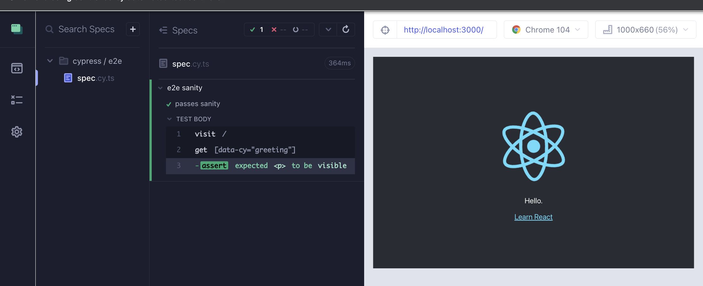
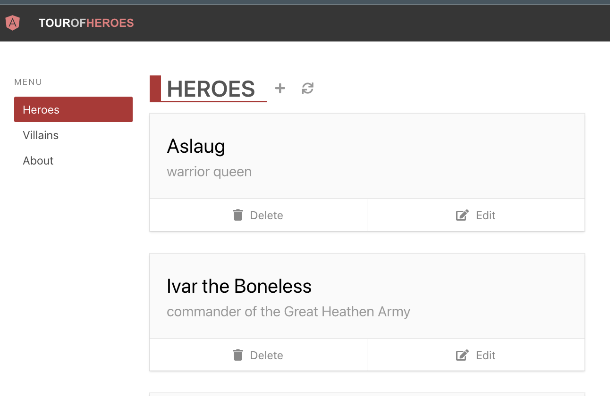
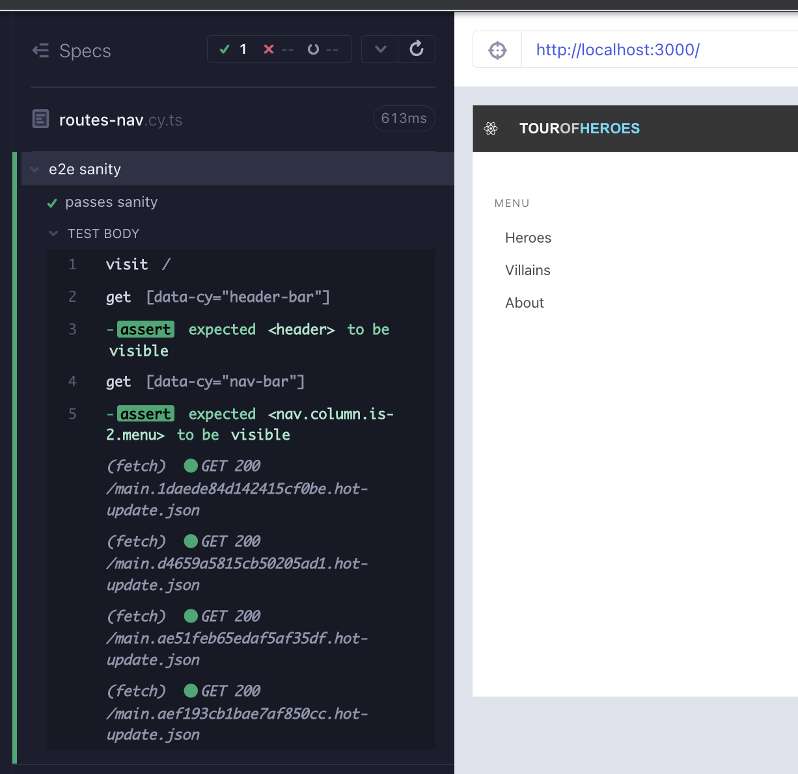
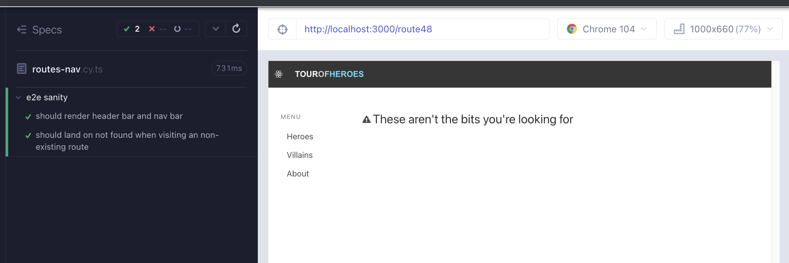
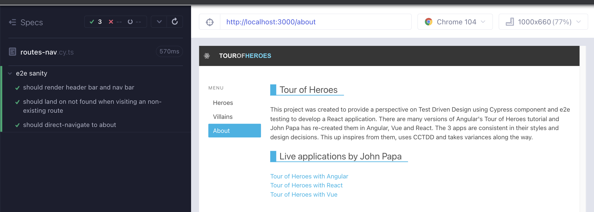
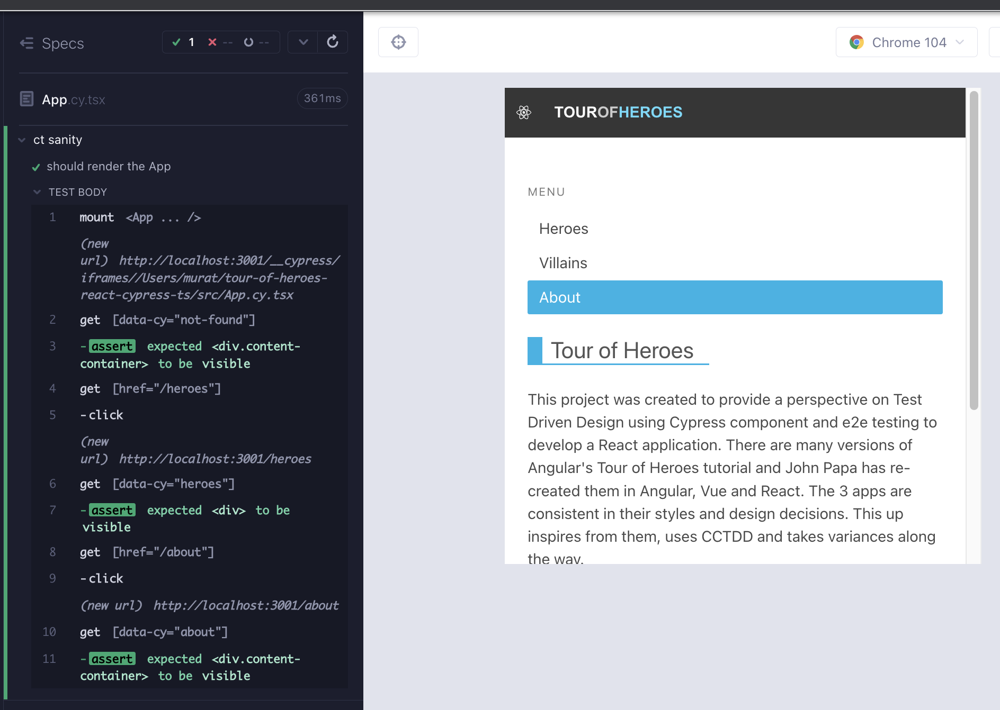

# react-router

`Heroes` bileşenimiz, rotaları kullanmaya ihtiyaç duyuyor, ancak uygulamamızda bunu henüz ayarlamadık. Şu ana kadar, her bileşen izole bir şekilde tasarlandı. Bu arada, gerçek uygulama genel bir sayfada başlatılır ve kullanıcı bununla çok fazla işlem yapamaz. Bu bölümde [`react-router`](https://reactrouter.com/en/v6.3.0/getting-started/overview) ayarlayacağız ve bunu test etmek için e2e kullanacağız.

> `react-router-dom` ve `react-router-native` `react-router` içindedir. Web uygulaması üzerinde çalıştığımız için `react-router-dom`'u `react-router` olarak adlandıracağız.

## e2e Kullanımı

Bileşenlerin içinde gezinme bağlantıları olan bileşenlerde, rotalama özelliğinin bir kısmını bileşen testinde test edebiliriz. `HeaderBar` ve `NavBar` bileşenlerinde bunların örneklerini uyguladık. Bunun ötesinde, rotayı test etmenin en güvenilir yolu e2e testler kullanmaktır çünkü uygulamanın rotalama özelliklerini ve olası akışlarını tamamen kapsamamızı sağlar.

e2e koşucusunu `yarn cy:open-e2e` ile başlatıyoruz. Bu komut, `localhost:3000` adresinde uygulamaya hizmet veren `yarn start` komutunu da çalıştırır. Şu anda, `spec` dosyasını çalıştırırken genel React uygulamasını görüyoruz. Bunu `routes-nav.cy.ts` olarak yeniden adlandırabiliriz.



Gereksinimimiz, uygulamamızı sunmak, bağlantılara tıklamak, doğru URL'lere gitmek ve ilgili bileşenleri işlemektir.

> Henüz Villains bileşenini uygulamadık, şimdilik bu sorun değil.

## 

Yukarıdan aşağıya doğru başlayarak, ilk başarısız testimiz `HeaderBar` bileşenini işlemek için (Kırmızı 1).

```tsx
// cypress/e2e/routes-nav.cy.ts
describe("e2e sanity", () => {
  it("passes sanity", () => {
    cy.visit("/");
    cy.getByCy("header-bar").should("be.visible");
  });
});
```

Diğer bileşenleri içeren bir bileşeni test ettiğimizde, çocuk bileşenin kaynağına ve bileşen testine bakmak gibi en iyi bir uygulama vardır. e2e ile uygulamayı test ederken de aynıdır. `src/components/HeaderBar.cy.tsx`, `HeaderBar`'ı monte ederken `BrowserRouter` ile sarmalar, bu da ana uygulamamızın da `BrowserRouter`'a ihtiyacı olduğu anlamına gelir (Yeşil 1).

```tsx
// src/App.tsx
import HeaderBar from "components/HeaderBar";
import { BrowserRouter } from "react-router-dom";
import "./styles.scss";

function App() {
  return (
    <BrowserRouter>
      <HeaderBar />
    </BrowserRouter>
  );
}

export default App;
```

İkinci gereklilik `NavBar` bileşenini göstermektir (Kırmızı 2).

```tsx
// cypress/e2e/routes-nav.cy.ts
describe("e2e sanity", () => {
  it("should render header bar and nav bar", () => {
    cy.visit("/");
    cy.getByCy("header-bar").should("be.visible");
    cy.getByCy("nav-bar").should("be.visible");
  });
});
```

`NavBar />`'ı uygulamamıza ekleyin ve test geçiyor (Yeşil 2).

```tsx
// src/App.tsx
import HeaderBar from "components/HeaderBar";
import NavBar from "components/NavBar";
import { BrowserRouter } from "react-router-dom";
import "./styles.scss";

function App() {
  return (
    <BrowserRouter>
      <HeaderBar />
      <NavBar />
    </BrowserRouter>
  );
}

export default App;
```

Özgün uygulamadan bazı css ekleyerek işlemeyi daha da düzgün hale getirebiliriz (Düzenleme 2).

```tsx
// src/App.tsx
import HeaderBar from "components/HeaderBar";
import NavBar from "components/NavBar";
import { BrowserRouter } from "react-router-dom";
import "./styles.scss";

function App() {
  return (
    <BrowserRouter>
      <HeaderBar />
      <div className="section columns">
        <NavBar />
      </div>
    </BrowserRouter>
  );
}
export default App;
```



`NavBar.cy.tsx`'ye baktığımızda kahramanlar, kötü adamlar ve hakkında tıklama navigasyonunu zaten kapsadığımızı görüyoruz. Bu testi e2e'de tekrarlamamıza gerek yok. Daha düşük seviyedeki testlerin kapsamını her zaman kontrol edin ve daha yüksek seviyede çaba harcamaktansa çabayı çoğaltmamayı tercih edin, çünkü bu daha fazla maliyet getirebilir ama ekstra güven sağlamayabilir.

e2e veya bileşen testleri kullanıyor olsanız bile, TDD'nin akışı aynıdır; başarısız olan bir şeyle başlayın, çalışacak şekilde en aza indirgeyin ve ardından daha iyi hale getirin. Ana ayrım ölçektir; e2e ile daha küçük artımlı adımlara sahip olmak için daha dikkatli olmamız gerekiyor çünkü uygulamanın büyük ölçekteki etkisi daha yüksek olabilir ve başarısızlıkları teşhis etmeyi daha zor hale getirebilir. Test odaklı tasarımda uygulaması zor olan açık uygulama, bir seferde çok küçük artımlı testler yazmaktır.

## Yönlendirme

Mevcut olmayan bir rotayı ziyaret ettiğimizde `NotFound` bileşenini işleyip işlemediğimizi kontrol eden başarısız bir test yazın (Kırmızı 3).

```tsx
// cypress/e2e/routes-nav.cy.ts
describe("e2e sanity", () => {
  it("should render header bar and nav bar", () => {
    cy.visit("/");
    cy.getByCy("header-bar").should("be.visible");
    cy.getByCy("nav-bar").should("be.visible");
  });
  it("should land on not found when visiting an non-existing route", () => {
    cy.visit("/route48");
    cy.getByCy("not-found").should("be.visible");
  });
});
```

`react-router` kullanmak için bileşenimizi bir `Routes` bileşeniyle sarmalamanız ve içe aktarmanız gerekir. Her bileşen, bir `Route` bileşenindeki bir `element` özelliği olur. Bileşeni bir `path` özelliğine eşleriz. `*` ise diğer yollara uymayan her şeyin buna yönlendirileceği anlamına gelir (Yeşil 3).

```tsx
// src/App.tsx
import HeaderBar from "components/HeaderBar";
import NavBar from "components/NavBar";
import NotFound from "components/NotFound";
import { BrowserRouter, Routes, Route } from "react-router-dom";
import "./styles.scss";

function App() {
  return (
    <BrowserRouter>
      <HeaderBar />
      <div className="section columns">
        <NavBar />
        <Routes>
          <Route path="*" element={<NotFound />} />
        </Routes>
      </div>
    </BrowserRouter>
  );
}
export default App;
```

`react-router` kullanarak render'ı biraz daha geliştirebiliriz (Refactor 3).

```tsx
// src/App.tsx
import HeaderBar from "components/HeaderBar";
import NavBar from "components/NavBar";
import NotFound from "components/NotFound";
import { BrowserRouter, Routes, Route } from "react-router-dom";
import "./styles.scss";

function App() {
  return (
    <BrowserRouter>
      <HeaderBar />
      <div className="section columns">
        <NavBar />
        <main className="column">
          <Routes>
            <Route path="*" element={<NotFound />} />
          </Routes>
        </main>
      </div>
    </BrowserRouter>
  );
}

export default App;
```



`About` bileşenini ekleyerek yol ayarını biraz daha ilginç hale getirelim. Aşağıdakileri `src/About.tsx`'ye kopyalayın.

```tsx
// src/About.tsx
import React from "react";

const About = () => (
  <div data-cy="about" className="content-container">
    <div className="content-title-group not-found">
      <h2 className="title">Tour of Heroes</h2>
      <p>
        This project was created to provide a perspective on Test Driven Design
        using Cypress component and e2e testing to develop a React application.
        There are many versions of Angular's Tour of Heroes tutorial and John
        Papa has re-created them in Angular, Vue and React. The 3 apps are
        consistent in their styles and design decisions. This one inspires from
        them, uses CCTDD and takes variances along the way.
      </p>

      </br>
      <h2 className="title">Live applications by John Papa</h2>

      <ul>
        <li>
          <a href="https://papa-heroes-angular.azurewebsites.net">
            Tour of Heroes with Angular
          </a>
        </li>
        <li>
          <a href="https://papa-heroes-react.azurewebsites.net">
            Tour of Heroes with React
          </a>
        </li>
        <li>
          <a href="https://papa-heroes-vue.azurewebsites.net">
            Tour of Heroes with Vue
          </a>
        </li>
      </ul>
    </div>
  </div>
);

export default About;
```

Şimdi yola doğrudan gitmeyi test eden başarısız bir test yazabiliriz. `NavBar` bileşen testinde tıklama-nav sürümünü zaten yazdık ve bunu e2e'de tekrar etmiyoruz (Kırmızı 4).

```tsx
// cypress/e2e/routes-nav.cy.ts
describe("e2e sanity", () => {
  it("should render header bar and nav bar", () => {
    cy.visit("/");
    cy.getByCy("header-bar").should("be.visible");
    cy.getByCy("nav-bar").should("be.visible");
  });
  it("should land on not found when visiting an non-existing route", () => {
    cy.visit("/route48");
    cy.getByCy("not-found").should("be.visible");
  });

  it("should direct-navigate to about", () => {
    cy.visit("/about");
    cy.getByCy("about").contains("CCTDD");
  });
});
```

`About` bileşenini `/about` yoluna ayarlayarak testi geçerli hale getiriyoruz (Yeşil 4).

```tsx
// src/App.tsx
import About from "About";
import HeaderBar from "components/HeaderBar";
import NavBar from "components/NavBar";
import NotFound from "components/NotFound";
import { BrowserRouter, Routes, Route } from "react-router-dom";
import "./styles.scss";

function App() {
  return (
    <BrowserRouter>
      <HeaderBar />
      <div className="section columns">
        <NavBar />
        <main className="column">
          <Routes>
            <Route path="/about" element={<About />} />
            <Route path="*" element={<NotFound />} />
          </Routes>
        </main>
      </div>
    </BrowserRouter>
  );
}

export default App;
```



test eklemeyi düşünmek istiyoruz. URL kontrollerini ekleyerek testleri, bir url'ye yönlendirirken bileşen render'ının yanı sıra destekleyebiliriz (Refactor 4).

```tsx
// cypress/e2e/routes-nav.cy.ts
describe("e2e sanity", () => {
  it("should render header bar and nav bar", () => {
    cy.visit("/");
    cy.getByCy("header-bar").should("be.visible");
    cy.getByCy("nav-bar").should("be.visible");
  });
  it("should land on not found when visiting an non-existing route", () => {
    const route = "/route48";
    cy.visit(route);
    cy.location('pathname').should('eq', route);
    cy.getByCy("not-found").should("be.visible");
  });

  it("should direct-navigate to about", () => {
    const route = "/about";
    cy.visit(route);
    cy.location('pathname').should('eq' route);
    cy.getByCy("about").contains("CCTDD");
  });
});
```

Uygulamamız için varsayılan URL'nin ne olması gerektiği konusunda bir soru sormak istiyoruz. En karmaşık bileşen `Heroes` olduğundan, bu uygun bir seçimdir. Boş bir yola gidildiğinde `/heroes` yoluna yönlendirilmek ve `Heroes` bileşenini görüntülemek istiyoruz. Bu ihtiyaca yönelik başarısız bir test ekleyelim (Kırmızı 5).

```tsx
// cypress/e2e/routes-nav.cy.ts
describe("e2e sanity", () => {
  it("should render header bar and nav bar", () => {
    cy.visit("/");
    cy.getByCy("header-bar").should("be.visible");
    cy.getByCy("nav-bar").should("be.visible");

    cy.location('pathname').should('eq' "heroes");
  });
  it("should land on not found when visiting an non-existing route", () => {
    const route = "/route48";
    cy.visit(route);
    cy.location('pathname').should('eq' route);
    cy.getByCy("not-found").should("be.visible");
  });

  it("should direct-navigate to about", () => {
    const route = "/about";
    cy.visit(route);
    cy.location('pathname').should('eq' route);
    cy.getByCy("about").contains("CCTDD");
  });
});
```

`react-router`da bu özelliği kullanmanın yolu `Navigate` bileşenini kullanmaktır. Şimdi, yönlendirilebilecek `/heroes` yoluna da ihtiyacımız var (Yeşil 5).

```tsx
// src/App.tsx
import About from "About";
import HeaderBar from "components/HeaderBar";
import NavBar from "components/NavBar";
import NotFound from "components/NotFound";
import Heroes from "heroes/Heroes";
import { BrowserRouter, Routes, Route, Navigate } from "react-router-dom";
import "./styles.scss";

function App() {
  return (
    <BrowserRouter>
      <HeaderBar />
      <div className="section columns">
        <NavBar />
        <main className="column">
          <Routes>
            <Route path="/" element={<Navigate replace to="/heroes" />} />
            <Route path="/heroes" element={<Heroes />} />
            <Route path="/about" element={<About />} />
            <Route path="*" element={<NotFound />} />
          </Routes>
        </main>
      </div>
    </BrowserRouter>
  );
}

export default App;
```

İlk testi, `HeaderBar` ve `NavBar`ın tüm yönlendirme testlerinde doğru olduğunu kontrol eden testi değiştirebiliriz. Burada, yönlendirmeye yönelik yeni bir test yazmak yerine testi değiştirmek tercih edilir. Mevcut testi değiştirmek için fırsatlar arayın, yeni özellikler için kısmen yinelenen testler yazmak yerine. Bir test açısından önemli olan şey, bir testin başlangıç durumudur; bu duruma ulaşmak ortaksa, o zaman bu test iyileştirmesi için bir fırsattır ve kısmi test çoğaltma yerine. Ayrıca `/heroes` rotası için doğrudan gezinme işlevselliğini kontrol eden yeni bir test ekleyebiliriz (Refactor 5).

```tsx
// cypress/e2e/routes-nav.cy.ts
describe("Routes and navigation", () => {
  it("should land on baseUrl, redirect to /heroes", () => {
    cy.visit("/");
    cy.getByCy("header-bar").should("be.visible");
    cy.getByCy("nav-bar").should("be.visible");

    cy.location('pathname').should('eq' "/heroes");
    cy.getByCy("heroes").should("be.visible");
  });

  it("should direct-navigate to /heroes", () => {
    const route = "/heroes";
    cy.visit(route);
    cy.location('pathname').should('eq' route);
    cy.getByCy("heroes").should("be.visible");
  });

  it("should land on not found when visiting an non-existing route", () => {
    const route = "/route48";
    cy.visit(route);
    cy.location('pathname').should('eq' route);
    cy.getByCy("not-found").should("be.visible");
  });

  it("should direct-navigate to about", () => {
    const route = "/about";
    cy.visit(route);
    cy.location('pathname').should('eq' route);
    cy.getByCy("about").contains("CCTDD");
  });
});
```

Bu noktada başka hangi testleri düşünebiliriz? Rota geçmişi hakkında ne dersiniz? Bunun için düşük maliyetli ve güvenilir bir e2e testi ile kapsayabileceğimiz bir test ekleyebiliriz. Testi, kahramanlar -> kötü adamlar -> hakkında'dan farklı bir rota sırası kullanarak daha ilginç hale getirebiliriz (Refactor 5).

```tsx
// cypress/e2e/routes-nav.cy.ts
describe("e2e sanity", () => {
  it("should land on baseUrl, redirect to /heroes", () => {
    cy.visit("/");
    cy.getByCy("header-bar").should("be.visible");
    cy.getByCy("nav-bar").should("be.visible");

    cy.location('pathname').should('eq' "/heroes");
    cy.getByCy("heroes").should("be.visible");
  });

  it("should direct-navigate to /heroes", () => {
    const route = "/heroes";
    cy.visit(route);
    cy.location('pathname').should('eq' route);
    cy.getByCy("heroes").should("be.visible");
  });

  it("should land on not found when visiting an non-existing route", () => {
    const route = "/route48";
    cy.visit(route);
    cy.location('pathname').should('eq' route);
    cy.getByCy("not-found").should("be.visible");
  });

  it("should direct-navigate to about", () => {
    const route = "/about";
    cy.visit(route);
    cy.location('pathname').should('eq' route);
    cy.getByCy("about").contains("CCTDD");
  });

  it("should cover route history with browser back and forward", () => {
    cy.visit("/");
    const routes = ["villains", "heroes", "about"];
    cy.wrap(routes).each((route: string) =>
      cy.get(`[href="/${route}"]`).click()
    );

    const lastIndex = routes.length - 1;
    cy.location('pathname').should('eq' routes[lastIndex]);
    cy.go("back");
    cy.location('pathname').should('eq' routes[lastIndex - 1]);
    cy.go("back");
    cy.location('pathname').should('eq' routes[lastIndex - 2]);
    cy.go("forward").go("forward");
    cy.location('pathname').should('eq' routes[lastIndex]);
  });
});
```

## Bileşen testi kullanma

Doğrudan gezinme ve yönlendirme ile ilgili testler konusunda e2e ile çok güveniyoruz. Ayrıca `src/components/NotFound.cy.tsx` dosyasında tıklama ile gezinmeyi de ele aldık. Bir bileşen testinde, url bağlanma sırasında mevcut değildir ve `cy.visit` kullanamayız. Ancak tıklama ile gezinme kullanabiliriz. `App.cy.tsx` dosyasını bu şekilde güncelleyebiliriz. Cypress koşucusundan bileşen testine geçin veya `yarn cy:open-ct` ile başlatın.

```tsx
import App from "./App";

describe("ct sanity", () => {
  it("should render the App", () => {
    cy.mount(<App />);
    cy.getByCy("not-found").should("be.visible");

    cy.getByCy("nav-bar").within(() => {
      cy.contains("p", "Menu");

      const routes = ["heroes", "villains", "about"];
      cy.getByCy("menu-list").children().should("have.length", routes.length);

      routes.forEach((route: string) => {
        cy.get(`[href="/${route}"]`)
          .contains(route, { matchCase: false })
          .click()
          .should("have.class", "active-link")
          .siblings()
          .should("not.have.class", "active-link");

        cy.location("pathname").should("eq", route);
      });
    });
  });
});
```

Bağlanma işlemi sırasında url'nin belirsiz olduğunu `cy.getByCy('not-found').should('be.visible')` kullanarak kontrol ediyoruz. Geri kalan test, `src/components/NotFound.cy.tsx` dosyasından kopyalanan ve yapıştırılan bir kısımdır. Bunun yerine, App bileşeninin alt bileşenlerinin render'ını kontrol edebiliriz.

```tsx
import App from "./App";

describe("ct sanity", () => {
  it("should render the App", () => {
    cy.mount(<App />);
    cy.getByCy("not-found").should("be.visible");

    cy.contains("Heroes").click();
    cy.getByCy("heroes").should("be.visible");

    cy.contains("About").click();
    cy.getByCy("about").should("be.visible");
  });
});
```



Bu test, mevcut e2e ve bileşen testlerinin üzerinde fazladan bir güven sağlamaz çünkü ekstra bir şey yapmaz. En iyisi, akıl sağlığı testi olarak hizmet edebilir. Şimdilik Cypress bileşen testini React Testing Library ile karşılaştıran yan projede saklayacağız. İşte aynı testin başlangıç RTL kopyası.

```tsx
// src/App.test.tsx
import { render, screen } from "@testing-library/react";
import userEvent from "@testing-library/user-event";
import App from "./App";

test("renders tour of heroes", async () => {
  render(<App />);

  await userEvent.click(screen.getByText("About"));
  expect(screen.getByTestId("about")).toBeVisible();

  await userEvent.click(screen.getByText("Heroes"));
  expect(screen.getByTestId("heroes")).toBeVisible();
});

// CT vs RTL: src/App.cy.tsx
```

`src/setupTests.ts` dosyasını güncelleyin ve varsayılan test kimliği seçiciyi `data-cy` olarak yeniden yazın.

```tsx
// src/setupTests.ts
import "@testing-library/jest-dom";

import { configure } from "@testing-library/react";

configure({ testIdAttribute: "data-cy" });
```

Birim testini `yarn test` ile çalıştırın.

## Özet

Uygulama hizmete sunulduğunda ana bileşenlerin bazılarını oluşturup oluşturamadığımızı kontrol etmek için bir e2e testi yazdık (Kırmızı 1, Kırmızı 2)

Testleri geçmek için ana bileşeni saran `BrowserRouter` ekledik (Yeşil 1, Yeşil 2).

Stil ekledik (Düzenleme 2).

</br>

Geçersiz bir rota için başarısız olan bir test ekledik ve `NotFound` bileşenini oluşturduk (Kırmızı 3).

Rota kurulumunun temelini oluşturduk; `NotFound` öğesi olan Route bileşenini saran Routes bileşeni (Yeşil 3).

Stil ekledik (Düzenleme 3).

</br>

/about rotaları için doğrudan bir navigasyon testi ekledik (Kırmızı 4).

`About` bileşeni için rotayı ayarladık (Yeşil 4).

</br>

Uygulamanın başlangıç yönlendirmesini /heroes'tan (Kırmızı 5) kontrol etmek için bir test ekledik.

`Navigate` ile rotaların ayarını geliştirdik (Yeşil 5).

Doğrudan /heroes'a yönlendirmeyi kontrol etmek için bir test ekledik ve rota geçmişini test etmek için başka bir test ekledik (Düzenleme 5).

</br>

`App.cy.tsx` adlı testi inceledik ve test çoğaltma konusunu tartıştık. Testin, başka bir bileşen testi veya e2e testinden başka bir şey yapmadığı halde, mantıklı olduğuna karar verdik. Başka bir neden ise, CT ile RTL arasındaki 1: 1 karşılaştırmalarını incelemeye başlamaktı. App RTL testini, App mantıklı bileşen testini yansıtacak şekilde güncelledik.

### Çıkarılacak Dersler

- E2e testi, uygulamanın yönlendirme özelliklerini ve olası akışları daha iyi bir şekilde kapsamamıza olanak tanır.
- E2e veya bileşen testleri kullanıyor olun, TDD'nin temel fikri aynıdır; başarısız olan bir şeyle başlayın, çalışmasını sağlamak için minimumu yapın ve ardından daha iyi hale getirin.
- Test odaklı tasarımda uygulamaya açık ama zor olan uygulama, bir seferde çok küçük artımlı testler yazmaktır. Değişikliklerin daha yüksek etki yarıçapı nedeniyle, e2e testlerle daha küçük artışları daha dikkatli değerlendirin.
- Başka bileşenleri içeren bir bileşeni test ettiğimizde, çocuk bileşen kaynağına ve bileşen testine bakın. Aynı kural e2e için de geçerlidir. Daha düşük seviyeli testlerin kapsamını her zaman kontrol edin ve çaba sarf etmeyi yüksek seviyede tekrarlamaktan kaçının, çünkü ekstra maliyeti olacaktır ancak ekstra güvence sağlamayabilir.
- Geçerli testlerimiz olduğunda, daha fazla kaynak kodu eklemekten önce refactor yapmayı veya daha fazla test eklemeyi tercih ederiz.
- Zaten mevcut olan testi değiştirmek için fırsatlar arayın, yeni özellikler için kısmen yinelenen testler yazmak yerine. Bir test açısından önemli olan şey, bir testin başlangıç durumudur; bu duruma ulaşmak yaygın ise, bu, testin iyileştirilmesi veya kısmi test çoğaltması açısından bir fırsattır.
