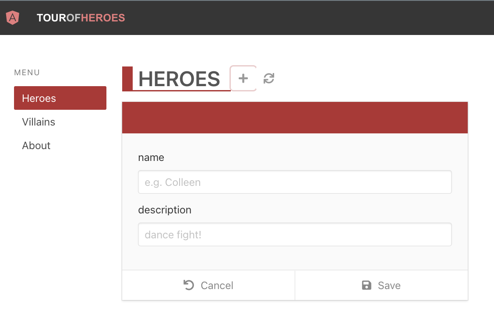
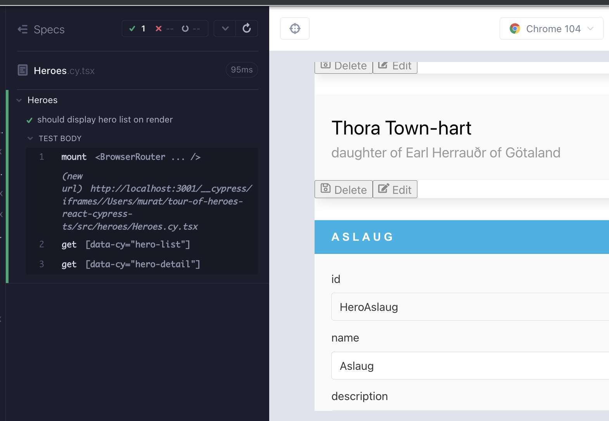
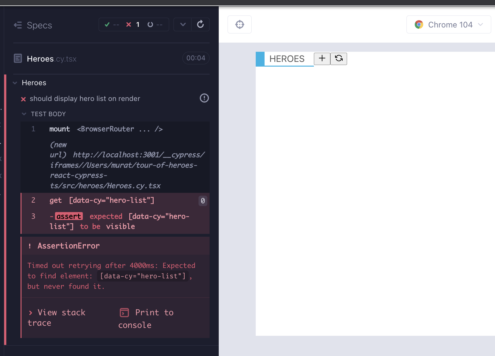
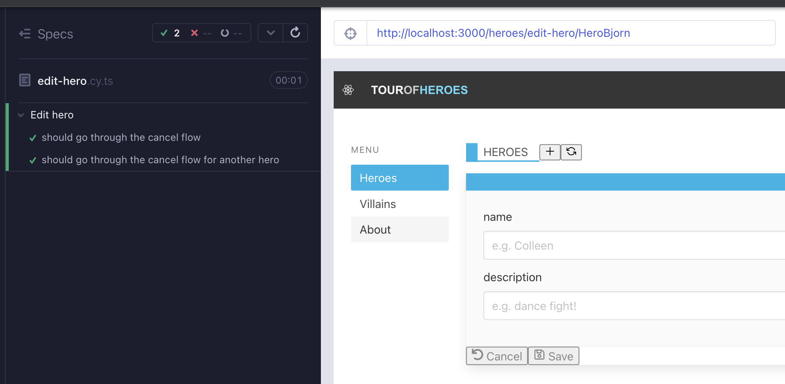
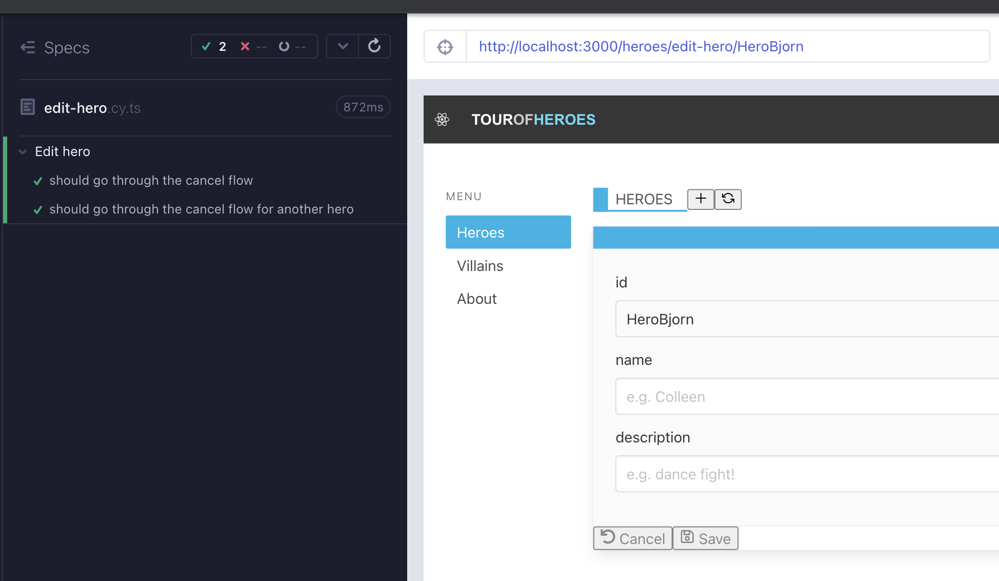
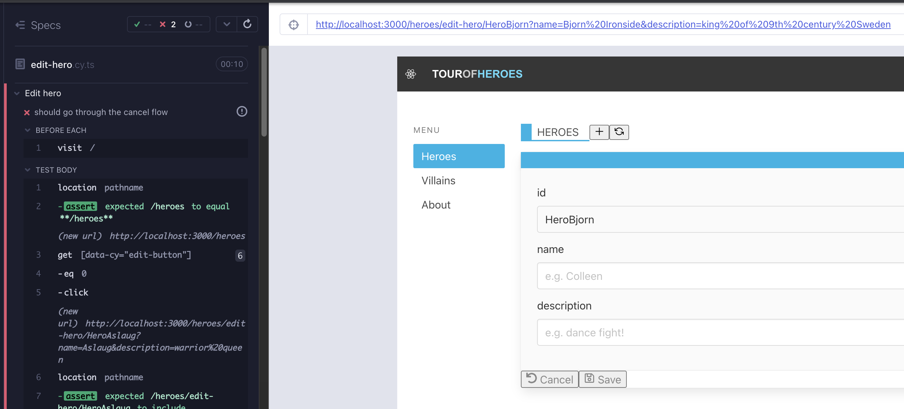
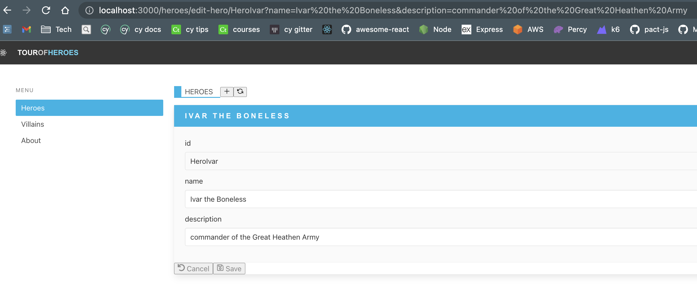

# Heroes 2.bölüm - react-router

`Heroes` bileşenine geri döndük ve bu sefer yönlendirme özelliklerine sahibiz. İlk render'da `Heroes`, alt `HeroList` bileşenini gösterir. `ListHeader`daki + düğmesine tıklayarak `HeroDetail`i görüntüleyebilmemiz gerekiyor. Daha sonra `ListHeader`daki yenileme düğmesine tıkladığında `HeroList`i tekrar görüntülememiz gerekiyor. `Cancel` düğmesi `HeroDetail`den `HeroList`e geri dönmelidir. Yeni bir dal oluşturun `feat/Heroes-part2`



Şimdilik, rotaya bağlı olarak `HeroList` ve `HeroDetail` arasında geçiş yapmak yerine, her ikisini bir arada gösterelim. Testi yazalım (Red 1).

```tsx
// src/heroes/Heroes.cy.tsx
import Heroes from "./Heroes";
import { BrowserRouter } from "react-router-dom";
import "../styles.scss";

describe("Heroes", () => {
  it("should handle hero add and refresh", () => {
    cy.window()
      .its("console")
      .then((console) => cy.spy(console, "log").as("log"));

    cy.mount(
      <BrowserRouter>
        <Heroes />
      </BrowserRouter>
    );

    cy.getByCy("list-header");
    cy.getByCy("add-button").click();
    cy.get("@log").should("have.been.calledWith", "handleAdd");
    cy.getByCy("refresh-button").click();
    cy.get("@log").should("have.been.calledWith", "handleRefresh");
  });

  it.only("should display hero list on render", () => {
    cy.mount(
      <BrowserRouter>
        <Heroes />
      </BrowserRouter>
    );

    cy.getByCy("hero-list");
    cy.getByCy("hero-detail");
  });

  const invokeHeroDelete = () => {
    cy.getByCy("delete-button").first().click();
    cy.getByCy("modal-yes-no").should("be.visible");
  };
  it("should go through the modal flow", () => {
    cy.window()
      .its("console")
      .then((console) => cy.spy(console, "log").as("log"));

    cy.mount(
      <BrowserRouter>
        <Heroes />
      </BrowserRouter>
    );

    cy.getByCy("modal-yes-no").should("not.exist");

    cy.log("do not delete flow");
    invokeHeroDelete();
    cy.getByCy("button-no").click();
    cy.getByCy("modal-yes-no").should("not.exist");

    cy.log("delete flow");
    invokeHeroDelete();
    cy.getByCy("button-yes").click();
    cy.getByCy("modal-yes-no").should("not.exist");
    cy.get("@log").should("have.been.calledWith", "handleDeleteFromModal");
  });
});
```

Testi geçmek için, `HeroList`in yanına `HeroDetail`i ekleyin. Geçici olarak `heroes` dizisinin 0. indeksi olan bir `hero` özelliği olabilir (Green 1).

```tsx
// src/heroes/Heroes.tsx
import ListHeader from "components/ListHeader";
import ModalYesNo from "components/ModalYesNo";
import HeroList from "./HeroList";
import heroes from "./heroes.json";
import { useState } from "react";
import HeroDetail from "./HeroDetail";

export default function Heroes() {
  const [showModal, setShowModal] = useState<boolean>(false);
  const addNewHero = () => console.log("handleAdd");
  const handleRefresh = () => console.log("handleRefresh");
  const handleCloseModal = () => {
    setShowModal(false);
  };
  const handleDeleteHero = () => {
    setShowModal(true);
  };
  const handleDeleteFromModal = () => {
    setShowModal(false);
    console.log("handleDeleteFromModal");
  };

  return (
    <div data-cy="heroes">
      <ListHeader
        title="Heroes"
        handleAdd={addNewHero}
        handleRefresh={handleRefresh}
      />
      <div>
        <div>
          <HeroList heroes={heroes} handleDeleteHero={handleDeleteHero} />
          <HeroDetail hero={heroes[0]} />
        </div>
      </div>

      {showModal && (
        <ModalYesNo
          message="Would you like to delete the hero?"
          onNo={handleCloseModal}
          onYes={handleDeleteFromModal}
        />
      )}
    </div>
  );
}
```



## [`useNavigate`](https://reactrouter.com/en/main/hooks/use-navigate)

Yolu değiştirdiğinde görüntülenen bileşeni değiştirmek istiyoruz. React'te bunu yönlendiren şey, önce yol, ardından alt bileşendir, `react-router` bölümünde gördüğümüz gibi. Bir bileşen testinde başlangıçta url yoktur, ancak bir bağlantıya tıkladığında yol değişir. Yolu kontrol etmek için yenileme ve + düğmeleri ile testi kullanabiliriz. Bu testte yolu kontrol etmek için `cy.location` kullanacağız. İşte [Gleb Bahmutov'un Cypress ipuçlarından](https://glebbahmutov.com/cypress-examples/9.7.0/commands/location.html#cy-hash) bir alıntı:

```tsx
cy.visit("https://example.cypress.io/commands/location?search=value#top");
// yields a specific part of the location
cy.location("protocol").should("equal", "https:");
cy.location("hostname").should("equal", "example.cypress.io");
cy.location("pathname").should("equal", "/commands/location");
cy.location("search").should("equal", "?search=value");
cy.location("hash").should("equal", "#top");
```

Kısalık adına, test kodunu `.only` bölümüne odaklı tutacağız. Yenileme düğmesine tıklayarak yolun `/heroes` olmasını kontrol eden bir test yazıyoruz (Red 2).

```tsx
// src/heroes/Heroes.cy.tsx
it.only("should display hero list on render", () => {
  cy.mount(
    <BrowserRouter>
      <Heroes />
    </BrowserRouter>
  );

  cy.getByCy("hero-list");
  cy.getByCy("hero-detail");
  cy.getByCy("refresh-button").click();
  cy.location("pathname").should("eq", "/heroes");
});
```

Test başarısız oldu, ancak konsolda `handleRefresh` günlüğünü görüyoruz. Günlüğün yerine, url'yi değiştiren bir şey kullanabiliriz. React-router'ın [`useNavigate`](https://reactrouter.com/en/v6.3.0/api#usenavigate) işlevi, programlamalı olarak herhangi bir url'ye yönlendirmemize olanak tanır (Green 2).

```tsx
// src/heroes/Heroes.tsx
import { useNavigate } from "react-router-dom";
import ListHeader from "components/ListHeader";
import ModalYesNo from "components/ModalYesNo";
import HeroList from "./HeroList";
import heroes from "./heroes.json";
import { useState } from "react";
import HeroDetail from "./HeroDetail";

export default function Heroes() {
  const [showModal, setShowModal] = useState<boolean>(false);
  const addNewHero = () => console.log("handleAdd");
  const navigate = useNavigate();
  const handleRefresh = () => navigate("/heroes");

  const handleCloseModal = () => {
    setShowModal(false);
  };
  const handleDeleteHero = () => {
    setShowModal(true);
  };
  const handleDeleteFromModal = () => {
    setShowModal(false);
    console.log("handleDeleteFromModal");
  };

  return (
    <div data-cy="heroes">
      <ListHeader
        title="Heroes"
        handleAdd={addNewHero}
        handleRefresh={handleRefresh}
      />
      <div>
        <div>
          <HeroList heroes={heroes} handleDeleteHero={handleDeleteHero} />
          <HeroDetail hero={heroes[0]} />
        </div>
      </div>

      {showModal && (
        <ModalYesNo
          message="Would you like to delete the hero?"
          onNo={handleCloseModal}
          onYes={handleDeleteFromModal}
        />
      )}
    </div>
  );
}
```

Şimdi ekle düğmesine tıklayarak url'yi kontrol etmek için başka bir test deneyebiliriz. Yolun `add-hero` olmasını istiyoruz (Red 3).

```tsx
// src/heroes/Heroes.cy.tsx
it.only("should display hero list on render", () => {
  cy.mount(
    <BrowserRouter>
      <Heroes />
    </BrowserRouter>
  );

  cy.getByCy("hero-list");
  cy.getByCy("hero-detail");

  cy.getByCy("refresh-button").click();
  cy.location("pathname").should("eq", "/heroes");

  cy.getByCy("add-button").click();
  cy.location("pathname").should("eq", "/heroes/add-hero");
});
```

Önceki döngüye benzer şekilde, `handleAdd`'ın console.logged olduğunu görüyoruz. Bir kez daha `useNavigate` kullanabiliriz (Yeşil 3).

```tsx
// src/heroes/Heroes.tsx
import { useNavigate } from "react-router-dom";
import ListHeader from "components/ListHeader";
import ModalYesNo from "components/ModalYesNo";
import HeroList from "./HeroList";
import heroes from "./heroes.json";
import { useState } from "react";
import HeroDetail from "./HeroDetail";

export default function Heroes() {
  const [showModal, setShowModal] = useState<boolean>(false);
  const navigate = useNavigate();
  const addNewHero = () => navigate("/heroes/add-hero");
  const handleRefresh = () => navigate("/heroes");

  const handleCloseModal = () => {
    setShowModal(false);
  };
  const handleDeleteHero = () => {
    setShowModal(true);
  };
  const handleDeleteFromModal = () => {
    setShowModal(false);
    console.log("handleDeleteFromModal");
  };

  return (
    <div data-cy="heroes">
      <ListHeader
        title="Heroes"
        handleAdd={addNewHero}
        handleRefresh={handleRefresh}
      />
      <div>
        <div>
          <HeroList heroes={heroes} handleDeleteHero={handleDeleteHero} />
          <HeroDetail hero={heroes[0]} />
        </div>
      </div>

      {showModal && (
        <ModalYesNo
          message="Would you like to delete the hero?"
          onNo={handleCloseModal}
          onYes={handleDeleteFromModal}
        />
      )}
    </div>
  );
}
```

Yol adlarımız iyi görünüyor, ancak ihtiyacımız olan şey, rotaya bağlı olarak farklı bileşenlerin görüntülenmesi.

## `react-router` soyut rotalar

1. İlk işlemde `HeroList`'i görmek istiyoruz.
2. `ListHeader`'daki ekle düğmesine tıkladığında, `HeroDetail`'i görmek istiyoruz.
3. `ListHeader`'daki yenile düğmesine tıkladığında tekrar `HeroList`'i görmek istiyoruz, böyle devam eder.

Burada biraz React Router v6 bilgisine ihtiyacımız var. Üst düzey uygulama bileşenindeki `react-router` kurulumunu hatırlayın. Burada `/heroes` rotası ile ilgileniyoruz. Yol adı sadece `/heroes` olduğunda `HeroesList`'i görüntülemek istiyoruz, `/heroes/add-hero` olduğunda `HeroDetail`'i görüntülemek istiyoruz. Bu, `/heroes` için soyut bir rota gerektireceği anlamına gelir.

```tsx
// src/App.tsx
import About from "About";
import HeaderBar from "components/HeaderBar";
import NavBar from "components/NavBar";
import NotFound from "components/NotFound";
import Heroes from "heroes/Heroes";
import { BrowserRouter, Routes, Route, Navigate } from "react-router-dom";
import "./styles.scss";

function App() {
  return (
    <BrowserRouter>
      <HeaderBar />
      <div className="section columns">
        <NavBar />
        <main className="column">
          <Routes>
            <Route path="/" element={<Navigate replace to="/heroes" />} />
            {/* WE ARE CONCERNED ABOUT HEROES ROUTE */}
            <Route path="/heroes" element={<Heroes />} />
            <Route path="/about" element={<About />} />
            <Route path="*" element={<NotFound />} />
          </Routes>
        </main>
      </div>
    </BrowserRouter>
  );
}

export default App;
```

`react-router v6`'da, bir rotanın soyut ağacında başka bir `<Routes>` olduğunda sonunda `*`'a ihtiyacımız var. Bu durumda, soyut `<Routes>` kalan yol adı kısmını eşleştirir. `App.tsx` dosyasındaki `path="/heroes"` özelliğini `path="heroes/*"` olarak değiştirmemiz gerekiyor. Bu, ekleyeceğimiz soyut `Routes` bileşeninin rota kontrolünü devralmasına izin verecektir.

```tsx
// src/App.tsx
import About from "About";
import HeaderBar from "components/HeaderBar";
import NavBar from "components/NavBar";
import NotFound from "components/NotFound";
import Heroes from "heroes/Heroes";
import { BrowserRouter, Routes, Route, Navigate } from "react-router-dom";
import "./styles.scss";

function App() {
  return (
    <BrowserRouter>
      <HeaderBar />
      <div className="section columns">
        <NavBar />
        <main className="column">
          <Routes>
            <Route path="/" element={<Navigate replace to="/heroes" />} />
            <Route path="/heroes/*" element={<Heroes />} />
            <Route path="/about" element={<About />} />
            <Route path="*" element={<NotFound />} />
          </Routes>
        </main>
      </div>
    </BrowserRouter>
  );
}

export default App;
```

`Heroes` bileşeninde ihtiyacımız olan şey şu:

```tsx
<HeroList heroes={heroes} handleDeleteHero={handleDeleteHero} />
<HeroDetail hero={heroes[0]} />
```

Bunu şuna dönüştürmek:

```tsx
<Routes>
  <Route
    path=""
    element={<HeroList heroes={heroes} handleDeleteHero={handleDeleteHero} />}
  />

  <Route path="/add-hero" element={<HeroDetail />} />
</Routes>
```

Rota `/heroes` ise, `HeroList`'i görüntüleriz.

Rota `/heroes/add-hero` ise, `HeroDetail`'i görüntüleriz.

```tsx
// src/heroes/Heroes.tsx
import { Route, Routes, useNavigate } from "react-router-dom";
import ListHeader from "components/ListHeader";
import ModalYesNo from "components/ModalYesNo";
import HeroList from "./HeroList";
import heroes from "./heroes.json";
import { useState } from "react";
import HeroDetail from "./HeroDetail";

export default function Heroes() {
  const [showModal, setShowModal] = useState<boolean>(false);
  const navigate = useNavigate();
  const addNewHero = () => navigate("/heroes/add-hero");
  const handleRefresh = () => navigate("/heroes");

  const handleCloseModal = () => {
    setShowModal(false);
  };
  const handleDeleteHero = () => {
    setShowModal(true);
  };
  const handleDeleteFromModal = () => {
    setShowModal(false);
    console.log("handleDeleteFromModal");
  };

  return (
    <div data-cy="heroes">
      <ListHeader
        title="Heroes"
        handleAdd={addNewHero}
        handleRefresh={handleRefresh}
      />
      <div>
        <div>
          <Routes>
            <Route
              path=""
              element={
                <HeroList heroes={heroes} handleDeleteHero={handleDeleteHero} />
              }
            />

            <Route path="/add-hero" element={<HeroDetail />} />
          </Routes>
        </div>
      </div>

      {showModal && (
        <ModalYesNo
          message="Would you like to delete the hero?"
          onNo={handleCloseModal}
          onYes={handleDeleteFromModal}
        />
      )}
    </div>
  );
}
```

Bu yapıyla 2 başarısızlık var; test hiçbir şey görüntülemediği için başarısız oluyor, TS `HeroDetail`'in tanımlı bir `hero` ile `hero` özelliğine sahip olmasını istediği için hata veriyor (Kırmızı 4).

`HeroDetail`'i iki koşulda kullanmak için ayarlamıştık; `heroId` alanını `heroId` varsa veya yoksa görüntülemek için kullanabiliriz. Bu nedenle, yeni bir kahraman eklemek için bileşeni kullanabilmeliyiz. Şimdilik özelliği isteğe bağlı yapabiliriz ve boş `id`, `name` ve `description` özelliklerine sahip varsayılan bir kahraman nesnesi oluşturabiliriz. Şimdilik `HeroDetail` şu şekilde:

```tsx
// src/heroes/HeroDetail.tsx
import InputDetail from "components/InputDetail";
import { useState, ChangeEvent } from "react";
import ButtonFooter from "components/ButtonFooter";
import { FaUndo, FaRegSave } from "react-icons/fa";

export type Hero = {
  id: string;
  name: string;
  description: string;
};
type HeroDetailProps = {
  hero?: Hero;
};

export default function HeroDetail({
  hero: initHero = {
    id: "",
    name: "",
    description: "",
  },
}: HeroDetailProps) {
  const [hero, setHero] = useState<Hero>({ ...initHero });

  const handleCancel = () => console.log("handleCancel");
  const updateHero = () => console.log("updateHero");
  const createHero = () => console.log("createHero");
  const handleSave = () => {
    console.log("handleSave");
    return hero.name ? updateHero() : createHero();
  };

  const handleNameChange = (e: ChangeEvent<HTMLInputElement>) => {
    console.log("handleNameChange");
    setHero({ ...hero, name: e.target.value });
  };
  const handleDescriptionChange = (e: ChangeEvent<HTMLInputElement>) => {
    console.log("handleDescriptionChange");
    setHero({ ...hero, description: e.target.value });
  };

  return (
    <div data-cy="hero-detail" className="card edit-detail">
      <header className="card-header">
        <p className="card-header-title">{hero.name}</p>
        &nbsp;
      </header>
      <div className="card-content">
        <div className="content">
          {hero.id && (
            <InputDetail
              name={"id"}
              value={hero.id}
              readOnly={true}
            ></InputDetail>
          )}
          <InputDetail
            name={"name"}
            value={hero.name}
            placeholder="e.g. Colleen"
            onChange={handleNameChange}
          ></InputDetail>
          <InputDetail
            name={"description"}
            value={hero.description}
            placeholder="e.g. dance fight!"
            onChange={handleDescriptionChange}
          ></InputDetail>
        </div>
      </div>
      <footer className="card-footer">
        <ButtonFooter
          label="Cancel"
          IconClass={FaUndo}
          onClick={handleCancel}
        />
        <ButtonFooter label="Save" IconClass={FaRegSave} onClick={handleSave} />
      </footer>
    </div>
  );
}
```

`HeroDetail.cy.tsx`'in o değişiklikten sonra geçiyor olması harika. Tek endişemiz, `Heroes` testimizi bozmuş olmamız.

```tsx
// src/heroes/Heroes.cy.tsx
it.only("should display hero list on render", () => {
  cy.mount(
    <BrowserRouter>
      <Heroes />
    </BrowserRouter>
  );

  cy.getByCy("hero-list").should("be.visible");

  cy.getByCy("add-button").click();
  cy.location("pathname").should("eq", "/heroes/add-hero");

  cy.getByCy("refresh-button").click();
  cy.location("pathname").should("eq", "/heroes");
});
```



`react-router` bölümünden hatırlayacağımız gibi, bir bileşen testi yollar hakkında fikir sahibi değildir ve teste tıklayarak gezinmediğimiz sürece, yol belirsizdir. Bu, geçersiz bir kahramanlar rotası için de bir test gerektirebilir; örneğin `heroes/foo42`. Böyle bir durum söz konusu olduğunda, var olmayan bir heroId arıyoruz, `HeroList`i görmek istiyoruz. Yolun * olduğu `HeroList`i oluşturan yeni bir `Route` öğesi eklememiz gerekiyor.

```tsx
// src/heroes/Heroes.tsx
import { useNavigate, Routes, Route, Navigate } from "react-router-dom";
import ListHeader from "components/ListHeader";
import ModalYesNo from "components/ModalYesNo";
import HeroList from "./HeroList";
import heroes from "./heroes.json";
import { useState } from "react";
import HeroDetail from "./HeroDetail";

export default function Heroes() {
  const [showModal, setShowModal] = useState<boolean>(false);
  const navigate = useNavigate();
  const addNewHero = () => navigate("/heroes/add-hero");
  const handleRefresh = () => navigate("/heroes");

  const handleCloseModal = () => {
    setShowModal(false);
  };
  const handleDeleteHero = () => {
    setShowModal(true);
  };
  const handleDeleteFromModal = () => {
    setShowModal(false);
    console.log("handleDeleteFromModal");
  };

  return (
    <div data-cy="heroes">
      <ListHeader
        title="Heroes"
        handleAdd={addNewHero}
        handleRefresh={handleRefresh}
      />
      <div>
        <div>
          <Routes>
            <Route
              path=""
              element={
                <HeroList heroes={heroes} handleDeleteHero={handleDeleteHero} />
              }
            />
            <Route path="/add-hero" element={<HeroDetail />} />
            <Route
              path="*"
              element={
                <HeroList heroes={heroes} handleDeleteHero={handleDeleteHero} />
              }
            />
          </Routes>
        </div>
      </div>

      {showModal && (
        <ModalYesNo
          message="Would you like to delete the hero?"
          onNo={handleCloseModal}
          onYes={handleDeleteFromModal}
        />
      )}
    </div>
  );
}
```

Bileşenin testte bağlantısı belirsiz olduğundan, url doğrulamayı da `HeroList`in oluşturulduğunu kontrol etmeye değiştirmeliyiz (Green 4).

```tsx
// src/heroes/Heroes.cy.tsx
it.only("should display the hero list on render", () => {
  cy.mount(
    <BrowserRouter>
      <Heroes />
    </BrowserRouter>
  );

  cy.getByCy("hero-list").should("be.visible");

  cy.getByCy("add-button").click();
  cy.location("pathname").should("eq", "/heroes/add-hero");

  cy.getByCy("refresh-button").click();
  cy.location("pathname").should("eq", "/heroes");
});
```

Bu değişiklik, testin çalışmasını sağlar, ancak süite ilk iki `it` bloğu arasında uyumlu bir anlam kazandırmaz. `handleAdd` ve `handleRefresh` üzerindeki `console.log`'ları kontrol etmek için yapılan ilk test artık geçerli değil ve artık gerekmeyecek çünkü rotayı `useNavigate` ile değiştiriyoruz. `useNavigate` üzerinde casusluk yapabiliriz, ancak bu uygulama detayı ve zaten url'nin değiştiğini kontrol ediyoruz; **daha yüksek seviyede, ekstra maliyet olmadan şeyleri daha iyi bir şekilde test ediyoruz**. İşte testin yeniden düzenlenmesi (Düzenleme 4):

```tsx
// src/heroes/Heroes.cy.tsx
import Heroes from "./Heroes";
import { BrowserRouter } from "react-router-dom";
import "../styles.scss";

describe("Heroes", () => {
  it("should display the hero list on render, and go through hero add & refresh flow", () => {
    cy.mount(
      <BrowserRouter>
        <Heroes />
      </BrowserRouter>
    );

    cy.getByCy("list-header").should("be.visible");
    cy.getByCy("hero-list").should("be.visible");

    cy.getByCy("add-button").click();
    cy.location("pathname").should("eq", "/heroes/add-hero");

    cy.getByCy("refresh-button").click();
    cy.location("pathname").should("eq", "/heroes");
  });

  const invokeHeroDelete = () => {
    cy.getByCy("delete-button").first().click();
    cy.getByCy("modal-yes-no").should("be.visible");
  };
  it("should go through the modal flow", () => {
    cy.window()
      .its("console")
      .then((console) => cy.spy(console, "log").as("log"));

    cy.mount(
      <BrowserRouter>
        <Heroes />
      </BrowserRouter>
    );

    cy.getByCy("modal-yes-no").should("not.exist");

    cy.log("do not delete flow");
    invokeHeroDelete();
    cy.getByCy("button-no").click();
    cy.getByCy("modal-yes-no").should("not.exist");

    cy.log("delete flow");
    invokeHeroDelete();
    cy.getByCy("button-yes").click();
    cy.getByCy("modal-yes-no").should("not.exist");
    cy.get("@log").should("have.been.calledWith", "handleDeleteFromModal");
  });
});
```

`react-router` bölümünde, yönlendirmeyi e2e testleri ile test etmenin en iyi yoluna karar verdik. Bileşenlerde yolları test ediyoruz, ancak yol değiştiğinde doğru alt bileşenin oluşturulup oluşturulmadığını test edemiyoruz. Benzer bir akışı kapsayan e2e testi başlatabiliriz, bu da gelecekte CRUD kahraman akışını kapsayan daha büyük bir test olarak hizmet edecektir. **Daha düşük seviyede test edemeyeceğimiz veya güvenle test edemeyeceğimiz bir işlevsellik olduğunda, test piramidinde yukarı çıkarız**, bu durumda bileşen testinden e2e testine. `yarn cy:open-e2e` ile e2e koşucusunu başlatın. `cypress/e2e/create-hero.cy.ts` adlı yeni bir e2e test oluşturun.

```tsx
// cypress/e2e/create-hero.cy.ts

describe("Create hero", () => {
  beforeEach(() => cy.visit("/"));
  it("should go through the refresh flow", () => {
    cy.location("pathname").should("eq", "/heroes");

    cy.getByCy("add-button").click();
    cy.location("pathname").should("eq", "/heroes/add-hero");
    cy.getByCy("hero-detail").should("be.visible");
    cy.getByCy("input-detail-id").should("not.exist");

    cy.getByCy("refresh-button").click();
    cy.location("pathname").should("eq", "/heroes");
    cy.getByCy("hero-list").should("be.visible");
  });
});
```

Bu test, `HeroDetail` bileşenin ekleme sırasında nasıl görüntülendiğini ve yeni bir kahraman olduğundan `id` alanı olmadan nasıl görüntüleneceğini kontrol etmemize olanak tanır. Yenileme kahramanı oluşturma akışı bize yeni bir fikir verir; arka uç çalışıyor olsun veya olmasın, kahraman düzenleme veya ekleme için iptal akışı da çalışmalıdır. Belirli bir dönüm noktasına ulaştıktan sonra, uçtan uca testler veya uygulamanın basitçe reklam amaçlı kullanımı genellikle bize yeni özellikler için fikirler sunar. Sonuçta bu, bilimsel yöntemdir, şimdi daha fazlasını biliyoruz ve daha fazlasını denemek için çalışabiliriz ve bu, TDD'nin arkasındaki orijinal düşünceyi ve çevikliği esas alır.

Düzenleme kahramanı iptal akışı için başarısız bir e2e testi ekleyelim (Kırmızı 5). `cypress/e2e/edit-hero.cy.ts` adında bir dosya oluşturun. Ekleme akışına benzer şekilde başlar, ancak Düzenle düğmesine tıklar ve ilgili bir rota içinde olmayı bekler.

```tsx
// cypress/e2e/edit-hero.cy.ts
describe("Edit hero", () => {
  beforeEach(() => cy.visit("/"));
  it("should go through the cancel flow", () => {
    cy.location("pathname").should("eq", "/heroes");

    cy.getByCy("edit-button").first().click();
    cy.location("pathname").should("eq", "/heroes/edit-hero/HeroAslaug");
  });
});
```

Uygulamamızdaki tıklama işleyicileriyle ne yapacağımızdan emin olmadığımızda, onları `console.log` ile başlattık. E2e testinin konsolunda `handleSelectHero`'yu görebiliriz. Bu işlev `HeroList` bileşeninde bulunmaktadır. Sadece onu, ana `Heroes` bileşeninde yaptığımız gibi `useNavigate` kullanacak şekilde geliştirmemiz gerekiyor (Yeşil 5).

```tsx
// src/heroes/HeroList.tsx
import { useNavigate } from "react-router-dom";
import CardContent from "components/CardContent";
import ButtonFooter from "components/ButtonFooter";
import { FaEdit, FaRegSave } from "react-icons/fa";
import { Hero } from "models/Hero";
type HeroListProps = {
  heroes: Hero[];
  handleDeleteHero: () => void; // TODO: consider better type
};

export default function HeroList({ heroes, handleDeleteHero }: HeroListProps) {
  const navigate = useNavigate();
  const handleSelectHero = () => navigate("/heroes/edit-hero/HeroAslaug");

  return (
    <ul data-cy="hero-list" className="list">
      {heroes.map((hero, index) => (
        <li data-cy={`hero-list-item-${index}`} key={hero.id}>
          <div className="card">
            <CardContent name={hero.name} description={hero.description} />
            <footer className="card-footer">
              <ButtonFooter
                label="Delete"
                IconClass={FaRegSave}
                onClick={handleDeleteHero}
              />
              <ButtonFooter
                label="Edit"
                IconClass={FaEdit}
                onClick={handleSelectHero}
              />
            </footer>
          </div>
        </li>
      ))}
    </ul>
  );
}
```

İlk kahramana gidebiliriz, ancak başka bir kahramana gidip doğru URL'de bitebilir miyiz? Bunu test etmek için bir test yazalım (Kırmızı 6).

```tsx
// cypress/e2e/edit-hero.cy.ts
describe("Edit hero", () => {
  beforeEach(() => cy.visit("/"));
  it("should go through the cancel flow", () => {
    cy.location("pathname").should("eq", "/heroes");

    cy.getByCy("edit-button").first().click();
    cy.location("pathname").should("eq", "/heroes/edit-hero/HeroAslaug");
  });
  it("should go through the cancel flow for another hero", () => {
    cy.location("pathname").should("eq", "/heroes");

    cy.getByCy("edit-button").eq(1).click();
    cy.location("pathname").should("eq", "/heroes/edit-hero/HeroBjorn");
  });
});
```

Test başarısız oluyor çünkü `react-router`ın rota parametresini bilmeye ihtiyacı var. `heroId` navigasyonundan daha iyi bir şey yapabilmemiz gerekiyor. Kahramanı düzenlerken, bu `heroId`'yi bileşene iletilen `heroes` özelliğinden alabilmeliyiz. `handleSelectHero`, `id`'yi bir argüman olarak almalı ve ona gitmelidir.

```tsx
const handleSelectHero = (heroId: string) =>
  navigate(`/heroes/edit-hero/${heroId}`);
```

Bu değişiklik, şimdi `handleSelectHero`'nun bir argüman beklemesi nedeniyle `ButtonFooer`'da bir tür hatasına neden oluyor. Bileşeni şu şekilde güncelleyebiliriz (Yeşil 6):

```tsx
// src/heroes/HeroList.tsx
import { useNavigate } from "react-router-dom";
import CardContent from "components/CardContent";
import ButtonFooter from "components/ButtonFooter";
import { FaEdit, FaRegSave } from "react-icons/fa";
import { Hero } from "models/Hero";
type HeroListProps = {
  heroes: Hero[];
  handleDeleteHero: () => void; // TODO: consider better type
};

export default function HeroList({ heroes, handleDeleteHero }: HeroListProps) {
  const navigate = useNavigate();
  const handleSelectHero = (heroId: string) =>
    navigate(`/heroes/edit-hero/${heroId}`);

  return (
    <ul data-cy="hero-list" className="list">
      {heroes.map((hero, index) => (
        <li data-cy={`hero-list-item-${index}`} key={hero.id}>
          <div className="card">
            <CardContent name={hero.name} description={hero.description} />
            <footer className="card-footer">
              <ButtonFooter
                label="Delete"
                IconClass={FaRegSave}
                onClick={handleDeleteHero}
              />
              <ButtonFooter
                label="Edit"
                IconClass={FaEdit}
                onClick={() => handleSelectHero(hero.id)}
              />
            </footer>
          </div>
        </li>
      ))}
    </ul>
  );
}
```

Testi geliştirelim ve bir kahramanı düzenlerken sadece doğru URL yoluna sahip olmakla kalmayıp, aynı zamanda `HeroDetail`'i gösterdiğimizi kontrol edelim (Kırmızı 7).

```tsx
// cypress/e2e/edit-hero.cy.ts
describe("Edit hero", () => {
  beforeEach(() => cy.visit("/"));
  it("should go through the cancel flow", () => {
    cy.location("pathname").should("eq", "/heroes");

    cy.getByCy("edit-button").first().click();
    cy.location("pathname").should("eq", "/heroes/edit-hero/HeroAslaug");
    cy.location("pathname").should("include", "/heroes/edit-hero/");
    cy.getByCy("hero-detail").should("be.visible");
  });
  it("should go through the cancel flow for another hero", () => {
    cy.location("pathname").should("eq", "/heroes");

    cy.getByCy("edit-button").eq(1).click();
    cy.location("pathname").should("eq", "/heroes/edit-hero/HeroBjorn");
    cy.location("pathname").should("include", "/heroes/edit-hero/");
    cy.getByCy("hero-detail").should("be.visible");
  });
});
```

## Yol özellikleri ve [`useParams`](https://reactrouter.com/en/main/hooks/use-params)

Yoldaki `heroId`'yi çıkarmanın ve bileşenin bunu bilmesini sağlamanın bir yoluna ihtiyacımız var. `react-router`da yol özelliklerinden ve `useParam` kancasından yararlanabiliriz. İşte yol özelliklerinin nasıl çalıştığını gösteren basit bir örnek. Verimizin `milkshake` olduğunu ve veri modelinin şu şekilde göründüğünü varsayalım:

```json
{
  "flavor": "vanilla",
  "size": "medium"
}
```

Eğer rota ayarlarını böyle yaparsak:

```tsx
<Route path="/milkshake/:flavor/:size" element={<Milkshake />} />
```

URL yolu `/milkshake/vanilla/medium` olacaktır.

Bu yapılandırmayı yeniden oluşturmak için, `edit-hero` yolunun `id` adında bir yol özelliğine ihtiyacı vardır ve URL'den bu yol özelliğini çıkarmanın bir yoluna ihtiyacımız vardır. React-router'ın `useParam`ı, URL parametrelerine karşılık gelen özelliklere sahip bir nesne döndürür..

```tsx
const { flavor, size } = useParams();
```

Bu bilgiyi uygulamamıza aktararak, veri şu şekildedir:

```json
{
  "id": "HeroAslaug",
  "name": "Aslaug",
  "description": "warrior queen"
},
```

Yollara kıyasla şu şekildedir:

```tsx
<Route path="/milkshake/:flavor/:size" element={<Milkshake />} />
<Route path="/edit-hero/:id" element={<HeroDetail />} />
```

`useParams()` böyle olabilir:

```typescript
const { id } = useParams();
```

Heroes bileşenindeki `HeroDetail` rotasını, `edit-hero` yoluna bir `:id` rotası parametresi ekleyerek değiştirin (Yeşil 7).

```tsx
// src/heroes/Heroes.tsx
import { useNavigate, Routes, Route } from "react-router-dom";
import ListHeader from "components/ListHeader";
import ModalYesNo from "components/ModalYesNo";
import HeroList from "./HeroList";
import heroes from "./heroes.json";
import { useState } from "react";
import HeroDetail from "./HeroDetail";

export default function Heroes() {
  const [showModal, setShowModal] = useState<boolean>(false);
  const navigate = useNavigate();
  const addNewHero = () => navigate("/heroes/add-hero");
  const handleRefresh = () => navigate("/heroes");

  const handleCloseModal = () => {
    setShowModal(false);
  };
  const handleDeleteHero = () => {
    setShowModal(true);
  };
  const handleDeleteFromModal = () => {
    setShowModal(false);
    console.log("handleDeleteFromModal");
  };

  return (
    <div data-cy="heroes">
      <ListHeader
        title="Heroes"
        handleAdd={addNewHero}
        handleRefresh={handleRefresh}
      />
      <div>
        <div>
          <Routes>
            <Route
              path=""
              element={
                <HeroList heroes={heroes} handleDeleteHero={handleDeleteHero} />
              }
            />
            <Route path="/add-hero" element={<HeroDetail />} />
            <Route path="/edit-hero/:id" element={<HeroDetail />} />
            <Route
              path="*"
              element={
                <HeroList heroes={heroes} handleDeleteHero={handleDeleteHero} />
              }
            />
          </Routes>
        </div>
      </div>

      {showModal && (
        <ModalYesNo
          message="Would you like to delete the hero?"
          onNo={handleCloseModal}
          onYes={handleDeleteFromModal}
        />
      )}
    </div>
  );
}
```

Test geçiyor, `heroId` ile doğru URL'ye sahibiz, `HeroDetails` görüntüleniyor, ancak `heroId` alanı görüntülenmiyor.



Bir kahramanı düzenlerken `heroId` alanının görünür olduğundan emin olmak için bir test daha yazıyoruz (Kırmızı 8).

```tsx
// cypress/e2e/edit-hero.cy.ts
describe("Edit hero", () => {
  beforeEach(() => cy.visit("/"));
  it("should go through the cancel flow", () => {
    cy.location("pathname").should("eq", "/heroes");

    cy.getByCy("edit-button").first().click();
    cy.location("pathname").should("eq", "/heroes/edit-hero/HeroAslaug");
    cy.location("pathname").should("include", "/heroes/edit-hero/");
    cy.getByCy("hero-detail").should("be.visible");
    cy.getByCy("input-detail-id").should("be.visible");
  });
  it("should go through the cancel flow for another hero", () => {
    cy.location("pathname").should("eq", "/heroes");

    cy.getByCy("edit-button").eq(1).click();
    cy.location("pathname").should("eq", "/heroes/edit-hero/HeroBjorn");
    cy.location("pathname").should("include", "/heroes/edit-hero/");
    cy.getByCy("hero-detail").should("be.visible");
    cy.getByCy("input-detail-id").should("be.visible");
  });
});
```

URL'den `id` değerini almak için, `useParams()` ile `const { id } = useParams()` kullanarak rotayı bileşene bağlayın. Kahraman verilerine güvenmek yerine, URL'den aldığımız yol özniteliğine güvenmek istiyoruz ve `useParams` bunun için kullanılacak kancadır. Ayrıca, doğrudan bir URL'ye yönlendirebilme yan faydasına da sahibiz (Yeşil 8).

```tsx
// src/heroes/HeroDetail.tsx
import { useState, ChangeEvent } from "react";
import { useParams } from "react-router-dom";
import { FaUndo, FaRegSave } from "react-icons/fa";
import InputDetail from "components/InputDetail";
import ButtonFooter from "components/ButtonFooter";

export type Hero = {
  id: string;
  name: string;
  description: string;
};
type HeroDetailProps = {
  hero?: Hero;
};

export default function HeroDetail({
  hero: initHero = {
    id: "",
    name: "",
    description: "",
  },
}: HeroDetailProps) {
  const { id } = useParams();
  const [hero, setHero] = useState<Hero>({ ...initHero });

  const handleCancel = () => console.log("handleCancel");
  const updateHero = () => console.log("updateHero");
  const createHero = () => console.log("createHero");
  const handleSave = () => {
    console.log("handleSave");
    return hero.name ? updateHero() : createHero();
  };

  const handleNameChange = (e: ChangeEvent<HTMLInputElement>) => {
    console.log("handleNameChange");
    setHero({ ...hero, name: e.target.value });
  };
  const handleDescriptionChange = (e: ChangeEvent<HTMLInputElement>) => {
    console.log("handleDescriptionChange");
    setHero({ ...hero, description: e.target.value });
  };

  return (
    <div data-cy="hero-detail" className="card edit-detail">
      <header className="card-header">
        <p className="card-header-title">{hero.name}</p>
        &nbsp;
      </header>
      <div className="card-content">
        <div className="content">
          {id && (
            <InputDetail name={"id"} value={id} readOnly={true}></InputDetail>
          )}
          <InputDetail
            name={"name"}
            value={hero.name}
            placeholder="e.g. Colleen"
            onChange={handleNameChange}
          ></InputDetail>
          <InputDetail
            name={"description"}
            value={hero.description}
            placeholder="e.g. dance fight!"
            onChange={handleDescriptionChange}
          ></InputDetail>
        </div>
      </div>
      <footer className="card-footer">
        <ButtonFooter
          label="Cancel"
          IconClass={FaUndo}
          onClick={handleCancel}
        />
        <ButtonFooter label="Save" IconClass={FaRegSave} onClick={handleSave} />
      </footer>
    </div>
  );
}
```

URL'deki kahramanın `id` değerinden bağımsız olarak, `id` alanı yol özniteliği değeri ile görüntülenir.



Eğer URL'den kahramanın `id` değerini alabiliyorsak, neden `name` ve `description` değerlerini de almayalım ki? Ad ve açıklama alanlarının da doldurulduğunu kontrol etmek için testleri geliştirelim (Kırmızı 9). `fixtures/heroes.json` dosyasını kullanarak verileri sahteleyebiliriz. Ad ve açıklama için verilerin alanlarda görüntülendiğini doğrulamak istiyoruz (Kırmızı 9).

```tsx
// cypress/e2e/edit-hero.cy.ts
describe("Edit hero", () => {
  beforeEach(() => cy.visit("/"));
  it("should go through the cancel flow", () => {
    cy.location("pathname").should("eq", "/heroes");

    cy.fixture("heroes").then((heroes) => {
      cy.getByCy("edit-button").eq(0).click();
      cy.location("pathname").should(
        "include",
        `/heroes/edit-hero/${heroes[0].id}`
      );
      cy.getByCy("hero-detail").should("be.visible");
      cy.getByCy("input-detail-id").should("be.visible");
      cy.findByDisplayValue(heroes[0].id);
      cy.findByDisplayValue(heroes[0].name);
      cy.findByDisplayValue(heroes[0].description);
    });
  });

  it("should go through the cancel flow for another hero", () => {
    cy.location("pathname").should("eq", "/heroes");

    cy.fixture("heroes").then((heroes) => {
      cy.getByCy("edit-button").eq(1).click();
      cy.location("pathname").should(
        "include",
        `/heroes/edit-hero/${heroes[1].id}`
      );
      cy.getByCy("hero-detail").should("be.visible");
      cy.getByCy("input-detail-id").should("be.visible");
      cy.findByDisplayValue(heroes[1].id);
      cy.findByDisplayValue(heroes[1].name);
      cy.findByDisplayValue(heroes[1].description);
    });
  });
});
```

`HeroList` bileşeni tüm kahramanlar hakkında bilgi sahibidir ve `Edit` düğmesine tıklayarak ilgili kahramana götürebiliriz. Daha önce bunu şöyle ifade ettik:

```tsx
const handleSelectHero = (heroId: string) => {
  navigate(`/heroes/edit-hero/${heroId}`);
};
```

`Heroes` rotası yolunu şu şekilde değiştirerek daha fazla rota parametresi ekleyebiliriz: `<Route *path*="/edit-hero/:id/:name/:description" *element*={<HeroDetail />} />.`

Ancak, `react-router` ayarlarını değiştirmeden arama parametrelerini kullanmak daha iyidir. İşte `handleSelectHero` arama parametreleri ile nasıl görünür:

```typescript
const handleSelectHero = (heroId: string) => {
  navigate(
    `/heroes/edit-hero/${heroId}?name=${hero.name}&description=${hero.description}`
  );
};
```

Verilen `heroes` dizisi, bileşene bir prop olarak geçirilirken, `heroId`'den `hero.name` ve `hero.description`'ı çıkarmamız için bir yol bulmamız gerekiyor. Array.find yöntemi, ihtiyacımız olan kahramanı bize sağlayabilir:

```typescript
const hero = heroes.find((h: Hero) => h.id === heroId);
```

Kahraman listesini güncelleyin.

```tsx
// src/heroes/HeroList.tsx
import { useNavigate } from "react-router-dom";
import CardContent from "components/CardContent";
import ButtonFooter from "components/ButtonFooter";
import { FaEdit, FaRegSave } from "react-icons/fa";
import { Hero } from "models/Hero";
type HeroListProps = {
  heroes: Hero[];
  handleDeleteHero: () => void; // TODO: consider better type
};

export default function HeroList({ heroes, handleDeleteHero }: HeroListProps) {
  const navigate = useNavigate();
  const handleSelectHero = (heroId: string) => {
    const hero = heroes.find((h: Hero) => h.id === heroId);
    navigate(
      `/heroes/edit-hero/${hero?.id}?name=${hero?.name}&description=${hero?.description}`
    );
  };

  return (
    <ul data-cy="hero-list" className="list">
      {heroes.map((hero, index) => (
        <li data-cy={`hero-list-item-${index}`} key={hero.id}>
          <div className="card">
            <CardContent name={hero.name} description={hero.description} />
            <footer className="card-footer">
              <ButtonFooter
                label="Delete"
                IconClass={FaRegSave}
                onClick={handleDeleteHero}
              />
              <ButtonFooter
                label="Edit"
                IconClass={FaEdit}
                onClick={() => handleSelectHero(hero.id)}
              />
            </footer>
          </div>
        </li>
      ))}
    </ul>
  );
}
```

Test hala başarısız olsa da, şimdi `HeroList` üzerinde `Edit`e tıkladığınızda, `HeroDetail` URL'de ilgili tüm verilere sahip.



Şimdi, `HeroDetail`'e bakarken URL'den arama parametrelerini çıkarmak için bir yola ihtiyacımız var, böylece URL'den tüm `hero` durumunu (id, isim, açıklama) alabiliriz.

## [`useSearchParams`](https://reactrouter.com/en/main/hooks/use-search-params)

React router'ın `useSearchParams` hook'u, URL'den arama parametrelerini çıkarmak için kullanılabilir.

Öyle bir URL verildiğinde:

```
/heroes/edit-hero/${hero.id}?name=${hero.name}&description=${hero.description}
```

- `useParams()` -> yol parametrelerini alır -> `hero.id`'yi elde eder.
- useSearchParams() -> arama parametrelerini alır -> `hero.name`, `hero.description`.

Arayüz şöyle görünüyor:

```
const [searchParams] = useSearchParams();
const name = searchParams.get("name");
const description = searchParams.get("description");
```

Bu bilgiyle `HeroDetail` bileşenini değiştirin (Yeşil 9).

```tsx
// src/heroes/HeroDetail.tsx
import { useState, ChangeEvent } from "react";
import { useParams, useSearchParams } from "react-router-dom";
import { FaUndo, FaRegSave } from "react-icons/fa";
import InputDetail from "components/InputDetail";
import ButtonFooter from "components/ButtonFooter";

export type Hero = {
  id: string;
  name: string;
  description: string;
};
type HeroDetailProps = {
  hero?: Hero;
};

export default function HeroDetail({
  hero: initHero = {
    id: "",
    name: "",
    description: "",
  },
}: HeroDetailProps) {
  const { id } = useParams();
  const [searchParams] = useSearchParams();
  const name = searchParams.get("name");
  const description = searchParams.get("description");
  const [hero, setHero] = useState<Hero>({ ...initHero });

  const handleCancel = () => console.log("handleCancel");
  const updateHero = () => console.log("updateHero");
  const createHero = () => console.log("createHero");
  const handleSave = () => {
    console.log("handleSave");
    return hero.name ? updateHero() : createHero();
  };

  const handleNameChange = (e: ChangeEvent<HTMLInputElement>) => {
    console.log("handleNameChange");
    setHero({ ...hero, name: e.target.value });
  };
  const handleDescriptionChange = (e: ChangeEvent<HTMLInputElement>) => {
    console.log("handleDescriptionChange");
    setHero({ ...hero, description: e.target.value });
  };

  return (
    <div data-cy="hero-detail" className="card edit-detail">
      <header className="card-header">
        <p className="card-header-title">{hero.name}</p>
        &nbsp;
      </header>
      <div className="card-content">
        <div className="content">
          {id && (
            <InputDetail name={"id"} value={id} readOnly={true}></InputDetail>
          )}
          <InputDetail
            name={"name"}
            value={name ? name : ""}
            placeholder="e.g. Colleen"
            onChange={handleNameChange}
          ></InputDetail>
          <InputDetail
            name={"description"}
            value={description ? description : ""}
            placeholder="e.g. dance fight!"
            onChange={handleDescriptionChange}
          ></InputDetail>
        </div>
      </div>
      <footer className="card-footer">
        <ButtonFooter
          label="Cancel"
          IconClass={FaUndo}
          onClick={handleCancel}
        />
        <ButtonFooter label="Save" IconClass={FaRegSave} onClick={handleSave} />
      </footer>
    </div>
  );
}
```

URL'den tüm kahraman durumunu alarak geçen bir testimiz var. Veri akışı şöyleydi:

- `Heroes` bileşeni, `hero` verisini alır ve bunu `HeroList`'e bir özellik olarak iletir.
- `HeroList`, bu verilerle bir URL'ye yönlendirir: `/edit-hero/${hero?.id}?name=${hero?.name}&description=${hero?.description}`
- `HeroDetail`, `useParams` ve `useSearchParams` ile URL'den veri/durumu alır ve bunu görüntüler.



## Değişiklikleri iptal etmek için [`useNavigate`](https://reactrouter.com/en/main/hooks/use-navigate)

`HeroDetails`'ta `İptal` düğmesine bastığımızda `HeroList`'in görüntülenmesi gerekir. İşte başarısız olan testimiz (Kırmızı 10).

```tsx
// cypress/e2e/edit-hero.cy.ts
describe("Edit hero", () => {
  beforeEach(() => cy.visit("/"));
  it("should go through the cancel flow", () => {
    cy.location("pathname").should("eq", "/heroes");

    cy.fixture("heroes").then((heroes) => {
      cy.getByCy("edit-button").eq(0).click();
      cy.location("pathname").should(
        "include",
        `/heroes/edit-hero/${heroes[0].id}`
      );
      cy.getByCy("hero-detail").should("be.visible");
      cy.getByCy("input-detail-id").should("be.visible");
      cy.findByDisplayValue(heroes[0].id);
      cy.findByDisplayValue(heroes[0].name);
      cy.findByDisplayValue(heroes[0].description);

      cy.getByCy("cancel-button").click();
      cy.location("pathname").should("eq", "/heroes");
      cy.getByCy("hero-list").should("be.visible");
    });
  });

  it("should go through the cancel flow for another hero", () => {
    cy.location("pathname").should("eq", "/heroes");

    cy.fixture("heroes").then((heroes) => {
      cy.getByCy("edit-button").eq(1).click();
      cy.location("pathname").should(
        "include",
        `/heroes/edit-hero/${heroes[1].id}`
      );
      cy.getByCy("hero-detail").should("be.visible");
      cy.getByCy("input-detail-id").should("be.visible");
      cy.findByDisplayValue(heroes[1].id);
      cy.findByDisplayValue(heroes[1].name);
      cy.findByDisplayValue(heroes[1].description);

      cy.getByCy("cancel-button").click();
      cy.location("pathname").should("eq", "/heroes");
      cy.getByCy("hero-list").should("be.visible");
    });
  });
});
```

Eğer konsola bakarsak, `handleCancel`'in çağrıldığını görürüz. Bu fonksiyon da `HeroDetail` bileşeninde bulunuyor. İptal düğmesine tıkladığında URL'yi `/heroes`'e değiştirmek için bir kez daha `useNavigate`'i kullanabiliriz (Yeşil 10).

```tsx
// src/heroes/HeroDetail.tsx
import { useState, ChangeEvent } from "react";
import { useNavigate, useParams, useSearchParams } from "react-router-dom";
import { FaUndo, FaRegSave } from "react-icons/fa";
import InputDetail from "components/InputDetail";
import ButtonFooter from "components/ButtonFooter";

export type Hero = {
  id: string;
  name: string;
  description: string;
};
type HeroDetailProps = {
  hero?: Hero;
};

export default function HeroDetail({
  hero: initHero = {
    id: "",
    name: "",
    description: "",
  },
}: HeroDetailProps) {
  const { id } = useParams();
  const [searchParams] = useSearchParams();
  const name = searchParams.get("name");
  const description = searchParams.get("description");
  const navigate = useNavigate();
  const [hero, setHero] = useState<Hero>({ ...initHero });

  const handleCancel = () => navigate("/heroes");
  const updateHero = () => console.log("updateHero");
  const createHero = () => console.log("createHero");
  const handleSave = () => {
    console.log("handleSave");
    return hero.name ? updateHero() : createHero();
  };

  const handleNameChange = (e: ChangeEvent<HTMLInputElement>) => {
    console.log("handleNameChange");
    setHero({ ...hero, name: e.target.value });
  };
  const handleDescriptionChange = (e: ChangeEvent<HTMLInputElement>) => {
    console.log("handleDescriptionChange");
    setHero({ ...hero, description: e.target.value });
  };

  return (
    <div data-cy="hero-detail" className="card edit-detail">
      <header className="card-header">
        <p className="card-header-title">{hero.name}</p>
        &nbsp;
      </header>
      <div className="card-content">
        <div className="content">
          {id && (
            <InputDetail name={"id"} value={id} readOnly={true}></InputDetail>
          )}
          <InputDetail
            name={"name"}
            value={name ? name : ""}
            placeholder="e.g. Colleen"
            onChange={handleNameChange}
          ></InputDetail>
          <InputDetail
            name={"description"}
            value={description ? description : ""}
            placeholder="e.g. dance fight!"
            onChange={handleDescriptionChange}
          ></InputDetail>
        </div>
      </div>
      <footer className="card-footer">
        <ButtonFooter
          label="Cancel"
          IconClass={FaUndo}
          onClick={handleCancel}
        />
        <ButtonFooter label="Save" IconClass={FaRegSave} onClick={handleSave} />
      </footer>
    </div>
  );
}
```

`edit-hero` e2e testindeki iptal akışı, `add-hero` akışına da uygulanır. İkinci testi `add-hero`ya ekleyebiliriz, böylece yenileme akışındaki kontrolleri tekrarlamadan ve tıklama navigasyonu yerine doğrudan navigasyon kullanarak (Düzenleme 10).

```tsx
// cypress/e2e/create-hero.cy.ts
describe("Create hero", () => {
  it("should go through the refresh flow", () => {
    cy.visit("/");
    cy.location("pathname").should("eq", "/heroes");

    cy.getByCy("add-button").click();
    cy.location("pathname").should("eq", "/heroes/add-hero");
    cy.getByCy("hero-detail").should("be.visible");
    cy.getByCy("input-detail-id").should("not.exist");

    cy.getByCy("refresh-button").click();
    cy.location("pathname").should("eq", "/heroes");
    cy.getByCy("hero-list").should("be.visible");
  });

  it("should go through the cancel flow and perform direct navigation", () => {
    cy.visit("/heroes/add-hero");

    cy.getByCy("cancel-button").click();
    cy.location("pathname").should("eq", "/heroes");
    cy.getByCy("hero-list").should("be.visible");
  });
});
```

## Son yeniden düzenlemeler

`HeroDetail` bileşenine baktığımızda, `useParams` ve `useSearchParams` kullanarak URL'den tüm verileri alıyoruz. Artık hiçbir verinin özellik olarak geçmesine gerek kalmadı, çünkü `id`, `name` ve `description`'a sahibiz. Bunlar `useState` içinde başlatılabilir. İşte yeniden düzenleme:

```tsx
// src/heroes/HeroDetail.tsx
import { useState, ChangeEvent } from "react";
import { useNavigate, useParams, useSearchParams } from "react-router-dom";
import { FaUndo, FaRegSave } from "react-icons/fa";
import InputDetail from "components/InputDetail";
import ButtonFooter from "components/ButtonFooter";

export default function HeroDetail() {
  const { id } = useParams();
  const [searchParams] = useSearchParams();
  const name = searchParams.get("name");
  const description = searchParams.get("description");
  const navigate = useNavigate();
  const [hero, setHero] = useState({ id, name, description });

  const handleCancel = () => navigate("/heroes");
  const updateHero = () => console.log("updateHero");
  const createHero = () => console.log("createHero");
  const handleSave = () => {
    console.log("handleSave");
    return hero.name ? updateHero() : createHero();
  };

  const handleNameChange = (e: ChangeEvent<HTMLInputElement>) => {
    console.log("handleNameChange");
    setHero({ ...hero, name: e.target.value });
  };
  const handleDescriptionChange = (e: ChangeEvent<HTMLInputElement>) => {
    console.log("handleDescriptionChange");
    setHero({ ...hero, description: e.target.value });
  };

  return (
    <div data-cy="hero-detail" className="card edit-detail">
      <header className="card-header">
        <p className="card-header-title">{hero.name}</p>
        &nbsp;
      </header>
      <div className="card-content">
        <div className="content">
          {id && (
            <InputDetail name={"id"} value={id} readOnly={true}></InputDetail>
          )}
          <InputDetail
            name={"name"}
            value={name ? name : ""}
            placeholder="e.g. Colleen"
            onChange={handleNameChange}
          ></InputDetail>
          <InputDetail
            name={"description"}
            value={description ? description : ""}
            placeholder="e.g. dance fight!"
            onChange={handleDescriptionChange}
          ></InputDetail>
        </div>
      </div>
      <footer className="card-footer">
        <ButtonFooter
          label="Cancel"
          IconClass={FaUndo}
          onClick={handleCancel}
        />
        <ButtonFooter label="Save" IconClass={FaRegSave} onClick={handleSave} />
      </footer>
    </div>
  );
}
```

Bir tür hatası alıyoruz çünkü `HeroDetail` bileşeni testleri hala `hero` özelliğini iletiyor. `HeroDetail.cy.tsx` ve `HeroList.cy.tsx` bileşen testlerine bakarak, `useNavigate`'in `<Router>` bileşeni altında kullanılması gerektiği konusunda bir hata alıyoruz. `src/heroes/HeroList.cy.tsx` dosyasında, mountları `BrowserRouter` içine alıyoruz. `console.log`'u kaldırıyoruz ve şimdi `edit-button`'a tıklandığında url'yi doğrulayabiliyoruz, bu da `/heroes/edit-hero/<someHeroId>` olmalı.

Ayrıca bir anti-kalıp fark ediyoruz; `useState` üzerinde casusluk yapıyoruz, bu da kahraman adı ve açıklamasını alanlara yazarken oluyor. Bu bir uygulama ayrıntısıdır ve eğer durum yönetimini değiştirirsek, testin bakımı gerekebilir. Daha çok siyah kutu yaklaşımına yönelebilir ve bileşenin nasıl çalışması gerektiğine dair daha iyi bir güven sağlayabiliriz. İşte güncellenmiş test:

```tsx
// src/heroes/HeroList.cy.tsx
import { BrowserRouter } from "react-router-dom";
import HeroList from "./HeroList";
import "../styles.scss";
import heroes from "../../cypress/fixtures/heroes.json";

describe("HeroList", () => {
  it("should render the item layout", () => {
    cy.mount(
      <BrowserRouter>
        <HeroList
          heroes={heroes}
          handleDeleteHero={cy.stub().as("handleDeleteHero")}
        />
      </BrowserRouter>
    );

    cy.getByCyLike("hero-list-item").should("have.length", heroes.length);

    cy.getByCy("card-content");
    cy.contains(heroes[0].name);
    cy.contains(heroes[0].description);

    cy.get("footer")
      .first()
      .within(() => {
        cy.getByCy("delete-button");
        cy.getByCy("edit-button");
      });
  });

  context("handleDelete, handleEdit", () => {
    beforeEach(() => {
      cy.mount(
        <BrowserRouter>
          <HeroList
            heroes={heroes}
            handleDeleteHero={cy.stub().as("handleDeleteHero")}
          />
        </BrowserRouter>
      );
    });
    it("should handle delete", () => {
      cy.getByCy("delete-button").first().click();
      cy.get("@handleDeleteHero").should("have.been.called");
    });
    it("should handle edit", () => {
      cy.getByCy("edit-button").first().click();
      cy.location("pathname").should("eq", "/heroes/edit-hero/" + heroes[0].id);
    });
  });
});
```

```tsx
// src/heroes/HeroDetail.cy.tsx
import HeroDetail from "./HeroDetail";
import "../styles.scss";
import React from "react";
import { BrowserRouter } from "react-router-dom";

describe("HeroDetail", () => {
  context("handleSave, handleCancel", () => {
    beforeEach(() => {
      cy.mount(
        <BrowserRouter>
          <HeroDetail />
        </BrowserRouter>
      );
    });
    it("should handle Save", () => {
      cy.getByCy("save-button").click();
      // TODO spy on something when the network request is made in the future
    });

    it("should handle Cancel", () => {
      cy.getByCy("cancel-button").click();
      cy.location("pathname").should("eq", "/heroes");
    });
  });

  context("handleNameChange, handleDescriptionChange", () => {
    beforeEach(() => {
      cy.mount(
        <BrowserRouter>
          <HeroDetail />
        </BrowserRouter>
      );
    });

    it("should handle name change", () => {
      const newHeroName = "abc";
      cy.getByCy("input-detail-name").type(newHeroName);

      cy.findByDisplayValue(newHeroName).should("be.visible");
    });

    it("should handle description change", () => {
      const newHeroDescription = "123";
      cy.getByCy("input-detail-description").type(newHeroDescription);

      cy.findByDisplayValue(newHeroDescription).should("be.visible");
    });
  });

  context("state: should verify the layout of the component", () => {
    it("id: false, name: false - should verify the minimal state of the component", () => {
      cy.mount(
        <BrowserRouter>
          <HeroDetail />{" "}
        </BrowserRouter>
      );

      cy.get("p").then(($el) => cy.wrap($el.text()).should("equal", ""));
      cy.getByCyLike("input-detail").should("have.length", 2);
      cy.getByCy("input-detail-id").should("not.exist");

      cy.findByPlaceholderText("e.g. Colleen").should("be.visible");
      cy.findByPlaceholderText("e.g. dance fight!").should("be.visible");

      cy.getByCy("save-button").should("be.visible");
      cy.getByCy("cancel-button").should("be.visible");
    });
  });
});
```

### Currying olayları

`HeroList` bileşeninde, footer bölümüne göz atalım:

```tsx
const handleSelectHero = (heroId: string) => {
  const hero = heroes.find((h: Hero) => h.id === heroId)
  navigate(
    `/heroes/edit-hero/${hero?.id}?name=${hero?.name}&description=${hero?.description}`,
  )
}

// ....

<ButtonFooter
   label="Delete"
   IconClass={FaRegSave}
   // pretty
   onClick={handleDeleteHero}
   />
<ButtonFooter
  label="Edit"
  IconClass={FaEdit}
  // not pretty
  onClick={() => handleSelectHero(hero.id)}
/>
```

Bu, currying için güzel bir kullanım örneğidir. Dış fonksiyon, özel argümanı alabilir ve olayı kabul eden bir işlev döndürebilir. `HeroList`'i şöyle yeniden düzenleyebiliriz:

```tsx
// src/heroes/HeroList.tsx
import { useNavigate } from "react-router-dom";
import CardContent from "components/CardContent";
import ButtonFooter from "components/ButtonFooter";
import { FaEdit, FaRegSave } from "react-icons/fa";
import { Hero } from "models/Hero";

type HeroListProps = {
  heroes: Hero[];
  handleDeleteHero: () => void;
};

export default function HeroList({ heroes, handleDeleteHero }: HeroListProps) {
  const navigate = useNavigate();
  // currying: the outer fn takes our custom arg and returns a fn that takes the event
  const handleSelectHero = (id: string) => () => {
    const hero = heroes.find((h: Hero) => h.id === id);
    navigate(
      `/heroes/edit-hero/${id}?name=${hero?.name}&description=${hero?.description}`
    );
  };

  return (
    <ul data-cy="hero-list" className="list">
      {heroes.map((hero, index) => (
        <li data-cy={`hero-list-item-${index}`} key={hero.id}>
          <div className="card">
            <CardContent name={hero.name} description={hero.description} />
            <footer className="card-footer">
              <ButtonFooter
                label="Delete"
                IconClass={FaRegSave}
                onClick={handleDeleteHero}
              />
              <ButtonFooter
                label="Edit"
                IconClass={FaEdit}
                onClick={handleSelectHero(hero.id)}
              />
            </footer>
          </div>
        </li>
      ))}
    </ul>
  );
}
```

`ButtonFooter` için `onClick` özelliklerini güncelleriz:

```tsx
// src/components/ButtonFooter.tsx
import { FaUndo, FaRegSave, FaEdit, FaTrash } from "react-icons/fa";
import { MouseEvent } from "react";
import "../styles.scss";

type ButtonFooterProps = {
  label: "Cancel" | "Save" | "Edit" | "Delete";
  IconClass: typeof FaUndo | typeof FaRegSave | typeof FaEdit | typeof FaTrash;
  onClick: (e: MouseEvent<HTMLButtonElement>) => void;
};

export default function ButtonFooter({
  label,
  IconClass,
  onClick,
}: ButtonFooterProps) {
  return (
    <button
      data-cy={`${label.toLowerCase()}-button`}
      aria-label={label}
      onClick={onClick}
    >
      <IconClass />
      &nbsp;
      <span>{label}</span>
    </button>
  );
}
```

#### Not: React'taki 3 olay türü

- Değişiklik olayı (*onChange*): `React.ChangeEvent<HTMLInputElement>`, `React.ChangeEvent<HTMLSelectElement>`
- Tıklama olayı (*onClick*): `React.MouseEvent<HTMLButtonElement>`, `React.MouseEvent<HTMLAnchorElement>`
- Form gönderme olayı (*onSubmit*): `React.FormEvent`

### Özel kanca

`useSearchParams` ile ilgili 3 satırı özel bir kancaya çıkarabiliriz, bu da bize soyutlama yapmamıza yardımcı olabilir.

```tsx
// src/heroes/HeroDetail.tsx
const [searchParams] = useSearchParams();
const name = searchParams.get("name");
const description = searchParams.get("description");
```

Yeni bir dosya oluşturun, `src/hooks/useHeroParams.ts` ve kodu kancaya taşıyın. Tek fark, bu kanca içinde ihtiyacımız olan şeyi döndüren bir nesneyle dönüyoruz.

```tsx
import { useSearchParams } from "react-router-dom";

export function useHeroParams() {
  const [searchParams] = useSearchParams();
  const name = searchParams.get("name");
  const description = searchParams.get("description");

  return { name, description };
}
```

İçe aktarmayı, `useSearchParams` içe aktarmasını kaldırın ve 3 satırı `const {name, description} = useHeroParams()` tek satırlık kod ile değiştirin:

```tsx
// src/heroes/HeroDetail.tsx
import { useState, ChangeEvent } from "react";
import { useNavigate, useParams } from "react-router-dom";
import { FaUndo, FaRegSave } from "react-icons/fa";
import InputDetail from "components/InputDetail";
import ButtonFooter from "components/ButtonFooter";
import { useHeroParams } from "hooks/useHeroParams";

export default function HeroDetail() {
  const { id } = useParams();
  const { name, description } = useHeroParams();
  const navigate = useNavigate();
  const [hero, setHero] = useState({ id, name, description });

  const handleCancel = () => navigate("/heroes");
  const updateHero = () => console.log("updateHero");
  const createHero = () => console.log("createHero");
  const handleSave = () => {
    console.log("handleSave");
    return hero.name ? updateHero() : createHero();
  };

  const handleNameChange = (e: ChangeEvent<HTMLInputElement>) => {
    console.log("handleNameChange");
    setHero({ ...hero, name: e.target.value });
  };
  const handleDescriptionChange = (e: ChangeEvent<HTMLInputElement>) => {
    console.log("handleDescriptionChange");
    setHero({ ...hero, description: e.target.value });
  };

  return (
    <div data-cy="hero-detail" className="card edit-detail">
      <header className="card-header">
        <p className="card-header-title">{hero.name}</p>
        &nbsp;
      </header>
      <div className="card-content">
        <div className="content">
          {id && (
            <InputDetail name={"id"} value={id} readOnly={true}></InputDetail>
          )}
          <InputDetail
            name={"name"}
            value={name ? name : ""}
            placeholder="e.g. Colleen"
            onChange={handleNameChange}
          ></InputDetail>
          <InputDetail
            name={"description"}
            value={description ? description : ""}
            placeholder="e.g. dance fight!"
            onChange={handleDescriptionChange}
          ></InputDetail>
        </div>
      </div>
      <footer className="card-footer">
        <ButtonFooter
          label="Cancel"
          IconClass={FaUndo}
          onClick={handleCancel}
        />
        <ButtonFooter label="Save" IconClass={FaRegSave} onClick={handleSave} />
      </footer>
    </div>
  );
}
```

## Özet

`HeroDetail`i `HeroList` ile birlikte işlemek için başarısız bir test ekledik (Kırmızı 1) ve iki bileşeni `Heroes`a ekledik (Yeşil 1).

</br>

`ListHeader`daki yenile düğmesine tıklarken url'yi inceleyen bir test yazdık (Kırmızı 2).

`useNavigate` kullanarak tıklama sonrası ihtiyaç duyduğumuz url'ye programlı olarak yönlendirdik (Yeşil 2).

</br>

Ekle düğmesi için benzer bir test ekledik, url'yi inceledik ve yine `useNavigate` kullandık (Kırmızı 3, Yeşil 3).

</br>

`react-router`ı alt rotalar için yapılandırdık, TS ve testi her şeyin çalıştığından emin olmak için güncelledik (Kırmızı 4, Yeşil 4). Testi daha uyumlu ve anlamlı olacak şekilde yeniden düzenledik (Düzenleme 4).

`react-router` bölümünü hatırlayarak, yönlendirmenin en iyi şekilde e2e ile test edildiğini, bileşenlerimizde güveni artırmak için e2e test ekledik; pathname'den daha fazlasını doğrulayın, alt bileşenlerin belirli bir şekilde işlemesini sağlayın. Kahraman oluşturma iptal akışı için e2e testimiz mükemmel çalıştı.

</br>

Sonra, düzenleme kahramanı iptal akışındaki benzerliği gördük ve bunun için başarısız bir e2e test ekledik. Düzenle düğmesine tıkladığında, `/heroes/edit-hero/HeroAslaug` gibi bir rota üzerinde olmak istedik (Kırmızı 5).

Zaten mevcut `HeroList` bileşeninin `handleSelectHero` işlevinde `useNavigate` kullanarak, aynı url'yi elle kodladık (Yeşil 5).

</br>

Herhangi bir kahramanı düzenleyip doğru rotaya ulaşıp ulaşamayacağımızı kontrol etmek için bir test ekledik (Kırmızı 6).

`HeroList`'teki sabit kodlu /HeroAslaug'u `navigate`'den kaldırdık, bunun yerine `handleSelectHero`'yu `heroId` argümanı tarafından yönlendirilen bir işlev haline getirdik (Yeşil 6).

</br>

Testi, doğru rotada olmanın yanı sıra `HeroDetail`'in gösterilip gösterilmediğini kontrol etmek için geliştirdik (Kırmızı 7)

`Heroes` düzenleme kahramanı rotasında `:id` rotası parametresini kullandık. `:id`, `handleSelectHero`'nun `heroId` argümanıyla eşleştiğinde, başarılı bir test elde ettik (Yeşil 7).

</br>

Testi, id alanının koşullu işlemesi için geliştirdik; eğer bir heroId varsa, bir alan olmalıdır (Kırmızı 8).

`HeroDetail`'de `useParams` kullanarak ve `const {id} = useParams()` ile `:id` yönlendirici parametresini eşleştirerek kullandık. Koşullu işlemede `hero.id` yerine `id` kullandık (Yeşil 8).

</br>

Bir kahramanı düzenlerken `HeroDetail`'de ad ve açıklamanın görüntülenip görüntülenmediğini kontrol ederek testi geliştirdik (Kırmızı 9).

Ek rotalar eklemek yerine `HeroList` `handleSelectHero`'da arama parametrelerini kullanmaya karar verdik. `useSearchParams`, url'deki arama parametrelerini yakalamamıza yardımcı oldu (Yeşil 9)

</br>

Testi, iptal düğmesinin bizi `HeroDetails`'den `HeroList` bileşenine götürdüğünü kontrol etmek için geliştirdik (Kırmızı 10).

İptal'e tıklandığında `HeroDetail`'i `/heroes` rotasına yönlendirmek için `useNavigate` kullanmaya başladık (Yeşil 10).

Ayrıca, `Cancel` üzerindeki `HeroDetails`'den `HeroList`'e yönlendirme aynı olduğundan, kahraman ekleme akışına da bir test ekledik (Düzenleme 10).

</br>

## Çıkarımlar

- Uygulama detaylarından daha yüksek seviyede test etmek, ekstra maliyetler olmaksızın idealdir. Örneğin, kancaların sonuçlarını test edebiliriz, kancanın çağrılıp çağrılmadığını kontrol ederiz; `useNavigate` ve url kontrolü yerine `useNavigate` üzerinde casusluk yapma.
- Test etmekte zorlandığımız veya daha düşük seviyede güvenle test edemediğimiz işlevler varsa, test piramidinde yukarı çıkarız.
- Belirli bir dönüm noktasına ulaştıktan sonra, e2e testler veya basitçe uygulamanın geçici kullanımı, genellikle bize daha yüksek düzeyde bir perspektif ve yeni özellikler için fikirler sunar. Sonuçta bu, bilimsel yöntemdir; artık daha fazlasını biliyoruz ve daha fazlasını denemeye çalışabiliriz ve bu, TDD'nin arkasındaki orijinal zihniyeti ve çevikliği esas alır.
- TDD'de, testlerin geçmesini sağlamak için sabit kodlu değerler kullanmayı teşvik edilir.
- Bileşen testlerinde, uygulama detaylarını test etmekten kaçınmak ve bileşenin nasıl çalışması gerektiği konusunda daha iyi güven sağlamak için daha çok siyah kutuya eğilebiliriz.
- Olay işleyicilerini yeniden düzenlemek için currying kullanabiliriz: `onClick={() => handleSelectHero(hero.id)}` vs `onClick={handleSelectHero(hero.id)}`.
- Bileşenlerdeki bazı mantığı soyutlamak için özel kanca kullanabiliriz.
