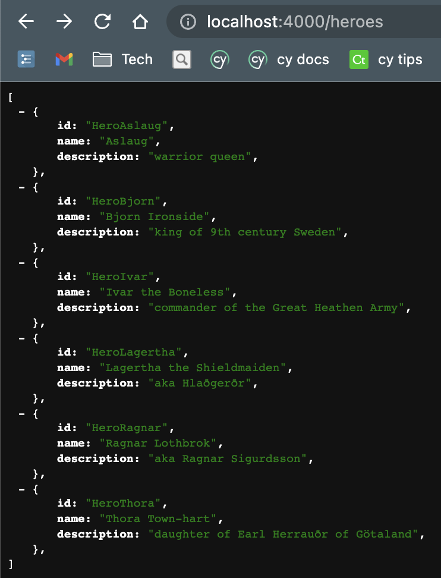
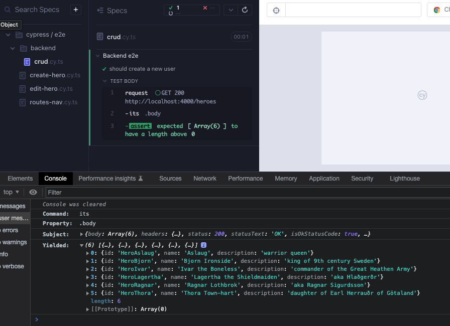
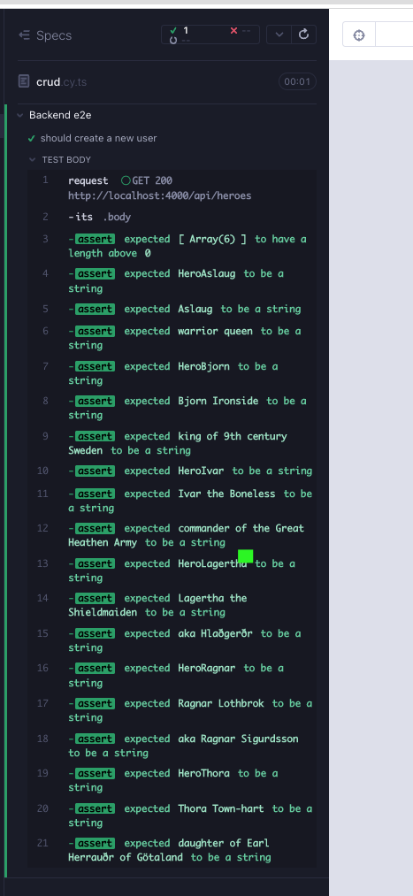
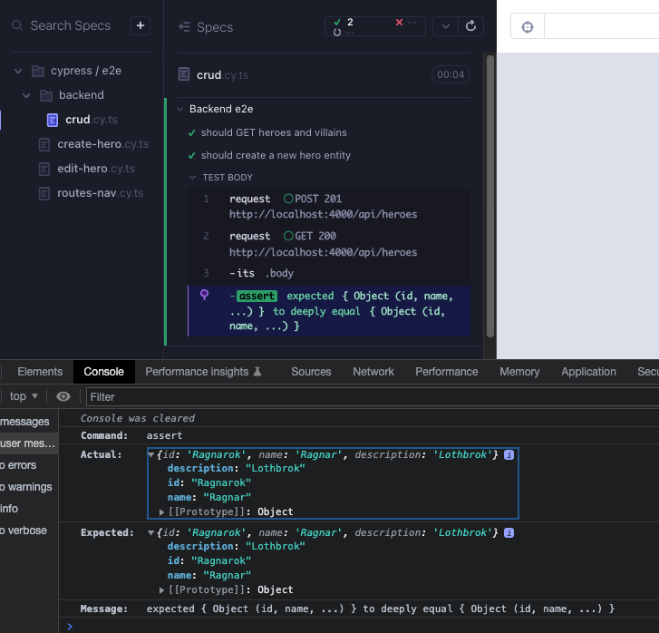

# json-server

### [`json-server`](https://github.com/typicode/json-server)

Şimdiye kadar `Heroes` bileşeninde `src/heroes/heroes.json` adlı bir json dosyası kullanıyorduk. Uygulamamız bir arka uçla iletişim kurmuyor. Bunun yerine sahte bir REST API'ye sahip olmak ideal olacaktır ve `json-server` bunu sağlayabilir. Uygulamamıza aşağıdaki paketleri ekleyin:

```bash
yarn add -D concurrently json-server
```

Proje kökünde bir `db.json` dosyası oluşturun ve aşağıdaki içeriği içine kopyalayın.

```json
{
  "heroes": [
    {
      "id": "HeroAslaug",
      "name": "Aslaug",
      "description": "warrior queen"
    },
    {
      "id": "HeroBjorn",
      "name": "Bjorn Ironside",
      "description": "king of 9th century Sweden"
    },
    {
      "id": "HeroIvar",
      "name": "Ivar the Boneless",
      "description": "commander of the Great Heathen Army"
    },
    {
      "id": "HeroLagertha",
      "name": "Lagertha the Shieldmaiden",
      "description": "aka Hlaðgerðr"
    },
    {
      "id": "HeroRagnar",
      "name": "Ragnar Lothbrok",
      "description": "aka Ragnar Sigurdsson"
    },
    {
      "id": "HeroThora",
      "name": "Thora Town-hart",
      "description": "daughter of Earl Herrauðr of Götaland"
    }
  ],
  "villains": [
    {
      "id": "VillainMadelyn",
      "name": "Madelyn",
      "description": "the cat whisperer"
    },
    {
      "id": "VillainHaley",
      "name": "Haley",
      "description": "pen wielder"
    },
    {
      "id": "VillainElla",
      "name": "Ella",
      "description": "fashionista"
    },
    {
      "id": "VillainLandon",
      "name": "Landon",
      "description": "Mandalorian mauler"
    }
  ]
}
```

`package.json` yakınında bulunan `"start"` script'ine bir script ekleyin. Bu, `db.json` dosyasını kullanarak `localhost:4000` adresinde içeriği döndürecek ve 1 saniyelik simüle edilmiş ağ gecikmesi sağlayacaktır.

```json
{
  "scripts": {
    "start:api": "json-server --watch db.json --port 4000 --delay 1000"
  }
}
```

`yarn start:api` komutunu çalıştırın ve http://localhost:4000/heroes veya http://localhost:4000/villains adreslerine gidin. Bazı veriler görmelisiniz.



Aşağıdaki gibi `package.json` script'lerini güncelleyin. Değişiklikler, UI sunucusunun her zaman API sunucusuyla birlikte sunulmasını sağlar. Bu sayede repo kullanıcısı, repoyu kullanırken arka uç ihtiyaçlarını soyutlamış olur.

```json
"scripts": {
  "start": "react-scripts start",
  "start:api": "json-server --watch db.json --port 4000 --delay 1000",
  "dev": "concurrently -k yarn:start yarn:start:api",
  "build": "react-scripts build",
  "test": "react-scripts test",
  "test:coverage": "yarn test --watchAll=false --coverage",
  "test:debug": "node --inspect-brk ./node_modules/jest/bin/jest.js --watch --runInBand",
  "format": "prettier --ignore-path .gitignore --write \"**/*.+(js|json|css|md|mdx|html)\"",
  "lint": "eslint . --cache-location node_modules/.cache/eslint",
  "typecheck": "tsc --noEmit",
  "validate": "npm-run-all --parallel format lint typecheck build",
  "cy:open": "cypress open --e2e --browser chrome",
  "cy:open-e2e": "concurrently -k yarn:start:api 'server-test 3000 cy:open'",
  "cy:run-e2e": "concurrently -k yarn:start:api 'server-test 3000 cy:run'",
  "cy:open-ct": "cypress open --component --browser chrome",
  "cy:run-ct": "cypress run --component --browser chrome"
},
```

CI için, `.github/workflows/main.yml` dosyasındaki `cypress-e2e-test` bölümünü > Cypress GitHub eylem komutunu > `start` özelliğini `yarn start`'tan `yarn dev`'e güncelleyin. Bu, başlatma komutunun sadece UI sunucusunu başlatmakla kalmayıp, aynı zamanda arka ucu da başlatacağından emin olacaktır.

```yaml
cypress-e2e-test:
  needs: [install-dependencies]
  runs-on: ubuntu-latest
  container: cypress/included:10.7.0 # or whatever is the latest
  steps:
    - uses: actions/checkout@v3

    - uses: bahmutov/npm-install@v1.8.21
      with: { useRollingCache: true }

    - name: Cypress e2e tests 🧪
      uses: cypress-io/github-action@v4.2.0
      with:
        install: false
        # update from yarn start to yarn dev
        start: yarn dev
        wait-on: "http://localhost:3000"
        browser: chrome
      env:
        GITHUB_TOKEN: ${{ secrets.GITHUB_TOKEN }}
```

### Arka Uç-e2e

Cypress, canlı bir arka uç testi için harika bir API istemcisi aracıdır; [Cypress ile Dağıtılmış Hizmette CRUD API Testi](https://dev.to/muratkeremozcan/crud-api-testing-a-deployed-service-with-cypress-using-cy-api-spok-cypress-data-session-cypress-each-4mlg) yazısına göz atın. Arka uç düzgün çalıştığından emin olmak için arka uç e2e testleri yazabiliriz. `json-server` ile bu gerekli değildir, ancak gerçek yaşam örneğini göstermek istiyoruz ve ayrıca bu API komutlarının bazılarını UI e2e CRUD testlerinde durumu ayarlamak ve temizlemek için kullanacağız. Gerçek dünyada, büyük olasılıkla arka uç ayrı bir depoda olacak ve kendi Cypress api e2e testlerine sahip olacaktır. Ön uçta da kullanılacak olan ortak komutlar büyük olasılıkla dahili bir Cypress test paketinde barındırılacaktır; bu konuda bir rehberi [burada](https://dev.to/muratkeremozcan/how-to-create-an-internal-test-plugins-for-your-team-in-ts-implement-custom-commands-and-use-other-cypress-plugins-in-them-5lp) bulabilirsiniz.

Cypress API testi ile TDD'yi göstermek için bir arka uç-e2e testi oluşturuyoruz. `cypress/e2e/backend/crud.cy.ts` adında bir dosya oluşturun ve basit bir `GET` isteği yapın.

```typescript
// cypress/e2e/backend/crud.cy.ts
describe("Backend e2e", () => {
  it("should ", () => {
    const url = "http://localhost:4000/heroes";

    cy.request({
      method: "GET",
      url,
    })
      .its("body")
      .should("have.length.gt", 0);
  });
});
```

Arka uç e2e testlerini başlatmak için `yarn cy:open-e2e` komutunu kullanın ve testi çalıştırın. Konsolu incelediğimizde, `body` içinde 6 kahramanın dizisini görebiliriz.



Her varlık için `id`, `name` ve `description` özelliklerine sahip olduğundan emin olmak için daha derinlemesine test edebiliriz.

```typescript
// cypress/e2e/backend/crud.cy.ts
describe("Backend e2e", () => {
  it("should ", () => {
    const url = "http://localhost:4000/heroes";
    type Hero = { id: string; name: string; description: string };

    cy.request({
      method: "GET",
      url,
    })
      .its("body")
      .should("have.length.gt", 0)
      .each((entity: Hero) => {
        expect(entity.id).to.be.a("string");
        expect(entity.name).to.be.a("string");
        expect(entity.description).to.be.a("string");
      });
  });
});
```

Arka ucun `/api` rotasıyla sunulması daha ideal olurdu, böylece ön uçla karıştırılmaz ve daha uyumlu hale getirilir. Bu değişiklik için başarısız bir testle URL'yi değiştirin (Kırmızı 1).

```typescript
// cypress/e2e/backend/crud.cy.ts
describe("Backend e2e", () => {
  it("should ", () => {
    const url = "http://localhost:4000/api/heroes";
    type Hero = { id: string; name: string; description: string };

    cy.request({
      method: "GET",
      url,
    })
      .its("body")
      .should("have.length.gt", 0)
      .each((entity: Hero) => {
        expect(entity.id).to.be.a("string");
        expect(entity.name).to.be.a("string");
        expect(entity.description).to.be.a("string");
      });
  });
});
```

Değişikliği gerçekleştirmek için 2 değişiklik yapmamız gerekiyor. Önce, projenin kökünde `routes.json` adlı bir dosya oluşturun:

```json
{
  "/api/*": "/$1"
}
```

Bu dosyanın kullanılması için `package.json` betiğini `--routes routes.json` ekleyerek değiştirin.

```json
"start:api": "json-server --watch db.json --port 4000 --delay 1000 --routes routes.json",
```



Benzer bir testi, `villains` için de hafif bir düzenlemeyle yapabiliriz (Düzenleme 1).

```typescript
// cypress/e2e/backend/crud.cy.ts
describe("Backend e2e", () => {
  it("should GET heroes and villains ", () => {
    const apiUrl = "http://localhost:4000/api";
    type Hero = { id: string; name: string; description: string };

    cy.request({
      method: "GET",
      url: `${apiUrl}/heroes`,
    })
      .its("body")
      .should("have.length.gt", 0)
      .each((entity: Hero) => {
        expect(entity.id).to.be.a("string");
        expect(entity.name).to.be.a("string");
        expect(entity.description).to.be.a("string");
      });

    cy.request({
      method: "GET",
      url: `${apiUrl}/villains`,
    })
      .its("body")
      .should("have.length.gt", 0)
      .each((entity: Hero) => {
        expect(entity.id).to.be.a("string");
        expect(entity.name).to.be.a("string");
        expect(entity.description).to.be.a("string");
      });
  });
});
```

Daha kuru olacak şekilde bunu daha da yeniden düzenleyebiliriz.

```typescript
// cypress/e2e/backend/crud.cy.ts
describe("Backend e2e", () => {
  const apiUrl = "http://localhost:4000/api";
  type Hero = { id: string; name: string; description: string };

  const assertProperties = (entity: Hero) => {
    expect(entity.id).to.be.a("string");
    expect(entity.name).to.be.a("string");
    expect(entity.description).to.be.a("string");
  };

  const getRoute = (route: string) =>
    cy.request({
      method: "GET",
      url: `${apiUrl}/${route}`,
    });

  it("should GET heroes and villains ", () => {
    getRoute("heroes")
      .its("body")
      .should("have.length.gt", 0)
      .each(assertProperties);

    getRoute("villains")
      .its("body")
      .should("have.length.gt", 0)
      .each(assertProperties);
  });
});
```

Yeni bir test yazalım, bu sefer bir kahraman ekleyip eklenip eklenmediğini doğrulayalım.

```typescript
// cypress/e2e/backend/crud.cy.ts
describe("Backend e2e", () => {
  const apiUrl = "http://localhost:4000/api";
  type Hero = { id: string; name: string; description: string };

  const assertProperties = (entity: Hero) => {
    expect(entity.id).to.be.a("string");
    expect(entity.name).to.be.a("string");
    expect(entity.description).to.be.a("string");
  };

  const getRoute = (route: string) =>
    cy.request({
      method: "GET",
      url: `${apiUrl}/${route}`,
    });
  it("should GET heroes and villains ", () => {
    getRoute("heroes")
      .its("body")
      .should("have.length.gt", 0)
      .each(assertProperties);

    getRoute("villains")
      .its("body")
      .should("have.length.gt", 0)
      .each(assertProperties);
  });

  const postRoute = (route: string, body: Hero) =>
    cy.request({
      method: "POST",
      url: `${apiUrl}/${route}`,
      body,
    });

  it("should create a new hero entity", () => {
    const newHero = { id: "Ragnarok", name: "Ragnar", description: "Lothbrok" };

    postRoute("heroes", newHero);

    getRoute("heroes")
      .its("body")
      .then((body) => {
        expect(body.at(-1)).to.deep.eq(newHero);
      });
  });
});
```

Test başlangıçta çalışıyor gibi görünüyor, ancak yeniden çalıştırıldığında 500 hata alıyoruz, çünkü oluşturduğumuz varlık zaten mevcut (Kırmızı 2).



Bunu ele almanın birkaç yolu vardır. Varlığı rastgeleleştirebilir ve/veya testin sonunda varlığı silebiliriz. En iyi uygulamaları göstermek için bunları yapacağız, ancak bununla başa çıkmak için kesin yol, testin başında sunucu durumunu sıfırlamaktır. İlerleyen zamanlarda testin kendi kendini temizlemesini sağlayabiliriz.

[json-server-reset](https://github.com/bahmutov/json-server-reset) uygulamasını `yarn add -D json-server-reset` ile yükleyin. `package.json` dosyasını düzenleyerek, api için bir `/reset` rotası sağlayan middleware'i ekleyin. Herhangi bir yük ile `reset` rotasına `POST` isteği yapıldığında, `db.json` dosyası o yüke sıfırlanır.

```json
"start:api": "json-server --watch db.json --port 4000 --delay 1000 --routes routes.json --middlewares ./node_modules/json-server-reset"
```

İlk testte eklenen ek varlığı db.json dosyasından kaldırın ve db'yi orijinal durumuna sıfırlayın. Kaldırın:

```json
{
  "id": "Ragnarok",
  "name": "Ragnar",
  "description": "Lothbrok"
}
```

Şimdi ihtiyacımız olan tek şey bir yüktür, ancak `db.json` dosyasını testimize dahil edip aynı zamanda kendisini sıfırlamak için kullanırsak, sıfırlama çağrısı sonsuz bir şekilde tekrarlanacaktır. `db.json` dosyasının bir kopyasını `cypress/fixtures/db.json` şeklinde oluşturun, böylece oradan içe aktarabilir ve ağımızı tamamen taklit edebiliriz. Aşağıda gösterildiği gibi, verileri her testten önce sıfırlamak için komut dosyamızı değiştirebiliriz (Yeşil 2).

```typescript
// cypress/e2e/backend/crud.cy.ts
import data from "../../fixtures/db.json";

describe("Backend e2e", () => {
  const apiUrl = "http://localhost:4000/api";
  type Hero = { id: string; name: string; description: string };

  const assertProperties = (entity: Hero) => {
    expect(entity.id).to.be.a("string");
    expect(entity.name).to.be.a("string");
    expect(entity.description).to.be.a("string");
  };

  const getRoute = (route: string) =>
    cy.request({
      method: "GET",
      url: `${apiUrl}/${route}`,
    });

  const postRoute = (route: string | "reset", body: Hero | object) =>
    cy.request({
      method: "POST",
      url: `${apiUrl}/${route}`,
      body,
    });

  const resetData = () => postRoute("reset", data);

  beforeEach(resetData);

  it("should GET heroes and villains ", () => {
    getRoute("heroes")
      .its("body")
      .should("have.length.gt", 0)
      .each(assertProperties);

    getRoute("villains")
      .its("body")
      .should("have.length.gt", 0)
      .each(assertProperties);
  });

  it("should create a new hero entity", () => {
    const newHero = { id: "Ragnarok", name: "Ragnar", description: "Lothbrok" };

    postRoute("heroes", newHero);

    getRoute("heroes")
      .its("body")
      .then((body) => {
        expect(body.at(-1)).to.deep.eq(newHero);
      });
  });
});
```

Şimdi kahramanı güncellemek ve silmek için testin geri kalanını ekleyebiliriz. Bir rotada `id` özelliğini kullanarak doğrudan o varlığı almak, güncellemek veya silmek için kullanabileceğimize dikkat edin. Başarılı bir testimiz olduğu için, başarısız olana kadar yeni testler eklemeye devam ediyoruz. `json-server`ı test ediyoruz, bu yüzden başarısızlıklar olası değildir. Bu, geliştirme tamamlandıktan sonra TDD benzeri bir yaklaşım uygulandığında yaygın bir senaryodur, bu nedenle TDD'nin gerçek değeri geliştirme sırasında anlaşılır. Testi güncelleme ve silme ile geliştirelim (Düzenleme 2).

```typescript
// cypress/e2e/backend/crud.cy.ts
import data from "../../fixtures/db.json";

describe("Backend e2e", () => {
  const apiUrl = "http://localhost:4000/api";
  type Hero = { id: string; name: string; description: string };

  const assertProperties = (entity: Hero) => {
    expect(entity.id).to.be.a("string");
    expect(entity.name).to.be.a("string");
    expect(entity.description).to.be.a("string");
  };

  const getRoute = (route: string) =>
    cy.request({
      method: "GET",
      url: `${apiUrl}/${route}`,
    });

  const postRoute = (route: string, body: Hero | object) =>
    cy.request({
      method: "POST",
      url: `${apiUrl}/${route}`,
      body,
    });

  const editRoute = (route: string, body: Hero | object) =>
    cy.request({
      method: "PUT",
      url: `${apiUrl}/${route}`,
      body,
    });

  const deleteRoute = (route: string) =>
    cy.request({
      method: "DELETE",
      url: `${apiUrl}/${route}`,
    });

  const resetData = () => postRoute("reset", data);

  beforeEach(resetData);

  it("should GET heroes and villains ", () => {
    getRoute("heroes")
      .its("body")
      .should("have.length.gt", 0)
      .each(assertProperties);

    getRoute("villains")
      .its("body")
      .should("have.length.gt", 0)
      .each(assertProperties);
  });

  it("should create a new hero entity", () => {
    const newHero = { id: "Ragnarok", name: "Ragnar", description: "Lothbrok" };

    postRoute("heroes", newHero);

    getRoute("heroes")
      .its("body")
      .then((body) => {
        expect(body.at(-1)).to.deep.eq(newHero);
      });

    const editedHero = { ...newHero, name: "Murat" };
    editRoute(`heroes/${editedHero.id}`, editedHero);
    getRoute(`heroes/${editedHero.id}`)
      .its("body")
      .should("deep.eq", editedHero);

    deleteRoute(`heroes/${editedHero.id}`);
  });
});
```

Testin, veritabanı durumundan sorumlu olması en iyi uygulamadır. Burada tek bir blok altında oluşturma, güncelleme ve silme işlemlerini yapıyoruz, ancak başka bir yaklaşım aşağıdaki gibi olabilir. Çoğaltılan alt adımlar **kalın** ile vurgulanmıştır.

- Oluşturma
  - **UI oluştur**
  - **API sil**
- Güncelleme
  - **API oluştur**
  - UI güncelle
  - **API sil**
- Silme
  - **API oluştur**
  - **UI sil**

Gördüğünüz gibi, güncelleme senaryosunu kapsamak her şeyi tatmin eder, aksi takdirde testler arasında çoğaltma vardır.

Son silme işleminden sonra, varlığın veritabanından kaldırıldığından emin olmalıyız. Bunu kontrol etmek için son bir get işlemi ekleyin (Kırmızı 3).

```typescript
// cypress/e2e/backend/crud.cy.ts
import data from "../../fixtures/db.json";

describe("Backend e2e", () => {
  const apiUrl = "http://localhost:4000/api";
  type Hero = { id: string; name: string; description: string };

  const assertProperties = (entity: Hero) => {
    expect(entity.id).to.be.a("string");
    expect(entity.name).to.be.a("string");
    expect(entity.description).to.be.a("string");
  };

  const getRoute = (route: string) =>
    cy.request({
      method: "GET",
      url: `${apiUrl}/${route}`,
    });

  const postRoute = (route: string, body: Hero | object) =>
    cy.request({
      method: "POST",
      url: `${apiUrl}/${route}`,
      body,
    });

  const editRoute = (route: string, body: Hero | object) =>
    cy.request({
      method: "PUT",
      url: `${apiUrl}/${route}`,
      body,
    });

  const deleteRoute = (route: string) =>
    cy.request({
      method: "DELETE",
      url: `${apiUrl}/${route}`,
    });

  const resetData = () => postRoute("reset", data);

  beforeEach(resetData);

  it("should GET heroes and villains ", () => {
    getRoute("heroes")
      .its("body")
      .should("have.length.gt", 0)
      .each(assertProperties);

    getRoute("villains")
      .its("body")
      .should("have.length.gt", 0)
      .each(assertProperties);
  });

  it("should CRUD a new hero entity", () => {
    const newHero = { id: "Ragnarok", name: "Ragnar", description: "Lothbrok" };

    postRoute("heroes", newHero);

    getRoute("heroes")
      .its("body")
      .then((body) => {
        expect(body.at(-1)).to.deep.eq(newHero);
      });

    const editedHero = { ...newHero, name: "Murat" };
    editRoute(`heroes/${editedHero.id}`, editedHero);
    getRoute(`heroes/${editedHero.id}`)
      .its("body")
      .should("deep.eq", editedHero);

    deleteRoute(`heroes/${editedHero.id}`);
    getRoute(`heroes/${editedHero.id}`).its("status").should("eq", 404);
  });
});
```

Cypress, başarılı olana kadar komutları yeniden dener (4 saniye) olduğu için 404 durumu hakkında bir hata alacağız. 200 dışındaki kodlar için kontrolümüz varsa, api çağrılarının başarısız olmasına izin vermelidir.

[cy.request](https://docs.cypress.io/api/commands/request) kontrol etmeyi sevdiğimiz iki özelliğe sahiptir:

- `retryOnStatusCodeFailure`: Cypress'in, hata kodlarını otomatik olarak yeniden denemesi gerekip gerekmediği. Eğer bu true olarak ayarlanırsa, Cypress bir isteği en fazla 4 kez yeniden dener.
- `failOnStatusCode`: `2xx` ve `3xx` dışındaki yanıt kodlarına göre başarısız olup olmamak

Bu ikisini, varsayılan değeri `false` olan `allowedToFail` adlı bir argüman bayrağı ile birlikte kontrol edebiliriz. 200 dışındaki durum kodlarını beklediğimizde, bunu true olarak ayarlayabiliriz (Yeşil 3).

```typescript
// cypress/e2e/backend/crud.cy.ts
import data from "../../fixtures/db.json";

describe("Backend e2e", () => {
  const apiUrl = "http://localhost:4000/api";
  type Hero = { id: string; name: string; description: string };

  const assertProperties = (entity: Hero) => {
    expect(entity.id).to.be.a("string");
    expect(entity.name).to.be.a("string");
    expect(entity.description).to.be.a("string");
  };

  const getRoute = (route: string, allowedToFail = false) =>
    cy.request({
      method: "GET",
      url: `${apiUrl}/${route}`,
      retryOnStatusCodeFailure: !allowedToFail,
      failOnStatusCode: !allowedToFail,
    });

  const postRoute = (route: string, body: Hero | object) =>
    cy.request({
      method: "POST",
      url: `${apiUrl}/${route}`,
      body,
    });

  const editRoute = (route: string, body: Hero | object) =>
    cy.request({
      method: "PUT",
      url: `${apiUrl}/${route}`,
      body,
    });

  const deleteRoute = (route: string) =>
    cy.request({
      method: "DELETE",
      url: `${apiUrl}/${route}`,
    });

  const resetData = () => postRoute("reset", data);

  beforeEach(resetData);

  it("should GET heroes and villains ", () => {
    getRoute("heroes")
      .its("body")
      .should("have.length.gt", 0)
      .each(assertProperties);

    getRoute("villains")
      .its("body")
      .should("have.length.gt", 0)
      .each(assertProperties);
  });

  it("should CRUD a new hero entity", () => {
    const newHero = { id: "Ragnarok", name: "Ragnar", description: "Lothbrok" };

    postRoute("heroes", newHero);

    getRoute("heroes")
      .its("body")
      .then((body) => {
        expect(body.at(-1)).to.deep.eq(newHero);
      });

    const editedHero = { ...newHero, name: "Murat" };
    editRoute(`heroes/${editedHero.id}`, editedHero);
    getRoute(`heroes/${editedHero.id}`)
      .its("body")
      .should("deep.eq", editedHero);

    deleteRoute(`heroes/${editedHero.id}`);
    getRoute(`heroes/${editedHero.id}`, true).its("status").should("eq", 404);
  });
});
```

API'yi daha okunabilir ve genişletilebilir hale getirmek için seçenekleri bir nesneye koyarak yeniden düzenleyebiliriz. Bu şekilde, birden fazla seçenek varsa, sıraları önemli değildir. Hiçbir seçenek iletilmezse, varsayılan olarak boş bir nesneye dönüşür. Bu yeniden düzenleme, gelecekte yeni seçenekler eklememize ve API kullanıcısının hangilerini kullanmak istediğini seçmesine olanak tanır.

Ayrıca, `cy.request` yanıtını dökerek türü iyileştirebiliriz ve alacağımız değerin türünü belirtiriz.

```typescript
const getRoute = (
  // required args
  route: string,
  // options, some can have default values
  // {optional args}: {their types} = {}
  { allowedToFail = false }: { allowedToFail?: boolean } = {}
) =>
  cy.request<Hero[] & Hero>({
    method: "GET",
    url: `${apiUrl}/${route}`,
    retryOnStatusCodeFailure: !allowedToFail,
    failOnStatusCode: !allowedToFail,
  });
```

İşte yeniden yapılandırılmış test (Düzenleme 3).

```typescript
// cypress/e2e/backend/crud.cy.ts
import data from "../../fixtures/db.json";

describe("Backend e2e", () => {
  const apiUrl = "http://localhost:4000/api";
  type Hero = { id: string; name: string; description: string };

  const assertProperties = (entity: Hero) => {
    expect(entity.id).to.be.a("string");
    expect(entity.name).to.be.a("string");
    expect(entity.description).to.be.a("string");
  };

  const getRoute = (
    route: string,
    { allowedToFail = false }: { allowedToFail?: boolean } = {}
  ) =>
    cy.request<Hero[] & Hero>({
      method: "GET",
      url: `${apiUrl}/${route}`,
      retryOnStatusCodeFailure: !allowedToFail,
      failOnStatusCode: !allowedToFail,
    });

  const postRoute = (route: string, body: Hero | object) =>
    cy.request<Hero>({
      method: "POST",
      url: `${apiUrl}/${route}`,
      body,
    });

  const editRoute = (route: string, body: Hero | object) =>
    cy.request<Hero>({
      method: "PUT",
      url: `${apiUrl}/${route}`,
      body,
    });

  const deleteRoute = (route: string) =>
    cy.request<Hero>({
      method: "DELETE",
      url: `${apiUrl}/${route}`,
    });

  const resetData = () => postRoute("reset", data);

  beforeEach(resetData);

  it("should GET heroes and villains ", () => {
    getRoute("heroes")
      .its("body")
      .should("have.length.gt", 0)
      .each(assertProperties);

    getRoute("villains")
      .its("body")
      .should("have.length.gt", 0)
      .each(assertProperties);
  });

  it("should CRUD a new hero entity", () => {
    const newHero = { id: "Ragnarok", name: "Ragnar", description: "Lothbrok" };

    postRoute("heroes", newHero);

    getRoute("heroes")
      .its("body")
      .then((body) => {
        expect(body.at(-1)).to.deep.eq(newHero);
      });

    const editedHero = { ...newHero, name: "Murat" };
    editRoute(`heroes/${editedHero.id}`, editedHero);
    getRoute(`heroes/${editedHero.id}`)
      .its("body")
      .should("deep.eq", editedHero);

    deleteRoute(`heroes/${editedHero.id}`);
    getRoute(`heroes/${editedHero.id}`, { allowedToFail: true })
      .its("status")
      .should("eq", 404);
  });
});
```

Daha iyi okunabilir bir API olmasına rağmen, CRUD işlevleri arasında biraz yineleme vardır. Aşağıdaki işlevi düşünün; tip güvenliğiyle herhangi bir CRUD işlemini gerçekleştirebilir. `method` ve `route` gerekli olan parametrelerdir. `body` ve `allowedToFail` bayrağı isteğe bağlıdır; eğer geçirilmezlerse, `body` boş olacak ama `allowedToFail` yine de `false` olacaktır. Eğer `body` geçirilir ve `method` `POST` veya `PUT` ise, yük alınacaktır; aksi takdirde, `GET` ve `DELETE` için tanımsızdır.

```typescript
const crud = (
  // required args
  method: "GET" | "POST" | "PUT" | "DELETE",
  route: string,
  // optional args
  // {optional args}: {their types} = {}
  {
    body,
    allowedToFail = false,
  }: { body?: Hero | object; allowedToFail?: boolean } = {}
) =>
  cy.request<Hero[] & Hero>({
    method: method,
    url: `${apiUrl}/${route}`,
    body: method === "POST" || method === "PUT" ? body : undefined,
    retryOnStatusCodeFailure: !allowedToFail,
    failOnStatusCode: !allowedToFail,
  });
```

İşte yukarıdaki fonksiyonu kullanarak yapılan yeniden düzenleme (Düzenleme 4):

```typescript
import data from "../../fixtures/db.json";

describe("Backend e2e", () => {
  const apiUrl = "http://localhost:4000/api";
  type Hero = { id: string; name: string; description: string };

  const assertProperties = (entity: Hero) => {
    expect(entity.id).to.be.a("string");
    expect(entity.name).to.be.a("string");
    expect(entity.description).to.be.a("string");
  };

  const crud = (
    method: "GET" | "POST" | "PUT" | "DELETE",
    route: string,
    {
      body,
      allowedToFail = false,
    }: { body?: Hero | object; allowedToFail?: boolean } = {}
  ) =>
    cy.request<Hero[] & Hero>({
      method: method,
      url: `${apiUrl}/${route}`,
      body: method === "POST" || method === "PUT" ? body : undefined,
      retryOnStatusCodeFailure: !allowedToFail,
      failOnStatusCode: !allowedToFail,
    });

  const resetData = () => crud("POST", "reset", { body: data });

  beforeEach(resetData);

  it("should GET heroes and villains ", () => {
    crud("GET", "heroes")
      .its("body")
      .should("have.length.gt", 0)
      .each(assertProperties);

    crud("GET", "villains")
      .its("body")
      .should("have.length.gt", 0)
      .each(assertProperties);
  });

  it("should CRUD a new hero entity", () => {
    const newHero = { id: "Ragnarok", name: "Ragnar", description: "Lothbrok" };

    crud("POST", "heroes", { body: newHero });

    crud("GET", "heroes")
      .its("body")
      .then((body) => {
        expect(body.at(-1)).to.deep.eq(newHero);
      });

    const editedHero = { ...newHero, name: "Murat" };
    crud("PUT", `heroes/${editedHero.id}`, { body: editedHero });
    crud("GET", `heroes/${editedHero.id}`)
      .its("body")
      .should("deep.eq", editedHero);

    crud("DELETE", `heroes/${editedHero.id}`);
    crud("GET", `heroes/${editedHero.id}`, { allowedToFail: true })
      .its("status")
      .should("eq", 404);
  });
});
```

UI e2e testlerimiz olduğunda, bu komutu kurulum ve sökme için kullanmak isteyeceğiz. Bunu bir yardımcı dosyaya taşıyabilir ve onu ihtiyacı olan her testten içe aktarabiliriz. Genel bir kural olarak, 2-3 içe aktarma olduğunda yardımcı bir dosyayı kullanmak ve oradan fonksiyonu içe aktarmak uygundur. Bundan daha fazlası, Cypress komutundan alınması daha uygundur. Bunu nasıl başarılacağını göstermek için bir komut oluşturalım.

Testler eklemeye devam ettik ve tekrar tekrar yeşil ışık aldık. Şimdi sonuçtan memnun kalana kadar yeniden düzenlemeye devam edebiliriz.

`crud` ve `resetData` komutlarını Cypress komutlarına ekleyin (Düzenleme 4).

```typescript
// cypress/support/commands.ts
import "@testing-library/cypress/add-commands";
import data from "../fixtures/db.json";

Cypress.Commands.add("getByCy", (selector, ...args) =>
  cy.get(`[data-cy="${selector}"]`, ...args)
);

Cypress.Commands.add("getByCyLike", (selector, ...args) =>
  cy.get(`[data-cy*=${selector}]`, ...args)
);

Cypress.Commands.add("getByClassLike", (selector, ...args) =>
  cy.get(`[class*=${selector}]`, ...args)
);

export type Hero = { id: string; name: string; description: string };
Cypress.Commands.add(
  "crud",
  (
    method: "GET" | "POST" | "PUT" | "DELETE",
    route: string,
    {
      body,
      allowedToFail = false,
    }: { body?: Hero | object; allowedToFail?: boolean } = {}
  ) =>
    cy.request<Hero[] & Hero>({
      method: method,
      url: `http://localhost:4000/api/${route}`,
      body: method === "POST" || method === "PUT" ? body : undefined,
      retryOnStatusCodeFailure: !allowedToFail,
      failOnStatusCode: !allowedToFail,
    })
);

Cypress.Commands.add("resetData", () =>
  cy.crud("POST", "reset", { body: data })
);
```

Komutun tip tanımını `./cypress.d.ts` dosyasına ekleyin.

````typescript
// cypress.d.ts

/* eslint-disable @typescript-eslint/no-explicit-any */
import { MountOptions, MountReturn } from "cypress/react";
import type { Hero } from "./cypress/support/commands";

export {};
declare global {
  namespace Cypress {
    interface Chainable {
      /** Yields elements with a data-cy attribute that matches a specified selector.
       * ```
       * cy.getByCy('search-toggle') // where the selector is [data-cy="search-toggle"]
       * ```
       */
      getByCy(qaSelector: string, args?: any): Chainable<JQuery<HTMLElement>>;

      /** Yields elements with data-cy attribute that partially matches a specified selector.
       * ```
       * cy.getByCyLike('chat-button') // where the selector is [data-cy="chat-button-start-a-new-claim"]
       * ```
       */
      getByCyLike(
        qaSelector: string,
        args?: any
      ): Chainable<JQuery<HTMLElement>>;

      /** Yields the element that partially matches the css class
       * ```
       * cy.getByClassLike('StyledIconBase') // where the class is class="StyledIconBase-ea9ulj-0 lbJwfL"
       * ```
       */
      getByClassLike(
        qaSelector: string,
        args?: any
      ): Chainable<JQuery<HTMLElement>>;

      /** Mounts a React node
       * @param component React Node to mount
       * @param options Additional options to pass into mount
       */
      mount(
        component: React.ReactNode,
        options?: MountOptions
      ): Cypress.Chainable<MountReturn>;

      /**
       * Performs crud operations GET, POST, PUT and DELETE.
       *
       * `body` and `allowedToFail are optional.
       *
       * If they are not passed in, body is empty but `allowedToFail` still is `false`.
       *
       * If the body is passed in and the method is `POST` or `PUT`, the payload will be taken,
       * otherwise undefined for `GET` and `DELETE`.
       * @param method
       * @param route
       * @param options: {body?: Hero | object; allowedToFail?: boolean}
       */
      crud(
        method: "GET" | "POST" | "PUT" | "DELETE",
        route: string,
        {
          body,
          allowedToFail = false,
        }: { body?: Hero | object; allowedToFail?: boolean } = {}
      ): Cypress.Chainable<Response<Hero[] & Hero>>;

      /**
       * Resets the data in the database to the initial data.
       */
      resetData(): Cypress.Chainable<Response<Hero[] & Hero>>;
    }
  }
}
````

Komutları spec dosyasında kullanın. Burada çalıştığımız veriler için [`faker`](https://fakerjs.dev/api/) kullanarak son bir dokunuş yapacağız. `yarn add -D @faker-js/faker` (Düzenleme 4).

```typescript
// cypress/e2e/backend/crud.cy.ts
import type {Hero} from '../../support/commands'
import {faker} from '@faker-js/faker'

describe('Backend e2e', () => {
  const assertProperties = (entity: Hero) => {
    expect(entity.id).to.be.a('string')
    expect(entity.name).to.be.a('string')
    expect(entity.description).to.be.a('string')
  }

  beforeEach(() => cy.resetData())

  it('should GET heroes and villains ', () => {
    cy.crud('GET', 'heroes')
      .its('body')
      .should('have.length.gt', 0)
      .each(assertProperties)

    cy.crud('GET', 'villains')
      .its('body')
      .should('have.length.gt', 0)
      .each(assertProperties)
  })

  it('should CRUD a new hero entity', () => {
    const newHero = {
      id: faker.datatype.uuid(),
      name: faker.internet.userName(),
      description: `description ${faker.internet.userName()}`,
    }

    cy.crud('POST', 'heroes', {body: newHero}).its('status').should('eq', 201)

    cy.crud('GET', 'heroes')
      .its('body')
      .then(body => {
        expect(body.at(-1)).to.deep.eq(newHero)
      })

    const editedHero = {...newHero, name: 'Murat'}
    cy.crud('PUT', `heroes/${editedHero.id}`, {body: editedHero})
      .its('status')
      .should('eq', 200)
    cy.crud('GET', `heroes/${editedHero.id}`)
      .its('body')
      .should('deep.eq', editedHero)

    cy.crud('DELETE', `heroes/${editedHero.id}`).its('status').should('eq', 200)
    cy.crud('GET', `heroes/${editedHero.id}`, {allowedToFail: true})
      .its('status')
      .should('eq', 404)
  })
```

Son kod karmaşık görünebilir, ancak oraya ulaşmak için testlerin çalışmasını sağlama ve yeniden düzenleme döngülerinden birçok kez geçti.

### Özet

Uygulamamızın konuşabileceği sahte bir sunucu oluşturduk; `json-server` kullanarak bunu gerçekleştirdik.

Bu işlem, `db.json` dosyasıyla veritabanını seedleme ve uygulamamız başlatıldığında api sunucusunu başlatma gerektirdi.

`package.json` komutları ve CI değiştirilmeliydi.

Seedlenen verileri doğrulamak için bir `GET` testiyle başladık. Sunucuyu benzersiz bir önek `api` kullanacak şekilde değiştirdik ve kahramanları ve kötü adamları doğruladık (Kırmızı 1, Yeşil 1, Düzenleme 1).

</br>

Yeni bir kahraman eklemek için yeni bir test oluşturduk. Ancak testin arkasında durum bırakması nedeniyle, testi yeniden çalıştırmak sorunlara neden oldu (Kırmızı 2).

Her testten önce veritabanını orijinal haline döndürmek için `json-server-reset` kullandık (Yeşil 2).

Testi güncelleme ve silme ile geliştirdik (Düzenleme 2).

</br>

Silinen öğenin veritabanından kaldırıldığından emin olmak için yeni bir test ekledik (Kırmızı 3).

200 dışındaki durum kodlarını doğrulamak için test api'sini geliştirdik (Yeşil 3).

İsteğe bağlı `allowedToFail` için bir nesne kullanarak api'yi daha iyi okunabilir ve genişletilebilir hale getirdik (Düzenleme 3).

CRUD komutlarını tek bir işleve taşıdık (Düzenleme 4).

Test eklemeye devam ettik ve tekrar tekrar yeşil ışık aldık.

O noktadan sonra, Cypress komutları, sahte veriler, daha iyi tipler vb. kullanarak sonuçtan memnun kalana kadar yeniden yapılandırmaya devam ettik.

###  Çıkarılacak Dersler

TDD'nin gerçek değeri geliştirme sırasında anlaşılır. Geliştirme sonrasında da uygulanabilir, ancak KırmızıYeşilRefaktor döngüleri daha çok YeşilRefaktor gibi olur. Kapsamlı testlere ve refaktör edilmiş koda doğru ilerleyen küçük, artan adımlar yine aynıdır.

Cypress ile başparmak kuralı, 2-3 referans / içe aktarma olduğunda yardımcı bir dosya kullanmaktır ve işlevleri oradan içe aktarmaktır. Bunun ötesinde, içe aktarma yapmadan her spec'te kullanılabilen bir Cypress komutu ile daha uygun hale gelir. Okuyucuların aşina olmayabileceği daha sofistike bir yaklaşımı göstermek için bir komut kullanmayı tercih ettik.
