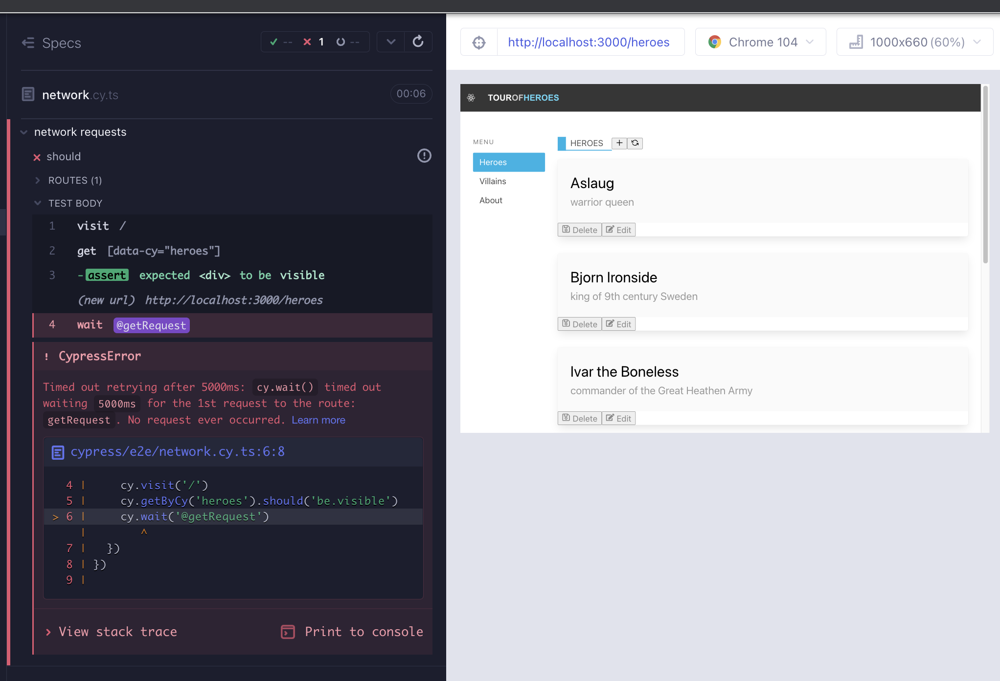
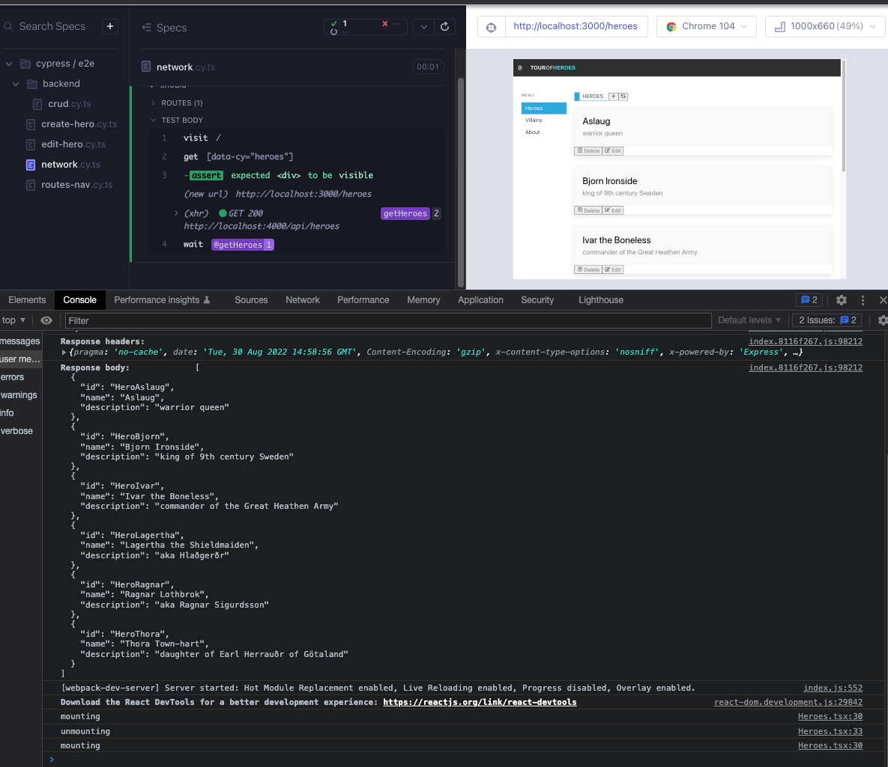
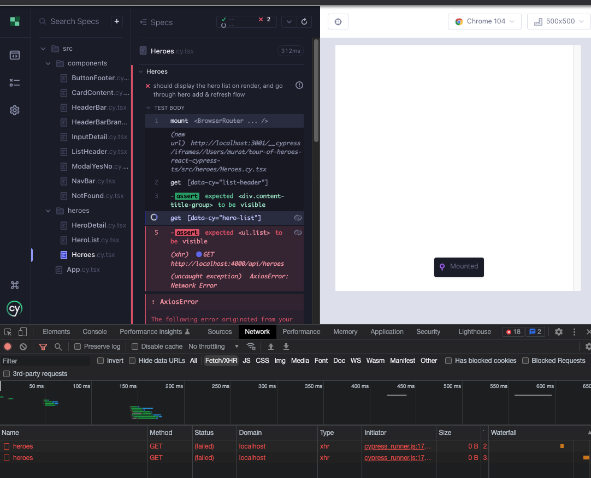
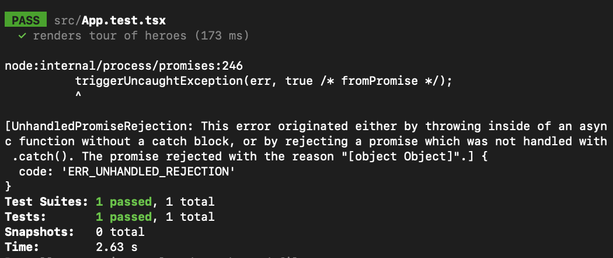
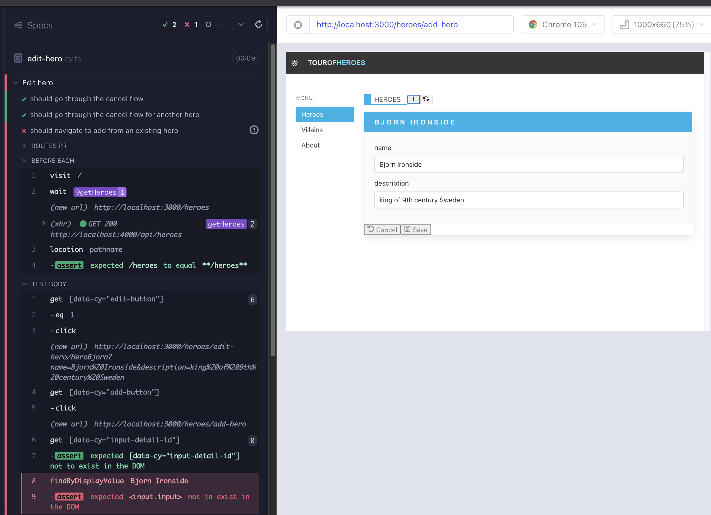

# Heroes part 3 - useEffect and HTTP

## HTTP istekleri

Şimdiye kadar `src/heroes/Heroes.tsx` dosyasında bir json dosyasını içe aktarıyorduk, hatırlayın `import heroes from './heroes.json'`. Şimdi bir arka uç sunucumuz olduğuna göre, verileri ağdan alabiliriz.

Kent C. Dodds'ın Epic React'inden:

_"HTTP istekleri, uygulamalarda yapmamız gereken diğer yaygın yan etkilerdir. Bu, oluşturulan DOM'a uyguladığımız yan etkilerle ya da localStorage gibi tarayıcı API'leriyle etkileşim kurarken olduğu gibi farklı değildir. Tüm bu durumlarda, bunları bir `useEffect` kancası geri çağırma işlevi içinde yaparız. Bu kancı, belirli değişiklikler meydana geldiğinde, bu değişikliklere dayalı olarak yan etkileri uygularız."_

`HeroList`i yüklerken, uygulamamızın arka uca bir `GET` isteği yapması gerekmektedir. Bunun için başarısız bir e2e testi yazalım (Kırmızı 1). Şimdilik dosyaya istediğimiz ismi verebiliriz. `HeroList`i yüklüyoruz, ancak şu anda sunucuya yapılan `GET` istekleri yok.

```typescript
// cypress/e2e/network.cy.ts
describe("network requests", () => {
  it("should ", () => {
    cy.intercept("GET", "http://localhost:4000/api/heroes").as("getHeroes");
    cy.visit("/");
    cy.wait("@getHeroes");
    cy.getByCy("heroes").should("be.visible");
    cy.getByCyLike("hero-list-item").should("have.length.gt", 0);
  });
});
```



`axios` kullanarak yerleşik `fetch` API'si yerine başka bir seçenek kullanacağız. `yarn add axios`. Bir `useEffect` kancasında `axios.get` kullanarak sunucumuza bir `GET` isteği yapın (Yeşil 1). `useEffect`, bileşenin bağını kaldıran bir temizleme işlevi alır.

```typescript
// src/heroes/Heroes.tsx
import { useNavigate, Routes, Route } from "react-router-dom";
import ListHeader from "components/ListHeader";
import ModalYesNo from "components/ModalYesNo";
import HeroList from "./HeroList";
import heroes from "./heroes.json";
import { useEffect, useState } from "react";
import HeroDetail from "./HeroDetail";
import axios from "axios";

export default function Heroes() {
  const [showModal, setShowModal] = useState<boolean>(false);
  const getData = () =>
    axios.get("http://localhost:4000/api/heroes").then((res) => res.data);

  useEffect(() => {
    console.log("mounting");
    getData();

    return () => console.log("unmounting");
  });

  const navigate = useNavigate();
  const addNewHero = () => navigate("/heroes/add-hero");
  const handleRefresh = () => navigate("/heroes");

  const handleCloseModal = () => {
    setShowModal(false);
  };
  const handleDeleteHero = () => {
    setShowModal(true);
  };
  const handleDeleteFromModal = () => {
    setShowModal(false);
    console.log("handleDeleteFromModal");
  };

  return (
    <div data-cy="heroes">
      <ListHeader
        title="Heroes"
        handleAdd={addNewHero}
        handleRefresh={handleRefresh}
      />
      <div>
        <div>
          <Routes>
            <Route
              path=""
              element={
                <HeroList heroes={heroes} handleDeleteHero={handleDeleteHero} />
              }
            />
            <Route path="/add-hero" element={<HeroDetail />} />
            <Route path="/edit-hero/:id" element={<HeroDetail />} />
            <Route
              path="*"
              element={
                <HeroList heroes={heroes} handleDeleteHero={handleDeleteHero} />
              }
            />
          </Routes>
        </div>
      </div>

      {showModal && (
        <ModalYesNo
          message="Would you like to delete the hero?"
          onNo={handleCloseModal}
          onYes={handleDeleteFromModal}
        />
      )}
    </div>
  );
}
```

Test başarılı olur, ancak konsola baktığımızda bileşenin bağlandığını, bağının kaldırıldığını ve tekrar bağlandığını görürüz. Bu arada, API'ye 2 çağrı yapılır. İlk çağrıda yanıt gövdesinde hiçbir şey yoktur, ikincisi ise kahramanları alır. Burada `useEffect` bağımlılık dizisi ile ilgili bir yan not düşelim ve konuya daha sonra geri dönelim.

- `useEffect(fn, [a, b, c])` -> a, b veya c değiştiğinde etkiyi çalıştır
- `useEffect(fn, [a])` -> a değiştiğinde etkiyi çalıştır
- `useEffect(fn, [])` -> etkiyi çalıştır... hiçbir şey değişmediğinde, bu yüzden sadece bir kez çalışır
- `useEffect(fn)` -> her render'da etkiyi çalıştır



## Sabit kodlanmış json verilerini kaldırma

`heroes` verilerini `db.json` dosyasından içe aktarıyoruz. Şimdi bunları ağdan almanın zamanı. İçe aktarmayı devre dışı bıraktığımızda, değişken artık mevcut olmadığı için bileşende tür hataları alırız, ayrıca listede hiç kahraman olmadığı için test başarısız olur (Kırmızı 2).

useEffect ile bazı veriler alıyoruz, ancak bu verileri bileşendeki bir state değişkeninde saklamamız gerekiyor. `const [heroes, setHeroes] = useState([])` şeklinde `useState` kullanacağız ve ağdan aldığımız kahramanları ayarlayacağız.

```typescript
// src/heroes/Heroes.tsx
import { useNavigate, Routes, Route } from "react-router-dom";
import ListHeader from "components/ListHeader";
import ModalYesNo from "components/ModalYesNo";
import HeroList from "./HeroList";
import { useEffect, useState } from "react";
import HeroDetail from "./HeroDetail";
import axios from "axios";

export default function Heroes() {
  const [showModal, setShowModal] = useState<boolean>(false);
  const [heroes, setHeroes] = useState([]);

  const getData = () =>
    axios.get("http://localhost:4000/api/heroes").then((res) => res.data);

  useEffect(() => {
    console.log("mounting");
    getData().then((data) => {
      setHeroes(data);
    });

    return () => console.log("unmounting");
  }, []); // empty array to have the effect occur only once

  const navigate = useNavigate();
  const addNewHero = () => navigate("/heroes/add-hero");
  const handleRefresh = () => navigate("/heroes");

  const handleCloseModal = () => {
    setShowModal(false);
  };
  const handleDeleteHero = () => {
    setShowModal(true);
  };
  const handleDeleteFromModal = () => {
    setShowModal(false);
    console.log("handleDeleteFromModal");
  };

  return (
    <div data-cy="heroes">
      <ListHeader
        title="Heroes"
        handleAdd={addNewHero}
        handleRefresh={handleRefresh}
      />
      <div>
        <div>
          <Routes>
            <Route
              path=""
              element={
                <HeroList heroes={heroes} handleDeleteHero={handleDeleteHero} />
              }
            />
            <Route path="/add-hero" element={<HeroDetail />} />
            <Route path="/edit-hero/:id" element={<HeroDetail />} />
            <Route
              path="*"
              element={
                <HeroList heroes={heroes} handleDeleteHero={handleDeleteHero} />
              }
            />
          </Routes>
        </div>
      </div>

      {showModal && (
        <ModalYesNo
          message="Would you like to delete the hero?"
          onNo={handleCloseModal}
          onYes={handleDeleteFromModal}
        />
      )}
    </div>
  );
}
```

Bu işe yarayacaktır, ancak testi açık bırakırsak, sunucuya tekrarlanan `GET` istekleri yapıldığını ve bileşenin sürekli bağlandığını göreceğiz. Bileşenin render edildiğinde etkinin sadece bir kez gerçekleşmesi için boş bir `useEffect` bağımlılık dizisi kullanabiliriz. Kısaltmak adına, işte değiştirilen kod (Yeşil 2):

```typescript
useEffect(() => {
  console.log("mounting");
  console.log("heroes is :", heroes);
  getData().then((data) => {
    setHeroes(data);
  });

  return () => console.log("unmounting");
}, []); // empty array to have the effect occur only once
```

Biraz daha fazla düzenleme yaparak `axios` hata mesajlarına destek ekleyebilir ve maliyetli `axios.get` işlemini `useCallBack` içinde sarabiliriz. Neden `useCallback`? Kısacası, özel fonksiyonlar her render işlemi sırasında tanımlanır ve özellikle ağ durumu aynı olduğunda maliyetli olabilir. `useCallback`, değerlerin yeniden tanımlanmasını veya yeniden hesaplanmasını önleyerek böyle maliyetli işlemleri hafızaya almayı sağlar. İmza şu şekildedir: `useCallBack(updaterFn, [dependencies])` (Düzenleme 2).

```tsx
// src/heroes/Heroes.tsx
import { useNavigate, Routes, Route } from "react-router-dom";
import ListHeader from "components/ListHeader";
import ModalYesNo from "components/ModalYesNo";
import HeroList from "./HeroList";
import { useCallback, useEffect, useState } from "react";
import HeroDetail from "./HeroDetail";
import axios, { AxiosResponse } from "axios";

export default function Heroes() {
  const [showModal, setShowModal] = useState<boolean>(false);
  const [heroes, setHeroes] = useState([]);

  // TODO: identify a better type later
  // eslint-disable-next-line @typescript-eslint/no-explicit-any
  const parseList = (response: AxiosResponse<any>) => {
    if (response.status !== 200) throw Error(response.statusText);
    let list = response.data;
    if (typeof list !== "object") {
      list = [];
    }
    console.log(list);
    return list;
  };

  const getData = useCallback(async () => {
    const response = await axios.get("http://localhost:4000/api/heroes");
    return parseList(response);
  }, []);

  useEffect(() => {
    console.log("mounting");
    getData().then((data) => {
      setHeroes(data);
    });

    return () => console.log("unmounting");
  }, []); // empty array to have the effect occur only once

  const navigate = useNavigate();
  const addNewHero = () => navigate("/heroes/add-hero");
  const handleRefresh = () => navigate("/heroes");

  const handleCloseModal = () => {
    setShowModal(false);
  };
  const handleDeleteHero = () => {
    setShowModal(true);
  };
  const handleDeleteFromModal = () => {
    setShowModal(false);
    console.log("handleDeleteFromModal");
  };

  return (
    <div data-cy="heroes">
      <ListHeader
        title="Heroes"
        handleAdd={addNewHero}
        handleRefresh={handleRefresh}
      />
      <div>
        <div>
          <Routes>
            <Route
              path=""
              element={
                <HeroList heroes={heroes} handleDeleteHero={handleDeleteHero} />
              }
            />
            <Route path="/add-hero" element={<HeroDetail />} />
            <Route path="/edit-hero/:id" element={<HeroDetail />} />
            <Route
              path="*"
              element={
                <HeroList heroes={heroes} handleDeleteHero={handleDeleteHero} />
              }
            />
          </Routes>
        </div>
      </div>

      {showModal && (
        <ModalYesNo
          message="Would you like to delete the hero?"
          onNo={handleCloseModal}
          onYes={handleDeleteFromModal}
        />
      )}
    </div>
  );
}
```

## Bileşen testlerini ağ farkındalığı ile güncelleme

`Heroes` bileşeninin tasarımını e2e test ile yönlendirdik. Artık `useEffect` kullanarak bileşen bir `axios` isteği yapacak. Bileşen testi `Heroes.cy.tsx` çalıştırılırken ağ çağrısının gerçekleştiğini ve başarısız olduğunu görebiliriz.



Bileşenin bunu render edebilmesi için ağı bazı verilerle taklit etmemiz gerekiyor. Cypress fixtures'daki `heroes.json` dosyasından taklit verilerle yanıt verecek şekilde `src/heroes/Heroes.cy.tsx` ve `src/App.cy,tsx` dosyalarına bir `cy.intercept` ekleyin. Intercept, `http://localhost:4000/api/heroes` adresine yapılan tüm `GET` isteklerinin Cypress fixtures'daki `heroes.json` dosyasından gelen taklit verilerle yanıtlanmasını sağlayacaktır.

```tsx
// src/heroes/Heroes.cy.tsx
import Heroes from "./Heroes";
import { BrowserRouter } from "react-router-dom";
import "../styles.scss";

describe("Heroes", () => {
  beforeEach(() => {
    cy.intercept("GET", "http://localhost:4000/api/heroes", {
      fixture: "heroes.json",
    }).as("getHeroes");
  });
  it("should display the hero list on render, and go through hero add & refresh flow", () => {
    cy.mount(
      <BrowserRouter>
        <Heroes />
      </BrowserRouter>
    );

    cy.wait("@getHeroes");

    cy.getByCy("list-header").should("be.visible");
    cy.getByCy("hero-list").should("be.visible");

    cy.getByCy("add-button").click();
    cy.location("pathname").should("eq", "/heroes/add-hero");

    cy.getByCy("refresh-button").click();
    cy.location("pathname").should("eq", "/heroes");
  });

  const invokeHeroDelete = () => {
    cy.getByCy("delete-button").first().click();
    cy.getByCy("modal-yes-no").should("be.visible");
  };
  it("should go through the modal flow", () => {
    cy.window()
      .its("console")
      .then((console) => cy.spy(console, "log").as("log"));

    cy.mount(
      <BrowserRouter>
        <Heroes />
      </BrowserRouter>
    );

    cy.getByCy("modal-yes-no").should("not.exist");

    cy.log("do not delete flow");
    invokeHeroDelete();
    cy.getByCy("button-no").click();
    cy.getByCy("modal-yes-no").should("not.exist");

    cy.log("delete flow");
    invokeHeroDelete();
    cy.getByCy("button-yes").click();
    cy.getByCy("modal-yes-no").should("not.exist");
    cy.get("@log").should("have.been.calledWith", "handleDeleteFromModal");
  });
});
```

```tsx
// src/App.cy.tsx
import App from "./App";

describe("ct sanity", () => {
  it("should render the App", () => {
    cy.intercept("GET", "http://localhost:4000/api/heroes", {
      fixture: "heroes.json",
    }).as("getHeroes");

    cy.mount(<App />);
    cy.getByCy("not-found").should("be.visible");

    cy.contains("Heroes").click();
    cy.getByCy("heroes").should("be.visible");

    cy.contains("About").click();
    cy.getByCy("about").should("be.visible");
  });
});
```

Ayrıca, `App.cy.tsx`'i yansıtan RTL birim testi `src/App.test.tsx`'i de güncellememiz gerekiyor. Birim testini çalıştırırken başarısız olmaz, ancak hata birleştirme engelleyicisi olacaktır. Sorunun ne olduğunu sadece daha önce gördüğümüz için veya bileşen test çalıştırıcısında gerçek tarayıcıyı kullanarak bileşenin ağ çağrısının gerçekleştiğini gördüğümüz için biliyoruz. **Cypress ile bileşen testi, gerçek tarayıcıyı kullanarak Jest / RTL kullanarak yapılması daha zor olan uygulamadaki sorunları teşhis etmeye yardımcı olabilir.**



RTL'de `cy.intercept`'in eşdeğeri [`msw`](https://mswjs.io/) 'dir. `yarn add -D msw` ile yükleyin. Dosyayı şu şekilde değiştirin:

```tsx
// src/App.test.tsx
import { render, screen } from "@testing-library/react";
import userEvent from "@testing-library/user-event";
import App from "./App";
import { heroes } from "../db.json";

import { rest } from "msw";
import { setupServer } from "msw/node";

const handlers = [
  rest.get("http://localhost:4000/api/heroes", async (_req, res, ctx) => {
    return res(ctx.status(200), ctx.json(heroes));
  }),
];
const server = setupServer(...handlers);

beforeAll(() => {
  server.listen({
    onUnhandledRequest: "warn",
  });
});

afterEach(() => {
  server.resetHandlers();
});

afterAll(() => {
  server.close();
});

test("renders tour of heroes", async () => {
  render(<App />);

  await userEvent.click(screen.getByText("About"));
  expect(screen.getByTestId("about")).toBeVisible();

  await userEvent.click(screen.getByText("Heroes"));
  expect(screen.getByTestId("heroes")).toBeVisible();
});
```

Sonunda, tüm e2e testlerinde, URL'yi ziyaret ettikten sonra ağ verilerini beklememiz gerekiyor. Sayfanın stabil olduğundan ve ağ verilerini yüklediğinden emin olmak için, `create-hero.cy.tsx`, `edit-hero.cy.tsx` ve `network.cy.tsx` dosyalarında, `cy.visit` örneklerini bir kesme ve bekleme ile sarın:

```typescript
cy.intercept("GET", "http://localhost:4000/api/heroes").as("getHeroes");
cy.visit("/");
cy.wait("@getHeroes");
```

## Akışları test etme: alternatif kahraman ekleme

`ListHeader` bileşeninin `+` düğmesini kullanarak, herhangi bir ekrandan bir kahraman ekleyebiliriz. Mevcut e2e testimiz, kahraman listesinden veya doğrudan URL'ye yönlendirerek `HeroDetails`'e ulaşır. Ne yazık ki, kahramanı düzenleme yoluyla da `HeroDetails`'e ulaşabiliriz, bu da kahraman verileri ile `HeroDetais`'in başka bir oluşturmasıdır. `+` düğmesine tıkladığında görüntülenen Kimlik alanının ve ad ve açıklama alanlarındaki verilerin temizlenmesi gereken bu akış ilginçtir. Bunu test etmek için bir test yazalım (Kırmızı 3).

```typescript
// cypress/e2e/edit-hero.cy.ts
describe("Edit hero", () => {
  beforeEach(() => {
    cy.intercept("GET", "http://localhost:4000/api/heroes").as("getHeroes");
    cy.visit("/");
    cy.wait("@getHeroes");
    cy.location("pathname").should("eq", "/heroes");
  });
  it("should go through the cancel flow", () => {
    cy.fixture("heroes").then((heroes) => {
      cy.getByCy("edit-button").eq(0).click();
      cy.location("pathname").should(
        "include",
        `/heroes/edit-hero/${heroes[0].id}`
      );
      cy.getByCy("hero-detail").should("be.visible");
      cy.getByCy("input-detail-id").should("be.visible");
      cy.findByDisplayValue(heroes[0].id).should("be.visible");
      cy.findByDisplayValue(heroes[0].name).should("be.visible");
      cy.findByDisplayValue(heroes[0].description).should("be.visible");

      cy.getByCy("cancel-button").click();
      cy.location("pathname").should("eq", "/heroes");
      cy.getByCy("hero-list").should("be.visible");
    });
  });

  it("should go through the cancel flow for another hero", () => {
    cy.fixture("heroes").then((heroes) => {
      cy.getByCy("edit-button").eq(1).click();
      cy.location("pathname").should(
        "include",
        `/heroes/edit-hero/${heroes[1].id}`
      );
      cy.getByCy("hero-detail").should("be.visible");
      cy.getByCy("input-detail-id").should("be.visible");
      cy.findByDisplayValue(heroes[1].id).should("be.visible");
      cy.findByDisplayValue(heroes[1].name).should("be.visible");
      cy.findByDisplayValue(heroes[1].description).should("be.visible");

      cy.getByCy("cancel-button").click();
      cy.location("pathname").should("eq", "/heroes");
      cy.getByCy("hero-list").should("be.visible");
    });
  });

  it("should navigate to add from an existing hero", () => {
    cy.fixture("heroes").then((heroes) => {
      cy.getByCy("edit-button").eq(1).click();

      cy.getByCy("add-button").click();
      cy.getByCy("input-detail-id").should("not.exist");
      cy.findByDisplayValue(heroes[1].name).should("not.exist");
      cy.findByDisplayValue(heroes[1].description).should("not.exist");
    });
  });
});
```

Test başarısız olur. Koşullu işleme çalışıyor, ancak `InputDetail` bileşeninin ( `HeroDetail`'in alt bileşeni) durumu devredilir.



Değeri alıp sadece görüntülemek yerine, `InputDetail`'i durumun farkında kılmalıyız. Bunu, durumu en alakalı olduğu yerde, bileşenin kendisinde yöneterek ve `useState` ve `useEffect` kombinasyonunu kullanarak başarabiliriz. `shownValue` adında bir değişken ve onun için bir ayarlayıcı bulunur. Bileşen bağlandığında, `useEffect`'i değeri ayarlamak için kullanırız. Ayrıca, değer için bir bağımlılık dizisi belirtiriz (Yeşil 3).

```tsx
// src/components/InputDetail.tsx
import { ChangeEvent, useEffect, useState } from "react";

type InputDetailProps = {
  name: string;
  value: string;
  placeholder?: string;
  onChange?: (e: ChangeEvent<HTMLInputElement>) => void;
  readOnly?: boolean;
};

export default function InputDetail({
  name,
  value,
  placeholder,
  onChange,
  readOnly,
}: InputDetailProps) {
  const [shownValue, setShownValue] = useState("");
  useEffect(() => {
    setShownValue(value);
  }, [value]);

  return (
    <div data-cy={`input-detail-${name}`} className="field">
      <label className="label" htmlFor={name}>
        {name}
      </label>
      <input
        name={name}
        role={name}
        defaultValue={shownValue}
        placeholder={placeholder}
        onChange={onChange}
        readOnly={readOnly}
        className="input"
        type="text"
      ></input>
    </div>
  );
}
```

Benzer şekilde yönlendirmeye, uygulamadaki endişelerimiz daha üst düzey olduğunda, yani durum yönetimi ve akışlar söz konusu olduğunda, e2e testler, bileşen testleriyle test edemeyeceğimiz hataları yakalamada etkili olabilir. E2e test şimdi çalışıyor ve bileşen testi geriye dönük güvence sağlar. `onChange` şimdi iki kez vs üç kez çağrılır ve bu güncellemenin tek farkıdır.

```tsx
// src/components/InputDetail.cy.tsx
import InputDetail from "./InputDetail";
import "../styles.scss";

describe("InputDetail", () => {
  const placeholder = "Aslaug";
  const name = "name";
  const value = "some value";
  const newValue = "42";

  it("should allow the input field to be modified", () => {
    cy.mount(
      <InputDetail
        name={name}
        value={value}
        placeholder={placeholder}
        onChange={cy.stub().as("onChange")}
      />
    );

    cy.contains("label", name);
    cy.findByPlaceholderText(placeholder).clear().type(newValue);
    cy.findByDisplayValue(newValue);
    cy.get("@onChange").its("callCount").should("eq", newValue.length);
  });

  it("should not allow the input field to be modified", () => {
    cy.mount(
      <InputDetail
        name={name}
        value={value}
        placeholder={placeholder}
        readOnly={true}
      />
    );

    cy.contains("label", name);
    cy.findByPlaceholderText(placeholder)
      .should("have.value", value)
      .and("have.attr", "readOnly");
  });
});
```

## Yeniden Düzenleme

### Ortam değişkenleri

Tüm `http://localhost:4000/api` referanslarını ortam değişkeniyle yeniden düzenleme zamanı geldi. Create React App (CRA), `dotenv` paketiyle zaten kurulmuş durumda. Tek gereksinim, değişken adlarının `REACT_APP_` ile başlamasıdır. Hemen API URL'si ile bir `.env` dosyası oluşturabiliriz.

```
REACT_APP_API_URL=http://localhost:4000/api
```

```tsx
// src/heroes/Heroes.tsx
const getData = useCallback(async () => {
  const response = await axios.get(`${process.env.REACT_APP_API_URL}/heroes`);
  return parseList(response);
}, []);
```

```tsx
// src/App.test.tsx
const handlers = [
  rest.get(
    `${process.env.REACT_APP_API_URL}/heroes`,
    async (_req, res, ctx) => {
      return res(ctx.status(200), ctx.json(heroes));
    }
  ),
];
```

`.env` dosyasının eşdeğeri, `./cypress.config.js` dosyasındaki `env` özelliğidir. Bu özellik, `e2e`, `component` veya her ikisine özgü olabilir ve özelliğin yerleştirildiği yere bağlıdır.

```tsx
// cypress.config.js

/* eslint-disable @typescript-eslint/no-unused-vars */
const { defineConfig } = require("cypress");

module.exports = defineConfig({
  experimentalSingleTabRunMode: true,
  retries: {
    runMode: 2,
    openMode: 0,
  },
  env: {
    API_URL: "http://localhost:4000/api",
  },
  e2e: {
    specPattern: "cypress/e2e/**/*.cy.{js,jsx,ts,tsx}",
    baseUrl: "http://localhost:3000",
    setupNodeEvents(_on, _config) {
      // implement node event listeners here
      // and load any plugins that require the Node environment
    },
  },

  component: {
    specPattern: "src/**/*.cy.{js,jsx,ts,tsx}",
    devServer: {
      framework: "create-react-app",
      bundler: "webpack",
      webpackConfig: {
        // workaround to react scripts 5 issue https://github.com/cypress-io/cypress/issues/22762#issuecomment-1185677066
        devServer: {
          port: 3001,
        },
      },
    },
  },
});
```

Bileşen ve e2e testlerindeki `http://localhost:4000/api` dizesi örneklerini, `${Cypress.env('API_URL')}` şablon dizesiyle değiştirin. Değişiklik yapılması gereken dosyalar şunlardır:

- _cypress/e2e/create-hero.cy.ts_
- _cypress/e2e/edit-hero.cy.ts_
- _cypress/e2e/network-hero.cy.ts_
- _cypress/support/commands.ts_
- _src/App.cy.tsx_
- _src/components/InputDetail.cy.tsx_
- _src/heroes/Heroes.cy.tsx_

### Özel kanca `useAxios`

HTTP mantığının 20-30 satırını kendi kanca içine çıkarabilir ve ardından `Heroes` bileşeninde bu kanca kullanabiliriz. Kancamız argüman olarak bir rota kabul eder, veri, durum ve hata nesnesini döndürür. Ayrıca `useEffect` temizleme ile ilgili kaygıları ele alır. Detayları yorumlarda ve gelecek bölümlerde daha iyi bir çözüm kullanarak ele alacağız.

```typescript
// src/hooks/useAxios.ts
import { useCallback, useEffect, useState } from "react";
import axios from "axios";

const getItem = (route: string) =>
  axios({
    method: "GET",
    baseURL: `${process.env.REACT_APP_API_URL}/${route}`,
  })
    .then((res) => res.data)
    .catch((err) => {
      throw Error(`There was a problem fetching data: ${err}`);
    });

/** Takes a url, returns an object of data, status & error */
export default function useAxios(url: string) {
  const [data, setData] = useState();
  const [error, setError] = useState(null);
  const [status, setStatus] = useState("idle");

  const getItemCb = useCallback((route: string) => {
    return getItem(route);
  }, []);

  // When fetching data within a call to useEffect,
  // combine a local variable and the cleanup function
  // in order to match a data request with its response:
  // If the component re-renders, the cleanup function for the previous render
  // will set the previous render’s doUpdate variable to false,
  // preventing the previous then method callback from performing updates with stale data.
  // eslint-disable-next-line @typescript-eslint/ban-ts-comment
  // @ts-ignore
  useEffect(() => {
    let doUpdate = true;

    setData(undefined);
    setError(null);
    setStatus("loading");

    getItemCb(url)
      .then((data) => {
        if (doUpdate) {
          setData(data);
          setStatus("success");
        }
      })
      .catch((error) => {
        if (doUpdate) {
          setError(error);
          setStatus("error");
        }
      });

    return () => (doUpdate = false);
  }, [url]);

  return { data, status, error };
}
```

`Heroes` bileşeninde artık `useState` kullanmamıza gerek yok çünkü verileri `useAxios` ile alıyoruz. Sadece `data` değişkenini yeniden adlandırıp `heroes` olarak başlatmalıyız.

```tsx
// src/heroes/Heroes.tsx
import { useNavigate, Routes, Route } from "react-router-dom";
import ListHeader from "components/ListHeader";
import ModalYesNo from "components/ModalYesNo";
import HeroList from "./HeroList";
import { useState } from "react";
import HeroDetail from "./HeroDetail";
import useAxios from "hooks/useAxios";

export default function Heroes() {
  const [showModal, setShowModal] = useState<boolean>(false);
  const { data: heroes = [] } = useAxios("heroes");

  const navigate = useNavigate();
  const addNewHero = () => navigate("/heroes/add-hero");
  const handleRefresh = () => navigate("/heroes");

  const handleCloseModal = () => {
    setShowModal(false);
  };
  const handleDeleteHero = () => {
    setShowModal(true);
  };
  const handleDeleteFromModal = () => {
    setShowModal(false);
    console.log("handleDeleteFromModal");
  };

  return (
    <div data-cy="heroes">
      <ListHeader
        title="Heroes"
        handleAdd={addNewHero}
        handleRefresh={handleRefresh}
      />
      <div>
        <div>
          <Routes>
            <Route
              path=""
              element={
                <HeroList heroes={heroes} handleDeleteHero={handleDeleteHero} />
              }
            />
            <Route path="/add-hero" element={<HeroDetail />} />
            <Route path="/edit-hero/:id" element={<HeroDetail />} />
            <Route
              path="*"
              element={
                <HeroList heroes={heroes} handleDeleteHero={handleDeleteHero} />
              }
            />
          </Routes>
        </div>
      </div>

      {showModal && (
        <ModalYesNo
          message="Would you like to delete the hero?"
          onNo={handleCloseModal}
          onYes={handleDeleteFromModal}
        />
      )}
    </div>
  );
}
```

## Özet

Başarısız bir e2e testi yazdık, uygulama yüklenirken beklenen bir http GET çağrısına `/heroes` yolunda casusluk yaptık (Kırmızı 1).

Verileri `/heroes` rotasına yönelik bir `axios.get` çağrısı yaparak alan `useEffect` ekledik (Yeşil 1).

</br>

Verileri almak için json dosyası içe aktarmasını kaldırdık, `useState` kullandık ve veri dizisini `useEffect` içinde ayarladık (Kırmızı 2, Yeşil 2).

</br>

Yeniden düzenlemeler:

Http GET etkisinin sadece bir kez gerçekleşmesi için boş bir dizi kullandık. Pahalı işlevleri sarmak için `useCallback` gösterdik.

Bileşen testlerini ve ağa bağlı birim testini güncelledik, Cypress için `cy.intercept` ve RTL için `msw` ile ağı örnekledik.

DOM yerleştikten sonra kullanıcı arayüzü iddialarının başlayabilmesi için e2e testlerini ağı beklemeye güncelledik.

</br>

Alternatif bir kahraman ekleme akışını kapsayan yeni bir e2e testi ekledik; kahramanı düzenlemekten kahraman ekleme yoluna geçiş (Kırmızı 3).

Başarısızlığı ele almak için durumu en alakalı olduğu yerde yönettik; `InputDetail` bileşeni. Sadece `useState` ve `useEffect` kullandık (Yeşil 3).

</br>

Yeniden düzenlemeler:

Sabit kodlanmış api yolunu bir ortam değişkenine çevirdik.

Bir `useAxios` kancası kullanarak verileri bileşende soyut bir şekilde sunuyoruz.

</br>

## Önemli Noktalar

- Kent Dodds'tan: _"HTTP istekleri, uygulamalarda yapmamız gereken başka yaygın yan etkilerdir. Bu, işlenmiş DOM'a uygulamalar yapmamız gereken yan etkilerle ya da localStorage gibi tarayıcı API'leriyle etkileşimde bulunmamız gereken yan etkilerden farklı değildir. Tüm bu durumlarda, bunları bir `useEffect` kancası geri çağırma içinde yaparız. Bu kancanın yardımıyla, belirli değişiklikler meydana geldiğinde, bu değişikliklere dayalı yan etkileri uygularız."_
- Uygulamadan backend'e http çağrıları yapmak için yerleşik `fetch` API'sini veya `axios` kullanabiliriz.
- `useEffect` bağımlılık dizisi:
  - `useEffect(fn, [a, b, c])` -> a, b veya c değiştiğinde etkiyi çalıştır
  - `useEffect(fn, [a])` -> a değiştiğinde etkiyi çalıştır
  - `useEffect(fn, [])` -> etkiyi çalıştır... hiçbir şey değişmediğinde, bu yüzden sadece bir kez çalışır
  - `useEffect(fn)` -> her render işlemde etkiyi çalıştır
- Tekrarlanan çağrıları hafızada tutmak için pahalı işlevleri `useCallback` ile sarın.
- `useState` ve `useEffect` ile çoğu http durumunu yönetebiliriz, ancak uygulama ölçeklendikçe uygulama büyüyebilir.
- Cypress ile bileşen testi yaparak, gerçek tarayıcıyı kullanarak, Jest/RTL kullanarak yapmaktan daha zor olabilecek uygulama sorunlarını teşhis etmeye yardımcı olabilir.
- Bileşen testleri ağ çağrıları yapıyorsa, [`cy.intercept`](https://docs.cypress.io/api/commands/intercept) API'si ile ağı örnekleyebiliriz. Jest/RTL için `cy.intercept`'in zıttı [`msw`](https://mswjs.io/docs/) 'dir.
- Yönlendirmeye benzer şekilde, uygulamayla ilgili endişelerimiz durum yönetimi ve akışlar gibi daha yüksek düzeyde olduğunda, bileşen testleriyle kapsayamayabileceğimiz kenar durumlarını yakalamak için e2e testleri etkilidir.
