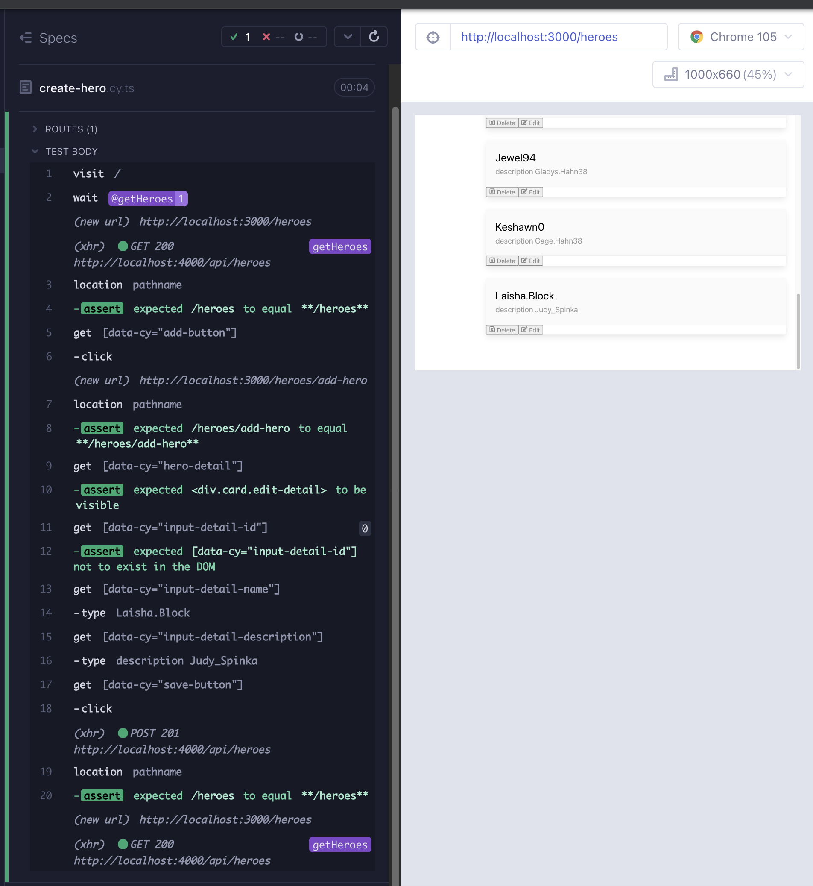
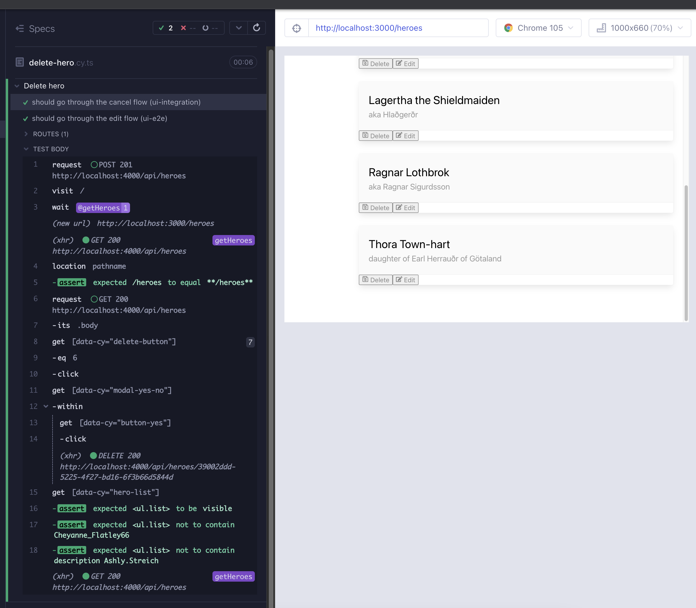

# react-query

### Önbellekleme ve [`react-query`](https://react-query-v3.tanstack.com/overview)

Kent C. Dodds'tan iyi dersler alarak, önceki bölümlerde sunucu önbelleğini ayrı bir şeye bölersek, kullanıcı arayüzü durum yönetimini büyük ölçüde basitleştirebileceğimizi belirttik. Durum iki kümeye ayrılabilir:

1. Kullanıcı arayüzü durumu: Modal açık, öğe vurgulanmış vb. *(bunun için `useState` kancaını kullandık)*
2. Sunucu önbelleği: Kullanıcı verileri, tweet'ler, kişiler vb. *(`react-query` burada yararlıdır)*

Neden `react-query`? Yeniden çoğaltılmış veri almayı önlemek için, tüm veri alıcı kodunu merkezi bir depoya taşımak ve ona ihtiyaç duyan bileşenlerden bu tek kaynağa erişmek istiyoruz. React Query ile böyle bir depo oluşturma işleminde herhangi bir iş yapmamıza gerek yok. Veri alıcı kodunu veriye ihtiyaç duyan bileşenlerde tutmamıza izin verir, ancak arka planda bir veri önbelleği yönetir ve bileşenler onları istediğinde zaten alınan verileri iletir.

React-query'nin [`useQuery`](https://tanstack.com/query/v4/docs/reference/useQuery) kancası, veriyi anahtarla alarak ve önbelleğe alarak güncellemek içindir. Bunu bir `GET` isteği gibi düşünün. Anahtar argümanı, önbellekteki sorgu / veri için benzersiz bir tanımlayıcıdır; dize, dizi veya nesne. İkinci argüman, veriyi döndüren bir async işlevidir.

```
const { data, status, error } = useQuery(key, () => fetch(url))
```

`useMutation`, `useQuery`'nin yazma yansımasıdır. Bunu `PUT` ve `POST` isteklerimize benzer şekilde düşünün. `useMutation`, data, status, error gibi useQuery ile aynı değerleri sağlar. İlk argüman, idempotent olmayan bir isteği yürüten bir işlevidir. İkinci argüman, onMutate özelliğine sahip bir nesnedir.

```
const { dataToMutate, status, error } = useMutation((*url*) => fetch(*url*) {...})
```

- `useQuery` durumu alır: Kullanıcı arayüzü durumu <- sunucu / url ve onu önbelleğe alır.
- `useMutation` tam tersidir: Kullanıcı arayüzü durumu -> sunucu ve yine de önbelleğe alır.

Bu bölümde API'mizi oluşturacak, kahramanlar üzerinde CRUD işlemleri için kancalar oluşturacak ve bunları bileşenlerde kullanacağız.

### API

`useAxios` kancasındaki `getItem` işlevini çoğaltacağız ve diğer CRUD istekleriyle uyumlu hale getireceğiz. `src/hooks/api.ts` adında bir dosya oluşturun ve aşağıdaki kodu yapıştırın. `Axios`'u saran tür korumalı bir `client` işlevimiz var, bununla herhangi bir CRUD isteği yapabiliriz. Daha az argümanlı işlevlerle bunları tekrar sararız, bu şekilde kullanmaları daha kolaydır.

```typescript
// src/hooks/api.ts
import axios from "axios";
import { Hero } from "models/Hero";

export type CrudType = "GET" | "POST" | "PUT" | "DELETE";
export type CrudOptions = { item?: Hero | object; config?: object };

export const client = (route: string, method: CrudType, item?: Hero | object) =>
  axios({
    method,
    baseURL: `${process.env.REACT_APP_API_URL}/${route}`,
    data: method === "POST" || method === "PUT" ? item : undefined,
  })
    .then((res) => res.data)
    .catch((err) => {
      throw Error(`There was a problem fetching data: ${err}`);
    });

export const createItem = (route: string, item: Hero | object) =>
  client(route, "POST", item);

export const editItem = (route: string, item: Hero | object) =>
  client(route, "PUT", item);

export const deleteItem = (route: string) => client(route, "DELETE");

export const getItem = (route: string) => client(route, "GET");
```

### `useGetHeroes`

Basit bir kanca oluşturabilir ve karmaşık `useAxios`'umuzu, `react-query` tarafından önbellek yönetiminin performans kazanımlarını gösterirken değiştirebiliriz. `yarn add react-query` kullanarak ekleyin ve `src/hooks/useGetHeroes.ts` adında bir dosya oluşturun. `react-query`'in [`useQuery`](https://tanstack.com/query/v4/docs/reference/useQuery) işlevi, özel useAxios'umuza benzer: bir url alır, veri, durum ve hata nesnesi döndürür.

`const { data, status, error } = useQuery(key, () => fetch(url))`

Durumu ve kullanmadığımız hatayı da döndüren `useAxios` ile karşılaştırın:

`const {data: heroes = []} = useAxios('heroes')`

Herhangi bir bileşen daha sonra anahtarla useQuery'yi çağırdığında, `react-query` önbelleğinden önceden alınan verileri döndürür ve ardından arka planda en son verileri alır (PWAs ve hizmet işçilerine çok benzer). Sorgu anahtarımız burada `heroes` dizisi ve geri çağırma işlevi api'den `/heroes` rotasını çağıran `getItem`'dır. `useQuery` `data`, `status` ve `error` döndürür, bunları bileşenimizde daha kolay kullanım için güzel bir şekilde yeniden şekillendiririz.

```tsx
// src/hooks/useGetHeroes.ts
import { useQuery } from "react-query";
import { getItem } from "./api";

/**
 * Helper for GET to `/heroes` route
 * @returns {object} {heroes, status, getError}
 */
export const useGetHeroes = () => {
  const query = useQuery("heroes", () => getItem("heroes"));

  return {
    heroes: query.data,
    status: query.status,
    getError: query.error,
  };
};
```

`Heroes` bileşeninde `useAxios`'u değiştirmeden önce, uygulama JSX'ini `QueryClientProvider` adlı bir sağlayıcı bileşenle sarmamız, bir `queryClient` örneği oluşturmamız ve bunu `QueryClientProvider`'ın `client` prop'u olarak kullanmamız gerekmektedir. Böylece önbelleği bileşenlerin erişip paylaşabileceği şekilde kullanılabilir hale getiririz.

```tsx
// src/App.tsx
import { BrowserRouter, Routes, Route, Navigate } from "react-router-dom";
import { QueryClient, QueryClientProvider } from "react-query";
import About from "About";
import HeaderBar from "components/HeaderBar";
import NavBar from "components/NavBar";
import NotFound from "components/NotFound";
import Heroes from "heroes/Heroes";
import "./styles.scss";

const queryClient = new QueryClient();

function App() {
  return (
    <BrowserRouter>
      <HeaderBar />
      <div className="section columns">
        <NavBar />
        <main className="column">
          <QueryClientProvider client={queryClient}>
            <Routes>
              <Route path="/" element={<Navigate replace to="/heroes" />} />
              <Route path="/heroes/*" element={<Heroes />} />
              <Route path="/about" element={<About />} />
              <Route path="*" element={<NotFound />} />
            </Routes>
          </QueryClientProvider>
        </main>
      </div>
    </BrowserRouter>
  );
}

export default App;
```

`useGetHeroes`, `useAxios` için yer değiştirme özelliğine sahiptir ve hatta bir argümana bile ihtiyaç duymaz. `status` ve `getError`'ı bir sonraki bölümde kullanacağız.

```tsx
import { useNavigate, Routes, Route } from "react-router-dom";
import ListHeader from "components/ListHeader";
import ModalYesNo from "components/ModalYesNo";
import HeroList from "./HeroList";
import { useState } from "react";
import HeroDetail from "./HeroDetail";
import { useGetHeroes } from "hooks/useGetHeroes";

export default function Heroes() {
  const [showModal, setShowModal] = useState<boolean>(false);
  const { heroes, status, getError } = useGetHeroes();

  const navigate = useNavigate();
  const addNewHero = () => navigate("/heroes/add-hero");
  const handleRefresh = () => navigate("/heroes");

  const handleCloseModal = () => {
    setShowModal(false);
  };
  const handleDeleteHero = () => {
    setShowModal(true);
  };
  const handleDeleteFromModal = () => {
    setShowModal(false);
    console.log("handleDeleteFromModal");
  };

  return (
    <div data-cy="heroes">
      <ListHeader
        title="Heroes"
        handleAdd={addNewHero}
        handleRefresh={handleRefresh}
      />
      <div>
        <div>
          <Routes>
            <Route
              path=""
              element={
                <HeroList heroes={heroes} handleDeleteHero={handleDeleteHero} />
              }
            />
            <Route path="/add-hero" element={<HeroDetail />} />
            <Route path="/edit-hero/:id" element={<HeroDetail />} />
            <Route
              path="*"
              element={
                <HeroList heroes={heroes} handleDeleteHero={handleDeleteHero} />
              }
            />
          </Routes>
        </div>
      </div>

      {showModal && (
        <ModalYesNo
          message="Would you like to delete the hero?"
          onNo={handleCloseModal}
          onYes={handleDeleteFromModal}
        />
      )}
    </div>
  );
}
```

Uygulamayı `yarn dev` ile çalıştırın ve `useAxios` ile `useGetHeroes` arasında geçiş yapın. Sekmeler arasında geçiş yaparak önbelleğin sağladığı performans farkını gözlemleyin.

### `usePostHero`

Şimdiye kadar kahraman eklemek için bir özelliğe sahip değildik. Arka uç tarafı bunu destekliyor, ancak ön uç tarafı desteklemiyor. Kahraman ekleme akışı ile başarısız olan bir testle başlayalım. Yeni testimiz, ana yolu ziyaret etmek, ekle düğmesine tıklamak, yeni sayfayı doğrulamak, rastgele kahraman adı ve açıklaması doldurmak ve değişiklikleri kaydetmek için basitçe çalışır (Kırmızı 1).

```tsx
// cypress/e2e/create-hero.cy.ts
import { faker } from "@faker-js/faker";
describe("Create hero", () => {
  it("should go through the refresh flow", () => {
    cy.intercept("GET", `${Cypress.env("API_URL")}/heroes`).as("getHeroes");
    cy.visit("/");
    cy.wait("@getHeroes");
    cy.location("pathname").should("eq", "/heroes");

    cy.getByCy("add-button").click();
    cy.location("pathname").should("eq", "/heroes/add-hero");
    cy.getByCy("hero-detail").should("be.visible");
    cy.getByCy("input-detail-id").should("not.exist");

    cy.getByCy("refresh-button").click();
    cy.location("pathname").should("eq", "/heroes");
    cy.getByCy("hero-list").should("be.visible");
  });

  it("should go through the cancel flow and perform direct navigation", () => {
    cy.intercept("GET", `${Cypress.env("API_URL")}/heroes`).as("getHeroes");
    cy.visit("/heroes/add-hero");
    cy.wait("@getHeroes");

    cy.getByCy("cancel-button").click();
    cy.location("pathname").should("eq", "/heroes");
    cy.getByCy("hero-list").should("be.visible");
  });

  it.only("should go through the add hero flow (ui-e2e)", () => {
    cy.intercept("GET", `${Cypress.env("API_URL")}/heroes`).as("getHeroes");
    cy.visit("/");
    cy.wait("@getHeroes");
    cy.location("pathname").should("eq", "/heroes");

    cy.getByCy("add-button").click();
    cy.location("pathname").should("eq", "/heroes/add-hero");
    cy.getByCy("hero-detail").should("be.visible");
    cy.getByCy("input-detail-id").should("not.exist");

    const newHero = {
      name: faker.internet.userName(),
      description: `description ${faker.internet.userName()}`,
    };
    cy.getByCy("input-detail-name").type(newHero.name);
    cy.getByCy("input-detail-description").type(newHero.description);
    cy.getByCy("save-button").click();
    // things work until here
    cy.location("pathname").should("eq", "/heroes");
  });
});
```

[`useMutation`](https://tanstack.com/query/v4/docs/reference/useMutation) hatırlayalım ve daha ileri gitmeden önce.

- useParams (`react-router`'dan) ve useQuery (`react-query`'den) durumu getirir:

  UI durumu <- sunucu/url ve bunu önbelleğe alır

- useMutation tam tersidir:

  UI durumu -> sunucu ve yine de bunu önbelleğe alır

`useMutation` tıpkı useQuery gibi veri, durum ve hata sağlar.

`const { mutate, status, error } = useMutation((item) => createItem(route, item)), {onSuccess: ...}`

İlk argüman, idempotent olmayan bir isteği gerçekleştiren bir fonksiyondur. İkinci argüman, başarı durumunda bir nesnedir.

Bu bilgiden türetilen eksik kancamız şu şekildedir. Api çağrımızla arka planda bir şeyler oluşturacağını, bazı yeni verileri günlüğe kaydedeceğini ve `/heroes` adresine yönlendireceğini bekliyoruz.

```tsx
// src/hooks/usePostHero.ts
import { Hero } from "models/Hero";
import { useMutation } from "react-query";
import { useNavigate } from "react-router-dom";
import { createItem } from "./api";

/**
 * Helper for simple POST to `/heroes` route
 * @returns {object} {mutate, status, error}
 */
export function usePostHero() {
  const navigate = useNavigate();

  return useMutation((item: Hero) => createItem("heroes", item), {
    onSuccess: (newData) => {
      console.log(newData);

      return navigate(`/heroes`);
    },
  });
}
```

`HeroDetail` bileşeninde, `console.log` kullanan bir `createHero` fonksiyonumuz var. Yerine koyabileceğimiz `createHero` fonksiyonu, kancadan elde edilen `mutate` değeri olabilir. Kancanın dönüş değerlerini şu şekilde atayabiliriz:

`const {mutate: createHero, status: postStatus, error: postError} = usePostHero()`

`const createHero = () => console.log('createHero')` ifadesini kaldırabiliriz, bunun yerine kancadan elde edilen `createHero`'yu kullanabiliriz. Ona bir öğe argümanı iletmemiz gerekiyor. Türü, `usePostHero` kancasının `useMutation` geri çağrısından gelir:

`useMutation((item: Hero) => createItem('heroes', item)`

Zaten mevcut olan `useState`'ten elde ettiğimiz `hero`'yu iletebiliriz:

`const [hero, setHero] = useState({id, name, description})`

`handleSave` içindeki üçlü operatör için son bir güncelleme yapmamız gerekiyor. Şu anda `hero.name` üzerinde çalışıyor ve `hero` durum tarafından yönlendirildiği için, `hero.name` bizim yazdığımız şeydir. Her zaman doğru olacaktır. Yeni bir kahraman durumunda mevcut olmayan bir şeye dayandırmamız gerekiyor ve bu, url'den aldığımız ad ve açıklama olabilir:

`const {name, description} = useHeroParams()`

Kahraman yoksa, url arama parametreleri de yoktur. Bu nedenle, üçlü operatörü ve `card-header-title` için `{hero.name}` jsx'ini sadece `name` ile değiştirebiliriz.

İşte güncellenmiş `HeroDetail` bileşeni (Yeşil 1):

```tsx
// src/heroes/HeroDetail.tsx
import { useState, ChangeEvent } from "react";
import { useNavigate, useParams } from "react-router-dom";
import { FaUndo, FaRegSave } from "react-icons/fa";
import InputDetail from "components/InputDetail";
import ButtonFooter from "components/ButtonFooter";
import { useHeroParams } from "hooks/useHeroParams";
import { usePostHero } from "hooks/usePostHero";
import { Hero } from "models/Hero";

export default function HeroDetail() {
  const navigate = useNavigate();
  const { id } = useParams();
  const { name, description } = useHeroParams();
  const [hero, setHero] = useState({ id, name, description });
  const { mutate: createHero, status, error: postError } = usePostHero();

  const handleCancel = () => navigate("/heroes");
  const updateHero = () => console.log("updateHero");
  const handleSave = () => {
    console.log("handleSave");
    return name ? updateHero() : createHero(hero as Hero);
  };

  const handleNameChange = (e: ChangeEvent<HTMLInputElement>) => {
    console.log("handleNameChange");
    setHero({ ...hero, name: e.target.value });
  };
  const handleDescriptionChange = (e: ChangeEvent<HTMLInputElement>) => {
    console.log("handleDescriptionChange");
    setHero({ ...hero, description: e.target.value });
  };

  return (
    <div data-cy="hero-detail" className="card edit-detail">
      <header className="card-header">
        <p className="card-header-title">{name}</p>
        &nbsp;
      </header>
      <div className="card-content">
        <div className="content">
          {id && (
            <InputDetail name={"id"} value={id} readOnly={true}></InputDetail>
          )}
          <InputDetail
            name={"name"}
            value={name ? name : ""}
            placeholder="e.g. Colleen"
            onChange={handleNameChange}
          ></InputDetail>
          <InputDetail
            name={"description"}
            value={description ? description : ""}
            placeholder="e.g. dance fight!"
            onChange={handleDescriptionChange}
          ></InputDetail>
        </div>
      </div>
      <footer className="card-footer">
        <ButtonFooter
          label="Cancel"
          IconClass={FaUndo}
          onClick={handleCancel}
        />
        <ButtonFooter label="Save" IconClass={FaRegSave} onClick={handleSave} />
      </footer>
    </div>
  );
}
```



Şimdi, kaydettikten sonra listeye yeni oluşturulan kahramanın görünüp görünmediğini doğrulayabiliriz. Kısaltma amacıyla yalnızca çalışan testi (Kırmızı 2) gösteriyoruz.

```typescript
// cypress/e2e/create-hero.cy.ts
it.only("should go through the add hero flow (ui-e2e)", () => {
  cy.intercept("GET", `${Cypress.env("API_URL")}/heroes`).as("getHeroes");
  cy.visit("/");
  cy.wait("@getHeroes");
  cy.location("pathname").should("eq", "/heroes");

  cy.getByCy("add-button").click();
  cy.location("pathname").should("eq", "/heroes/add-hero");
  cy.getByCy("hero-detail").should("be.visible");
  cy.getByCy("input-detail-id").should("not.exist");

  const newHero = {
    name: faker.internet.userName(),
    description: `description ${faker.internet.userName()}`,
  };
  cy.getByCy("input-detail-name").type(newHero.name);
  cy.getByCy("input-detail-description").type(newHero.description);
  cy.getByCy("save-button").click();

  cy.location("pathname").should("eq", "/heroes");
  cy.getByCy("hero-list")
    .should("be.visible")
    .should("contain", newHero.name)
    .and("contain", newHero.description);
});
```

Yeni oluşturulan varlığı arka uçta (`db.json` güncellendi) görüyoruz ve başka bir sekmeye gidip geri dönersek, yeni oluşturulan varlığı da görüyoruz. Ne yazık ki, kaydettikten hemen sonra `HeroList`'te değil. Bu, önbellek yönetimindeki bir eksikliğe işaret ediyor. Arka ucunu değiştirdiğimizde, aynı zamanda yeni önbelleği de güncellememiz gerekiyor. Bunun için `queryClient`'ın `setQueryData` metodunu kullanıyoruz. [`setQueryData`](https://tanstack.com/query/v4/docs/reference/QueryClient#queryclientsetquerydata), ilk argüman olarak bir anahtar, ikinci argüman olarak eski sorgu önbelleğini alan ve yeni olanını döndüren bir geri arama alır. Bu geliştirmelerle, testimiz geçiyor (Yeşil 2).

```typescript
// src/hooks/usePostHero.ts
import { Hero } from "models/Hero";
import { useMutation, useQueryClient } from "react-query";
import { useNavigate } from "react-router-dom";
import { createItem } from "./api";

/**
 * Helper for simple POST to `/heroes` route
 * @returns {object} {mutate, status, error}
 */
export function usePostHero() {
  const queryClient = useQueryClient();
  const navigate = useNavigate();
  return useMutation((item: Hero) => createItem("heroes", item), {
    onSuccess: (newData: Hero) => {
      queryClient.setQueryData(["heroes"], (oldData: Hero[] | undefined) => [
        ...(oldData || []),
        newData,
      ]);

      return navigate(`/heroes`);
    },
  });
}
```

İşte şu anki e2e testimiz:

```typescript
// cypress/e2e/create-hero.cy.ts
import { faker } from "@faker-js/faker";
describe("Create hero", () => {
  it("should go through the refresh flow", () => {
    cy.intercept("GET", `${Cypress.env("API_URL")}/heroes`).as("getHeroes");
    cy.visit("/");
    cy.wait("@getHeroes");
    cy.location("pathname").should("eq", "/heroes");

    cy.getByCy("add-button").click();
    cy.location("pathname").should("eq", "/heroes/add-hero");
    cy.getByCy("hero-detail").should("be.visible");
    cy.getByCy("input-detail-id").should("not.exist");

    cy.getByCy("refresh-button").click();
    cy.location("pathname").should("eq", "/heroes");
    cy.getByCy("hero-list").should("be.visible");
  });

  it("should go through the cancel flow and perform direct navigation", () => {
    cy.intercept("GET", `${Cypress.env("API_URL")}/heroes`).as("getHeroes");
    cy.visit("/heroes/add-hero");
    cy.wait("@getHeroes");

    cy.getByCy("cancel-button").click();
    cy.location("pathname").should("eq", "/heroes");
    cy.getByCy("hero-list").should("be.visible");
  });

  it("should go through the add hero flow (ui-e2e)", () => {
    cy.intercept("GET", `${Cypress.env("API_URL")}/heroes`).as("getHeroes");
    cy.visit("/");
    cy.wait("@getHeroes");
    cy.location("pathname").should("eq", "/heroes");

    cy.getByCy("add-button").click();
    cy.location("pathname").should("eq", "/heroes/add-hero");
    cy.getByCy("hero-detail").should("be.visible");
    cy.getByCy("input-detail-id").should("not.exist");

    const newHero = {
      name: faker.internet.userName(),
      description: `description ${faker.internet.userName()}`,
    };
    cy.getByCy("input-detail-name").type(newHero.name);
    cy.getByCy("input-detail-description").type(newHero.description);
    cy.getByCy("save-button").click();

    cy.location("pathname").should("eq", "/heroes");
    cy.getByCy("hero-list")
      .should("be.visible")
      .should("contain", newHero.name)
      .and("contain", newHero.description);
  });
});
```

#### ui-e2e ile ui-integration testleri arasındaki fark

İlk iki teste dikkat edin. Ekleme akışını iptal veya yenileme ile bitiriyorlar. İkisi de arka uca yazma isteği göndermez, sadece veriyi oradan okurlar. Veriyi arka uçtan okuduğumuz gerçeği ve arka uca yazdığımız gerçeği, e2e olarak kalması gereken 3. testte kapsanmıştır. Ancak ilk iki test tamamen ağı taklit ederek ui-integration testlerine dönüşebilir. `ui-integration` testleri nedir? [Test Metodolojileri Listesi](https://dev.to/muratkeremozcan/mostly-incomplete-list-of-test-methodologies-52no) yazısından:

*Bunlar, UI e2e testlerine benzer, ancak ağı tamamen taklit ederler ve gerçek bir sunucuya çarpmadan çalıştırılırlar. Ağ endişesi olmadığından daha hızlıdırlar ve geleneksel UI e2e testlerinden daha az kırılgandırlar. Shift-left yaklaşımı için harikadırlar ve arka uç önemli olduğunda dağıtımlarda test etmeden önce kullanıcı arayüzü işlevini izole etmek için kullanışlıdırlar.*

Eğer Kent C. Dodd'un [Epic React](https://epicreact.dev/login) serisinden geçtiyseniz, React Testing Library kullanarak entegrasyon testlerinin kendi sürümünü görmüş olabilirsiniz. Buradaki ayrım, gerçek kullanıcı arayüzünü kullanarak bileşenlerin entegrasyonunu daha yüksek bir düzeyde test ediyor olmamız ve sadece ağ verilerini taklit etmemizdir. Bazıları için gerçek tarayıcıyı, hatta gerçek uygulamayı görmek daha kolay ve güvenilir olabilir ve bu, bu kurs boyunca izleyeceğimiz yoldur.

Uygulamanızın işlevselliğine güven duymak için arka uca ihtiyacınız olup olmadığını her zaman değerlendirin. Bu güvene ihtiyaç duyduğunuzda yalnızca gerçek e2e testleri kullanmalı ve aynı maliyetli testleri her yerde tekrarlamamalısınız. Bunun yerine ui-integration testlerini kullanın. Eğer arka ucunuz kendi e2e testleriyle test edilmişse, ön ucun gerçek e2e ihtiyaçları daha da azdır; arka uç çabalarını çoğaltmamaya dikkat edin. Repo'muzda, `cypress/e2e/backend/crud.cy.ts` arka uç e2e testinin iyi bir örneğidir. Tesadüfen e2e'mizde veritabanı durumunu sıfırlamak veya kurmak için bazı komutlarını kullanacağız.

Test dosyamızı iptal ve yenileme akışları için ui-integration testlerini kullanacak şekilde yeniden düzenleyelim. Ağ verileri yerine, `cypress/fixtures` altındaki `heroes.json` dosyasını kullanacağız. Ayrıca testler arasındaki ortak gezinmeyi de yeniden düzenleyeceğiz (Düzenleme 2).

```typescript
// cypress/e2e/create-hero.cy.ts
import { faker } from "@faker-js/faker";
describe("Create hero", () => {
  const navToAddHero = () => {
    cy.location("pathname").should("eq", "/heroes");
    cy.getByCy("add-button").click();
    cy.location("pathname").should("eq", "/heroes/add-hero");
    cy.getByCy("hero-detail").should("be.visible");
    cy.getByCy("input-detail-id").should("not.exist");
  };

  it("should go through the refresh flow (ui-integration)", () => {
    cy.intercept("GET", `${Cypress.env("API_URL")}/heroes`, {
      fixture: "heroes",
    }).as("stubbedGetHeroes");
    cy.visit("/");
    cy.wait("@stubbedGetHeroes");

    navToAddHero();

    cy.getByCy("refresh-button").click();
    cy.location("pathname").should("eq", "/heroes");
    cy.getByCy("hero-list").should("be.visible");
  });

  it("should go through the cancel flow and perform direct navigation (ui-integration)", () => {
    cy.intercept("GET", `${Cypress.env("API_URL")}/heroes`, {
      fixture: "heroes",
    }).as("stubbedGetHeroes");
    cy.visit("/heroes/add-hero");
    cy.wait("@stubbedGetHeroes");

    cy.getByCy("cancel-button").click();
    cy.location("pathname").should("eq", "/heroes");
    cy.getByCy("hero-list").should("be.visible");
  });

  it("should go through the add hero flow (ui-e2e)", () => {
    cy.intercept("GET", `${Cypress.env("API_URL")}/heroes`).as("getHeroes");
    cy.visit("/");
    cy.wait("@getHeroes");

    navToAddHero();

    const newHero = {
      name: faker.internet.userName(),
      description: `description ${faker.internet.userName()}`,
    };
    cy.getByCy("input-detail-name").type(newHero.name);
    cy.getByCy("input-detail-description").type(newHero.description);
    cy.getByCy("save-button").click();

    cy.location("pathname").should("eq", "/heroes");
    cy.getByCy("hero-list")
      .should("be.visible")
      .should("contain", newHero.name)
      .and("contain", newHero.description);
  });
});
```

`json-server` için gecikmemiz 1 saniye olduğundan, test şimdi 2 saniye daha hızlı, daha az kırılgan ve üçüncü testte gerçek `GET` isteğini zaten kapsadığımız için güvenimiz azalmamıştır.

İki yeniden düzenleme daha kaldı. Stub'lanmış ve doğal yollarla baseUrl'e gitmemiz gerekeceği için, bu ikisi Cypress komutları haline gelebilir. Ayrıca, üçüncü test her çalıştırıldığında veritabanını şişiriyoruz. Arka uç-e2e süitinden sil komutunu kullanabiliriz ve aynı zamanda arka uç süiti gibi veritabanını sıfırlayabiliriz.

`getEntityByName`, `visitStubbedHeroes`, `visitHeroes` komutlarını commands dosyasına ekleyin.

```typescript
// cypress/support/commands.ts
import { Hero } from "../../src/models/Hero";
import data from "../fixtures/db.json";

Cypress.Commands.add("getByCy", (selector, ...args) =>
  cy.get(`[data-cy="${selector}"]`, ...args)
);

Cypress.Commands.add("getByCyLike", (selector, ...args) =>
  cy.get(`[data-cy*=${selector}]`, ...args)
);

Cypress.Commands.add("getByClassLike", (selector, ...args) =>
  cy.get(`[class*=${selector}]`, ...args)
);

Cypress.Commands.add(
  "crud",
  (
    method: "GET" | "POST" | "PUT" | "DELETE",
    route: string,
    {
      body,
      allowedToFail = false,
    }: { body?: Hero | object; allowedToFail?: boolean } = {}
  ) =>
    cy.request<Hero[] & Hero>({
      method: method,
      url: `${Cypress.env("API_URL")}/${route}`,
      body: method === "POST" || method === "PUT" ? body : undefined,
      retryOnStatusCodeFailure: !allowedToFail,
      failOnStatusCode: !allowedToFail,
    })
);

Cypress.Commands.add("resetData", () =>
  cy.crud("POST", "reset", { body: data })
);

const { _ } = Cypress;
Cypress.Commands.add("getEntityByName", (name: Hero["name"]) =>
  cy
    .crud("GET", "heroes")
    .its("body")
    .then((body: Hero[]) => _.filter(body, (hero: Hero) => hero.name === name))
    .its(0)
);

Cypress.Commands.add("visitStubbedHeroes", () => {
  cy.intercept("GET", `${Cypress.env("API_URL")}/heroes`, {
    fixture: "heroes",
  }).as("stubbedGetHeroes");
  cy.visit("/");
  cy.wait("@stubbedGetHeroes");
  return cy.location("pathname").should("eq", "/heroes");
});

Cypress.Commands.add("visitHeroes", () => {
  cy.intercept("GET", `${Cypress.env("API_URL")}/heroes`).as("getHeroes");
  cy.visit("/");
  cy.wait("@getHeroes");
  return cy.location("pathname").should("eq", "/heroes");
});
```

`cypress.d.ts` dosyasına tip tanımlarını ekleyin.

````typescript
// cypress.d.ts
/* eslint-disable @typescript-eslint/no-explicit-any */
import { MountOptions, MountReturn } from "cypress/react";
import type { Hero } from "./cypress/support/commands";

export {};
declare global {
  namespace Cypress {
    interface Chainable {
      /** Yields elements with a data-cy attribute that matches a specified selector.
       * ```
       * cy.getByCy('search-toggle') // where the selector is [data-cy="search-toggle"]
       * ```
       */
      getByCy(qaSelector: string, args?: any): Chainable<JQuery<HTMLElement>>;

      /** Yields elements with data-cy attribute that partially matches a specified selector.
       * ```
       * cy.getByCyLike('chat-button') // where the selector is [data-cy="chat-button-start-a-new-claim"]
       * ```
       */
      getByCyLike(
        qaSelector: string,
        args?: any
      ): Chainable<JQuery<HTMLElement>>;

      /** Yields the element that partially matches the css class
       * ```
       * cy.getByClassLike('StyledIconBase') // where the class is class="StyledIconBase-ea9ulj-0 lbJwfL"
       * ```
       */
      getByClassLike(
        qaSelector: string,
        args?: any
      ): Chainable<JQuery<HTMLElement>>;

      /** Mounts a React node
       * @param component React Node to mount
       * @param options Additional options to pass into mount
       */
      mount(
        component: React.ReactNode,
        options?: MountOptions
      ): Cypress.Chainable<MountReturn>;

      /** Visits baseUrl, uses real network, verifies path */
      visitHeroes(): Cypress.Chainable<string>;

      /** Visits baseUrl, uses stubbed network, verifies path */
      visitStubbedHeroes(): Cypress.Chainable<string>;

      /**
       * Gets an entity by name.
       * ```js
       * cy.getEntityByName(newHero.name).then(myHero => ...)
       * ```
       * @param name: Hero['name']
       */
      getEntityByName(name: Hero["name"]): Cypress.Chainable<Hero>;

      /**
       * Performs crud operations GET, POST, PUT and DELETE.
       *
       * `body` and `allowedToFail are optional.
       *
       * If they are not passed in, body is empty but `allowedToFail` still is `false`.
       *
       * If the body is passed in and the method is `POST` or `PUT`, the payload will be taken,
       * otherwise undefined for `GET` and `DELETE`.
       * @param method
       * @param route
       * @param options: {body?: Hero | object; allowedToFail?: boolean}
       */
      crud(
        method: "GET" | "POST" | "PUT" | "DELETE",
        route: string,
        {
          body,
          allowedToFail = false,
        }: { body?: Hero | object; allowedToFail?: boolean } = {}
      ): Cypress.Chainable<Response<Hero[] & Hero>>;

      /**
       * Resets the data in the database to the initial data.
       */
      resetData(): Cypress.Chainable<Response<Hero[] & Hero>>;
    }
  }
}
````

Yeniden düzenlenmiş testte, her çalıştırmadan önce veritabanını sıfırlarız, başlangıç navigasyonu için komutlar ve yardımcıları kullanırız (Düzenleme) ve en sonunda üçüncü testte ona verdiğimiz isimden kahramanı çıkarır ve bir API komutu kullanarak onu sileriz.

Bitirmeden önce, `cypress/e2e/network.cy.ts` testine bir göz atın. Bu testin ana kontrolleri, `Heroes` bileşeninin ve `HeroList` bileşenlerinin render edilmesini sağlamaktır:

```typescript
// cypress/e2e/network.cy.ts
cy.getByCy("heroes").should("be.visible");
cy.getByCyLike("hero-list-item").should("have.length.gt", 0);
```

Bölüm 13 sonuçlarından hatırlıyoruz:

*Yeni özellikler için kısmen yinelenen testler yazmaktansa, zaten mevcut olan testi değiştirmek için fırsatlar aramaya her zaman dikkat edin. Bir test açısından önemli olan şey, bir testin başlangıç durumudur; bu duruma ulaşmak ortaksa, bu, test geliştirmesi ve kısmi test yinelemesi arasında bir fırsattır.*

Kahramanlar listesine geri dönerken, createhero e2e testine iki kontrolü ekleyebilir ve `cypress/e2e/network.cy.ts` dosyasını tamamen kaldırabiliriz. Test ve birkaç saniye test etmeden 8 satır kod tasarrufu yapıyoruz ve test süresinde yeni bir zaman eklemiyoruz; bu, BDD çerçevesinde kolay bir karar olmazdı.

```typescript
// cypress/e2e/create-hero.cy.ts
import { faker } from "@faker-js/faker";
describe("Create hero", () => {
  before(cy.resetData);

  const navToAddHero = () => {
    cy.location("pathname").should("eq", "/heroes");
    cy.getByCy("add-button").click();
    cy.location("pathname").should("eq", "/heroes/add-hero");
    cy.getByCy("hero-detail").should("be.visible");
    cy.getByCy("input-detail-id").should("not.exist");
  };

  it("should go through the refresh flow (ui-integration)", () => {
    cy.visitStubbedHeroes();
    navToAddHero();

    cy.getByCy("refresh-button").click();
    cy.location("pathname").should("eq", "/heroes");
    cy.getByCy("hero-list").should("be.visible");
  });

  it("should go through the cancel flow and perform direct navigation (ui-integration)", () => {
    cy.intercept("GET", `${Cypress.env("API_URL")}/heroes`, {
      fixture: "heroes",
    }).as("stubbedGetHeroes");
    cy.visit("/heroes/add-hero");
    cy.wait("@stubbedGetHeroes");

    cy.getByCy("cancel-button").click();
    cy.location("pathname").should("eq", "/heroes");
    cy.getByCy("hero-list").should("be.visible");
  });

  it("should go through the add hero flow (ui-e2e)", () => {
    cy.visitHeroes();
    navToAddHero();

    const newHero = {
      name: faker.internet.userName(),
      description: `description ${faker.internet.userName()}`,
    };
    cy.getByCy("input-detail-name").type(newHero.name);
    cy.getByCy("input-detail-description").type(newHero.description);
    cy.getByCy("save-button").click();

    cy.location("pathname").should("eq", "/heroes");

    cy.getByCy("heroes").should("be.visible");
    cy.getByCyLike("hero-list-item").should("have.length.gt", 0);
    cy.getByCy("hero-list")
      .should("contain", newHero.name)
      .and("contain", newHero.description);

    cy.getEntityByProperty(newHero.name).then((myHero) =>
      cy.crud("DELETE", `heroes/${myHero.id}`)
    );
  });
});
```

`cypress/e2e/routes-nav.cy.ts` dosyasında bir ui-integration iyileştirmesi daha yapabiliriz. Testler, uygulamanın yollarını, arka ucun önemsiz olduğu şekilde kapsamaktadır. Herhangi bir veri olduğu sürece memnundurlar. Ağı taklit ederek bunu bir ui-integration testine dönüştürebiliriz.

> İpucu: Büyük bir projede, `ui-integration` testlerini `ui-e2e` testlerinden klasörlerde ayırıyor olabilirsiniz. Ve/veya seçici testin diğer türlerini uygulayabilirsiniz ([32'den fazlası var](https://dev.to/muratkeremozcan/the-32-ways-of-selective-testing-with-cypress-a-unified-concise-approach-to-selective-testing-in-ci-and-local-machines-1c19)), örneğin testleri [`cypress-grep`](https://github.com/cypress-io/cypress-grep) ile etiketleyerek.

```typescript
// cypress/e2e/routes-nav.cy.ts
describe("routes navigation", () => {
  beforeEach(() => {
    cy.intercept("GET", `${Cypress.env("API_URL")}/heroes`, {
      fixture: "heroes",
    }).as("stubbedGetHeroes");
  });
  it("should land on baseUrl, redirect to /heroes", () => {
    cy.visit("/");
    cy.getByCy("header-bar").should("be.visible");
    cy.getByCy("nav-bar").should("be.visible");

    cy.location('pathname').should('eq' "/heroes");
    cy.getByCy("heroes").should("be.visible");
  });

  it("should direct-navigate to /heroes", () => {
    const route = "/heroes";
    cy.visit(route);
    cy.location('pathname').should('eq' route);
    cy.getByCy("heroes").should("be.visible");
  });

  it("should land on not found when visiting an non-existing route", () => {
    const route = "/route48";
    cy.visit(route);
    cy.location('pathname').should('eq' route);
    cy.getByCy("not-found").should("be.visible");
  });

  it("should direct-navigate to about", () => {
    const route = "/about";
    cy.visit(route);
    cy.location('pathname').should('eq' route);
    cy.getByCy("about").contains("CCTDD");
  });

  it("should cover route history with browser back and forward", () => {
    cy.visit("/");
    const routes = ["villains", "heroes", "about"];
    cy.wrap(routes).each((route: string) =>
      cy.get(`[href="/${route}"]`).click()
    );

    const lastIndex = routes.length - 1;
    cy.location('pathname').should('eq' routes[lastIndex]);
    cy.go("back");
    cy.location('pathname').should('eq' routes[lastIndex - 1]);
    cy.go("back");
    cy.location('pathname').should('eq' routes[lastIndex - 2]);
    cy.go("forward").go("forward");
    cy.location('pathname').should('eq' routes[lastIndex]);
  });
});
```

### `usePutHero`

Bir API çağrısıyla bir kahraman ekleyen ve ardından düzenlemeye başlayan bir testle başlayacağız.

`findHeroIndex` komutunu ve tip tanımını ekleyerek başlayın. Kısalık adına sadece dosyaların yeni bölümlerini gösteriyoruz.

```
// cypress/support/commands.ts
Cypress.Commands.add(
  "findHeroIndex",
  (property: Hero["name"] | Hero["description"] | Hero["id"]) =>
    cy
      .crud("GET", "heroes")
      .its("body")
      .then((body: Hero[]) =>
        _.findIndex(
          body,
          (hero: Hero) =>
            hero.name === property ||
            hero.description === property ||
            hero.id === property
        )
      )
);
```

```typescript
// cypress.d.ts
/**
* Given a hero property (name, description or id),
* returns the index of the hero in the collection
*/
findHeroIndex(
  property: Hero['name'] | Hero['description'] | Hero['id'],
  ): number
```

Şimdi bir API çağrısıyla veritabanına bir kahraman ekleyebilir, uygulamayı ziyaret edebilir, kahramanın indeksini alabilir ve nth Düzenle düğmesine tıklayabiliriz. Şu ana kadar, mevcut işlevselliğe bağlı bir kahramana yönlendirmek dışında, özellikle ilgili bir şey test etmiyoruz.

```typescript
// cypress/e2e/edit-hero.cy.ts
import { faker } from "@faker-js/faker";
import { Hero } from "../../src/models/Hero";
describe("Edit hero", () => {
  beforeEach(() => {
    cy.intercept("GET", `${Cypress.env("API_URL")}/heroes`).as("getHeroes");
    cy.visit("/");
    cy.wait("@getHeroes");
    cy.location("pathname").should("eq", "/heroes");
  });
  it("should go through the cancel flow", () => {
    cy.fixture("heroes").then((heroes) => {
      cy.getByCy("edit-button").eq(0).click();
      cy.location("pathname").should(
        "include",
        `/heroes/edit-hero/${heroes[0].id}`
      );
      cy.getByCy("hero-detail").should("be.visible");
      cy.getByCy("input-detail-id").should("be.visible");
      cy.findByDisplayValue(heroes[0].id).should("be.visible");
      cy.findByDisplayValue(heroes[0].name).should("be.visible");
      cy.findByDisplayValue(heroes[0].description).should("be.visible");

      cy.getByCy("cancel-button").click();
      cy.location("pathname").should("eq", "/heroes");
      cy.getByCy("hero-list").should("be.visible");
    });
  });

  it("should go through the cancel flow for another hero", () => {
    cy.fixture("heroes").then((heroes) => {
      cy.getByCy("edit-button").eq(1).click();
      cy.location("pathname").should(
        "include",
        `/heroes/edit-hero/${heroes[1].id}`
      );
      cy.getByCy("hero-detail").should("be.visible");
      cy.getByCy("input-detail-id").should("be.visible");
      cy.findByDisplayValue(heroes[1].id).should("be.visible");
      cy.findByDisplayValue(heroes[1].name).should("be.visible");
      cy.findByDisplayValue(heroes[1].description).should("be.visible");

      cy.getByCy("cancel-button").click();
      cy.location("pathname").should("eq", "/heroes");
      cy.getByCy("hero-list").should("be.visible");
    });
  });

  it("should navigate to add from an existing hero", () => {
    cy.fixture("heroes").then((heroes) => {
      cy.getByCy("edit-button").eq(1).click();

      cy.getByCy("add-button").click();
      cy.getByCy("input-detail-id").should("not.exist");
      cy.findByDisplayValue(heroes[1].name).should("not.exist");
      cy.findByDisplayValue(heroes[1].description).should("not.exist");
    });
  });

  it.only("should go through the edit flow (ui-e2e)", () => {
    const newHero: Hero = {
      id: faker.datatype.uuid(),
      name: faker.internet.userName(),
      description: `description ${faker.internet.userName()}`,
    };

    cy.crud("POST", "heroes", { body: newHero });
    cy.visitHeroes();
    cy.findHeroIndex(newHero.id).then((heroIndex) =>
      cy.getByCy("edit-button").eq(heroIndex).click()
    );
  });
});
```

İlk iki testimize bakarsak, `HeroList` ile `HeroDetails` arasındaki tıklama-navigasyonunu zaten kapsıyoruz. Aynısını son testte tekrar ediyoruz. Bunun yerine url üzerinden doğrudan yönlendirebiliriz. Sorgu parametrelerini [`cy.visit`](https://docs.cypress.io/api/commands/visit#Arguments) komutuna iletebiliriz. E2e testlerle, test çabasını başka yerlerde tekrar ettiğinizi düşünün. Maliyet ek bir güven sağlamıyorsa, farklı işlevleri kapsama fırsatları bulun. Bu durumda, doğrudan yönlendirme konusunda güven kazanıyoruz, ancak aynı zamanda url'den durumu çıkarma yeteneği (hatırlayın `useParams` ve `useSearchParams`).

```typescript
// cypress/e2e/edit-hero.cy.ts
it.only("should go through the edit flow (ui-e2e)", () => {
  const newHero: Hero = {
    id: faker.datatype.uuid(),
    name: faker.internet.userName(),
    description: `description ${faker.internet.userName()}`,
  };

  cy.crud("POST", "heroes", { body: newHero });

  cy.visit(`heroes/edit-hero/${newHero.id}`, {
    qs: { name: newHero.name, description: newHero.description },
  });
});
```

Testin geri kalanında yapmamız gereken tek şey adı ve açıklamayı değiştirmek, kaydetmeye tıklamak, `HeroList` üzerinde son bulmak ve yeni verileri doğrulamaktır. Okunabilirliği kolaylaştırmak için görevler arasındaki ayrımı iletmek amacıyla nasıl boşluk kullanıldığına dikkat edin. Bu, ilk başarısız testimiz (Kırmızı 3).

```typescript
// cypress/e2e/edit-hero.cy.ts
it.only("should go through the edit flow (ui-e2e)", () => {
  const newHero: Hero = {
    id: faker.datatype.uuid(),
    name: faker.internet.userName(),
    description: `description ${faker.internet.userName()}`,
  };

  cy.crud("POST", "heroes", { body: newHero });

  cy.visit(`heroes/edit-hero/${newHero.id}`, {
    qs: { name: newHero.name, description: newHero.description },
  });

  const editedHero = {
    name: faker.internet.userName(),
    description: `description ${faker.internet.userName()}`,
  };

  cy.getByCy("input-detail-name")
    .find(".input")
    .clear()
    .type(`${editedHero.name}`);
  cy.getByCy("input-detail-description")
    .find(".input")
    .clear()
    .type(`${editedHero.description}`);
  cy.getByCy("save-button").click();

  cy.getByCy("hero-list")
    .should("be.visible")
    .should("contain", editedHero.name)
    .and("contain", editedHero.description);
});
```

`usePutHero` adlı özel kancamız için zamanı geldi. `src/hooks/usePutHero.ts` adlı bir dosya oluşturun. `usePostHero`ya benzer bir kullanımı taklit edin, bu sefer API'den `editItem` kullanarak:

`(item: Hero) => editItem(`heroes/${_item_.id}`, item)`

Döndürme için, bileşende değişkenlerin adlarını takma ad olarak kullanmak yerine, bir nesneyi yerinde takma ad olarak döndürme şeklinde nasıl yapılacağını gösterebiliriz.

```typescript
// src/hooks/usePutHero.ts
import { Hero } from "models/Hero";
import { useMutation } from "react-query";
import { useNavigate } from "react-router-dom";
import { editItem } from "./api";

/**
 * Helper for PUT to `/heroes` route
 * @returns {object} {updateHero, isUpdating, isUpdateError, updateError}
 */
export function usePutHero() {
  const navigate = useNavigate();

  const mutation = useMutation(
    (item: Hero) => editItem(`heroes/${item.id}`, item),
    {
      onSuccess: (updatedHero: Hero) => {
        console.log(updatedHero);
        navigate(`/heroes`);
      },
    }
  );

  return {
    updateHero: mutation.mutate,
    isUpdating: mutation.isLoading,
    isUpdateError: mutation.isError,
    updateError: mutation.error,
  };
}
```

Artık `HeroDetail`e geri döndük. `updateHero` adlı yer tutucu işlevimizi kaldırabiliriz:

`const updateHero = () => console.log('updateHero')`

Hook'umuzdan dönen `updateHero`yu kullanabiliriz. `usePostHero`ya benzer şekilde, `mutate` (sırasıyla `createHero` ve `updateHero` olarak adlandırdığımız) bir kahraman argümanı alır ve bu, `updateHero`nun beklediğidir.

Aşağıdaki değişikliklerle, `PUT` isteğini gönderiyoruz ve düzenledikten sonra kahramanı değiştiriyoruz. Bunu koşucuda ve `db.json`da doğrulayabiliriz. Ayrıca kahramanlar listesine geri dönmekteyiz. Ancak, benzer bir önbellek sorunumuz var; başka bir yere gidip geri dönersek düzenlenmiş öğe orada, ancak hemen güncellenmiyor.

```tsx
// src/heroes/HeroDetail.tsx
import { useState, ChangeEvent } from "react";
import { useNavigate, useParams } from "react-router-dom";
import { FaUndo, FaRegSave } from "react-icons/fa";
import InputDetail from "components/InputDetail";
import ButtonFooter from "components/ButtonFooter";
import { useHeroParams } from "hooks/useHeroParams";
import { usePostHero } from "hooks/usePostHero";
import { Hero } from "models/Hero";
import { usePutHero } from "hooks/usePutHero";

export default function HeroDetail() {
  const navigate = useNavigate();
  const { id } = useParams();
  const { name, description } = useHeroParams();
  const [hero, setHero] = useState({ id, name, description });
  const { mutate: createHero, status, error: postError } = usePostHero();
  const { updateHero, isUpdating, isUpdateError } = usePutHero();

  const handleCancel = () => navigate("/heroes");
  const handleSave = () => {
    console.log("handleSave");
    return name ? updateHero(hero as Hero) : createHero(hero as Hero);
  };

  const handleNameChange = (e: ChangeEvent<HTMLInputElement>) => {
    console.log("handleNameChange");
    setHero({ ...hero, name: e.target.value });
  };
  const handleDescriptionChange = (e: ChangeEvent<HTMLInputElement>) => {
    console.log("handleDescriptionChange");
    setHero({ ...hero, description: e.target.value });
  };

  return (
    <div data-cy="hero-detail" className="card edit-detail">
      <header className="card-header">
        <p className="card-header-title">{name}</p>
        &nbsp;
      </header>
      <div className="card-content">
        <div className="content">
          {id && (
            <InputDetail name={"id"} value={id} readOnly={true}></InputDetail>
          )}
          <InputDetail
            name={"name"}
            value={name ? name : ""}
            placeholder="e.g. Colleen"
            onChange={handleNameChange}
          ></InputDetail>
          <InputDetail
            name={"description"}
            value={description ? description : ""}
            placeholder="e.g. dance fight!"
            onChange={handleDescriptionChange}
          ></InputDetail>
        </div>
      </div>
      <footer className="card-footer">
        <ButtonFooter
          label="Cancel"
          IconClass={FaUndo}
          onClick={handleCancel}
        />
        <ButtonFooter label="Save" IconClass={FaRegSave} onClick={handleSave} />
      </footer>
    </div>
  );
}
```

Önbellekteki kahramanı güncellenmiş sürümle değiştirmenin bir yoluna ihtiyacımız var. Önce önbellekteki tüm kahramanları alırız. Sonra düzenlenen kahramanın önbellekteki indeksini buluruz. Kahraman bulunursa, düzenlenmeden önceki kahramanı güncellenmiş olanla değiştiririz, aksi takdirde bir şey yapmayız. Bu değişiklikle, e2e düzenleme testi geçer (Yeşil 3)

```typescript
// src/hooks/usePutHero.ts
import { Hero } from "models/Hero";
import { useMutation, useQueryClient } from "react-query";
import type { QueryClient } from "react-query";
import { useNavigate } from "react-router-dom";
import { editItem } from "./api";

/**
 * Helper for PUT to `/heroes` route
 * @returns {object} {updateHero, isUpdating, isUpdateError, updateError}
 */
export function usePutHero() {
  const queryClient = useQueryClient();
  const navigate = useNavigate();
  const mutation = useMutation(
    (item: Hero) => editItem(`heroes/${item.id}`, item),
    {
      onSuccess: (updatedHero: Hero) => {
        updateHeroesCache(updatedHero, queryClient);
        navigate(`/heroes`);
      },
    }
  );

  return {
    updateHero: mutation.mutate,
    isUpdating: mutation.isLoading,
    isUpdateError: mutation.isError,
    updateError: mutation.error,
  };
}

/** Replace a hero in the cache with the updated version. */
function updateHeroesCache(updatedHero: Hero, queryClient: QueryClient) {
  // get all the heroes from the cache
  let heroesCache: Hero[] = queryClient.getQueryData("heroes") || [];

  // find the index in the cache of the hero that's been edited
  const heroIndex = heroesCache.findIndex((h) => h.id === updatedHero.id);

  if (heroIndex !== -1) {
    // if the hero is found, replace the pre-edited hero with the updated one
    // this is just replacing an array item in place,
    // while not mutating the original array
    heroesCache = heroesCache.map((preEditedHero) =>
      preEditedHero.id === updatedHero.id ? updatedHero : preEditedHero
    );
    // use queryClient's setQueryData to set the cache
    // takes a key as the first arg, the 2nd arg is the new cache
    return queryClient.setQueryData(["heroes"], heroesCache);
  } else return null;
}
```

Testimizi ve komutlarımızı yeniden düzenlemeye başlayabiliriz. Kahraman ekleme akışına benzer şekilde, son test gerçek arka ucunu okuyor ve gerçek arka uca yazıyor. Diğer testler iptal akışları ve mevcut bir kahramandan ekleme işlemine yönlendirmeyi kapsayan kenar durumudur. Bu testlerde, arka uç okunur ve verilerin ne olduğu önemli değildir, yeter ki bir veri olsun. Bu nedenle, bir kez daha ui-integrasyon testi uygulayabiliriz.

Dizideki kahraman n ve kahraman n + 1 indeksini kapsamak için rastgeleleştirme de kullanabiliriz; veriler çubuklu ve sabit olduğu için, bu durumda rastgeleleştirme uygundur.

Başlangıçta veritabanını sıfırlamayı ve e2e testinin ardından eklenen kahramanı silerek temizlemeyi unutmayalım. `getEntityByName` komutunu herhangi bir özellikle iletilen varlığı alacak bu şekilde yükseltebiliriz.

İşte yeniden düzenlenmiş dosyalar (Düzenleme 3):

```typescript
// cypress/support/commands.ts
import { Hero } from "../../src/models/Hero";
import data from "../fixtures/db.json";

Cypress.Commands.add("getByCy", (selector, ...args) =>
  cy.get(`[data-cy="${selector}"]`, ...args)
);

Cypress.Commands.add("getByCyLike", (selector, ...args) =>
  cy.get(`[data-cy*=${selector}]`, ...args)
);

Cypress.Commands.add("getByClassLike", (selector, ...args) =>
  cy.get(`[class*=${selector}]`, ...args)
);

Cypress.Commands.add(
  "crud",
  (
    method: "GET" | "POST" | "PUT" | "DELETE",
    route: string,
    {
      body,
      allowedToFail = false,
    }: { body?: Hero | object; allowedToFail?: boolean } = {}
  ) =>
    cy.request<Hero[] & Hero>({
      method: method,
      url: `${Cypress.env("API_URL")}/${route}`,
      body: method === "POST" || method === "PUT" ? body : undefined,
      retryOnStatusCodeFailure: !allowedToFail,
      failOnStatusCode: !allowedToFail,
    })
);

Cypress.Commands.add("resetData", () =>
  cy.crud("POST", "reset", { body: data })
);

const { _ } = Cypress;

type HeroProperty = Hero["name"] | Hero["description"] | Hero["id"];

const propExists = (property: HeroProperty) => (hero: Hero) =>
  hero.name === property ||
  hero.description === property ||
  hero.id === property;

const getHeroes = () => cy.crud("GET", "heroes").its("body");

Cypress.Commands.add("getEntityByProperty", (property: HeroProperty) =>
  getHeroes()
    .then((body: Hero[]) => _.filter(body, propExists(property)))
    .its(0)
);

Cypress.Commands.add("findHeroIndex", (property: HeroProperty) =>
  getHeroes().then((body: Hero[]) => _.findIndex(body, propExists(property)))
);

Cypress.Commands.add("visitStubbedHeroes", () => {
  cy.intercept("GET", `${Cypress.env("API_URL")}/heroes`, {
    fixture: "heroes",
  }).as("stubbedGetHeroes");
  cy.visit("/");
  cy.wait("@stubbedGetHeroes");
  return cy.location("pathname").should("eq", "/heroes");
});

Cypress.Commands.add("visitHeroes", () => {
  cy.intercept("GET", `${Cypress.env("API_URL")}/heroes`).as("getHeroes");
  cy.visit("/");
  cy.wait("@getHeroes");
  return cy.location("pathname").should("eq", "/heroes");
});
```

````typescript
// cypress.d.ts
/* eslint-disable @typescript-eslint/no-explicit-any */
import { MountOptions, MountReturn } from "cypress/react";
import type { Hero } from "./cypress/support/commands";

export {};
declare global {
  namespace Cypress {
    interface Chainable {
      /** Yields elements with a data-cy attribute that matches a specified selector.
       * ```
       * cy.getByCy('search-toggle') // where the selector is [data-cy="search-toggle"]
       * ```
       */
      getByCy(qaSelector: string, args?: any): Chainable<JQuery<HTMLElement>>;

      /** Yields elements with data-cy attribute that partially matches a specified selector.
       * ```
       * cy.getByCyLike('chat-button') // where the selector is [data-cy="chat-button-start-a-new-claim"]
       * ```
       */
      getByCyLike(
        qaSelector: string,
        args?: any
      ): Chainable<JQuery<HTMLElement>>;

      /** Yields the element that partially matches the css class
       * ```
       * cy.getByClassLike('StyledIconBase') // where the class is class="StyledIconBase-ea9ulj-0 lbJwfL"
       * ```
       */
      getByClassLike(
        qaSelector: string,
        args?: any
      ): Chainable<JQuery<HTMLElement>>;

      /** Mounts a React node
       * @param component React Node to mount
       * @param options Additional options to pass into mount
       */
      mount(
        component: React.ReactNode,
        options?: MountOptions
      ): Cypress.Chainable<MountReturn>;

      /** Visits baseUrl, uses real network, verifies path */
      visitHeroes(): Cypress.Chainable<string>;

      /** Visits baseUrl, uses stubbed network, verifies path */
      visitStubbedHeroes(): Cypress.Chainable<string>;

      /**
       * Gets an entity by name.
       * ```js
       * cy.getEntityByName(newHero.name).then(myHero => ...)
       * ```
       * @param name: Hero['name']
       */
      getEntityByProperty(
        property: Hero["name"] | Hero["description"] | Hero["id"]
      ): Cypress.Chainable<Hero>;

      /**
       * Given a hero property (name, description or id),
       * returns the index of the hero in the collection
       */
      findHeroIndex(
        property: Hero["name"] | Hero["description"] | Hero["id"]
      ): Cypress.Chainable<number>;

      /**
       * Performs crud operations GET, POST, PUT and DELETE.
       *
       * `body` and `allowedToFail are optional.
       *
       * If they are not passed in, body is empty but `allowedToFail` still is `false`.
       *
       * If the body is passed in and the method is `POST` or `PUT`, the payload will be taken,
       * otherwise undefined for `GET` and `DELETE`.
       * @param method
       * @param route
       * @param options: {body?: Hero | object; allowedToFail?: boolean}
       */
      crud(
        method: "GET" | "POST" | "PUT" | "DELETE",
        route: string,
        {
          body,
          allowedToFail = false,
        }: { body?: Hero | object; allowedToFail?: boolean } = {}
      ): Cypress.Chainable<Response<Hero[] & Hero>>;

      /**
       * Resets the data in the database to the initial data.
       */
      resetData(): Cypress.Chainable<Response<Hero[] & Hero>>;
    }
  }
}
````

```typescript
// cypress/e2e/edit-hero.cy.ts
import { faker } from "@faker-js/faker";
import { Hero } from "../../src/models/Hero";
describe("Edit hero", () => {
  before(cy.resetData);

  /** Verifies hero info on Edit page */
  const verifyHero = (heroes: Hero[], heroIndex: number) => {
    cy.location("pathname").should("include", "/heroes/edit-hero/");
    cy.getByCy("hero-detail").should("be.visible");
    cy.getByCy("input-detail-id").should("be.visible");
    cy.findByDisplayValue(heroes[heroIndex].id);
    cy.findByDisplayValue(heroes[heroIndex].name);
    cy.findByDisplayValue(heroes[heroIndex].description);
  };

  const randomHeroIndex = (heroes: Hero[]) =>
    Cypress._.random(0, heroes.length - 1);

  it("should go through the cancel flow for a random hero (ui-integration)", () => {
    cy.visitStubbedHeroes();

    cy.fixture("heroes").then((heroes) => {
      const heroIndex = randomHeroIndex(heroes);
      cy.getByCy("edit-button").eq(heroIndex).click();
      verifyHero(heroes, heroIndex);
    });

    cy.getByCy("cancel-button").click();
    cy.location("pathname").should("eq", "/heroes");
    cy.getByCy("hero-list").should("be.visible");
  });

  it("should navigate to add from an existing hero (ui-integration)", () => {
    cy.visitStubbedHeroes();

    cy.fixture("heroes").then((heroes) => {
      const heroIndex = randomHeroIndex(heroes);
      cy.getByCy("edit-button").eq(heroIndex).click();
      verifyHero(heroes, heroIndex);

      cy.getByCy("add-button").click();
      cy.getByCy("input-detail-id").should("not.exist");
      cy.findByDisplayValue(heroes[heroIndex].name).should("not.exist");
      cy.findByDisplayValue(heroes[heroIndex].description).should("not.exist");
    });
  });

  it("should go through the edit flow (ui-e2e)", () => {
    const newHero: Hero = {
      id: faker.datatype.uuid(),
      name: faker.internet.userName(),
      description: `description ${faker.internet.userName()}`,
    };

    cy.crud("POST", "heroes", { body: newHero });

    cy.visit(`heroes/edit-hero/${newHero.id}`, {
      qs: { name: newHero.name, description: newHero.description },
    });

    const editedHero = {
      name: faker.internet.userName(),
      description: `description ${faker.internet.userName()}`,
    };

    cy.getByCy("input-detail-name")
      .find(".input")
      .clear()
      .type(`${editedHero.name}`);
    cy.getByCy("input-detail-description")
      .find(".input")
      .clear()
      .type(`${editedHero.description}`);
    cy.getByCy("save-button").click();

    cy.getByCy("hero-list")
      .should("be.visible")
      .should("contain", editedHero.name)
      .and("contain", editedHero.description);

    cy.getEntityByProperty(newHero.id).then((myHero) =>
      cy.crud("DELETE", `heroes/${myHero.id}`)
    );
  });
});
```

### `useDeleteHero`

Son kancamızın yaratılmasına her zamanki gibi bir test ile başlıyoruz. Api'yi kullanarak yeni bir kahraman yaratmak, kahramanın indeksini bilmek ve ardından onu silmeye çalışmak istiyoruz. Kahramanın indeksini bulmak için `cy.findHeroIndex` komutumuz var, bu komut tüm kahramanları alır ve aradığımız kahramanın indeksini bulur. Onun yerine bir nesne döndüren ve kahramanın indeksini ve kahramanlar dizisini döndüren bir komut kullanabiliriz. `findHeroIndex` komutunu ve tip tanımını şu şekilde değiştirin:

```typescript
// cypress/support/commands.ts
Cypress.Commands.add("findHeroIndex", (property: HeroProperty) =>
  getHeroes().then((body: Hero[]) => ({
    heroIndex: _.findIndex(body, propExists(property)),
    heroesArray: body,
  }))
);
```

```typescript
// cypress.d.ts
/**
 * Given a hero property (name, description or id),
 * returns the index of the hero, and the entire collection, as an object.
*/
findHeroIndex(
  property: Hero['name'] | Hero['description'] | Hero['id'],
  ): Cypress.Chainable<{heroIndex: number; heroesArray: Hero[]}>
```

İşte tüm testimiz. Kahramanı silmeyi iptal etme akışını bir ui-entegrasyon testi olarak kapsıyoruz. Kahramanı siliyoruz ve listede bulamayı beklemiyoruz (Kırmızı 4).

```typescript
// cypress/e2e/delete-hero.cy.ts
import { faker } from "@faker-js/faker";
import { Hero } from "../../src/models/Hero";
describe("Delete hero", () => {
  before(cy.resetData);

  it("should go through the cancel flow (ui-integration)", () => {
    cy.visitStubbedHeroes();

    cy.getByCy("delete-button").first().click();
    cy.getByCy("modal-yes-no").within(() => cy.getByCy("button-no").click());
    cy.getByCy("heroes").should("be.visible");
    cy.get("modal-yes-no").should("not.exist");
  });

  it("should go through the edit flow (ui-e2e)", () => {
    const hero: Hero = {
      id: faker.datatype.uuid(),
      name: faker.internet.userName(),
      description: `description ${faker.internet.userName()}`,
    };

    cy.crud("POST", "heroes", { body: hero });

    cy.visitHeroes();

    cy.findHeroIndex(hero.id).then(({ heroIndex, heroesArray }) => {
      cy.getByCy("delete-button").eq(heroIndex).click();
      cy.getByCy("modal-yes-no").within(() => cy.getByCy("button-yes").click());

      cy.getByCy("hero-list")
        .should("be.visible")
        .should("not.contain", heroesArray[heroIndex].name)
        .and("not.contain", heroesArray[heroIndex].description);
    });
  });
});
```

Test başarısız olduğunda, `Heroes` bileşeninde bulunan `handleDeleteFromModal` adlı bir `console.log` görüyoruz. Kancamız için `useMutation`'ı tekrar kullanacağız. Api'den `deleteItem` kullanıyoruz. `onSuccess` şimdiye kadar kullanılan ilk argümanı kullanacak (oluşturulan / düzenlenen öğe), ikinci argüman olan orijinal (silinen) öğeyi kullanacaktır. Önbellek tekrar yönetilmelidir; önbellekteki tüm kahramanları almalı ve silinen kahraman olmadan önbelleği ayarlamalıyız. `POST` ve `PUT` işlemleri için kullanılan aynı önbellek anahtarını kullanmalıyız; `['heroes']`. `usePutHero` kanca için benzer bir dönüş değeri uygulayacağız.

```typescript
// src/hooks/useDeleteHero.ts
import { Hero } from "models/Hero";
import { useMutation, useQueryClient } from "react-query";
import { useNavigate } from "react-router-dom";
import { deleteItem } from "./api";

/**
 * Helper for DELETE to `/heroes` route
 * @returns {object} {deleteHero, isDeleting, isDeleteError, deleteError}
 */
export function useDeleteHero() {
  const navigate = useNavigate();
  const queryClient = useQueryClient();

  const mutation = useMutation(
    (item: Hero) => deleteItem(`heroes/${item.id}`),
    {
      // on success receives the original item as a second argument
      // if you recall, the first argument is the created item
      onSuccess: (_, deletedHero: Hero) => {
        // get all the heroes from the cache
        const heroes: Hero[] = queryClient.getQueryData(["heroes"]) || [];
        // set the heroes cache without the delete one
        queryClient.setQueryData(
          ["heroes"],
          heroes.filter((h) => h.id !== deletedHero.id)
        );

        navigate("/heroes");
      },
    }
  );

  return {
    deleteHero: mutation.mutate,
    isDeleting: mutation.isLoading,
    isDeleteError: mutation.isError,
    deleteError: mutation.error,
  };
}
```

`Heroes` bileşenimiz şu şekilde kullanmaya başlayabilir:

`const {deleteHero, isDeleteError} = useDeleteHero()`

Ne yazık ki, bu iki işleyici fonksiyonda, kanca için dönüştürülmesi gereken bir `hero` vermemiz gerekiyor:

```typescript
// src/heroes/Heroes.tsx
const handleDeleteHero = () => {
  setShowModal(true);
};
const handleDeleteFromModal = () => {
  setShowModal(false);
  console.log("handleDeleteFromModal");
};
```

Bileşen sadece hangi kahramanı silmesi gerektiğini bilmekle kalmaz, tüm listeyi görüntülerken, aynı zamanda bu bilgiyi `HeroList` bileşenine bir özellik olan `handleDeleteHero` ile iletmelidir. Kahramanı `useState` aracılığıyla tanımlayabiliriz; başlangıçta kahramanı bilmiyoruz, `HeroList`e bildirdiğimizde kahramanı tanımlayabiliriz.

```typescript
// src/heroes/Heroes.tsx
const [heroToDelete, setHeroToDelete] = useState<Hero | null>(null);

const handleDeleteHero = (hero: Hero) => {
  setHeroToDelete(hero);
  setShowModal(true);
};

const handleDeleteFromModal = () => {
  eleteHero(heroToDelete!);
  setShowModal(false);
};
```

İlerlemeye devam etmeden önce, `HeroList`e küçük bir değişiklik yapmamız gerekiyor. `handleDeleteHero` özelliği, bir kahramanı argüman olarak almalıdır. Ayrıca, `handleDeleteHero` için tıklama işleyicisi, `handleSelectHero`ya benzer şekilde, `handleDeleteHero`yu döndüren bir işleve dönüşmelidir.

```tsx
// src/heroes/HeroList.tsx
import { useNavigate } from "react-router-dom";
import CardContent from "components/CardContent";
import ButtonFooter from "components/ButtonFooter";
import { FaEdit, FaRegSave } from "react-icons/fa";
import { Hero } from "models/Hero";

type HeroListProps = {
  heroes: Hero[];
  handleDeleteHero: (hero: Hero) => void; // TODO: consider better type
};

export default function HeroList({ heroes, handleDeleteHero }: HeroListProps) {
  const navigate = useNavigate();
  const handleSelectHero = (heroId: string) => {
    const hero = heroes.find((h: Hero) => h.id === heroId);
    navigate(
      `/heroes/edit-hero/${hero?.id}?name=${hero?.name}&description=${hero?.description}`
    );
  };

  return (
    <ul data-cy="hero-list" className="list">
      {heroes.map((hero, index) => (
        <li data-cy={`hero-list-item-${index}`} key={hero.id}>
          <div className="card">
            <CardContent name={hero.name} description={hero.description} />
            <footer className="card-footer">
              <ButtonFooter
                label="Delete"
                IconClass={FaRegSave}
                onClick={() => handleDeleteHero(hero)}
              />
              <ButtonFooter
                label="Edit"
                IconClass={FaEdit}
                onClick={() => handleSelectHero(hero.id)}
              />
            </footer>
          </div>
        </li>
      ))}
    </ul>
  );
}
```

Şimdi `Heroes` bileşenine anahtar değişiklikleri uygulayabiliriz (Yeşil 4).

```typescript
// we identify the hero to delete as state
const [heroToDelete, setHeroToDelete] = useState<Hero | null>(null);
// we use the new hook
const { deleteHero, isDeleteError } = useDeleteHero();
// when closing the modal, we should negat the heroToDelete state
const handleCloseModal = () => {
  setHeroToDelete(null); // we
  setShowModal(false);
};
// we let the HeroList know about which hero to delete
// and HeroList decides the hero in its click handler
// onClick={() => handleDeleteHero(hero)}
const handleDeleteHero = (hero: Hero) => {
  setHeroToDelete(hero);
  setShowModal(true);
};
// on clicking Yes in the modal, we invoke the hook
const handleDeleteFromModal = () => {
  heroToDelete ? deleteHero(heroToDelete) : null;
  setShowModal(false);
};
```

```tsx
// src/heroes/Heroes.tsx
import { useNavigate, Routes, Route } from "react-router-dom";
import ListHeader from "components/ListHeader";
import ModalYesNo from "components/ModalYesNo";
import HeroList from "./HeroList";
import { useState } from "react";
import HeroDetail from "./HeroDetail";
import { useGetHeroes } from "hooks/useGetHeroes";
import { useDeleteHero } from "hooks/useDeleteHero";
import { Hero } from "models/Hero";

export default function Heroes() {
  const [showModal, setShowModal] = useState<boolean>(false);
  const { heroes, status, getError } = useGetHeroes();
  const [heroToDelete, setHeroToDelete] = useState<Hero | null>(null);
  const { deleteHero, isDeleteError } = useDeleteHero();

  const navigate = useNavigate();
  const addNewHero = () => navigate("/heroes/add-hero");
  const handleRefresh = () => navigate("/heroes");

  const handleCloseModal = () => {
    setHeroToDelete(null);
    setShowModal(false);
  };
  const handleDeleteHero = (hero: Hero) => {
    setHeroToDelete(hero);
    setShowModal(true);
  };

  const handleDeleteFromModal = () => {
    heroToDelete ? deleteHero(heroToDelete) : null;
    setShowModal(false);
  };

  return (
    <div data-cy="heroes">
      <ListHeader
        title="Heroes"
        handleAdd={addNewHero}
        handleRefresh={handleRefresh}
      />
      <div>
        <div>
          <Routes>
            <Route
              path=""
              element={
                <HeroList heroes={heroes} handleDeleteHero={handleDeleteHero} />
              }
            />
            <Route path="/add-hero" element={<HeroDetail />} />
            <Route path="/edit-hero/:id" element={<HeroDetail />} />
            <Route
              path="*"
              element={
                <HeroList heroes={heroes} handleDeleteHero={handleDeleteHero} />
              }
            />
          </Routes>
        </div>
      </div>

      {showModal && (
        <ModalYesNo
          message="Would you like to delete the hero?"
          onNo={handleCloseModal}
          onYes={handleDeleteFromModal}
        />
      )}
    </div>
  );
}
```

`DELETE` isteğinin gittiğini görebiliriz ve test, kahramanın listeden kaldırıldığını doğrular.

### 

Bölüm 14'teki olay işleyicileriyle benzer bir yeniden düzenleme fırsatına sahibiz. `HeroList`te olay işleyicilerini şu şekilde değiştirebiliriz:

```typescript
onClick={() => handleDeleteHero(hero)}

onClick{handleDeleteHero(hero)}
```

Bunu başarmak için, `handleSelectHero` işlevini köri yapmamız gerekiyor. Bölüm 14'e benzer şekilde, dış işlev özel argümanımızı alır ve olayı alan bir işlevi döndürür. İletişim kurmak için özellik türünü hizalamamız gerekiyor.

```tsx
import { useNavigate } from "react-router-dom";
import CardContent from "components/CardContent";
import ButtonFooter from "components/ButtonFooter";
import { FaEdit, FaRegSave } from "react-icons/fa";
import { MouseEvent } from "react";
import { Hero } from "models/Hero";

type HeroListProps = {
  heroes: Hero[];
  handleDeleteHero: (hero: Hero) => (e: MouseEvent<HTMLButtonElement>) => void;
};

export default function HeroList({ heroes, handleDeleteHero }: HeroListProps) {
  const navigate = useNavigate();
  // currying: the outer fn takes our custom arg and returns a fn that takes the event
  const handleSelectHero = (heroId: string) => () => {
    const hero = heroes.find((h: Hero) => h.id === heroId);
    navigate(
      `/heroes/edit-hero/${hero?.id}?name=${hero?.name}&description=${hero?.description}`
    );
  };

  return (
    <ul data-cy="hero-list" className="list">
      {heroes.map((hero, index) => (
        <li data-cy={`hero-list-item-${index}`} key={hero.id}>
          <div className="card">
            <CardContent name={hero.name} description={hero.description} />
            <footer className="card-footer">
              <ButtonFooter
                label="Delete"
                IconClass={FaRegSave}
                onClick={handleDeleteHero(hero)}
              />
              <ButtonFooter
                label="Edit"
                IconClass={FaEdit}
                onClick={handleSelectHero(hero.id)}
              />
            </footer>
          </div>
        </li>
      ))}
    </ul>
  );
}
```

Sadece `Heroes` bileşenindeki `handleDeleteHero`ya aynı yeniden düzenlemeyi uygulamamız gerekiyor (Düzenleme 4).

```typescript
// src/heroes/Heroes.tsx
import { useNavigate, Routes, Route } from "react-router-dom";
import ListHeader from "components/ListHeader";
import ModalYesNo from "components/ModalYesNo";
import HeroList from "./HeroList";
import { useState } from "react";
import HeroDetail from "./HeroDetail";
import { useGetHeroes } from "hooks/useGetHeroes";
import { useDeleteHero } from "hooks/useDeleteHero";
import { Hero } from "models/Hero";

export default function Heroes() {
  const [showModal, setShowModal] = useState<boolean>(false);
  const { heroes, status, getError } = useGetHeroes();
  const [heroToDelete, setHeroToDelete] = useState<Hero | null>(null);
  const { deleteHero, isDeleteError } = useDeleteHero();

  const navigate = useNavigate();
  const addNewHero = () => navigate("/heroes/add-hero");
  const handleRefresh = () => navigate("/heroes");

  const handleCloseModal = () => {
    setHeroToDelete(null);
    setShowModal(false);
  };
  // currying: the outer fn takes our custom arg and returns a fn that takes the event
  const handleDeleteHero = (hero: Hero) => () => {
    setHeroToDelete(hero);
    setShowModal(true);
  };

  const handleDeleteFromModal = () => {
    heroToDelete ? deleteHero(heroToDelete) : null;
    setShowModal(false);
  };

  return (
    <div data-cy="heroes">
      <ListHeader
        title="Heroes"
        handleAdd={addNewHero}
        handleRefresh={handleRefresh}
      />
      <div>
        <div>
          <Routes>
            <Route
              path=""
              element={
                <HeroList heroes={heroes} handleDeleteHero={handleDeleteHero} />
              }
            />
            <Route path="/add-hero" element={<HeroDetail />} />
            <Route path="/edit-hero/:id" element={<HeroDetail />} />
            <Route
              path="*"
              element={
                <HeroList heroes={heroes} handleDeleteHero={handleDeleteHero} />
              }
            />
          </Routes>
        </div>
      </div>

      {showModal && (
        <ModalYesNo
          message="Would you like to delete the hero?"
          onNo={handleCloseModal}
          onYes={handleDeleteFromModal}
        />
      )}
    </div>
  );
}
```

### Bileşen testlerini güncelleme

Şimdi `react-query`'nin `QueryClientProvider` kullanıldığına göre, `Heroes` ve `HeroDetail` bileşenleri de `QueryClientProvider` içinde sarılmalıdır. Bileşen testlerini çalıştırdığımızda şu hatayı alıyoruz: ``(uncaught exception)**Error: No QueryClient set, use QueryClientProvider to set one`.`.

`HeroDetail` bileşen testini aşağıdaki gibi güncelliyoruz. `should handle Save` testini kapsadığımızda, artık gönderilen iptal edilmiş bir `POST` isteği görüyoruz ve bunu doğrulayabilir ve yapılacaklar listesini tamamlayabiliriz. Bunun dışında, sadece bileşen yüklemelerini `QueryClientProvider` içinde sarmalıyoruz.

```tsx
// src/heroes/HeroDetail.cy.tsx
import HeroDetail from "./HeroDetail";
import { BrowserRouter } from "react-router-dom";
import { QueryClient, QueryClientProvider } from "react-query";
import "../styles.scss";

describe("HeroDetail", () => {
  let queryClient: QueryClient;
  context("handleSave, handleCancel", () => {
    beforeEach(() => {
      queryClient = new QueryClient();
      cy.mount(
        <QueryClientProvider client={queryClient}>
          <BrowserRouter>
            <HeroDetail />
          </BrowserRouter>
        </QueryClientProvider>
      );
    });

    it("should handle Save", () => {
      cy.intercept("POST", "*", { statusCode: 200 }).as("postHero");
      cy.getByCy("save-button").click();
      cy.wait("@postHero");
    });

    it("should handle Cancel", () => {
      cy.getByCy("cancel-button").click();
      cy.location("pathname").should("eq", "/heroes");
    });
  });

  context("handleNameChange, handleDescriptionChange", () => {
    beforeEach(() => {
      queryClient = new QueryClient();
      cy.mount(
        <QueryClientProvider client={queryClient}>
          <BrowserRouter>
            <HeroDetail />
          </BrowserRouter>
        </QueryClientProvider>
      );
    });

    it("should handle name change", () => {
      const newHeroName = "abc";
      cy.getByCy("input-detail-name").type(newHeroName);

      cy.findByDisplayValue(newHeroName).should("be.visible");
    });

    it("should handle description change", () => {
      const newHeroDescription = "123";
      cy.getByCy("input-detail-description").type(newHeroDescription);

      cy.findByDisplayValue(newHeroDescription).should("be.visible");
    });
  });

  context("state: should verify the layout of the component", () => {
    it("id: false, name: false - should verify the minimal state of the component", () => {
      queryClient = new QueryClient();
      cy.mount(
        <QueryClientProvider client={queryClient}>
          <BrowserRouter>
            <HeroDetail />
          </BrowserRouter>
        </QueryClientProvider>
      );

      cy.get("p").then(($el) => cy.wrap($el.text()).should("equal", ""));
      cy.getByCyLike("input-detail").should("have.length", 2);
      cy.getByCy("input-detail-id").should("not.exist");

      cy.findByPlaceholderText("e.g. Colleen").should("be.visible");
      cy.findByPlaceholderText("e.g. dance fight!").should("be.visible");

      cy.getByCy("save-button").should("be.visible");
      cy.getByCy("cancel-button").should("be.visible");
    });
  });
});
```

`Heroes` bileşen testinde bileşeni `QueryClientProvider` içinde sarmalıyoruz. Ayrıca `console.log` üzerinde casusluk yapmayı durdurabilir ve bunun yerine kahramanı silme modül akışı sırasında gönderilen `DELETE` isteğini öğelerine ayırabiliriz.

```tsx
// src/heroes/Heroes.cy.tsx
import Heroes from "./Heroes";
import { BrowserRouter } from "react-router-dom";
import { QueryClient, QueryClientProvider } from "react-query";
import "../styles.scss";

describe("Heroes", () => {
  let queryClient: QueryClient;
  beforeEach(() => {
    cy.intercept("GET", `${Cypress.env("API_URL")}/heroes`, {
      fixture: "heroes.json",
    }).as("getHeroes");

    queryClient = new QueryClient();
    cy.mount(
      <QueryClientProvider client={queryClient}>
        <BrowserRouter>
          <Heroes />
        </BrowserRouter>
      </QueryClientProvider>
    );
  });

  it("should display the hero list on render, and go through hero add & refresh flow", () => {
    cy.wait("@getHeroes");

    cy.getByCy("list-header").should("be.visible");
    cy.getByCy("hero-list").should("be.visible");

    cy.getByCy("add-button").click();
    cy.location("pathname").should("eq", "/heroes/add-hero");

    cy.getByCy("refresh-button").click();
    cy.location("pathname").should("eq", "/heroes");
  });

  const invokeHeroDelete = () => {
    cy.getByCy("delete-button").first().click();
    cy.getByCy("modal-yes-no").should("be.visible");
  };
  it("should go through the modal flow", () => {
    cy.getByCy("modal-yes-no").should("not.exist");

    cy.log("do not delete flow");
    invokeHeroDelete();
    cy.getByCy("button-no").click();
    cy.getByCy("modal-yes-no").should("not.exist");

    cy.log("delete flow");
    invokeHeroDelete();
    cy.intercept("DELETE", "*", { statusCode: 200 }).as("deleteHero");

    cy.getByCy("button-yes").click();
    cy.wait("@deleteHero");
    cy.getByCy("modal-yes-no").should("not.exist");
  });
});
```

### Summary

`useAxios` hook'ünü `useGetHeroes` ile değiştirdik ve önbellekleme sayesinde performans artışı gördük.

</br>

UI üzerinden bir kahraman ekleyip yönlendirme işlemini kontrol eden bir e2e testi yazdık (Red 1).

`usePostHero` hook'unu yazdık ve `HeroDetail` bileşeninde kullandık (Green 1).

</br>

Testi geliştirerek, yeni kahramanın listeye eklenip eklenmediğini kontrol ettik (Red 2).

`usePostHero` hook'unda, kahramanın eklenmesiyle birlikte listeye görünmesini sağlamak için `queryClient`'ın `setQueryData` özelliğini kullandık (Green 2).

Backend verilerine ihtiyaç duymayan testlerimizi ui-integrasyon testlerine dönüştürdük (Düzenleme 2).

`baseUrl` yüklendiğinde doğal veya taklit veriler kullanabilmek için komutlar oluşturduk. Ayrıca, testlerin stateless olmasını sağladık; her testten önce db'yi sıfırlayarak ve oluşturduğumuz api komutlarını kullanarak kendini temizleyerek.

</br>

Bir kahramana gitmek, düzenlemek, yönlendirmeyi ve güncellenmiş verileri kontrol eden bir e2e testi yazdık (Red 3).

`usePutHero` hook'unu, güncelleme için önbellekleme desteğiyle birlikte yazdık ve `HeroDetail` bileşeninde kullandık (Green 3).

Backend verilerine ihtiyaç duymayan testleri tekrar ui-integrasyon testlerine dönüştürdük (Düzenleme 3).

</br>

Bir kahramanı silmek için bir test yazdık (Red 4).

`useDeleteHero` hook'umuzu yazdık ve `Heroes` bileşeninde kullandık (Green 4).

Event handler'ları currying ile yeniden düzenledik ve bileşen testlerini güncelledik (Düzenleme 4).

### Çıkarılacak Dersler

- `useQuery`, durumu getirir: UI state <- sunucu/url , ve önbelleğe alır.
- `useMutation`, tam tersi olarak çalışır: UI state -> sunucu , ve yine önbelleğe alır.
- Backend'i değiştirdiğimizde, yeni önbelleği de güncellememiz gerekiyor.
- `react-query` kullandığımızda, bazı component test mount'larımız `QueryClientProvider` ile sarmalanması gerekebilir.
- Uygulamanızın işlevselliğinde güven kazanmak için backend'e ihtiyacınız olup olmadığını her zaman değerlendirin. Güveninizi sağlamak için gerçek e2e testler yalnızca gerektiğinde kullanmalı ve aynı maliyetli e2e testleri her yerde tekrarlamamalısınız. Bunun yerine, ui-integration testlerini kullanın. Backend, kendi e2e testleriyle test ediliyorsa, UI e2e ihtiyacınız daha azdır; backend çabasını fazla tekrarlamamaya dikkat edin.
- Sırası önemli olmayan, durumsuz testler, yan etkiler olmadan izole bir şekilde geçebilmesi gereken temel unsurlar olmalıdır. Bu, özellikle idempotent olmayan istekler yapan e2e testlerinde önemlidir. Bu nedenle, önceki turlarda oluşturduğumuz API komutlarını kullanarak her testten önce veritabanını sıfırlıyor ve kendi kendimize temizliyoruz.
- Testler yazarken, herhangi bir yerde kapsama sağlayan testleri tekrarlamadığınızı düşünün. Maliyet herhangi bir güven sağlamıyorsa, farklı işlevsellikleri kapsayacak fırsatlar bulun. Kapsam sağlayan başka bir test tarafından sağlanabilen kapsama tekrarlamasını kaldırdık. Tıklama gezinimini tekrarlamamak için doğrudan yönlendirmeyi kullandık.
- E2e testinde amaçları / eylemleri iletişim kurmak ve ayırmak için boşluk kullanın.
