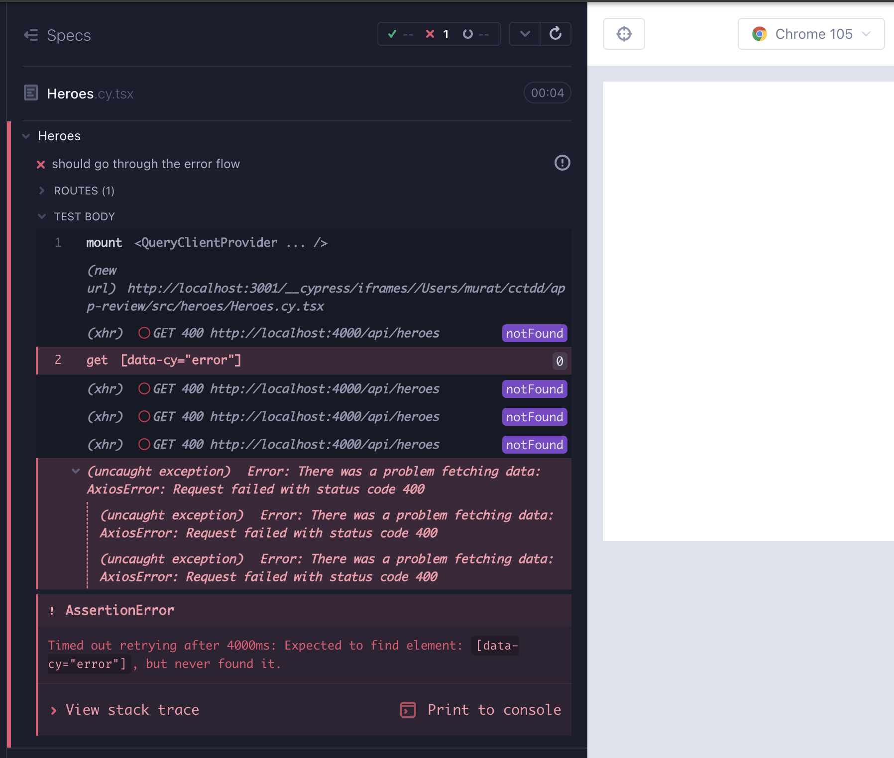
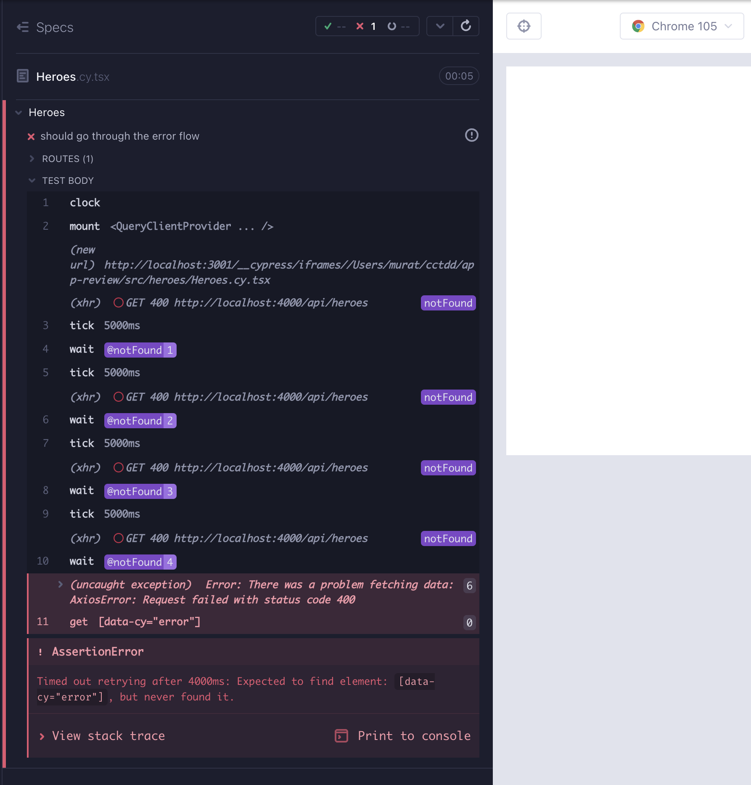

# Suspense, ErrorBoundary, Eşzamanlılık

Yeni özelliklerden daha iyi anlamak için, 3 bileşen - ErrorComp, PageSpinner, Spinner - ve `HeroList` için yeni bir arama filtresi özelliği ekliyoruz. Suspense ve ErrorBoundary kullanım durumları için bileşenlere ihtiyacımız olacak.

```typescript
// src/components/ErrorComp.cy.tsx
import ErrorComp from "./ErrorComp";
import "../styles.scss";

describe("ErrorComp", () => {
  it("should render error", () => {
    cy.mount(<ErrorComp />);
    cy.getByCy("error").should("be.visible");
  });
});
```

```tsx
// src/components/ErrorComp.test.tsx
import ErrorComp from "./ErrorComp";
import { render, screen } from "@testing-library/react";

describe("ErrorComp", () => {
  it("should render error", async () => {
    render(<ErrorComp />);
    expect(await screen.findByTestId("error")).toBeVisible();
  });
});
```

```tsx
// src/components/ErrorComp.tsx
export default function ErrorComp() {
  return (
    <>
      <h1 data-cy="error">Something went wrong!</h1>
      <p>Try reloading the page.</p>
    </>
  );
}
```

```typescript
// src/components/Spinner.cy.tsx
import Spinner from "./Spinner";
import "../styles.scss";

describe("Spinner", () => {
  it("should render a spinner", () => {
    cy.mount(<Spinner />);
    cy.getByCy("spinner").should("be.visible");
  });
});
```

```tsx
// src/components/Spinner.test.tsx
import Spinner from "./Spinner";
import { render, screen } from "@testing-library/react";

describe("Spinner", () => {
  it("should render a spinner", async () => {
    render(<Spinner />);
    await screen.findByTestId("spinner");
  });
});
```

```tsx
// src/components/Spinner.tsx
import React from "react";
import { FaSpinner } from "react-icons/fa";

export default function Spinner(
  props: JSX.IntrinsicAttributes &
    React.ClassAttributes<HTMLSpanElement> &
    React.HTMLAttributes<HTMLSpanElement>
) {
  return (
    <span {...props}>
      <FaSpinner className="icon-loading" data-cy="spinner" />
    </span>
  );
}
```

```typescript
// src/components/PageSpinner.cy.tsx
import PageSpinner from "./PageSpinner";
import "../styles.scss";

describe("PageSpinner", () => {
  it("should render the page spinner", () => {
    cy.mount(<PageSpinner />);
    cy.getByCyLike("page-spinner").should("be.visible");
  });
});
```

```tsx
// src/components/PageSpinner.test.tsx
import PageSpinner from "./PageSpinner";
import { render, screen } from "@testing-library/react";

describe("PageSpinner", () => {
  it("should render a PageSpinner", async () => {
    render(<PageSpinner />);
    await screen.findByTestId("page-spinner");
  });
});
```

```tsx
// src/components/PageSpinner.tsx
import Spinner from "./Spinner";

export default function PageSpinner() {
  return (
    <p className="page-loading" data-cy="page-spinner">
      <Spinner />
    </p>
  );
}
```

## `HeroList` için Arama-filtre

`HeroList` için kahramanların isimlerine veya açıklamalarına göre arama ve filtreleme yapabilecek yeni bir özellik istiyoruz, böylece daha sonra yeni React 18 kancaları `useTransition` ve `useDeferredValue` için bir kullanım durumu elde edebiliriz. Bunun için `HeroList.cy.tsx` dosyasına yeni bir test ekleyelim. Bir kahramanın adını veya açıklamasını aramak için yazdığımızda, listede sadece o kahramanı almalıyız. Tüm testler için aynı olan dağıtımı `beforeEach` test kancasına da taşıyabiliriz (Kırmızı 1).

```typescript
// src/heroes/HeroList.cy.tsx
import { BrowserRouter } from "react-router-dom";
import HeroList from "./HeroList";
import "../styles.scss";
import heroes from "../../cypress/fixtures/heroes.json";

describe("HeroList", () => {
  beforeEach(() => {
    cy.mount(
      <BrowserRouter>
        <HeroList
          heroes={heroes}
          handleDeleteHero={cy.stub().as("handleDeleteHero")}
        />
      </BrowserRouter>
    );
  });

  it("should render the hero layout", () => {
    cy.getByCyLike("hero-list-item").should("have.length", heroes.length);

    cy.getByCy("card-content");
    cy.contains(heroes[0].name);
    cy.contains(heroes[0].description);

    cy.get("footer")
      .first()
      .within(() => {
        cy.getByCy("delete-button");
        cy.getByCy("edit-button");
      });
  });

  it.only("should search and filter hero by name and description", () => {
    cy.getByCy("search").type(heroes[0].name);
    cy.getByCyLike("hero-list-item")
      .should("have.length", 1)
      .contains(heroes[0].name);

    cy.getByCy("search").clear().type(heroes[2].description);
    cy.getByCyLike("hero-list-item")
      .should("have.length", 1)
      .contains(heroes[2].description);
  });

  context("handleDelete, handleEdit", () => {
    it("should handle delete", () => {
      cy.getByCy("delete-button").first().click();
      cy.get("@handleDeleteHero").should("have.been.called");
    });
    it("should handle edit", () => {
      cy.getByCy("edit-button").first().click();
      cy.location("pathname").should("eq", "/heroes/edit-hero/" + heroes[0].id);
    });
  });
});
```

Arama alanına yazarken, kahraman verilerini isim veya açıklama listesinde mevcut olanlara göre filtrelemek istiyoruz. `heroes` verisini zaten bir özellik olarak alırız, bunu `useState` ile yönetebiliriz:

`const [filteredList, setFilteredList] = useState(heroes)`

Şimdi bu durumu filtreleme mantığıyla ayarlamamız gerekiyor. İşte bize bunu yapmada yardımcı olan iki işlev:

```typescript
type HeroProperty = Hero["name"] | Hero["description"] | Hero["id"];

/** returns a boolean whether the hero properties exist in the search field */
const searchExists = (searchProperty: HeroProperty, searchField: string) =>
  String(searchProperty).toLowerCase().indexOf(searchField.toLowerCase()) !==
  -1;

/** given the data and the search field, returns the data in which the search field exists */
const searchProperties = (searchField: string, data: Hero[]) =>
  [...data].filter((item: Hero) =>
    Object.values(item).find((property: HeroProperty) =>
      searchExists(property, searchField)
    )
  );

/** filters the heroes data to see if the name or the description exists in the list */
const handleSearch =
  (data: Hero[]) => (event: ChangeEvent<HTMLInputElement>) => {
    const searchField = event.target.value;

    return setFilteredHeroes(searchProperties(searchField, data));
  };
```

`heroes.map` ile listeyi işlemek yerine, `filteredHeroes` kullanırız; bu, bir değişiklik olayında `handleSearch` tarafından ayarlanır.

```tsx
// src/heroes/HeroList.tsx
import { useNavigate } from "react-router-dom";
import CardContent from "components/CardContent";
import ButtonFooter from "components/ButtonFooter";
import { FaEdit, FaRegSave } from "react-icons/fa";
import { ChangeEvent, MouseEvent, useState } from "react";
import { Hero } from "models/Hero";

type HeroListProps = {
  heroes: Hero[];
  handleDeleteHero: (hero: Hero) => (e: MouseEvent<HTMLButtonElement>) => void;
};

export default function HeroList({ heroes, handleDeleteHero }: HeroListProps) {
  const [filteredHeroes, setFilteredHeroes] = useState(heroes);
  const navigate = useNavigate();

  // currying: the outer fn takes our custom arg and returns a fn that takes the event
  const handleSelectHero = (heroId: string) => () => {
    const hero = heroes.find((h: Hero) => h.id === heroId);
    navigate(
      `/heroes/edit-hero/${hero?.id}?name=${hero?.name}&description=${hero?.description}`
    );
  };

  type HeroProperty = Hero["name"] | Hero["description"] | Hero["id"];

  /** returns a boolean whether the hero properties exist in the search field */
  const searchExists = (searchProperty: HeroProperty, searchField: string) =>
    String(searchProperty).toLowerCase().indexOf(searchField.toLowerCase()) !==
    -1;

  /** given the data and the search field, returns the data in which the search field exists */
  const searchProperties = (searchField: string, data: Hero[]) =>
    [...data].filter((item: Hero) =>
      Object.values(item).find((property: HeroProperty) =>
        searchExists(property, searchField)
      )
    );

  /** filters the heroes data to see if the name or the description exists in the list */
  const handleSearch =
    (data: Hero[]) => (event: ChangeEvent<HTMLInputElement>) => {
      const searchField = event.target.value;

      return setFilteredHeroes(searchProperties(searchField, data));
    };

  return (
    <div>
      <div className="card-content">
        <span>Search </span>
        <input data-cy="search" onChange={handleSearch(heroes)} />
      </div>
      &nbsp;
      <ul data-cy="hero-list" className="list">
        {filteredHeroes.map((hero, index) => (
          <li data-cy={`hero-list-item-${index}`} key={hero.id}>
            <div className="card">
              <CardContent name={hero.name} description={hero.description} />
              <footer className="card-footer">
                <ButtonFooter
                  label="Delete"
                  IconClass={FaRegSave}
                  onClick={handleDeleteHero(hero)}
                />
                <ButtonFooter
                  label="Edit"
                  IconClass={FaEdit}
                  onClick={handleSelectHero(hero.id)}
                />
              </footer>
            </div>
          </li>
        ))}
      </ul>
    </div>
  );
}
```

Başka bileşenlerde kullanılan bir bileşene özellik ekledik. Büyük özellikler eklerken, gerileme olup olmadığını kontrol etmek için CT ve e2e test paketlerinin tamamını çalıştırmak önemlidir; `yarn cy:run-ct`, `yarn cy:run-e2e`. Teoride, hiçbir şey ters gitmemeli. Bileşen hataları yok. Ancak `delete-hero` e2e testi, silme işleminden sonra yeni eklenen kahramanı temizlemiyor; güncellenmiş kahraman listesini görmek için yenilememiz gerekiyor. **Kırılgan bir ünleri olsa bile, iyi yazılmış, kararlı e2e testlerinin yüksek hata bulma yeteneği vardır ve daha küçük bir odakta fark edilmeyen hataları yakalar**.

Hataları gidermek için, `heroes` değiştiğinde `HeroList`i yeniden işlememiz gerekiyor. Bu, bağımlılık dizisindeki *heroes* ve `useEffect` ile elde edilir (Yeşil 1).

`useEffect(() => setFilteredHeroes(heroes), [heroes])`

```tsx
// src/heroes/HeroList.tsx
import { useNavigate } from "react-router-dom";
import CardContent from "components/CardContent";
import ButtonFooter from "components/ButtonFooter";
import { FaEdit, FaRegSave } from "react-icons/fa";
import {
  ChangeEvent,
  MouseEvent,
  startTransition,
  useEffect,
  useState,
} from "react";
import { Hero } from "models/Hero";

type HeroListProps = {
  heroes: Hero[];
  handleDeleteHero: (hero: Hero) => (e: MouseEvent<HTMLButtonElement>) => void;
};

export default function HeroList({ heroes, handleDeleteHero }: HeroListProps) {
  const [filteredHeroes, setFilteredHeroes] = useState(heroes);
  const navigate = useNavigate();

  // needed to refresh the list after deleting a hero
  useEffect(() => setFilteredHeroes(heroes), [heroes]);

  // currying: the outer fn takes our custom arg and returns a fn that takes the event
  const handleSelectHero = (heroId: string) => () => {
    const hero = heroes.find((h: Hero) => h.id === heroId);
    navigate(
      `/heroes/edit-hero/${hero?.id}?name=${hero?.name}&description=${hero?.description}`
    );
  };

  type HeroProperty = Hero["name"] | Hero["description"] | Hero["id"];

  /** returns a boolean whether the hero properties exist in the search field */
  const searchExists = (searchProperty: HeroProperty, searchField: string) =>
    String(searchProperty).toLowerCase().indexOf(searchField.toLowerCase()) !==
    -1;

  /** given the data and the search field, returns the data in which the search field exists */
  const searchProperties = (searchField: string, data: Hero[]) =>
    [...data].filter((item: Hero) =>
      Object.values(item).find((property: HeroProperty) =>
        searchExists(property, searchField)
      )
    );

  /** filters the heroes data to see if the name or the description exists in the list */
  const handleSearch =
    (data: Hero[]) => (event: ChangeEvent<HTMLInputElement>) => {
      const searchField = event.target.value;

      return setFilteredHeroes(searchProperties(searchField, data));
    };

  return (
    <div>
      <div className="card-content">
        <span>Search </span>
        <input data-cy="search" onChange={handleSearch(heroes)} />
      </div>
      &nbsp;
      <ul data-cy="hero-list" className="list">
        {filteredHeroes.map((hero, index) => (
          <li data-cy={`hero-list-item-${index}`} key={hero.id}>
            <div className="card">
              <CardContent name={hero.name} description={hero.description} />
              <footer className="card-footer">
                <ButtonFooter
                  label="Delete"
                  IconClass={FaRegSave}
                  onClick={handleDeleteHero(hero)}
                />
                <ButtonFooter
                  label="Edit"
                  IconClass={FaEdit}
                  onClick={handleSelectHero(hero.id)}
                />
              </footer>
            </div>
          </li>
        ))}
      </ul>
    </div>
  );
}
```

## `useDeferredValue` ve `useTransition` ile Eşzamanlılık

Eşzamanlılık kavramı, React 18'de yenidir. Birden fazla durum güncellemesi eşzamanlı olarak gerçekleşirken, Eşzamanlılık, UI tepki süresini optimize etmek amacıyla bazı durum güncellemelerinin diğerlerinden daha düşük önceliğe sahip olmasını ifade eder. `useDeferredValue` ve `useTransition` kancaları React 18'de yenidir. Uygulamamızda gerekli değiller, ancak yavaş bir bağlantıda büyük miktarda veri yüklerken nerede uygun olabileceklerini göstereceğiz.

`useTransition()` ile hangi durum güncellemelerinin diğer tüm durum güncellemelerinden daha düşük önceliğe sahip olduğunu belirleyebiliriz.

`const [isPending, startTransition] = useTransition()`

`isPending` boolean bir değerdir ve düşük öncelikli durum güncellemesinin hala beklemede olup olmadığını belirtir.

`startTransition` düşük öncelikli durum güncellemesini sarmalayan bir işlemdir.

`HeroList` bileşenimizde, `setFilteredHeroes` düşük öncelikli bir durum güncellemesi olarak kabul edilebilir. Bu, kahraman listesi çok büyük ve ağ çok yavaş olduğunda, arama filtresi girişinin listeyi hala yüklerken duyarlı kalmasını sağlar.

İlk değişiklik, `handleSearch`ın dönüş bölümündedir. `startTransition`, `setFilteredHeroes` döndüren bir işleve sarar.

```tsx
return startTransition(() =>
  setFilteredHeroes(
    [...data].filter(
      ({ name, description }: Hero) =>
        searchExists(searchField, name) ||
        searchExists(searchField, description)
    )
  )
);
```

Geçiş `isPending` olduğunda, bileşenin tümündeki opaklığı azaltabiliriz:

```tsx
 return (
    <div
      style={{
        opacity: isPending ? 0.5 : 1,
      }}
    >
      <div className="card-content">
   	  ...
      </div>
     ...
   </div>
```

İşte `HeroList` bileşenine yapılan `useTransition` güncellemeleri.

```tsx
// src/heroes/HeroList.tsx
import { useNavigate } from "react-router-dom";
import CardContent from "components/CardContent";
import ButtonFooter from "components/ButtonFooter";
import { FaEdit, FaRegSave } from "react-icons/fa";
import {
  ChangeEvent,
  MouseEvent,
  useTransition,
  useEffect,
  useState,
} from "react";
import { Hero } from "models/Hero";

type HeroListProps = {
  heroes: Hero[];
  handleDeleteHero: (hero: Hero) => (e: MouseEvent<HTMLButtonElement>) => void;
};

export default function HeroList({ heroes, handleDeleteHero }: HeroListProps) {
  const [filteredHeroes, setFilteredHeroes] = useState(heroes);
  const navigate = useNavigate();
  const [isPending, startTransition] = useTransition();

  // needed to refresh the list after deleting a hero
  useEffect(() => setFilteredHeroes(heroes), [heroes]);

  // currying: the outer fn takes our custom arg and returns a fn that takes the event
  const handleSelectHero = (heroId: string) => () => {
    const hero = heroes.find((h: Hero) => h.id === heroId);
    navigate(
      `/heroes/edit-hero/${hero?.id}?name=${hero?.name}&description=${hero?.description}`
    );
  };

  type HeroProperty = Hero["name"] | Hero["description"] | Hero["id"];

  /** returns a boolean whether the hero properties exist in the search field */
  const searchExists = (searchProperty: HeroProperty, searchField: string) =>
    String(searchProperty).toLowerCase().indexOf(searchField.toLowerCase()) !==
    -1;

  /** given the data and the search field, returns the data in which the search field exists */
  const searchProperties = (searchField: string, data: Hero[]) =>
    [...data].filter((item: Hero) =>
      Object.values(item).find((property: HeroProperty) =>
        searchExists(property, searchField)
      )
    );

  /** filters the heroes data to see if the name or the description exists in the list */
  const handleSearch =
    (data: Hero[]) => (event: ChangeEvent<HTMLInputElement>) => {
      const searchField = event.target.value;

      return startTransition(() =>
        setFilteredHeroes(searchProperties(searchField, data))
      );
    };

  return (
    <div
      style={{
        opacity: isPending ? 0.5 : 1,
      }}
    >
      <div className="card-content">
        <span>Search </span>
        <input data-cy="search" onChange={handleSearch(heroes)} />
      </div>
      &nbsp;
      <ul data-cy="hero-list" className="list">
        {filteredHeroes.map((hero, index) => (
          <li data-cy={`hero-list-item-${index}`} key={hero.id}>
            <div className="card">
              <CardContent name={hero.name} description={hero.description} />
              <footer className="card-footer">
                <ButtonFooter
                  label="Delete"
                  IconClass={FaRegSave}
                  onClick={handleDeleteHero(hero)}
                />
                <ButtonFooter
                  label="Edit"
                  IconClass={FaEdit}
                  onClick={handleSelectHero(hero.id)}
                />
              </footer>
            </div>
          </li>
        ))}
      </ul>
    </div>
  );
}
```

`useTransition` ile düşük öncelikli kod üzerinde tam kontrol sağlarız. Bazen, verinin dışarıdan bir özellik olarak veya dış koddan geldiği durumlar gibi, tam kontrol sağlayamayabiliriz. Bu tür durumlarda `useDeferredValue` kullanabiliriz. Durum güncelleme kodunu `useTransition` ile sarmalamanın aksine, `useDeferredValue` ile etkilenen son değeri sararız. `useTransition` ve `useDeferredValue` sonuçları aynıdır; React'e hangi düşük öncelikli durum güncellemelerinin olduğunu söyleriz.

Durum güncelleme koduna erişiminiz varsa, `useTransition` kullanın. Koda erişiminiz yoksa, sadece son değere erişiminiz varsa, `useDeferredValue` kullanın.

`HeroList` bileşenimizde, `hero` verisi bir özellik olarak gelmekte ve bu durum `useDeferredValue` için iyi bir adaydır.

```tsx
export default function HeroList({heroes, handleDeleteHero}: HeroListProps) {
  const deferredHeroes = useDeferredValue(heroes)
  const isStale = deferredHeroes !== heroes
  const [filteredHeroes, setFilteredHeroes] = useState(deferredHeroes)
```

`isStale` değerini CSS'te şu şekilde kullanabiliriz:

```tsx
<div
  style={{
    opacity: isPending ? 0.5 : 1,
    color: isStale ? 'dimgray' : 'black',
  }}
```

İşte güncellenmiş `HeroList` bileşeni (Düzenleme 1):

```tsx
// src/heroes/HeroList.tsx
import { useNavigate } from "react-router-dom";
import CardContent from "components/CardContent";
import ButtonFooter from "components/ButtonFooter";
import { FaEdit, FaRegSave } from "react-icons/fa";
import {
  ChangeEvent,
  MouseEvent,
  useTransition,
  useEffect,
  useState,
  useDeferredValue,
} from "react";
import { Hero } from "models/Hero";

type HeroListProps = {
  heroes: Hero[];
  handleDeleteHero: (hero: Hero) => (e: MouseEvent<HTMLButtonElement>) => void;
};

export default function HeroList({ heroes, handleDeleteHero }: HeroListProps) {
  const deferredHeroes = useDeferredValue(heroes);
  const isStale = deferredHeroes !== heroes;
  const [filteredHeroes, setFilteredHeroes] = useState(deferredHeroes);
  const navigate = useNavigate();
  const [isPending, startTransition] = useTransition();

  // needed to refresh the list after deleting a hero
  useEffect(() => setFilteredHeroes(deferredHeroes), [deferredHeroes]);

  // currying: the outer fn takes our custom arg and returns a fn that takes the event
  const handleSelectHero = (heroId: string) => () => {
    const hero = deferredHeroes.find((h: Hero) => h.id === heroId);
    navigate(
      `/heroes/edit-hero/${hero?.id}?name=${hero?.name}&description=${hero?.description}`
    );
  };

  type HeroProperty = Hero["name"] | Hero["description"] | Hero["id"];

  /** returns a boolean whether the hero properties exist in the search field */
  const searchExists = (searchProperty: HeroProperty, searchField: string) =>
    String(searchProperty).toLowerCase().indexOf(searchField.toLowerCase()) !==
    -1;

  /** given the data and the search field, returns the data in which the search field exists */
  const searchProperties = (searchField: string, data: Hero[]) =>
    [...data].filter((item: Hero) =>
      Object.values(item).find((property: HeroProperty) =>
        searchExists(property, searchField)
      )
    );

  /** filters the heroes data to see if the name or the description exists in the list */
  const handleSearch =
    (data: Hero[]) => (event: ChangeEvent<HTMLInputElement>) => {
      const searchField = event.target.value;

      return startTransition(() =>
        setFilteredHeroes(searchProperties(searchField, data))
      );
    };

  return (
    <div
      style={{
        opacity: isPending ? 0.5 : 1,
        color: isStale ? "dimgray" : "black",
      }}
    >
      <div className="card-content">
        <span>Search </span>
        <input data-cy="search" onChange={handleSearch(deferredHeroes)} />
      </div>
      &nbsp;
      <ul data-cy="hero-list" className="list">
        {filteredHeroes.map((hero, index) => (
          <li data-cy={`hero-list-item-${index}`} key={hero.id}>
            <div className="card">
              <CardContent name={hero.name} description={hero.description} />
              <footer className="card-footer">
                <ButtonFooter
                  label="Delete"
                  IconClass={FaRegSave}
                  onClick={handleDeleteHero(hero)}
                />
                <ButtonFooter
                  label="Edit"
                  IconClass={FaEdit}
                  onClick={handleSelectHero(hero.id)}
                />
              </footer>
            </div>
          </li>
        ))}
      </ul>
    </div>
  );
}
```

Koşullu işlem başka bir ipucu verir; veri yoksa arama çubuğuna ihtiyacımız var mı? Başarısız bir testle başlayarak bu özelliği ekleyelim. `HeroList.cy.tsx` dosyasını biraz yeniden düzenleyeceğiz, böylece testi iki bağlamda yakalayabiliriz; kahraman verisi olmadan monte etme ve kahraman verisiyle monte etme (Kırmızı 2).

```tsx
// src/heroes/HeroList.cy.tsx
import { BrowserRouter } from "react-router-dom";
import HeroList from "./HeroList";
import "../styles.scss";
import heroes from "../../cypress/fixtures/heroes.json";

describe("HeroList", () => {
  it("no heroes should not display a list nor search bar", () => {
    cy.mount(
      <BrowserRouter>
        <HeroList
          heroes={[]}
          handleDeleteHero={cy.stub().as("handleDeleteHero")}
        />
      </BrowserRouter>
    );

    cy.getByCy("hero-list").should("exist");
    cy.getByCyLike("hero-list-item").should("not.exist");
    cy.getByCy("search").should("not.exist");
  });

  context("with heroes in the list", () => {
    beforeEach(() => {
      cy.mount(
        <BrowserRouter>
          <HeroList
            heroes={heroes}
            handleDeleteHero={cy.stub().as("handleDeleteHero")}
          />
        </BrowserRouter>
      );
    });

    it("should render the hero layout", () => {
      cy.getByCyLike("hero-list-item").should("have.length", heroes.length);

      cy.getByCy("card-content");
      cy.contains(heroes[0].name);
      cy.contains(heroes[0].description);

      cy.get("footer")
        .first()
        .within(() => {
          cy.getByCy("delete-button");
          cy.getByCy("edit-button");
        });
    });

    it("should search and filter hero by name and description", () => {
      cy.getByCy("search").type(heroes[0].name);
      cy.getByCyLike("hero-list-item")
        .should("have.length", 1)
        .contains(heroes[0].name);

      cy.getByCy("search").clear().type(heroes[2].description);
      cy.getByCyLike("hero-list-item")
        .should("have.length", 1)
        .contains(heroes[2].description);
    });

    it("should handle delete", () => {
      cy.getByCy("delete-button").first().click();
      cy.get("@handleDeleteHero").should("have.been.called");
    });

    it("should handle edit", () => {
      cy.getByCy("edit-button").first().click();
      cy.location("pathname").should("eq", "/heroes/edit-hero/" + heroes[0].id);
    });
  });
});
```

Testi tatmin etmek için, arama çubuğu için koşullu işlem yapmamız yeterlidir.

```tsx
{
  deferredHeroes.length > 0 && (
    <div className="card-content">
      <span>Search </span>
      <input data-cy="search" onChange={handleSearch(deferredHeroes)} />
    </div>
  );
}
```

İşte `HeroList` bileşeni son haliyle (Yeşil 2):

```tsx
// src/heroes/HeroList.tsx
import { useNavigate } from "react-router-dom";
import CardContent from "components/CardContent";
import ButtonFooter from "components/ButtonFooter";
import { FaEdit, FaRegSave } from "react-icons/fa";
import {
  ChangeEvent,
  MouseEvent,
  useTransition,
  useEffect,
  useState,
  useDeferredValue,
} from "react";
import { Hero } from "models/Hero";

type HeroListProps = {
  heroes: Hero[];
  handleDeleteHero: (hero: Hero) => (e: MouseEvent<HTMLButtonElement>) => void;
};

export default function HeroList({ heroes, handleDeleteHero }: HeroListProps) {
  const deferredHeroes = useDeferredValue(heroes);
  const isStale = deferredHeroes !== heroes;
  const [filteredHeroes, setFilteredHeroes] = useState(deferredHeroes);
  const navigate = useNavigate();
  const [isPending, startTransition] = useTransition();

  // needed to refresh the list after deleting a hero
  useEffect(() => setFilteredHeroes(deferredHeroes), [deferredHeroes]);

  // currying: the outer fn takes our custom arg and returns a fn that takes the event
  const handleSelectHero = (heroId: string) => () => {
    const hero = deferredHeroes.find((h: Hero) => h.id === heroId);
    navigate(
      `/heroes/edit-hero/${hero?.id}?name=${hero?.name}&description=${hero?.description}`
    );
  };

  type HeroProperty = Hero["name"] | Hero["description"] | Hero["id"];

  /** returns a boolean whether the hero properties exist in the search field */
  const searchExists = (searchProperty: HeroProperty, searchField: string) =>
    String(searchProperty).toLowerCase().indexOf(searchField.toLowerCase()) !==
    -1;

  /** given the data and the search field, returns the data in which the search field exists */
  const searchProperties = (searchField: string, data: Hero[]) =>
    [...data].filter((item: Hero) =>
      Object.values(item).find((property: HeroProperty) =>
        searchExists(property, searchField)
      )
    );

  /** filters the heroes data to see if the any of the properties exist in the list */
  const handleSearch =
    (data: Hero[]) => (event: ChangeEvent<HTMLInputElement>) => {
      const searchField = event.target.value;

      return startTransition(() =>
        setFilteredHeroes(searchProperties(searchField, data))
      );
    };

  return (
    <div
      style={{
        opacity: isPending ? 0.5 : 1,
        color: isStale ? "dimgray" : "black",
      }}
    >
      {deferredHeroes.length > 0 && (
        <div className="card-content">
          <span>Search </span>
          <input data-cy="search" onChange={handleSearch(deferredHeroes)} />
        </div>
      )}
      &nbsp;
      <ul data-cy="hero-list" className="list">
        {filteredHeroes.map((hero, index) => (
          <li data-cy={`hero-list-item-${index}`} key={hero.id}>
            <div className="card">
              <CardContent name={hero.name} description={hero.description} />
              <footer className="card-footer">
                <ButtonFooter
                  label="Delete"
                  IconClass={FaRegSave}
                  onClick={handleDeleteHero(hero)}
                />
                <ButtonFooter
                  label="Edit"
                  IconClass={FaEdit}
                  onClick={handleSelectHero(hero.id)}
                />
              </footer>
            </div>
          </li>
        ))}
      </ul>
    </div>
  );
}
```

## Suspense & ErrorBoundary

### Kurulum

Uygulamanın başlangıcında yüklenen kod miktarını - başlangıç paketini - yönetmek için, UI tepki süresini artırmak amacıyla uygulamanın kodunu parçalara bölen ve yüklemeyi gerçekleştiren kod bölme işlemi kullanılabilir. React'te, [Suspense](https://reactjs.org/docs/code-splitting.html) ve tembel yükleme, kod bölme işlemini gerçekleştirmek için kullanılır. Genellikle `ErrorBoundary` ile birlikte anılırlar, çünkü `Suspense` ve `ErrorBoundary` bileşenleri, yükleme ve hata UI'sını bireysel bileşenlerden ayırmamıza olanak tanır. İşte ana fikirler:

- Yükleme sırasında `Suspense` bileşenini göster, hata durumunda `ErrorBoundary` bileşenini göster, başarılı durumda ise göstermek istediğimiz bileşeni göster.
- İlk kez işlem gördüklerinde bileşenleri yüklemek için `React.lazy` kullanın.

Bir bileşeni `lazy` işlevi ile tembel bir bileşene dönüştürme:

```tsx
// staticly imported component
import Heroes from "heroes/Heroes";

// lazy loaded component
const Heroes = lazy(() => import("heroes/Heroes"));
```

Suspense ve ErrorBoundary bileşenlerini, ağacında bir veya daha fazla tembel bileşen içeren UI'ı sarmak için kullanın. İşte yüksek düzeyde nasıl birlikte çalıştıkları:

```tsx
<ErrorBoundary fallback={<ErrorComp />}>
  <Suspense fallback={<PageSpinner />}>
    <Routes>
      ..
      <lazy-loaded-components />
      ..
    </Routes>
  </Suspense>
</ErrorBoundary>
```

`useGetHeroes` kancasını, yapılandırma için üçüncü bir argüman alacak şekilde güncelleyin. `{suspense: true}` geçmek, `react-query`'deki `useQuery` için `Suspense` modunu etkinleştirir.

```tsx
// src/App.tsx
import { lazy, Suspense } from "react";
import { BrowserRouter, Routes, Route, Navigate } from "react-router-dom";
import { QueryClient, QueryClientProvider } from "react-query";
import { ErrorBoundary } from "react-error-boundary";
import HeaderBar from "components/HeaderBar";
import NavBar from "components/NavBar";
import PageSpinner from "components/PageSpinner";
import ErrorComp from "components/ErrorComp";
import "./styles.scss";
const Heroes = lazy(() => import("heroes/Heroes"));
const NotFound = lazy(() => import("components/NotFound"));
const About = lazy(() => import("About"));

const queryClient = new QueryClient();

function App() {
  return (
    <BrowserRouter>
      <HeaderBar />
      <div className="section columns">
        <NavBar />
        <main className="column">
          <QueryClientProvider client={queryClient}>
            <ErrorBoundary fallback={<ErrorComp />}>
              <Suspense fallback={<PageSpinner />}>
                <Routes>
                  <Route path="/" element={<Navigate replace to="/heroes" />} />
                  <Route path="/heroes/*" element={<Heroes />} />
                  <Route path="/about" element={<About />} />
                  <Route path="*" element={<NotFound />} />
                </Routes>
              </Suspense>
            </ErrorBoundary>
          </QueryClientProvider>
        </main>
      </div>
    </BrowserRouter>
  );
}

export default App;
```

`useGetHeroes` kancasını, yapılandırma için üçüncü bir argüman alacak şekilde güncelleyin. `{suspense: true}` geçmek, `react-query`'deki `useQuery` için `Suspense` modunu etkinleştirir.

```typescript
// src/hooks/useGetHeroes.ts
import { useQuery } from "react-query";
import { getItem } from "./api";

/**
 * Helper for GET to `/heroes` route
 * @returns {object} {heroes, status, getError}
 */
export const useGetHeroes = () => {
  const query = useQuery("heroes", () => getItem("heroes"), {
    suspense: true,
  });

  return {
    heroes: query.data,
    status: query.status,
    getError: query.error,
  };
};
```

### Hata durumları için testler

#### `HeroDetail` bileşeni

Şimdi hata kenar durumları için başarısız testler yazmaya başlayabiliriz. Nereden başlarız? Pozitif durumları kapsayan, `cy.intercept()` ile ağı izlemeye alan veya ağı taklit eden herhangi bir bileşen testi iyi bir adaydır. Bunlar `HeroDetail` ve `Heroes` bileşen testleridir.

`HeroList` bileşen testine 200 olmayan bir senaryo için test ekleyin. İşlemcinin görünmesini sağlamak için gecikme seçeneği kullanırız (Kırmızı 3).

```typescript
it("should handle Save", () => {
  cy.intercept("POST", "*", { statusCode: 200 }).as("postHero");
  cy.getByCy("save-button").click();
  cy.wait("@postHero");
});

// the new test
it("should handle non-200 Save", () => {
  cy.intercept("POST", "*", { statusCode: 400, delay: 100 }).as("postHero");
  cy.getByCy("save-button").click();
  cy.getByCy("spinner");
});
```

```typescript
// src/heroes/HeroDetail.cy.tsx
import HeroDetail from "./HeroDetail";
import { BrowserRouter } from "react-router-dom";
import { QueryClient, QueryClientProvider } from "react-query";
import "../styles.scss";

describe("HeroDetail", () => {
  let queryClient: QueryClient;
  context("handleSave, handleCancel", () => {
    beforeEach(() => {
      queryClient = new QueryClient();
      cy.mount(
        <QueryClientProvider client={queryClient}>
          <BrowserRouter>
            <HeroDetail />
          </BrowserRouter>
        </QueryClientProvider>
      );
    });

    it("should handle Save", () => {
      cy.intercept("POST", "*", { statusCode: 200 }).as("postHero");
      cy.getByCy("save-button").click();
      cy.wait("@postHero");
    });

    it.only("should handle non-200 Save", () => {
      cy.intercept("POST", "*", { statusCode: 400, delay: 100 }).as("postHero");
      cy.getByCy("save-button").click();
      cy.getByCy("spinner");
    });

    it("should handle Cancel", () => {
      cy.getByCy("cancel-button").click();
      cy.location("pathname").should("eq", "/heroes");
    });
  });

  context("handleNameChange, handleDescriptionChange", () => {
    beforeEach(() => {
      queryClient = new QueryClient();
      cy.mount(
        <QueryClientProvider client={queryClient}>
          <BrowserRouter>
            <HeroDetail />
          </BrowserRouter>
        </QueryClientProvider>
      );
    });

    it("should handle name change", () => {
      const newHeroName = "abc";
      cy.getByCy("input-detail-name").type(newHeroName);

      cy.findByDisplayValue(newHeroName).should("be.visible");
    });

    it("should handle description change", () => {
      const newHeroDescription = "123";
      cy.getByCy("input-detail-description").type(newHeroDescription);

      cy.findByDisplayValue(newHeroDescription).should("be.visible");
    });
  });

  context("state: should verify the layout of the component", () => {
    it("id: false, name: false - should verify the minimal state of the component", () => {
      queryClient = new QueryClient();
      cy.mount(
        <QueryClientProvider client={queryClient}>
          <BrowserRouter>
            <HeroDetail />
          </BrowserRouter>
        </QueryClientProvider>
      );

      cy.get("p").then(($el) => cy.wrap($el.text()).should("equal", ""));
      cy.getByCyLike("input-detail").should("have.length", 2);
      cy.getByCy("input-detail-id").should("not.exist");

      cy.findByPlaceholderText("e.g. Colleen").should("be.visible");
      cy.findByPlaceholderText("e.g. dance fight!").should("be.visible");

      cy.getByCy("save-button").should("be.visible");
      cy.getByCy("cancel-button").should("be.visible");
    });
  });
});
```

`HeroDetail` bileşenine bakarak, `usePostHero` ve `usePutHero` kancalarından `status` ve `isUpdating` elde edebiliriz, bunları kullanabiliriz. Bu durumlar görülürse, `PageSpinner` işlemcisini işleme alın (Yeşil 2).

```
if (status === "loading" || isUpdating) {
  return <PageSpinner />;
}
```

```tsx
// src/heroes/HeroDetail.tsx
import { useState, ChangeEvent } from "react";
import { useNavigate, useParams } from "react-router-dom";
import { FaUndo, FaRegSave } from "react-icons/fa";
import InputDetail from "components/InputDetail";
import ButtonFooter from "components/ButtonFooter";
import { useHeroParams } from "hooks/useHeroParams";
import { usePostHero } from "hooks/usePostHero";
import { Hero } from "models/Hero";
import { usePutHero } from "hooks/usePutHero";
import PageSpinner from "components/PageSpinner";

export default function HeroDetail() {
  const { id } = useParams();
  const { name, description } = useHeroParams();
  const [hero, setHero] = useState({ id, name, description });
  const { mutate: createHero, status, error: postError } = usePostHero();
  const { updateHero, isUpdating, isUpdateError } = usePutHero();

  const navigate = useNavigate();
  const handleCancel = () => navigate("/heroes");
  const handleSave = () =>
    name ? updateHero(hero as Hero) : createHero(hero as Hero);
  const handleNameChange = (e: ChangeEvent<HTMLInputElement>) => {
    setHero({ ...hero, name: e.target.value });
  };
  const handleDescriptionChange = (e: ChangeEvent<HTMLInputElement>) => {
    setHero({ ...hero, description: e.target.value });
  };

  if (status === "loading" || isUpdating) {
    return <PageSpinner />;
  }

  return (
    <div data-cy="hero-detail" className="card edit-detail">
      <header className="card-header">
        <p className="card-header-title">{name}</p>
        &nbsp;
      </header>
      <div className="card-content">
        <div className="content">
          {id && (
            <InputDetail name={"id"} value={id} readOnly={true}></InputDetail>
          )}
          <InputDetail
            name={"name"}
            value={name ? name : ""}
            placeholder="e.g. Colleen"
            onChange={handleNameChange}
          ></InputDetail>
          <InputDetail
            name={"description"}
            value={description ? description : ""}
            placeholder="e.g. dance fight!"
            onChange={handleDescriptionChange}
          ></InputDetail>
        </div>
      </div>
      <footer className="card-footer">
        <ButtonFooter
          label="Cancel"
          IconClass={FaUndo}
          onClick={handleCancel}
        />
        <ButtonFooter label="Save" IconClass={FaRegSave} onClick={handleSave} />
      </footer>
    </div>
  );
}
```

Bileşen testini çalıştırarak, Cypress zaman yolculuğu hata ayıklama işleminin üzerine gelerek işlemciyi doğrulayabiliriz. Ayrıca taklit edilmiş `POST` isteğinin gittiğini de fark ederiz, bunu bir `cy.wait()` ile doğrulayabiliriz (Yeniden düzenleme 2). Cypress zaman yolculuğu hata ayıklayıcısı aracılığıyla bir bileşenin tüm geçişlerini görebilmek, testlerimizi geliştirmemize yardımcı olabilir.

```typescript
it.only("should handle non-200 Save", () => {
  cy.intercept("POST", "*", { statusCode: 400, delay: 100 }).as("postHero");
  cy.getByCy("save-button").click();
  cy.getByCy("spinner");
  cy.wait("@postHero");
});
```

Sonraki adımda, bir hatayı kontrol etmek için bir satır ekliyoruz. Durum kodu 400 ise, bu testte bir hata görmeliyiz (Kırmızı 4).

```typescript
it.only("should handle non-200 Save", () => {
  cy.intercept("POST", "*", { statusCode: 400, delay: 100 }).as("postHero");
  cy.getByCy("save-button").click();
  cy.getByCy("spinner");
  cy.wait("@postHero");
  cy.getByCy("error");
});
```

`HeroDetail` bileşenine bakarak, `usePostHero` ve `usePutHero` kancalarından `postError` ve `isUpdateError` elde edebiliriz, bunları kullanabiliriz (Yeşil 3).

```
if (status === "loading" || isUpdating) {
  return <PageSpinner />;
}

if (postError || isUpdateError) {
  return <ErrorComp />;
}
```

```tsx
// src/heroes/HeroDetail.tsx
import { useState, ChangeEvent } from "react";
import { useNavigate, useParams } from "react-router-dom";
import { FaUndo, FaRegSave } from "react-icons/fa";
import InputDetail from "components/InputDetail";
import ButtonFooter from "components/ButtonFooter";
import PageSpinner from "components/PageSpinner";
import ErrorComp from "components/ErrorComp";
import { useHeroParams } from "hooks/useHeroParams";
import { usePostHero } from "hooks/usePostHero";
import { Hero } from "models/Hero";
import { usePutHero } from "hooks/usePutHero";

export default function HeroDetail() {
  const { id } = useParams();
  const { name, description } = useHeroParams();
  const [hero, setHero] = useState({ id, name, description });
  const { mutate: createHero, status, error: postError } = usePostHero();
  const { updateHero, isUpdating, isUpdateError } = usePutHero();

  const navigate = useNavigate();
  const handleCancel = () => navigate("/heroes");
  const handleSave = () =>
    name ? updateHero(hero as Hero) : createHero(hero as Hero);
  const handleNameChange = (e: ChangeEvent<HTMLInputElement>) => {
    setHero({ ...hero, name: e.target.value });
  };
  const handleDescriptionChange = (e: ChangeEvent<HTMLInputElement>) => {
    setHero({ ...hero, description: e.target.value });
  };

  if (status === "loading" || isUpdating) {
    return <PageSpinner />;
  }

  if (postError || isUpdateError) {
    return <ErrorComp />;
  }

  return (
    <div data-cy="hero-detail" className="card edit-detail">
      <header className="card-header">
        <p className="card-header-title">{name}</p>
        &nbsp;
      </header>
      <div className="card-content">
        <div className="content">
          {id && (
            <InputDetail name={"id"} value={id} readOnly={true}></InputDetail>
          )}
          <InputDetail
            name={"name"}
            value={name ? name : ""}
            placeholder="e.g. Colleen"
            onChange={handleNameChange}
          ></InputDetail>
          <InputDetail
            name={"description"}
            value={description ? description : ""}
            placeholder="e.g. dance fight!"
            onChange={handleDescriptionChange}
          ></InputDetail>
        </div>
      </div>
      <footer className="card-footer">
        <ButtonFooter
          label="Cancel"
          IconClass={FaUndo}
          onClick={handleCancel}
        />
        <ButtonFooter label="Save" IconClass={FaRegSave} onClick={handleSave} />
      </footer>
    </div>
  );
}
```

Bileşen testinde güncelleme senaryosunu kontrol etmenin herhangi bir yolu yoktur, çünkü arka uçta bir değişikliği tetikleyecek böyle bir durumu kuramayız. Düşük düzeyde bileşen testleri ile bir testi kapsayamadığımız her durumda, ui-entegrasyon testlerine geçin. Çoğu zaman bir ui-entegrasyon testi yeterli olacak ve yeterli olmadığında arka ucu etkileyen gerçek bir e2e testi kullanabiliriz. Bizim durumumuzda, ui-entegrasyon tercih edilir, çünkü arka uç tarafından 500 yanıtı ile cevap vermenin zor olacağından. Ayrıca gerçek bir ağdan gelen yanıta ihtiyacımız yoktur. Bu nedenle, güncelleme senaryosunu kapsayan `edit-hero.cy.ts` e2e testine bir ui-entegrasyon testi ekleyebiliriz. Test türleri arasındaki sınırların daha ince olduğunu görüyoruz; en yüksek güveni elde etmek için en düşük maliyetli test türünü kullanırız. Piramitte nerede oldukları, yalnızca verilen bağlamda bu tür testi gerçekleştirme yeteneğiyle ilgilidir (Düzenleme 4).

Yeni test, diğer ui-entegrasyon testlerine benzerdir; ağı taklit ederiz ve ana rotayı ziyaret ederiz. Rastgele bir kahramanın düzenleme sayfasına gideriz. Güncelleme üzerinden gerçekleşecek olan ağ taklidini `cy.intercept` ile ayarlarız. Sonunda, bileşen testinden benzer bir işlemci -> ağı bekletme -> hata akışını tekrarlarız. Buradaki tek ayrım, `PUT` ve `POST` arasındadır.

```typescript
it("should go through the PUT error flow (ui-integration)", () => {
  // Arrange: beginning state
  cy.visitStubbedHeroes();
  // verify that we are editing data already populated
  cy.fixture("heroes").then((heroes) => {
    const heroIndex = randomHeroIndex(heroes);
    cy.getByCy("edit-button").eq(heroIndex).click();
    verifyHero(heroes, heroIndex);
  });
  // setup network stub
  cy.intercept("PUT", `${Cypress.env("API_URL")}/heroes/*`, {
    statusCode: 500,
    delay: 100,
  }).as("isUpdateError");

  // Act
  cy.getByCy("save-button").click();

  // Assert
  cy.getByCy("spinner");
  cy.wait("@isUpdateError");
  cy.getByCy("error");
});
```

Karşılaştırma için bileşen testiyle yan yana buradadır. Eylem ve İddia aynıdır, ağ taklidi `POST` ve `PUT` ile url'yi belirtme ihtiyacının daha az olmasıdır. Özellikle Arrange'ın kurulumu farklıdır.

```typescript
// Arrange: beginning state (mount the component in beforeEach)
beforeEach(() => {
  queryClient = new QueryClient();
  cy.mount(
    <QueryClientProvider client={queryClient}>
      <BrowserRouter>
        <HeroDetail />
      </BrowserRouter>
    </QueryClientProvider>
  );
});

it("should handle non-200 Save", () => {
  // setup network stub
  cy.intercept("POST", "*", { statusCode: 400, delay: 100 }).as("postHero");

  // Act
  cy.getByCy("save-button").click();

  // Assert
  cy.getByCy("spinner");
  cy.wait("@postHero");
  cy.getByCy("error");
});
```

İşte yeniden düzenlemenin ardından tam e2e testi.

```typescript
// cypress/e2e/edit-hero.cy.ts
import { faker } from "@faker-js/faker";
import { Hero } from "../../src/models/Hero";
describe("Edit hero", () => {
  before(cy.resetData);

  /** Verifies hero info on Edit page */
  const verifyHero = (heroes: Hero[], heroIndex: number) => {
    cy.location("pathname").should("include", "/heroes/edit-hero/");
    cy.getByCy("hero-detail").should("be.visible");
    cy.getByCy("input-detail-id").should("be.visible");
    cy.findByDisplayValue(heroes[heroIndex].id);
    cy.findByDisplayValue(heroes[heroIndex].name);
    cy.findByDisplayValue(heroes[heroIndex].description);
  };

  const randomHeroIndex = (heroes: Hero[]) =>
    Cypress._.random(0, heroes.length - 1);

  it("should go through the cancel flow for a random hero (ui-integration)", () => {
    cy.visitStubbedHeroes();

    cy.fixture("heroes").then((heroes) => {
      const heroIndex = randomHeroIndex(heroes);
      cy.getByCy("edit-button").eq(heroIndex).click();
      verifyHero(heroes, heroIndex);
    });

    cy.getByCy("cancel-button").click();
    cy.location("pathname").should("eq", "/heroes");
    cy.getByCy("hero-list").should("be.visible");
  });

  it("should go through the PUT error flow (ui-integration)", () => {
    cy.visitStubbedHeroes();

    cy.fixture("heroes").then((heroes) => {
      const heroIndex = randomHeroIndex(heroes);
      cy.getByCy("edit-button").eq(heroIndex).click();
      verifyHero(heroes, heroIndex);
    });

    cy.intercept("PUT", `${Cypress.env("API_URL")}/heroes/*`, {
      statusCode: 500,
      delay: 100,
    }).as("isUpdateError");

    cy.getByCy("save-button").click();
    cy.getByCy("spinner");
    cy.wait("@isUpdateError");
    cy.getByCy("error");
  });

  it("should navigate to add from an existing hero (ui-integration)", () => {
    cy.visitStubbedHeroes();

    cy.fixture("heroes").then((heroes) => {
      const heroIndex = randomHeroIndex(heroes);
      cy.getByCy("edit-button").eq(heroIndex).click();
      verifyHero(heroes, heroIndex);

      cy.getByCy("add-button").click();
      cy.getByCy("input-detail-id").should("not.exist");
      cy.findByDisplayValue(heroes[heroIndex].name).should("not.exist");
      cy.findByDisplayValue(heroes[heroIndex].description).should("not.exist");
    });
  });

  it("should go through the edit flow (ui-e2e)", () => {
    const newHero: Hero = {
      id: faker.datatype.uuid(),
      name: faker.internet.userName(),
      description: `description ${faker.internet.userName()}`,
    };

    cy.crud("POST", "heroes", { body: newHero });

    cy.visit(`heroes/edit-hero/${newHero.id}`, {
      qs: { name: newHero.name, description: newHero.description },
    });

    const editedHero = {
      name: faker.internet.userName(),
      description: `description ${faker.internet.userName()}`,
    };

    cy.getByCy("input-detail-name")
      .find(".input")
      .clear()
      .type(`${editedHero.name}`);
    cy.getByCy("input-detail-description")
      .find(".input")
      .clear()
      .type(`${editedHero.description}`);
    cy.getByCy("save-button").click();

    cy.getByCy("hero-list")
      .should("be.visible")
      .should("contain", editedHero.name)
      .and("contain", editedHero.description);

    cy.getEntityByProperty(newHero.id).then((myHero) =>
      cy.crud("DELETE", `heroes/${myHero.id}`)
    );
  });
});
```

#### `Heroes` bileşeni

Mutlu yol akışında `cy.intercept` kullanan diğer bileşen testi `Heroes.cy.tsx`'dir. `/heroes` rotasına bir `GET` çağrısını şu şekilde taklit etmektedir:

```tsx
cy.intercept("GET", `${Cypress.env("API_URL")}/heroes`, {
  fixture: "heroes.json",
}).as("getHeroes");
```

Varsayılan olarak, `cy.intecept` durum kodunu 200 olarak kabul eder. Durum kodu 200 değilse ne olur?

`Heroes` bileşeni, `HeroDetail`'i kullanmaktadır. Başlamadan önce, testi 2 bağlamda hafifçe yeniden düzenleyeceğiz; biri 200 akışları için ve

```tsx
// src/heroes/Heroes.cy.tsx
import Heroes from "./Heroes";
import { BrowserRouter } from "react-router-dom";
import { QueryClient, QueryClientProvider } from "react-query";
import "../styles.scss";

describe("Heroes", () => {
  const mounter = (queryClient: QueryClient) =>
    cy.mount(
      <QueryClientProvider client={queryClient}>
        <BrowserRouter>
          <Heroes />
        </BrowserRouter>
      </QueryClientProvider>
    );

  context("200 flows", () => {
    beforeEach(() => {
      cy.intercept("GET", `${Cypress.env("API_URL")}/heroes`, {
        fixture: "heroes.json",
      }).as("getHeroes");

      mounter(new QueryClient());
    });

    it("should display the hero list on render, and go through hero add & refresh flow", () => {
      cy.wait("@getHeroes");

      cy.getByCy("list-header").should("be.visible");
      cy.getByCy("hero-list").should("be.visible");

      cy.getByCy("add-button").click();
      cy.location("pathname").should("eq", "/heroes/add-hero");

      cy.getByCy("refresh-button").click();
      cy.location("pathname").should("eq", "/heroes");
    });

    const invokeHeroDelete = () => {
      cy.getByCy("delete-button").first().click();
      cy.getByCy("modal-yes-no").should("be.visible");
    };
    it("should go through the modal flow", () => {
      cy.getByCy("modal-yes-no").should("not.exist");

      cy.log("do not delete flow");
      invokeHeroDelete();
      cy.getByCy("button-no").click();
      cy.getByCy("modal-yes-no").should("not.exist");

      cy.log("delete flow");
      invokeHeroDelete();
      cy.intercept("DELETE", "*", { statusCode: 200 }).as("deleteHero");

      cy.getByCy("button-yes").click();
      cy.wait("@deleteHero");
      cy.getByCy("modal-yes-no").should("not.exist");
    });
  });
});
```

Yeni teste başlayalım. Ağı kurulumunu yapıyoruz, bileşeni yerleştiriyoruz ve bir hatayı görmeyi bekliyoruz.

```tsx
// src/heroes/Heroes.cy.tsx
import Heroes from "./Heroes";
import { BrowserRouter } from "react-router-dom";
import { QueryClient, QueryClientProvider } from "react-query";
import "../styles.scss";

describe("Heroes", () => {
  const mounter = (queryClient: QueryClient) =>
    cy.mount(
      <QueryClientProvider client={queryClient}>
        <BrowserRouter>
          <Heroes />
        </BrowserRouter>
      </QueryClientProvider>
    );

  it.only("should go through the error flow", () => {
    cy.intercept("GET", `${Cypress.env("API_URL")}/heroes`, {
      statusCode: 400,
      delay: 100,
    }).as("notFound");

    mounter(new QueryClient());

    cy.getByCy("error");
  });

  context("200 flows", () => {
    beforeEach(() => {
      cy.intercept("GET", `${Cypress.env("API_URL")}/heroes`, {
        fixture: "heroes.json",
      }).as("getHeroes");

      mounter(new QueryClient());
    });

    it("should display the hero list on render, and go through hero add & refresh flow", () => {
      cy.wait("@getHeroes");

      cy.getByCy("list-header").should("be.visible");
      cy.getByCy("hero-list").should("be.visible");

      cy.getByCy("add-button").click();
      cy.location("pathname").should("eq", "/heroes/add-hero");

      cy.getByCy("refresh-button").click();
      cy.location("pathname").should("eq", "/heroes");
    });

    const invokeHeroDelete = () => {
      cy.getByCy("delete-button").first().click();
      cy.getByCy("modal-yes-no").should("be.visible");
    };
    it("should go through the modal flow", () => {
      cy.getByCy("modal-yes-no").should("not.exist");

      cy.log("do not delete flow");
      invokeHeroDelete();
      cy.getByCy("button-no").click();
      cy.getByCy("modal-yes-no").should("not.exist");

      cy.log("delete flow");
      invokeHeroDelete();
      cy.intercept("DELETE", "*", { statusCode: 200 }).as("deleteHero");

      cy.getByCy("button-yes").click();
      cy.wait("@deleteHero");
      cy.getByCy("modal-yes-no").should("not.exist");
    });
  });
});
```

Bileşen testini çalıştırıyoruz, hiçbir şey işlemez hale geliyor, Axios birkaç kez tekrar deniyor ve hata fırlatıyor (Kırmızı 5).



`Heroes` içinde `HeroDetail`de yapılan iyileştirmeyi yansıtabiliriz.

```tsx
// HeroDetail
if (status === "loading" || isUpdating) {
  return <PageSpinner />;
}

if (postError || isUpdateError) {
  return <ErrorComp />;
}
```

```tsx
// Heroes
if (status === "loading") {
  return <PageSpinner />;
}

if (getError || isDeleteError) {
  return <ErrorComp />;
}
```

İşte `Suspense` ve `ErrorBoundary` ile `Heroes` bileşeni için yapılan geliştirme.

```tsx
// src/heroes/Heroes.tsx
import { useState, ChangeEvent } from "react";
import { useNavigate, useParams } from "react-router-dom";
import { FaUndo, FaRegSave } from "react-icons/fa";
import InputDetail from "components/InputDetail";
import ButtonFooter from "components/ButtonFooter";
import PageSpinner from "components/PageSpinner";
import ErrorComp from "components/ErrorComp";
import { useHeroParams } from "hooks/useHeroParams";
import { usePostHero } from "hooks/usePostHero";
import { Hero } from "models/Hero";
import { usePutHero } from "hooks/usePutHero";

export default function HeroDetail() {
  const { id } = useParams();
  const { name, description } = useHeroParams();
  const [hero, setHero] = useState({ id, name, description });
  const { mutate: createHero, status, error: postError } = usePostHero();
  const { updateHero, isUpdating, isUpdateError } = usePutHero();

  const navigate = useNavigate();
  const handleCancel = () => navigate("/heroes");
  const handleSave = () =>
    name ? updateHero(hero as Hero) : createHero(hero as Hero);
  const handleNameChange = (e: ChangeEvent<HTMLInputElement>) => {
    setHero({ ...hero, name: e.target.value });
  };
  const handleDescriptionChange = (e: ChangeEvent<HTMLInputElement>) => {
    setHero({ ...hero, description: e.target.value });
  };

  if (status === "loading" || isUpdating) {
    return <PageSpinner />;
  }

  if (postError || isUpdateError) {
    return <ErrorComp />;
  }

  return (
    <div data-cy="hero-detail" className="card edit-detail">
      <header className="card-header">
        <p className="card-header-title">{name}</p>
        &nbsp;
      </header>
      <div className="card-content">
        <div className="content">
          {id && (
            <InputDetail name={"id"} value={id} readOnly={true}></InputDetail>
          )}
          <InputDetail
            name={"name"}
            value={name ? name : ""}
            placeholder="e.g. Colleen"
            onChange={handleNameChange}
          ></InputDetail>
          <InputDetail
            name={"description"}
            value={description ? description : ""}
            placeholder="e.g. dance fight!"
            onChange={handleDescriptionChange}
          ></InputDetail>
        </div>
      </div>
      <footer className="card-footer">
        <ButtonFooter
          label="Cancel"
          IconClass={FaUndo}
          onClick={handleCancel}
        />
        <ButtonFooter label="Save" IconClass={FaRegSave} onClick={handleSave} />
      </footer>
    </div>
  );
}
```

Yine de Axios yeniden denemeleri uzun sürüyor ve hiçbir şey işlemiyor. Ağ hatalarını [`cy.clock`](https://docs.cypress.io/api/commands/clock) ve [`cy.tick`](https://docs.cypress.io/api/commands/tick) kullanarak hızlandırabiliriz. Ayrıca Cypress'e yakalanmamış istisnaların beklendiğini `Cypress.on('uncaught:exception', () => false)` kullanarak söylüyoruz.

```tsx
// src/heroes/Heroes.cy.tsx
it.only("should go through the error flow", () => {
  Cypress.on("uncaught:exception", () => false);
  cy.clock();
  cy.intercept("GET", `${Cypress.env("API_URL")}/heroes`, {
    statusCode: 400,
    delay: 100,
  }).as("notFound");

  mounter(new QueryClient());

  Cypress._.times(3, () => {
    cy.tick(5000);
    cy.wait("@notFound");
  });
  cy.tick(5000);

  cy.getByCy("error");
});
```

Bu değişiklikten sonra, kalan tek başarısızlık `data-cy` işlememesidir.



Bileşen testinin bağımsız, küçük ölçekli bir uygulama olduğunu unutmamalıyız. Uygulamamız temel düzeyde sarılıyor ve bununla birlikte `ErrorBoundary` ve `Suspense`, App altındaki her bileşene uygulanabiliyor. Bu nedenle, monte edilmiş bileşenimizi de sarmamız gerekiyor (Yeşil 5).

```tsx
// remember App.tsx
<QueryClientProvider client={queryClient}>
  <ErrorBoundary fallback={<ErrorComp />}>
    <Suspense fallback={<PageSpinner />}>
      <Routes>
        <Route path="/" element={<Navigate replace to="/heroes" />} />
        <Route path="/heroes/*" element={<Heroes />} />
        <Route path="/about" element={<About />} />
        <Route path="*" element={<NotFound />} />
      </Routes>
    </Suspense>
  </ErrorBoundary>
</QueryClientProvider>
```

Yeni monte ile karşılaştırın:

```tsx
// src/heroes/Heroes.cy.tsx
cy.mount(
  <QueryClientProvider client={new QueryClient()}>
    <ErrorBoundary fallback={<ErrorComp />}>
      <Suspense fallback={<PageSpinner />}>
        <BrowserRouter>
          <Heroes />
        </BrowserRouter>
      </Suspense>
    </ErrorBoundary>
  </QueryClientProvider>
);
```

Testimiz bununla çalışabilir, ancak büyük olasılıkla başka yerlerde de ayrıntılılık gerekecektir. Bunun yerine şöyle bir özel işlev kullanabiliriz:

```tsx
const wrappedMount = (
  WrappedComponent: React.ElementType,
  props: JSX.IntrinsicAttributes &
    React.ClassAttributes<HTMLSpanElement> &
    React.HTMLAttributes<HTMLSpanElement> = {}
) => {
  const wrapped = (
    <QueryClientProvider client={new QueryClient()}>
      <ErrorBoundary fallback={<ErrorComp />}>
        <Suspense fallback={<PageSpinner />}>
          <BrowserRouter>
            <WrappedComponent />
          </BrowserRouter>
        </Suspense>
      </ErrorBoundary>
    </QueryClientProvider>
  );
  return cy.mount(wrapped, props);
};

// usage

wrappedMount(Heroes);
```

Bunu, herhangi bir bileşende içe aktarmadan kullanabileceğimiz bir Cypress komutu olarak yapmak en iyisidir. `App.cy.tsx` dışındaki bileşen test süitindeki çoğu `cy.mount`ı değiştirebiliriz. Özel montaj gerekmeyen durumlar bile olsa, ek sargılar zarar vermez. `./cypress/support/component.ts` dosyasını `tsx` dosyasına değiştirin. Komut sürümündeki `wrappedMount` ile `cy.mount`ı daha iyi hizalıyoruz.

```tsx
// cypress/support/component.tsx
import "./commands";
import "@testing-library/cypress/add-commands";
import { mount } from "cypress/react18";
import { BrowserRouter } from "react-router-dom";
import { QueryClient, QueryClientProvider } from "react-query";
import { ErrorBoundary } from "react-error-boundary";
import ErrorComp from "../../src/components/ErrorComp";
import PageSpinner from "../../src/components/PageSpinner";
import { Suspense } from "react";

Cypress.Commands.add("mount", mount);

Cypress.Commands.add(
  "wrappedMount",
  (WrappedComponent: React.ReactNode, options = {}) => {
    const wrapped = (
      <QueryClientProvider client={new QueryClient()}>
        <ErrorBoundary fallback={<ErrorComp />}>
          <Suspense fallback={<PageSpinner />}>
            <BrowserRouter>{WrappedComponent}</BrowserRouter>
          </Suspense>
        </ErrorBoundary>
      </QueryClientProvider>
    );
    return cy.mount(wrapped, options);
  }
);
```

`cypress.d.ts.` dosyasına tanımı ekleyin.

```tsx
/** Mounts the component wrapped by all the providers:
* QueryClientProvider, ErrorBoundary, Suspense, BrowserRouter
* @param component React Node to mount
* @param options Additional options to pass into mount */
wrappedMount(
  component: React.ReactNode,
  options?: MountOptions,
): Cypress.Chainable<MountReturn>
```

İşte `cy.wrappedMount` ile yapılan testin nihai sürümü. Hata öncesinde dönen çarkı kontrol etmeyi de ekledik (Yeniden Düzenleme 5). İsteğe bağlı olarak `cy.wrappedMount` düzenlemesini bazı bileşen testlerine uygulayabilirsiniz:

- `src/components/Heroes.cy.tsx`
- `src/components/HeroList.cy.tsx`
- `src/components/HeroDetail.cy.tsx`
- Kullanışlı olmasa da hâlâ mümkün (sadece `BrowserRouter`'ı kılıf olarak kullanırlar):
  - `src/components/HeaderBar.cy.tsx`
  - `src/components/HeaderBarBrand.cy.tsx`
  - `src/components/ListHeader.cy.tsx`
  - `src/components/NavBar.cy.tsx`

```tsx
// src/heroes/Heroes.cy.tsx
import Heroes from "./Heroes";
import "../styles.scss";

describe("Heroes", () => {
  it("should see error on initial load with GET", () => {
    Cypress.on("uncaught:exception", () => false);
    cy.clock();
    cy.intercept("GET", `${Cypress.env("API_URL")}/heroes`, {
      statusCode: 400,
      delay: 100,
    }).as("notFound");

    cy.wrappedMount(<Heroes />);

    cy.getByCy("page-spinner").should("be.visible");
    Cypress._.times(3, () => {
      cy.tick(5000);
      cy.wait("@notFound");
    });
    cy.tick(5000);

    cy.getByCy("error");
  });

  context("200 flows", () => {
    beforeEach(() => {
      cy.intercept("GET", `${Cypress.env("API_URL")}/heroes`, {
        fixture: "heroes.json",
      }).as("getHeroes");

      cy.wrappedMount(<Heroes />);
    });

    it("should display the hero list on render, and go through hero add & refresh flow", () => {
      cy.wait("@getHeroes");

      cy.getByCy("list-header").should("be.visible");
      cy.getByCy("hero-list").should("be.visible");

      cy.getByCy("add-button").click();
      cy.location("pathname").should("eq", "/heroes/add-hero");

      cy.getByCy("refresh-button").click();
      cy.location("pathname").should("eq", "/heroes");
    });

    const invokeHeroDelete = () => {
      cy.getByCy("delete-button").first().click();
      cy.getByCy("modal-yes-no").should("be.visible");
    };
    it("should go through the modal flow, and cover error on DELETE", () => {
      cy.getByCy("modal-yes-no").should("not.exist");

      cy.log("do not delete flow");
      invokeHeroDelete();
      cy.getByCy("button-no").click();
      cy.getByCy("modal-yes-no").should("not.exist");

      cy.log("delete flow");
      invokeHeroDelete();
      cy.intercept("DELETE", "*", { statusCode: 500 }).as("deleteHero");

      cy.getByCy("button-yes").click();
      cy.wait("@deleteHero");
      cy.getByCy("modal-yes-no").should("not.exist");
      cy.getByCy("error").should("be.visible");
    });
  });
});
```

```tsx
// src/heroes/HeroList.cy.tsx
import HeroList from "./HeroList";
import "../styles.scss";
import heroes from "../../cypress/fixtures/heroes.json";

describe("HeroList", () => {
  it("no heroes should not display a list nor search bar", () => {
    cy.wrappedMount(
      <HeroList
        heroes={[]}
        handleDeleteHero={cy.stub().as("handleDeleteHero")}
      />
    );

    cy.getByCy("hero-list").should("exist");
    cy.getByCyLike("hero-list-item").should("not.exist");
    cy.getByCy("search").should("not.exist");
  });

  context("with heroes in the list", () => {
    beforeEach(() => {
      cy.wrappedMount(
        <HeroList
          heroes={heroes}
          handleDeleteHero={cy.stub().as("handleDeleteHero")}
        />
      );
    });

    it("should render the hero layout", () => {
      cy.getByCyLike("hero-list-item").should("have.length", heroes.length);

      cy.getByCy("card-content");
      cy.contains(heroes[0].name);
      cy.contains(heroes[0].description);

      cy.get("footer")
        .first()
        .within(() => {
          cy.getByCy("delete-button");
          cy.getByCy("edit-button");
        });
    });

    it("should search and filter hero by name and description", () => {
      cy.getByCy("search").type(heroes[0].name);
      cy.getByCyLike("hero-list-item")
        .should("have.length", 1)
        .contains(heroes[0].name);

      cy.getByCy("search").clear().type(heroes[2].description);
      cy.getByCyLike("hero-list-item")
        .should("have.length", 1)
        .contains(heroes[2].description);
    });

    it("should handle delete", () => {
      cy.getByCy("delete-button").first().click();
      cy.get("@handleDeleteHero").should("have.been.called");
    });

    it("should handle edit", () => {
      cy.getByCy("edit-button").first().click();
      cy.location("pathname").should("eq", "/heroes/edit-hero/" + heroes[0].id);
    });
  });
});
```

```tsx
// src/heroes/HeroDetail.cy.tsx
import HeroDetail from "./HeroDetail";
import "../styles.scss";

describe("HeroDetail", () => {
  beforeEach(() => {
    cy.wrappedMount(<HeroDetail />);
  });

  it("should handle Save", () => {
    cy.intercept("POST", "*", { statusCode: 200 }).as("postHero");
    cy.getByCy("save-button").click();
    cy.wait("@postHero");
  });

  it("should handle non-200 Save", () => {
    cy.intercept("POST", "*", { statusCode: 400, delay: 100 }).as("postHero");
    cy.getByCy("save-button").click();
    cy.getByCy("spinner");
    cy.wait("@postHero");
    cy.getByCy("error");
  });

  it("should handle Cancel", () => {
    cy.getByCy("cancel-button").click();
    cy.location("pathname").should("eq", "/heroes");
  });

  it("should handle name change", () => {
    const newHeroName = "abc";
    cy.getByCy("input-detail-name").type(newHeroName);

    cy.findByDisplayValue(newHeroName).should("be.visible");
  });

  it("should handle description change", () => {
    const newHeroDescription = "123";
    cy.getByCy("input-detail-description").type(newHeroDescription);

    cy.findByDisplayValue(newHeroDescription).should("be.visible");
  });

  it("id: false, name: false - should verify the minimal state of the component", () => {
    cy.get("p").then(($el) => cy.wrap($el.text()).should("equal", ""));
    cy.getByCyLike("input-detail").should("have.length", 2);
    cy.getByCy("input-detail-id").should("not.exist");

    cy.findByPlaceholderText("e.g. Colleen").should("be.visible");
    cy.findByPlaceholderText("e.g. dance fight!").should("be.visible");

    cy.getByCy("save-button").should("be.visible");
    cy.getByCy("cancel-button").should("be.visible");
  });
});
```

### RTL testlerini güncelleme

RTL'de başlangıçta dönen çarkı ele almak biraz farklıdır. Asenkron olarak beklemek için `act` kullanmamız gerekiyor. İşte güncellenmiş birim testi:

```tsx
// src/App.test.tsx
import { act, render, screen } from "@testing-library/react";
import userEvent from "@testing-library/user-event";
import App from "./App";
import { heroes } from "../db.json";

import { rest } from "msw";
import { setupServer } from "msw/node";

describe("200 flow", () => {
  const handlers = [
    rest.get(
      `${process.env.REACT_APP_API_URL}/heroes`,
      async (_req, res, ctx) => res(ctx.status(200), ctx.json(heroes))
    ),
  ];
  const server = setupServer(...handlers);
  beforeAll(() => {
    server.listen({
      onUnhandledRequest: "warn",
    });
  });
  afterEach(server.resetHandlers);
  afterAll(server.close);

  test("renders tour of heroes", async () => {
    render(<App />);
    await act(() => new Promise((r) => setTimeout(r, 0))); // spinner

    await userEvent.click(screen.getByText("About"));
    expect(screen.getByTestId("about")).toBeVisible();

    await userEvent.click(screen.getByText("Heroes"));
    expect(screen.getByTestId("heroes")).toBeVisible();
  });
});
```

RTL'deki `cy.wrappedMount`'ı yansıtmak için, `src/test-utils.tsx`'de özel bir `render` oluşturun. Bu dosya ayrıca `'@testing-library/react'`i dışa aktarır, böylece `wrappedRender`'ı kullanıyorsak buradan `screen`, `userEvent`, `waitFor`'i içe aktarabiliriz. Bileşen testlerine benzer şekilde, `wrappedRender` `heroes` klasöründeki 3 bileşende en yararlı olanıdır.

```tsx
// src/test-utils.tsx
import React, { FC, Suspense } from "react";
import { render, RenderOptions } from "@testing-library/react";
import { BrowserRouter } from "react-router-dom";
import { QueryClient, QueryClientProvider } from "react-query";
import { ErrorBoundary } from "react-error-boundary";
import ErrorComp from "components/ErrorComp";
import PageSpinner from "components/PageSpinner";

const AllTheProviders: FC<{ children: React.ReactNode }> = ({ children }) => {
  return (
    <QueryClientProvider client={new QueryClient()}>
      <ErrorBoundary fallback={<ErrorComp />}>
        <Suspense fallback={<PageSpinner />}>
          <BrowserRouter>{children}</BrowserRouter>
        </Suspense>
      </ErrorBoundary>
    </QueryClientProvider>
  );
};

/** Renders the component wrapped by all the providers:
 * QueryClientProvider, ErrorBoundary, Suspense, BrowserRouter.
 */
const wrappedRender = (
  ui: React.ReactNode,
  options?: Omit<RenderOptions, "wrapper">
  // @ts-expect-error - ok to ignore
) => render(ui, { wrapper: AllTheProviders, ...options });

export * from "@testing-library/react";
export { wrappedRender };
```

`HeroList.test.tsx`, `HeroList.cy.tsx`'in RTL yansımasıdır.

```tsx
// src/heroes/HeroList.test.tsx
import HeroList from "./HeroList";
import { wrappedRender, screen, waitFor } from "test-utils";
import userEvent from "@testing-library/user-event";
import { heroes } from "../../db.json";

describe("HeroList", () => {
  const handleDeleteHero = jest.fn();

  it("no heroes should not display a list nor search bar", async () => {
    wrappedRender(<HeroList heroes={[]} handleDeleteHero={handleDeleteHero} />);

    expect(await screen.findByTestId("hero-list")).toBeInTheDocument();
    expect(screen.queryByTestId("hero-list-item-1")).not.toBeInTheDocument();
    expect(screen.queryByTestId("search-bar")).not.toBeInTheDocument();
  });

  describe("with heroes in the list", () => {
    beforeEach(() => {
      wrappedRender(
        <HeroList heroes={heroes} handleDeleteHero={handleDeleteHero} />
      );
    });

    const cardContents = async () => screen.findAllByTestId("card-content");
    const deleteButtons = async () => screen.findAllByTestId("delete-button");
    const editButtons = async () => screen.findAllByTestId("edit-button");

    it("should render the hero layout", async () => {
      expect(
        await screen.findByTestId(`hero-list-item-${heroes.length - 1}`)
      ).toBeInTheDocument();

      expect(await screen.findByText(heroes[0].name)).toBeInTheDocument();
      expect(
        await screen.findByText(heroes[0].description)
      ).toBeInTheDocument();
      expect(await cardContents()).toHaveLength(heroes.length);
      expect(await deleteButtons()).toHaveLength(heroes.length);
      expect(await editButtons()).toHaveLength(heroes.length);
    });

    it("should search and filter hero by name and description", async () => {
      const search = await screen.findByTestId("search");

      userEvent.type(search, heroes[0].name);
      await waitFor(async () => expect(await cardContents()).toHaveLength(1));
      await screen.findByText(heroes[0].name);

      userEvent.clear(search);
      await waitFor(async () =>
        expect(await cardContents()).toHaveLength(heroes.length)
      );

      userEvent.type(search, heroes[2].description);
      await waitFor(async () => expect(await cardContents()).toHaveLength(1));
    });

    it("should handle delete", async () => {
      userEvent.click((await deleteButtons())[0]);
      expect(handleDeleteHero).toHaveBeenCalled();
    });

    it("should handle edit", async () => {
      userEvent.click((await editButtons())[0]);
      await waitFor(() =>
        expect(window.location.pathname).toEqual(
          "/heroes/edit-hero/" + heroes[0].id
        )
      );
    });
  });
});
```

[msw](https://testing-library.com/docs/react-testing-library/example-intro/#mock) ile - RTL kullanımı için `cy.intercept` düşünün - uygulamadan çıkan XHR çağrılarını doğrulamak önerilmez. Bunun yerine, kullanıcı arayüzündeki değişiklikleri doğrulamak önerilir. Ne yazık ki, bazen bileşende kendisinde değişiklik olmaz, bu nedenle her Cypress bileşen testini RTL ile 1:1 yansıtamayız. İşte `HeroDetail.cy.tsx`'in RTL yansıması.

> Alternatif olarak, `react-query` kancalarını takip etmeyi ve çağrıldıklarını doğrulamayı düşünebiliriz. Bu, çoğu geliştiricinin alışkın olduğu şey olsa da, durum yönetimi yaklaşımımızda yapılan değişiklikler testlerin başarısız olmasına neden olacağı için uygulama ayrıntısıdır.

```tsx
// src/heroes/HeroDetail.test.tsx
import HeroDetail from "./HeroDetail";
import { wrappedRender, act, screen, waitFor } from "test-utils";
import userEvent from "@testing-library/user-event";

describe("HeroDetail", () => {
  beforeEach(() => {
    wrappedRender(<HeroDetail />);
  });

  // should handle Save and should handle non-200 Save have no RTL mirrors
  // because of difference between msw and cy.intercept

  it("should handle Cancel", async () => {
    // code that causes React state updates (ex: BrowserRouter)
    // should be wrapped into act(...):
    // userEvent.click(await screen.findByTestId('cancel-button')) // won't work
    act(() => screen.getByTestId("cancel-button").click());

    expect(window.location.pathname).toBe("/heroes");
  });

  it("should handle name change", async () => {
    const newHeroName = "abc";
    const inputDetailName = await screen.findByPlaceholderText("e.g. Colleen");
    userEvent.type(inputDetailName, newHeroName);

    await waitFor(async () =>
      expect(inputDetailName).toHaveDisplayValue(newHeroName)
    );
  });

  const inputDetailDescription = async () =>
    screen.findByPlaceholderText("e.g. dance fight!");

  it("should handle description change", async () => {
    const newHeroDescription = "123";

    userEvent.type(await inputDetailDescription(), newHeroDescription);
    await waitFor(async () =>
      expect(await inputDetailDescription()).toHaveDisplayValue(
        newHeroDescription
      )
    );
  });

  it("id: false, name: false - should verify the minimal state of the component", async () => {
    expect(await screen.findByTestId("input-detail-name")).toBeVisible();
    expect(await screen.findByTestId("input-detail-description")).toBeVisible();
    expect(screen.queryByTestId("input-detail-id")).not.toBeInTheDocument();

    expect(await inputDetailDescription()).toBeVisible();

    expect(await screen.findByTestId("save-button")).toBeVisible();
    expect(await screen.findByTestId("cancel-button")).toBeVisible();
  });
});
```

`Heroes.test.tsx`, `Heroes.cy.tsx`'in RTL yansımasıdır.

```tsx
// src/heroes/Heroes.test.tsx
import Heroes from "./Heroes";
import { wrappedRender, screen, waitForElementToBeRemoved } from "test-utils";
import userEvent from "@testing-library/user-event";
import { rest } from "msw";
import { setupServer } from "msw/node";
import { heroes } from "../../db.json";

describe("Heroes", () => {
  // mute the expected console.error message, because we are mocking non-200 responses
  // eslint-disable-next-line @typescript-eslint/no-empty-function
  jest.spyOn(console, "error").mockImplementation(() => {});

  beforeEach(() => wrappedRender(<Heroes />));

  it("should see error on initial load with GET", async () => {
    const handlers = [
      rest.get(
        `${process.env.REACT_APP_API_URL}/heroes`,
        async (_req, res, ctx) => res(ctx.status(500))
      ),
    ];
    const server = setupServer(...handlers);
    server.listen({
      onUnhandledRequest: "warn",
    });
    jest.useFakeTimers();

    expect(await screen.findByTestId("page-spinner")).toBeVisible();

    jest.advanceTimersByTime(25000);
    await waitForElementToBeRemoved(
      () => screen.queryByTestId("page-spinner"),
      {
        timeout: 25000,
      }
    );

    expect(await screen.findByTestId("error")).toBeVisible();
    jest.useRealTimers();
    server.resetHandlers();
    server.close();
  });

  describe("200 flows", () => {
    const handlers = [
      rest.get(
        `${process.env.REACT_APP_API_URL}/heroes`,
        async (_req, res, ctx) => res(ctx.status(200), ctx.json(heroes))
      ),
      rest.delete(
        `${process.env.REACT_APP_API_URL}/heroes/${heroes[0].id}`, // use /.*/ for all requests
        async (_req, res, ctx) =>
          res(ctx.status(400), ctx.json("expected error"))
      ),
    ];
    const server = setupServer(...handlers);
    beforeAll(() => {
      server.listen({
        onUnhandledRequest: "warn",
      });
    });
    afterEach(server.resetHandlers);
    afterAll(server.close);

    it("should display the hero list on render, and go through hero add & refresh flow", async () => {
      expect(await screen.findByTestId("list-header")).toBeVisible();
      expect(await screen.findByTestId("hero-list")).toBeVisible();

      await userEvent.click(await screen.findByTestId("add-button"));
      expect(window.location.pathname).toBe("/heroes/add-hero");

      await userEvent.click(await screen.findByTestId("refresh-button"));
      expect(window.location.pathname).toBe("/heroes");
    });

    const deleteButtons = async () => screen.findAllByTestId("delete-button");
    const modalYesNo = async () => screen.findByTestId("modal-yes-no");
    const maybeModalYesNo = () => screen.queryByTestId("modal-yes-no");
    const invokeHeroDelete = async () => {
      userEvent.click((await deleteButtons())[0]);
      expect(await modalYesNo()).toBeVisible();
    };

    it("should go through the modal flow, and cover error on DELETE", async () => {
      expect(screen.queryByTestId("modal-dialog")).not.toBeInTheDocument();

      await invokeHeroDelete();
      await userEvent.click(await screen.findByTestId("button-no"));
      expect(maybeModalYesNo()).not.toBeInTheDocument();

      await invokeHeroDelete();
      await userEvent.click(await screen.findByTestId("button-yes"));

      expect(maybeModalYesNo()).not.toBeInTheDocument();
      expect(await screen.findByTestId("error")).toBeVisible();
      expect(screen.queryByTestId("modal-dialog")).not.toBeInTheDocument();
    });
  });
});
```

## Özet

Bu bölümde kullanılacak yeni bileşenler ekledik.

</br>

Kahraman arama / filtreleme özelliği için yeni bir test ekledik (Kırmızı 1).

`HeroList` bileşenine uygulamayı ekledik ve CT veya e2e regresyonlarının olmadığından emin olduk (Yeşil 1).

Bileşeni, üzerinde kontrol sahibi olduğumuz kodu (`setFilteredHeroes`) sarmak için `useTransition` ve üzerinde kontrol sahibi olmadığımız değeri sarmak için (`heroes` değeri prop olarak geçirilir) `useDeferredValue` ile geliştirdik (Yeniden düzenleme 1).

</br>

Arama-filtreleme için koşullu render ekledik (Kırmızı 2, Yeşil 2)

</br>

Uygulamayı `Suspense` ve `ErrorBoundary` için yapılandırdık

</br>

`HeroDetail` bileşeni için 200 olmayan / ağ hatası kenar durumu yazdık. Bu, `cy.intercept` gecikme seçeneğini kullanarak `Suspense` kodunu da vurur (Kırmızı 3, Kırmızı 4).

`HeroDetail`'e, `POST` isteğiyle meydana gelebilecek yükleme ve hata koşulları için koşullu render ekledik (Yeşil 3, Yeşil 4)

`PUT` isteği yükleme ve hata koşulunu kapsamak için, gerçek bir ağdan 500 yanıtı almak zorunda olmamasına rağmen arka uç değişikliği tetikleyebilecek bir durumun farkında olan bir ui-entegrasyon testi kullandık (Yeniden düzenleme 4)

</br>

`HeroDetail`'in üst bileşeni olan `Heroes` bileşeni için 200 olmayan / ağ hatası kenar durumu yazdık. Verileri almak için `GET` isteğini kullanır (Kırmızı 5).

Bileşen testini monte etmeyi, kök uygulamanın `ErrorBoundary` ve `Suspense` ile sarılma şeklinde gerçekleştirdik. `cy.clock`, `cy.tick`'i kullanarak ve beklenen hata atılırken test başarısızlığını kapatarak avantaj sağladık (Yeşil 5).

Dönen çarkı kontrol etmek için bileşen testini geliştirdik. `POST` isteği hata durumuna benzer şekilde, gerçek bir ağdan 500 yanıtı almak zorunda olmamasına rağmen arka uç değişikliği tetikleyebilecek bir durumun farkında olan bir ui-entegrasyon testinde `DELETE` için ağ hatası durumunu kapsadık (Yeniden düzenleme 5).

</br>

RTL birim testini `Suspense` ile çalışacak şekilde değiştirdik.

## Çıkarılacak Dersler

- Büyük özellikler eklerken, regresyon olmadığından emin olmak için CT ve e2e test süitlerini çalıştırmak önemlidir. Küçük artımlı adımlar ve güvenilir testler, hata teşhisini kolaylaştırır.
- "Kırılgan" olarak ünleri olsa da, iyi yazılmış, kararlı e2e veya ui-entegrasyon testlerinin yüksek hata bulma yeteneği vardır ve izole bileşenlerde ya da birim testlerde fark edilmeyen hataları yakalar.
- Eşzamanlı olarak birden fazla durum güncellemesi gerçekleşirken, Concurrency (Eşzamanlılık), UI yanıt verme hızını optimize etmek amacıyla bazı durum güncellemelerinin diğerlerine göre daha düşük önceliğe sahip olmasını ifade eder. `useTransition` ve `useDeferredValue`, daha düşük öncelikli olanı belirtmek için kullanılabilir. Durum güncelleme koduna erişiminiz varsa, `useTransition`'ı tercih edin ve kodu onunla sarın. Kod erişiminiz yoksa, ancak son değere erişiminiz varsa, değeri sarmak için `useDeferredValue` kullanın.
- `Suspense` ile `lazy` yükleme, başlangıç uygulama paketini kod bölme amacıyla kullanılır ve UI yanıt verme hızını artırır. `ErrorBoundary` ile birlikte, yükleme ve hata UI'sini bireysel bileşenlerden ayırırlar. Yükleme sırasında `Suspense` bileşenini gösterin, hata durumunda `ErrorBoundary` bileşenini gösterin, başarı durumunda render etmek istediğimiz bileşeni gösterin.
- Hata durumları için test yazmaya başlarken, ağ üzerinde casusluk etmek veya `cy.intercept()` ile ağı taklit etmek amacıyla pozitif akışları kapsayan herhangi bir test, başlamak için iyi bir adaydır. Bileşen düzeyinde başlayın ve daha fazla test mümkün olmadığında ui-entegrasyona geçin.
- Bir bileşen testi ile düşük düzeyde bir testi kapsayamadığımız her zaman, ui-entegrasyon testlerine geçin. Çoğu zaman bir ui-entegrasyon testi yeterli olacak ve yeterli olmadığında, arka ucu etkileyen gerçek bir e2e kullanabiliriz. En yüksek güveni elde etmek için en düşük maliyetli test türünü kullanın; piramitte nerede oldukları, yalnızca verilen bağlamda o tür testi gerçekleştirme yeteneğiyle ilgilidir.
- Ağ hatalarını hızlandırmak için [`cy.clock`](https://docs.cypress.io/api/commands/clock) ve [`cy.tick`](https://docs.cypress.io/api/commands/tick) kullanabiliriz. Hata durumunu kapsarken, Cypress'a yakalanmamış istisnaların beklendiğini `Cypress.on('uncaught:exception', () => false)` kullanarak söyleriz.
- Bir bileşen testinin bağımsız, küçük ölçekli bir uygulama olduğunu unutmayın. Temel `App` bileşenini saran ne varsa, bir bileşen testi montajını da sarması gerekebilir (`Providers`, `ErrorBoundary`, `Suspense`, `Router` vb.).
